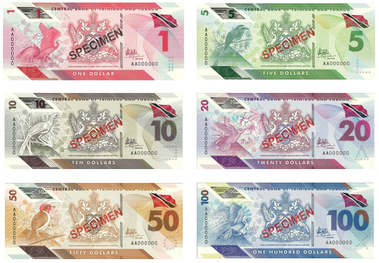

## Table of Contents

## What is the Trinidad and Tobago Dollar?

The Trinidad and Tobago Dollar is the official money used in the country of Trinidad and Tobago. It is often written as TTD or TT$. People use this money to buy things like food, clothes, and other stuff they need every day.

The Trinidad and Tobago Dollar started being used in 1964. Before that, Trinidad and Tobago used the British West Indies Dollar. The Central Bank of Trinidad and Tobago is in charge of the TTD. They make sure there is enough money and that it stays valuable.

## What are the denominations of the Trinidad and Tobago Dollar?

The Trinidad and Tobago Dollar comes in different amounts of money, called denominations. For paper money, you can find notes worth 1 dollar, 5 dollars, 10 dollars, 20 dollars, 50 dollars, and 100 dollars. These notes have pictures and designs that show important things about Trinidad and Tobago, like its culture and history.

For coins, there are smaller amounts. You can find coins worth 1 cent, 5 cents, 10 cents, 25 cents, and 1 dollar. The 1 dollar coin is special because it is worth the same as the smallest paper note. These coins are useful for buying things that cost less money, like candy or small snacks.

All these different denominations help people in Trinidad and Tobago to use the right amount of money when they are buying things. Whether it's a big purchase or something small, there's a note or coin that fits the need.

## How is the Trinidad and Tobago Dollar abbreviated?

The Trinidad and Tobago Dollar is shortened to TTD or TT$. These abbreviations make it easier to talk and write about the money without using the full name all the time.

When you see TTD or TT$ in stores, banks, or on price tags, it means the price is in Trinidad and Tobago Dollars. This helps everyone know which money is being used, especially in places where different kinds of money might be around.

## What is the history of the Trinidad and Tobago Dollar?

The Trinidad and Tobago Dollar, or TTD, started being used on December 31, 1964. Before that, Trinidad and Tobago used the British West Indies Dollar. The change to the TTD happened because Trinidad and Tobago wanted its own money after becoming independent from Britain in 1962. The Central Bank of Trinidad and Tobago was created in 1964 to take care of the new money. They make sure there is enough TTD and that it stays valuable.

Over the years, the TTD has changed a bit. New notes and coins have been made with different designs and colors. These designs often show important things about Trinidad and Tobago, like its culture, history, and nature. The TTD is used every day by people in Trinidad and Tobago to buy things they need. It helps the country's economy work smoothly and keeps money flowing in the right way.

## What are the main functions of the Trinidad and Tobago Dollar?

The Trinidad and Tobago Dollar, or TTD, has a few important jobs. One big job is to be a way for people to buy things. When someone wants to get food, clothes, or anything else, they use TTD to pay for it. This makes it easy for everyone to trade and get what they need. The TTD also helps keep the economy running smoothly. When people use TTD to buy things, it helps businesses grow and creates jobs for people.

Another important job of the TTD is to store value. This means that if someone saves their TTD, they can use it later to buy things. It's like keeping money in a piggy bank. The TTD also helps measure how much things are worth. When you see a price tag, it tells you how many TTD you need to buy that item. This makes it easy to compare prices and decide what to buy.

## How does the Trinidad and Tobago Dollar function as a medium of exchange?

The Trinidad and Tobago Dollar, or TTD, works as a medium of exchange by letting people buy things easily. When someone wants to get something, like food or clothes, they can use TTD to pay for it. This makes trading simple because everyone knows that TTD is the money they should use. Instead of having to trade things directly, like giving chickens for a shirt, people can just use TTD. This helps everyone in Trinidad and Tobago to get what they need without any trouble.

Using TTD as a medium of exchange also helps the economy work well. When people use TTD to buy things, it helps businesses sell their products and make money. This can lead to more jobs and a stronger economy. The TTD makes it easy for everyone to trade, which keeps money moving around and helps the country grow.

## What role does the Trinidad and Tobago Dollar play as a unit of account?

The Trinidad and Tobago Dollar, or TTD, acts as a unit of account by helping people understand how much things cost. When you see a price tag, it tells you how many TTD you need to buy that item. This makes it easy for everyone to know the value of things. For example, if a shirt costs 50 TTD, you know exactly how much money you need to get it. This way, people can compare prices and decide what to buy without any confusion.

Using TTD as a unit of account also helps businesses keep track of their money. When a store sells things, they can add up all the TTD they get to see how much money they made. This helps them know if they are doing well or if they need to change something. It's like keeping score in a game, but with money. By using TTD, everyone in Trinidad and Tobago can easily understand and manage their finances.

## How is the Trinidad and Tobago Dollar used as a store of value?

The Trinidad and Tobago Dollar, or TTD, is used as a store of value because people can save it and use it later to buy things. When someone puts their TTD in a piggy bank or a bank account, they know they can take it out later to get what they need. This makes TTD useful for planning for the future. If someone wants to buy a big thing, like a car or a house, they can save up TTD over time until they have enough.

Saving TTD also helps people feel secure. If they have some TTD saved, they know they can use it if something unexpected happens, like if they need to fix their car or if they lose their job. This makes TTD important for keeping life stable. By saving TTD, people in Trinidad and Tobago can make sure they have money for important things in the future.

## What are the exchange rate policies affecting the Trinidad and Tobago Dollar?

The exchange rate policies for the Trinidad and Tobago Dollar are managed by the Central Bank of Trinidad and Tobago. They use a managed float system, which means the value of the TTD can change but the Central Bank steps in to keep it stable. They do this by buying or selling foreign money, like US dollars, to control how much the TTD is worth. This helps keep the TTD strong and makes sure it doesn't change too much, which is good for businesses and people who need to buy things from other countries.

Sometimes, the Central Bank also sets rules about how much foreign money people and businesses can take out of the country. This is to make sure there is enough TTD in Trinidad and Tobago and to stop too much money from leaving. These rules can change based on what is happening in the economy. By doing all these things, the Central Bank tries to keep the TTD useful and stable for everyone in Trinidad and Tobago.

## How does the Central Bank of Trinidad and Tobago influence the value of the dollar?

The Central Bank of Trinidad and Tobago helps control the value of the Trinidad and Tobago Dollar by using a system called a managed float. This means the value of the TTD can go up or down, but the Central Bank steps in to keep it from changing too much. They do this by buying or selling foreign money, like US dollars. When they buy foreign money, it makes the TTD stronger. When they sell foreign money, it can make the TTD weaker. This helps keep the TTD stable, which is good for businesses and people who need to buy things from other countries.

The Central Bank also sets rules about how much foreign money people and businesses can take out of Trinidad and Tobago. This is to make sure there is enough TTD in the country and to stop too much money from leaving. These rules can change depending on what is happening in the economy. By doing all these things, the Central Bank tries to keep the TTD useful and stable for everyone in Trinidad and Tobago.

## What are the economic factors that impact the Trinidad and Tobago Dollar's value?

The value of the Trinidad and Tobago Dollar, or TTD, can change because of many things in the economy. One big thing is how much oil and gas Trinidad and Tobago sells. The country makes a lot of money from these, so if the price of oil and gas goes up, the TTD can get stronger. But if the price goes down, the TTD might get weaker. Another thing that matters is how much people in Trinidad and Tobago buy from other countries. If they buy a lot of things from outside, it can make the TTD weaker because they need to use more foreign money.

The Central Bank of Trinidad and Tobago also plays a big role in keeping the TTD's value steady. They do this by buying or selling foreign money, like US dollars, to control how much the TTD is worth. If the Central Bank thinks the TTD is getting too weak, they might buy foreign money to make the TTD stronger. They also set rules about how much foreign money people and businesses can take out of the country. This helps make sure there is enough TTD around and stops too much money from leaving. By doing all these things, the Central Bank tries to keep the TTD useful and stable for everyone in Trinidad and Tobago.

## How does the Trinidad and Tobago Dollar compare to other Caribbean currencies in terms of stability and usage?

The Trinidad and Tobago Dollar, or TTD, is known for being pretty stable compared to other Caribbean currencies. This is because the Central Bank of Trinidad and Tobago works hard to keep its value steady. They do this by buying and selling foreign money, like US dollars, to control how much the TTD is worth. This makes the TTD a good choice for people and businesses in Trinidad and Tobago because they know its value won't change too much. Other Caribbean countries, like Jamaica and the Bahamas, also try to keep their money stable, but their currencies can sometimes change more than the TTD.

In terms of usage, the TTD is used every day by people in Trinidad and Tobago to buy things they need. It's the main money they use for shopping, paying bills, and other everyday things. Some other Caribbean countries, like those using the Eastern Caribbean Dollar, share a common currency across several islands, which can make trading easier between them. But the TTD is only used in Trinidad and Tobago, which means it's very important for the local economy. Overall, the TTD's stability and wide use in the country make it a strong and reliable currency for its people.

## References & Further Reading

[1]: ["Exchange Rate Systems and Policies in Trinidad and Tobago"](https://generisonline.com/understanding-foreign-exchange-controls-in-trinidad-and-tobago/) by the Central Bank of Trinidad and Tobago

[2]: ["The Trinidad and Tobago Economy: Performance and Functioning"](https://www.firstcitizensgroup.com/tt/news-insights/the-trinidad-and-tobago-economy-a-60-year-perspective/) by Winston Dookeran, Caribbean Centre for Money and Finance

[3]: Ellis, L. (2001). ["A Brief History of Currency in Trinidad and Tobago"](https://www.banknoteworld.com/blog/a-brief-history-of-the-trinidad-tobago-dollar/) Central Bank of Trinidad and Tobago 

[4]: ["Oil and Gas and the Trinidad and Tobago Economy"](https://www.energy.gov.tt/our-business/oil-and-gas-industry/) by the Ministry of Energy and Energy Industries, Government of Trinidad and Tobago

[5]: ["Algorithmic and High-Frequency Trading"](https://www.amazon.com/Algorithmic-High-Frequency-Trading-Mathematics-Finance/dp/1107091144) by Álvaro Cartea, Sebastian Jaimungal, and José Penalva