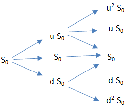

## Table of Contents

## What is the Trinomial Option Pricing Model?

The Trinomial Option Pricing Model is a way to figure out how much an option is worth. It's like a more detailed version of the Binomial Option Pricing Model. Instead of just two possible outcomes for the price of the stock (up or down), the Trinomial model adds a third possibility: the price can stay the same. This makes the model more accurate because it better reflects what can happen in real markets.

To use the Trinomial model, you start by breaking down the time until the option expires into smaller steps. At each step, you calculate what the stock price could be if it goes up, stays the same, or goes down. You then work backward from the end of the option's life to the present, figuring out the option's value at each step. This method helps you see how the option's value changes over time and under different conditions, making it a useful tool for traders and investors.

## How does the Trinomial Option Pricing Model differ from the Binomial Option Pricing Model?

The main difference between the Trinomial Option Pricing Model and the Binomial Option Pricing Model is the number of possible price movements at each step. In the Binomial model, the stock price can only go up or down at each time step. This makes it simpler but less accurate for real-world scenarios. On the other hand, the Trinomial model adds a third possibility: the stock price can also stay the same. This extra option makes the Trinomial model more realistic because stock prices often don't change much from one day to the next.

Both models work by breaking down the time until the option expires into smaller steps and calculating the option's value at each step. However, the Trinomial model's additional state (the price staying the same) allows for a more detailed and accurate representation of how stock prices move. This can lead to more precise option valuations, especially for options with complex features or longer time frames. While the Binomial model is easier to understand and use, the Trinomial model provides a closer match to actual market behavior, making it a preferred choice for more sophisticated option pricing.

## What are the key assumptions of the Trinomial Option Pricing Model?

The Trinomial Option Pricing Model, like other option pricing models, makes certain assumptions about how the market works. One big assumption is that the market is efficient, meaning all the information that could affect the stock price is already included in the price. The model also assumes that the stock price can move up, down, or stay the same at each time step, but it doesn't say how likely each of these moves is. Instead, it uses probabilities to figure out the value of the option.

Another key assumption is that the stock pays no dividends during the option's life. This simplifies the calculations but might not be true for all stocks. The model also assumes that you can borrow and lend money at a risk-free rate, like the interest rate on government bonds. This rate is used to discount future cash flows back to the present value. Lastly, the model assumes that there are no transaction costs or taxes, which makes the math easier but might not reflect real-world trading conditions.

## How is the Trinomial Option Pricing Model used to value options?

The Trinomial Option Pricing Model is used to figure out how much an option is worth by breaking down the time until the option expires into smaller steps. At each step, the model looks at three possible things that can happen to the stock price: it can go up, go down, or stay the same. By considering these three possibilities, the model creates a more detailed picture of how the stock price might change over time. Starting from the end of the option's life, the model works backward to the present, calculating the option's value at each step. This backward calculation helps to see how the option's value changes based on different stock price movements.

To use the model, you need to know things like the current stock price, the option's strike price, the time until the option expires, the risk-free interest rate, and the stock's volatility. With these inputs, the model uses probabilities to figure out how likely each price movement is and then calculates the option's value at each step. By adding up these values and working backward, the model gives you the option's current value. This method is helpful for traders and investors because it gives a more accurate estimate of an option's worth, especially when compared to simpler models like the Binomial model.

## What are the steps involved in implementing the Trinomial Option Pricing Model?

To use the Trinomial Option Pricing Model, you start by breaking down the time until the option expires into smaller steps. Each step represents a short period of time, like a day or a week. At each step, you imagine three things that can happen to the stock price: it can go up, go down, or stay the same. You need to know the current stock price, the option's strike price, the time until the option expires, the risk-free interest rate, and the stock's volatility. With these numbers, you can figure out how much the stock price might change at each step and how likely each change is.

Next, you start at the end of the option's life and work backward to the present. At the end, you know exactly what the option is worth because you can see if it will be profitable to exercise it or not. You then move one step back and calculate the option's value for each of the three possible stock prices at that step. You do this by using the probabilities of the stock price moving up, down, or staying the same, and the value of the option at the next step. You keep moving backward, step by step, until you reach the present. At each step, you're figuring out the option's value based on what might happen next. By the time you get back to the start, you have the option's current value, which is a more accurate estimate because it considers all the possible ways the stock price could move over time.

## Can you explain the role of the up, down, and middle nodes in the Trinomial Option Pricing Model?

In the Trinomial Option Pricing Model, the up, down, and middle nodes represent the three possible ways the stock price can move at each time step. The up node means the stock price goes up by a certain amount, the down node means it goes down by a certain amount, and the middle node means the stock price stays the same. These nodes help create a detailed picture of how the stock price might change over time, making the model more accurate than simpler models that only consider up and down movements.

To use the model, you start at the end of the option's life and work backward to the present. At each step, you calculate the option's value for each of the three nodes, using the probabilities of the stock price moving up, down, or staying the same. By considering all these possibilities and working backward, you can figure out the option's current value. This method helps traders and investors get a better idea of what an option is worth, especially when compared to models that don't include the middle node.

## How does the Trinomial Option Pricing Model handle dividends and other cash flows?

The Trinomial Option Pricing Model usually assumes that the stock doesn't pay any dividends during the time the option is active. This makes the math easier because you don't have to worry about the stock price changing because of dividend payments. But in real life, some stocks do pay dividends, so if you want to use the model for those stocks, you need to adjust it. One way to do this is by reducing the stock price at the time the dividend is paid, which changes how the stock price moves in the model.

To handle dividends, you can lower the stock price at each step where a dividend is expected. This means the stock price at the up, down, and middle nodes will be adjusted to reflect the dividend payment. By doing this, the model can still give you a good idea of the option's value, even for stocks that pay dividends. It's a bit more work, but it makes the model more accurate for real-world situations where dividends matter.

## What are the advantages of using the Trinomial Option Pricing Model over other models?

The Trinomial Option Pricing Model has some big advantages over other models like the Binomial model. One main advantage is that it's more accurate because it considers three possible ways the stock price can move at each step: up, down, or staying the same. This makes it a better match for how stock prices actually move in real life, where they often don't change much from one day to the next. By including this middle node, the Trinomial model can give a more detailed and realistic picture of how the option's value might change over time.

Another advantage is that the Trinomial model can handle more complex options better. For example, it's good for options that have features like early exercise or American-style options, where you can use the option before it expires. The model's ability to break down time into smaller steps and consider more possibilities makes it easier to figure out the best time to exercise these options. While it might be a bit more complicated to use than simpler models, the Trinomial model's extra detail and accuracy make it a valuable tool for traders and investors who need precise option valuations.

## What are the limitations and potential drawbacks of the Trinomial Option Pricing Model?

The Trinomial Option Pricing Model, while more accurate than simpler models like the Binomial model, has some limitations. One big drawback is that it can be more complicated to use. Because it considers three possible ways the stock price can move at each step, you need to do more calculations. This can make it harder to understand and use, especially for people who are new to option pricing. Also, the model assumes that the stock doesn't pay dividends, which isn't true for all stocks. If you want to use it for stocks that do pay dividends, you have to make adjustments, which adds more work and can make the model less straightforward.

Another limitation is that the Trinomial model still relies on some assumptions that might not always hold true in real markets. For example, it assumes that you can borrow and lend money at a risk-free rate and that there are no transaction costs or taxes. These assumptions can make the model's results less accurate if they don't match real-world conditions. While the model is good at handling complex options and giving a detailed picture of how stock prices might move, these limitations mean it's not perfect and might need to be used carefully, especially in situations where the assumptions don't fit well.

## How can the Trinomial Option Pricing Model be adjusted for American options?

The Trinomial Option Pricing Model can be adjusted for American options by considering the possibility of early exercise at each step. American options can be used before they expire, so at each time step, you need to check if it's better to exercise the option right away or to keep it and see what happens next. To do this, you compare the value of exercising the option at that step with the value of holding onto it. If exercising gives you more money, you do that. If holding onto it is better, you keep going with the model's calculations.

To make these adjustments, you start at the end of the option's life and work backward, just like with European options. But at each step, you add a check to see if early exercise is the best choice. This means you need to do a bit more work at each step, but it helps you figure out the best time to use the option. By considering early exercise, the Trinomial model can give you a more accurate value for American options, which is important because these options are common in real markets.

## What are some practical applications of the Trinomial Option Pricing Model in financial markets?

The Trinomial Option Pricing Model is used by traders and investors to figure out how much options are worth. It's especially helpful for pricing American options, which can be used before they expire. Traders use this model to decide if they should buy or sell options, and when it might be best to use them. For example, if a trader thinks a stock's price will go up, they might buy a call option. The Trinomial model helps them see how much that option could be worth at different times, so they can make a smart choice.

Another practical use of the Trinomial model is in risk management. Companies and investors use it to understand how much risk they're taking on with their options. By looking at all the possible ways a stock price could move, they can see how their options might change in value. This helps them plan better and make sure they're not taking on too much risk. It's like having a map that shows all the different paths a stock price could take, so they can prepare for whatever might happen.

## How does the Trinomial Option Pricing Model converge to the Black-Scholes model as the number of time steps increases?

As you use more and more time steps in the Trinomial Option Pricing Model, it starts to look more like the Black-Scholes model. The Black-Scholes model is a famous way to figure out how much an option is worth, and it assumes that stock prices move smoothly over time. When you break down the time until the option expires into smaller and smaller steps in the Trinomial model, the three possible moves (up, down, or staying the same) start to blend together. This blending makes the stock price movements look more like the smooth changes that the Black-Scholes model assumes.

With enough time steps, the Trinomial model's results get very close to what the Black-Scholes model would say. This happens because the more steps you use, the more detailed and accurate the Trinomial model becomes. It's like taking a picture with a higher resolution; the more pixels you have, the clearer the image. So, even though the Trinomial model starts with three possible moves at each step, as you add more steps, it ends up giving you a result that's almost the same as the Black-Scholes model, which is great for traders and investors who want to use the best tool for their needs.

## References & Further Reading

Hayes, A. 'Trinomial Option Pricing Model: What it is, How it Works' provides a comprehensive overview of the trinomial option pricing model, elaborating on its mechanism to incorporate three potential outcomes at each time step, which enhances the test for more complex financial derivatives such as American and exotic options.

Black, F., & Scholes, M. 'The Pricing of Options and Corporate Liabilities' is a seminal paper which introduced the Black-Scholes model. This work laid the foundation for modern option pricing frameworks by offering a closed-form solution for pricing European call and put options, underlining the importance of using continuous-time finance models.

Cox, J. C., Ross, S. A., & Rubinstein, M. 'Option Pricing: A Simplified Approach' simplifies the complexities involved in option pricing by introducing the binomial tree model. This approach lays the groundwork for understanding the algebra involved in creating a trinomial model, showcasing how discrete steps can be used to approximate option values over time.

Hull, J. C. 'Options, Futures, and Other Derivatives' is an essential textbook for finance students and professionals. It covers a broad array of derivative topics, offering rich insight into the structural and mathematical underpinnings of options, futures, and their derivative counterparts. The discussions on the interplay between theory and practice make it critical for understanding option pricing and trading strategies.

Wilmott, P., Howison, S., & Dewynne, J. 'The Mathematics of Financial Derivatives: A Student Introduction' caters to the mathematical aspects concerning financial derivatives. This resource details the quantitative approaches employed in derivatives pricing and risk management, providing the mathematical foundation necessary for comprehending complex pricing models like the trinomial approach.

