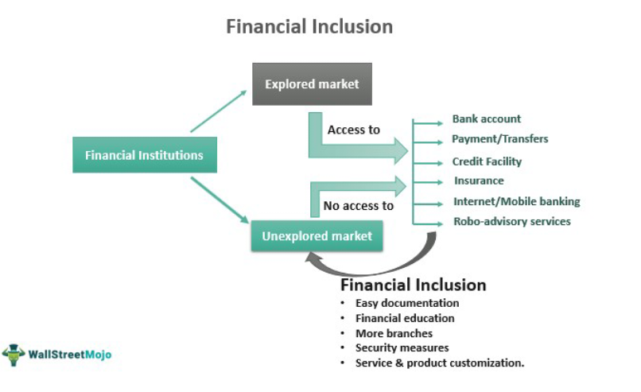

Financial risk management is an essential element for institutions engaged in intricate transactions within the financial sector. It involves identifying, assessing, and controlling threats to an organization's capital and earnings. The complexity of this task is amplified by the vast array of transactions and financial instruments entities deal with daily. Among these instruments, derivatives stand out for their significant role in contemporary finance. Derivatives are financial contracts whose value is derived from underlying assets like stocks, bonds, and commodities. They offer substantial tools for risk mitigation by allowing institutions to hedge against potential losses in asset portfolios.

Furthermore, the advent of algorithmic trading has revolutionized the trading environment by facilitating faster and more accurate transactions. This form of trading uses computer algorithms to automate trading decisions, executing orders at speeds and volumes that are beyond human capabilities. While algorithmic trading enhances market efficiency and liquidity, it also introduces new challenges and risks that need robust management strategies.



In this complex landscape, TriOptima has distinguished itself as a leader in providing comprehensive post-trade risk management solutions, particularly for the over-the-counter (OTC) derivatives market. Founded in 2000, the company has been instrumental in helping institutions manage and reduce risks associated with derivative transactions. Their suite of products, including triReduce and triResolve, assists firms in navigating global regulatory requirements while improving capital efficiency.

This article examines the convergence of financial risk management, derivatives, and algorithmic trading. It highlights the critical role TriOptima plays in enabling institutions to effectively manage these complex and interrelated aspects of modern financial markets.

## Table of Contents

## Understanding Financial Risk Management

Financial risk management is a systematic approach encompassing the identification, assessment, and prioritization of risks followed by efforts to mitigate their potential impacts on financial institutions. This is essential for ensuring both stability and profitability, given the inherently volatile nature of financial markets. Risk in this context often arises from fluctuations in market prices, credit defaults, and operational failures, among other sources.

Successful financial risk management relies heavily on a combination of strategies and tools designed to address these uncertainties. Primarily, tools such as Value at Risk (VaR) are widely used to quantify the risk level of a portfolio. VaR calculates the maximum potential loss over a specific time frame at a given confidence level. Institutions might use a simple formula like:

$$
\text{VaR} = \text{mean} - z \times \text{standard deviation}
$$

where $z$ is the z-score from a normal distribution corresponding to the desired confidence level. This quantifies potential losses, helping managers make informed decisions about resource allocation.

In addition to quantitative measures, risk management employs qualitative assessments to address regulatory and compliance issues. Financial institutions must adhere to complex regulations like the Basel III framework, which mandates maintaining adequate capital to cover risks. An intricate understanding of these rules and the ability to implement them effectively is key. Technologies such as [machine learning](/wiki/machine-learning) algorithms are increasingly leveraged to analyze large datasets, predict risk patterns, and optimize decision-making processes. These tools provide insights into risk exposure and support strategic planning by offering real-time data analysis.

Moreover, financial institutions are investing in sophisticated software solutions to monitor market conditions and automate risk reporting. This technological advancement helps mitigate the challenges posed by market [volatility](/wiki/volatility-trading-strategies) and ensures accurate compliance with regulatory standards.

Overall, embracing a comprehensive approach to risk management allows financial institutions to safeguard against potential threats, maintain operational efficiency, and achieve sustained growth.

## Derivatives: A Key Component of Financial Markets

Derivatives are financial instruments whose value is contingent upon the value of other underlying financial assets, such as stocks, bonds, commodities, currencies, interest rates, or market indices. These instruments are integral to modern financial markets due to their versatility and the wide range of purposes they serve. 

Derivatives fall into several primary categories, including futures, options, swaps, and forwards. Each of these contracts provides different methods for risk management and speculation. For example, futures and forwards are commitments to buy or sell an asset at a predetermined price and date, which can be used for hedging against price fluctuations. Options offer the right, but not the obligation, to buy or sell an asset under certain conditions, giving traders flexibility in risk exposure. Swaps involve the exchange of cash flows or other financial elements, commonly used to manage [interest rate](/wiki/interest-rate-trading-strategies) and currency exposures.

Derivative contracts are predominantly used for hedging purposes, as they allow market participants to protect against adverse movements in underlying asset prices. For instance, a wheat farmer might use futures contracts to lock in a price for their harvest, mitigating the risk of falling prices. Similarly, an investment manager might use options to protect the value of a portfolio against market downturns.

In addition to risk mitigation, derivatives play a crucial role in speculative trading. Traders and investors utilize derivatives to speculate on the directional movement of underlying assets, aiming to profit from price changes while employing leverage to magnify potential returns. The speculative nature of derivatives can, however, introduce significant risks, particularly if market movements are unfavorable.

Derivatives also contribute to market [liquidity](/wiki/liquidity-risk-premium) by allowing participants to enter and [exit](/wiki/exit-strategy) positions more effectively, thereby enhancing capital flows and enabling efficient price discovery processes. The presence of active derivative markets provides avenues for investors to express views on future asset price movements without the need to transact directly in the underlying markets.

Despite their advantages, derivatives bring about inherent complexities and potential systemic risks. The leverage associated with derivative instruments can result in substantial losses if mismanaged. Furthermore, the often intricate nature of these contracts necessitates robust risk management practices to address issues like counterparty risk and market volatility.

Effective risk management strategies are vital for institutions engaging in derivative transactions. This involves understanding the risk profiles of the instruments, maintaining adequate collateral, and employing sophisticated modeling techniques to predict and mitigate potential adverse outcomes. Risk management also demands compliance with regulatory requirements designed to enhance transparency and reduce systemic risk, as underscored by the financial reforms following the 2008 crisis.

## Algorithmic Trading in Financial Markets

Algorithmic trading harnesses the power of computer algorithms to automate trading processes, thereby increasing the speed and accuracy of transactions in financial markets. By leveraging complex mathematical models and large datasets, [algorithmic trading](/wiki/algorithmic-trading) systems can analyze multiple markets and execute trades in milliseconds. This technological advancement allows traders to implement sophisticated trading strategies at scales and speeds unattainable by human traders. The application of algorithms in trading not only accelerates the decision-making process but also enhances the precision of trades by minimizing human error.

One of the core advantages of algorithmic trading is its ability to execute a plethora of trade orders based on predetermined criteria such as timing, price, and [volume](/wiki/volume-trading-strategy). For example, a simple Python function to determine the optimal time to buy or sell using a moving average algorithm could look like this:

```python
def moving_average_strategy(prices, window_size):
    moving_averages = []
    for i in range(len(prices) - window_size + 1):
        window = prices[i:i + window_size]
        moving_averages.append(sum(window) / window_size)
    return moving_averages

# Example usage
prices = [110, 115, 120, 125, 130, 135, 140]
window_size = 3
print(moving_average_strategy(prices, window_size))
```

In this example, the function calculates the moving average over a specified window size, providing traders with insights into market trends that inform their buying or selling decisions. This streamlined process allows traders to capitalize on market opportunities with unparalleled speed.

However, the rise of algorithmic trading also presents unique challenges for financial institutions, particularly in risk management. The automation of trades increases the volume and velocity of transactions, necessitating the development of advanced risk management systems to mitigate potential systemic risks. Financial institutions must implement comprehensive monitoring frameworks to oversee trading algorithms and ensure compliance with market regulations. Robust risk management systems are crucial to safeguarding against algorithmic failures, such as flash crashes or unintended trading patterns, that could have significant financial repercussions.

As the prevalence of algorithmic trading continues to grow, it is imperative for financial institutions to adopt cutting-edge risk management strategies that can keep pace with technological innovations. These systems must be agile, scalable, and capable of integrating real-time data analytics to adequately address the complexities of modern trading environments.

## TriOptima: Championing Post-Trade Risk Management

TriOptima, established in 2000, has emerged as a prominent provider of risk management solutions specifically tailored for over-the-counter (OTC) derivatives. As financial institutions navigate the complexities of derivatives markets, TriOptima's suite of products plays a vital role in managing and mitigating associated risks. Key offerings from the company include triReduce, triResolve, triBalance, and triCalculate, each of which addresses distinct aspects of post-trade risk management.

triReduce is a significant component in TriOptima's lineup, focusing on multilateral compression of trades. This service helps in reducing the notional size of OTC derivative portfolios without impacting market risk. By eliminating redundant trades, triReduce aids institutions in managing counterparty credit exposure and optimizing capital allocation.

triResolve is another crucial product utilized by financial institutions for reconciliation and dispute resolution. This service enhances operational efficiency by promoting transparency and consistency through continuous portfolio reconciliation. By identifying discrepancies and facilitating quick resolution, triResolve mitigates operational risk and ensures data accuracy.

triBalance, meanwhile, targets systemic risk by optimizing collateral requirements and capital usage. It aligns with global regulatory standards, enabling institutions to efficiently manage collateral while maintaining compliance with evolving financial regulations. This helps in safeguarding against liquidity shortages and enhances the firm's overall capital efficiency.

Furthermore, triCalculate offers an advanced analytics platform for derivatives pricing and risk calculations, which is indispensable for accurate valuation and risk assessment. This service assists in meeting regulatory expectations for model validation and stress testing, providing institutions with robust analytical tools.

Overall, TriOptima's solutions are critical in helping clients adapt to the stringent demands of global financial regulations and improve their capital efficiency. By focusing on reducing systemic risk and enhancing operational processes, TriOptima supports institutions in achieving resilience and stability in the volatile derivatives market.

## The Intersection of Derivatives, Algorithmic Trading, and Risk Management

As algorithmic trading becomes increasingly prevalent in financial markets, the need for efficient risk management, particularly regarding derivatives, is more critical than ever. Algorithmic trading, characterized by its rapid and automated execution of trades, significantly amplifies both the volume and velocity of transactions. This escalation necessitates robust and adaptable risk management mechanisms to address the complexities that arise in such dynamic environments.

TriOptima plays a crucial role in mitigating these challenges through its innovative solutions tailored to the derivatives market. The firm's services, such as triReduce, triResolve, triBalance, and triCalculate, are specifically designed to manage risks by optimizing and standardizing post-trade processes. These solutions help financial institutions not only comply with regulatory demands but also enhance capital efficiency and operational resilience.

A notable trend is the integration of real-time data analytics with risk management frameworks. This development presents opportunities for platforms that dynamically analyze vast amounts of data to offer instantaneous insights and decision-making capabilities. By leveraging advanced data analytics, institutions can gain a better understanding of market conditions, allowing them to adjust their risk management strategies promptly. 

For instance, real-time analytics can assist in the identification of abnormal trading patterns or potential market disruptions, enabling preemptive action to mitigate associated risks. Additionally, the incorporation of [artificial intelligence](/wiki/ai-artificial-intelligence) and machine learning algorithms enhances the predictive accuracy of risk models, offering more sophisticated tools for managing the intricacies of derivative instruments within an algorithmic trading context.

As financial markets continue to evolve, the synergy between derivatives, algorithmic trading, and risk management will likely intensify. The future lies in creating holistic solutions that seamlessly interconnect these components, fostering an ecosystem where financial institutions can thrive amid increasing complexity and competition.

## Conclusion

Financial risk management, derivatives, and algorithmic trading are integral to modern financial markets, each playing a critical role in ensuring market stability and efficiency. As financial markets evolve, they become more complex and interconnected, necessitating sophisticated tools and strategies to manage associated risks.

Organizations like TriOptima are pivotal in enabling financial institutions to navigate this complexity effectively. By offering comprehensive services and tools tailored to the management of over-the-counter (OTC) derivatives, TriOptima empowers institutions to mitigate risks, enhance operational efficiency, and comply with increasingly stringent regulatory requirements.

Given the dynamic nature of markets and the rapid pace of technological advancement, the importance of robust risk management strategies and technologies cannot be overstated. Institutions must continuously adapt to new regulatory environments and market conditions while leveraging innovative solutions to manage risks efficiently. This includes implementing real-time data analytics, algorithmic trading strategies, and advanced risk modeling techniques.

As we progress further into an era where data-driven decisions and automated processes dominate financial operations, the reliance on cutting-edge risk management technologies will grow. The ability to preemptively identify and manage risks, ensure optimal capital allocation, and maintain regulatory compliance will define the competitive edge for financial institutions. Thus, the continued emphasis on evolving risk management methodologies will remain a cornerstone for stability and growth in the financial markets.

## References

Information about TriOptima has been sourced from MarketsWiki, a comprehensive resource that offers detailed insights into the operations and innovations within the financial markets sector. The platform provides an extensive overview of TriOptima's contributions, particularly its leadership in post-trade risk management solutions for over-the-counter (OTC) derivatives, highlighting the effectiveness of its products in reducing risk and ensuring compliance with global regulatory standards.

Details regarding derivatives and financial risk management have been retrieved from industry-standard sources that include academic journals, financial textbooks, and leading financial services websites. These sources offer foundational and advanced knowledge about derivatives as financial instruments and outline sophisticated strategies employed by financial institutions to manage various forms of risk, such as market, credit, and operational risks.

Insights into algorithmic trading are based on recent financial market studies and emerging trends in the trading sector. These studies provide an in-depth analysis of how algorithmic trading has reshaped trading dynamics by utilizing complex mathematical models and computer algorithms to execute trades at high speed and volume, addressing unique risk management challenges posed by such rapid technological advancements in the financial markets.

## References & Further Reading

[1]: Hull, J. C. (2018). ["Options, Futures, and Other Derivatives"](https://www.amazon.com/Options-Futures-Other-Derivatives-10th/dp/013447208X). Pearson.

[2]: Black, F., & Scholes, M. (1973). ["The Pricing of Options and Corporate Liabilities."](https://www.cs.princeton.edu/courses/archive/fall09/cos323/papers/black_scholes73.pdf) The Journal of Political Economy, 81(3), 637-654.

[3]: Lopez de Prado, M. (2018). ["Advances in Financial Machine Learning."](https://www.amazon.com/Advances-Financial-Machine-Learning-Marcos/dp/1119482089) Wiley.

[4]: Glasserman, P. (2003). ["Monte Carlo Methods in Financial Engineering."](https://link.springer.com/book/10.1007/978-0-387-21617-1) Springer.

[5]: Lewis, M. (2014). ["Flash Boys: A Wall Street Revolt."](https://en.wikipedia.org/wiki/Flash_Boys) W. W. Norton & Company.

[6]: Aronson, D. R. (2007). ["Evidence-Based Technical Analysis: Applying the Scientific Method and Statistical Inference to Trading Signals."](https://onlinelibrary.wiley.com/doi/book/10.1002/9781118268315) Wiley.

[7]: Chan, E. P. (2009). ["Quantitative Trading: How to Build Your Own Algorithmic Trading Business."](https://github.com/ftvision/quant_trading_echan_book) Wiley.

[8]: Alexander, C. (2008). ["Market Risk Analysis, Quantitative Methods in Finance."](https://archive.org/details/marketriskanalys0001alex) Wiley.