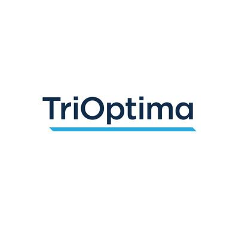

## Table of Contents

## What is TriOptima and what services do they offer?

TriOptima is a company that helps banks and financial institutions manage their trading activities more efficiently. They focus on reducing risks and costs associated with trading, especially in complex financial products like derivatives. By using technology and data analysis, TriOptima helps their clients to streamline their operations and make smarter decisions.

One of the main services TriOptima offers is trade compression. This service helps banks reduce the number of trades they need to manage without changing their overall financial position. This can save them a lot of money and reduce the risk of errors. Another service is triResolve, which is a tool that helps banks reconcile their trades, making sure all records match and reducing the chance of disputes.

Overall, TriOptima's services are designed to make the world of financial trading simpler and safer. They use advanced technology to help their clients handle the complexities of modern finance, ensuring that they can focus on growing their business rather than managing day-to-day trading issues.

## How does TriOptima help in managing financial risks?

TriOptima helps manage financial risks by making trading simpler and safer for banks and financial institutions. They use technology to reduce the number of trades that need to be managed through a process called trade compression. This means banks can keep the same financial position but with fewer trades, which cuts down on costs and the chance of mistakes. By having fewer trades to keep track of, banks can better manage their risks because there's less complexity.

Another way TriOptima helps is with their tool called triResolve. This tool helps banks make sure all their trade records match up correctly. When records match, it reduces the chance of disagreements or disputes, which can be risky and costly. By keeping everything in order, triResolve helps banks avoid surprises and manage their risks more effectively. Overall, TriOptima's services make it easier for banks to focus on growing their business without worrying as much about the risks involved in trading.

## What is the history and background of TriOptima?

TriOptima was started in 2002 in Sweden. The company was created to help banks and financial institutions handle their trading better. At first, they focused on making trading simpler and safer. They did this by using technology to reduce the number of trades banks needed to manage. This was a new idea at the time, and it helped TriOptima grow quickly.

Over the years, TriOptima added more services to help banks. They created a tool called triResolve, which helps make sure all trade records match up correctly. This reduces the chance of mistakes and disagreements. In 2010, TriOptima was bought by a bigger company called CME Group, but it kept its name and continued to grow. Today, TriOptima works all over the world, helping banks manage their trading and reduce risks.

## Can you explain how TriOptima's triReduce service works?

TriOptima's triReduce service is all about making trading simpler for banks. It does this by reducing the number of trades banks need to keep track of. Imagine you have a bunch of trades that cancel each other out. Instead of keeping all those trades, triReduce helps you get rid of the ones that aren't needed. This means banks can keep the same financial position but with fewer trades to manage. It's like cleaning up your room by getting rid of things you don't need anymore.

This service is really helpful because it saves banks money and reduces the risk of mistakes. When there are fewer trades, it's easier to keep everything organized. Banks don't have to spend as much time and money on managing all those extra trades. Plus, with fewer trades, there's less chance of something going wrong. So, triReduce makes trading smoother and safer for banks, letting them focus on other important parts of their business.

## How does TriOptima's triResolve service assist in managing derivatives?

TriOptima's triResolve service helps banks manage derivatives by making sure all their trade records match up correctly. When banks trade derivatives, they need to keep track of a lot of information. Sometimes, the records from different banks don't match, which can cause problems and disagreements. TriResolve fixes this by checking all the records and finding any mistakes. This way, banks can fix the errors before they become big issues.

By using triResolve, banks can avoid surprises and manage their derivatives more smoothly. When all the records are correct, it's easier for banks to see their overall financial position. This helps them make better decisions and reduces the risk of losing money because of mistakes. In simple terms, triResolve keeps everything in order, so banks can focus on trading without worrying about record-keeping problems.

## What role does TriOptima play in the global financial market?

TriOptima plays an important role in the global financial market by helping banks and financial institutions manage their trading activities better. They use technology to make trading simpler and safer. One of the main ways they do this is by reducing the number of trades banks need to keep track of. This saves banks money and reduces the chance of mistakes. By making trading easier, TriOptima helps banks focus on growing their business instead of worrying about managing lots of trades.

Another way TriOptima helps is by making sure all trade records match up correctly. This is really important because if records don't match, it can cause disagreements and problems. TriOptima's tool, called triResolve, checks all the records and finds any errors. This helps banks fix mistakes before they become big issues. By keeping everything in order, TriOptima makes it easier for banks to manage their trades and reduces the risk of losing money because of record-keeping problems.

## How does TriOptima ensure compliance with financial regulations?

TriOptima helps banks follow financial rules by making sure all their trading records are correct and up to date. They use a tool called triResolve that checks all the records and finds any mistakes. This is important because if banks have wrong information, they might break the rules without knowing it. By fixing these errors quickly, TriOptima helps banks stay compliant and avoid fines or other problems.

Another way TriOptima helps with compliance is by reducing the number of trades banks need to manage. They do this with a service called triReduce, which gets rid of trades that cancel each other out. This makes it easier for banks to keep track of everything and report their trades correctly. When banks can report their trades accurately, they are more likely to follow the rules set by financial regulators.

## What are the benefits of using TriOptima's services for financial institutions?

Using TriOptima's services helps financial institutions save money and reduce risks. TriOptima's triReduce service cuts down the number of trades banks need to manage. This means banks can keep the same financial position but with fewer trades, which saves them a lot of money and reduces the chance of making mistakes. When there are fewer trades, it's easier for banks to keep everything organized and focus on growing their business instead of worrying about managing lots of trades.

Another big benefit is that TriOptima helps banks make sure their trade records are correct. With the triResolve tool, banks can check all their records and fix any errors before they become big problems. This is important because if records don't match, it can cause disagreements and issues. By keeping everything in order, TriOptima helps banks follow financial rules and avoid fines or other problems. This makes trading smoother and safer for financial institutions.

## How does TriOptima integrate with other financial systems and platforms?

TriOptima works well with other financial systems and platforms by using technology that can connect easily with different software. They make sure their services, like triReduce and triResolve, can talk to other systems that banks use. This means banks can use TriOptima's tools without having to change all their other software. It's like adding a new app to your phone that works well with the apps you already have.

By connecting smoothly with other systems, TriOptima helps banks manage their trades better without causing any big changes. This makes it easier for banks to use TriOptima's services because they don't have to learn a whole new way of doing things. It's all about making things simpler and safer for banks, so they can focus on their business instead of worrying about how different systems work together.

## What are some case studies or success stories involving TriOptima?

One success story involves a big bank that used TriOptima's triReduce service. The bank had lots of trades that were canceling each other out. By using triReduce, they got rid of many of these trades. This saved them a lot of money because they had fewer trades to manage. It also made things simpler and safer for the bank. They could focus on growing their business instead of worrying about all those extra trades.

Another case study is about a bank that used TriOptima's triResolve tool. The bank was having trouble making sure all their trade records matched up. This was causing disagreements and problems. When they started using triResolve, it checked all their records and found any mistakes. The bank could fix these errors quickly, which helped them avoid big issues. This made trading smoother and helped the bank follow financial rules better.

## What are the future trends and developments expected in TriOptima's services?

In the future, TriOptima is expected to keep making trading easier and safer for banks. They might use even more advanced technology, like artificial intelligence, to find new ways to reduce the number of trades banks need to manage. This could mean more savings for banks and even fewer mistakes. TriOptima might also work on making their services work better with other financial systems. This would help banks use TriOptima's tools without changing all their other software, making everything run smoother.

Another trend could be TriOptima helping banks with new types of financial products. As trading gets more complex, TriOptima might develop new tools to manage these products better. They could also focus more on helping banks follow new financial rules that come up. By staying ahead of these changes, TriOptima can keep making trading simpler and safer for banks around the world.

## How does TriOptima address challenges like cybersecurity and data privacy in its operations?

TriOptima takes cybersecurity and data privacy very seriously. They use strong security measures to protect the information they handle. This includes using encryption to keep data safe and setting up firewalls to stop hackers. TriOptima also follows strict rules about how they can use and share data. They make sure that only the people who need to see the information can access it, and they keep everything private.

To make sure they stay safe, TriOptima regularly checks their systems for any problems. They do this by running tests to find weak spots and fixing them before they can be used by attackers. They also train their employees to know about the latest security threats and how to avoid them. By doing all these things, TriOptima helps keep the banks' information safe and private.

## What is Understanding Financial Risk Management?

Financial risk management is a systematic approach encompassing the identification, assessment, and prioritization of risks followed by efforts to mitigate their potential impacts on financial institutions. This is essential for ensuring both stability and profitability, given the inherently volatile nature of financial markets. Risk in this context often arises from fluctuations in market prices, credit defaults, and operational failures, among other sources.

Successful financial risk management relies heavily on a combination of strategies and tools designed to address these uncertainties. Primarily, tools such as Value at Risk (VaR) are widely used to quantify the risk level of a portfolio. VaR calculates the maximum potential loss over a specific time frame at a given confidence level. Institutions might use a simple formula like:

$$
\text{VaR} = \text{mean} - z \times \text{standard deviation}
$$

where $z$ is the z-score from a normal distribution corresponding to the desired confidence level. This quantifies potential losses, helping managers make informed decisions about resource allocation.

In addition to quantitative measures, risk management employs qualitative assessments to address regulatory and compliance issues. Financial institutions must adhere to complex regulations like the Basel III framework, which mandates maintaining adequate capital to cover risks. An intricate understanding of these rules and the ability to implement them effectively is key. Technologies such as [machine learning](/wiki/machine-learning) algorithms are increasingly leveraged to analyze large datasets, predict risk patterns, and optimize decision-making processes. These tools provide insights into risk exposure and support strategic planning by offering real-time data analysis.

Moreover, financial institutions are investing in sophisticated software solutions to monitor market conditions and automate risk reporting. This technological advancement helps mitigate the challenges posed by market [volatility](/wiki/volatility-trading-strategies) and ensures accurate compliance with regulatory standards.

Overall, embracing a comprehensive approach to risk management allows financial institutions to safeguard against potential threats, maintain operational efficiency, and achieve sustained growth.

## References & Further Reading

[1]: Hull, J. C. (2018). ["Options, Futures, and Other Derivatives"](https://www.amazon.com/Options-Futures-Other-Derivatives-10th/dp/013447208X). Pearson.

[2]: Black, F., & Scholes, M. (1973). ["The Pricing of Options and Corporate Liabilities."](https://www.cs.princeton.edu/courses/archive/fall09/cos323/papers/black_scholes73.pdf) The Journal of Political Economy, 81(3), 637-654.

[3]: Lopez de Prado, M. (2018). ["Advances in Financial Machine Learning."](https://www.amazon.com/Advances-Financial-Machine-Learning-Marcos/dp/1119482089) Wiley.

[4]: Glasserman, P. (2003). ["Monte Carlo Methods in Financial Engineering."](https://link.springer.com/book/10.1007/978-0-387-21617-1) Springer.

[5]: Lewis, M. (2014). ["Flash Boys: A Wall Street Revolt."](https://en.wikipedia.org/wiki/Flash_Boys) W. W. Norton & Company.

[6]: Aronson, D. R. (2007). ["Evidence-Based Technical Analysis: Applying the Scientific Method and Statistical Inference to Trading Signals."](https://onlinelibrary.wiley.com/doi/book/10.1002/9781118268315) Wiley.

[7]: Chan, E. P. (2009). ["Quantitative Trading: How to Build Your Own Algorithmic Trading Business."](https://github.com/ftvision/quant_trading_echan_book) Wiley.

[8]: Alexander, C. (2008). ["Market Risk Analysis, Quantitative Methods in Finance."](https://archive.org/details/marketriskanalys0001alex) Wiley.