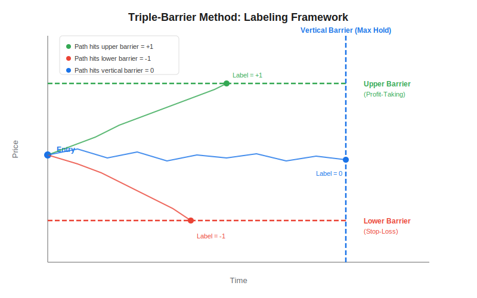
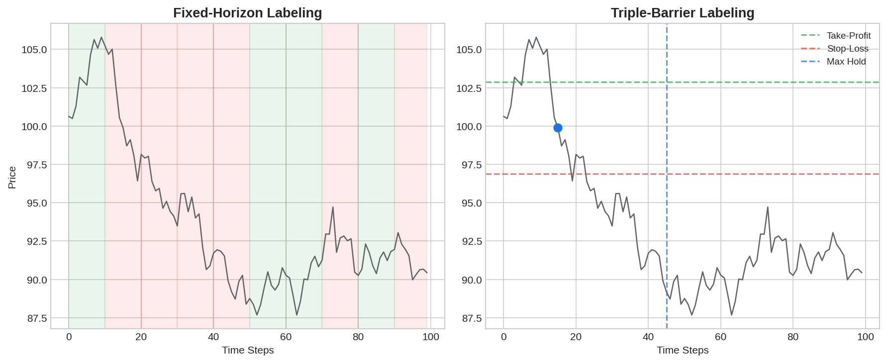

The triple-barrier method is a data-labeling technique introduced by Marcos Lopez de Prado in *Advances in Financial Machine Learning* (2018). It replaces the naive fixed-horizon labeling approach with a framework that mirrors real trading mechanics — profit-taking, stop-loss, and maximum holding period — to produce higher-quality training labels for supervised ML models. If you are building classification models for [systematic trading strategies](https://paperswithbacktest.com/wiki/systematic-trading-strategies), the triple-barrier method is now the de facto standard.

## What Is the Triple-Barrier Method?

Traditional labeling assigns a `+1` or `-1` based solely on whether the price is higher or lower after a fixed number of bars. This ignores what happens *during* the trade — a position that briefly doubled in value before crashing back down would still get a `-1` label if the final bar happened to be negative.

The triple-barrier method fixes this by constructing three barriers around each trade entry:

- **Upper barrier (profit-taking):** a horizontal level above the entry price, typically set as a multiple of recent volatility.
- **Lower barrier (stop-loss):** a horizontal level below the entry price.
- **Vertical barrier (max holding period):** a time limit after which the trade is closed regardless of P&L.

The label is determined by **whichever barrier is touched first**:

| First Barrier Hit | Label | Interpretation |
|---|---|---|
| Upper (profit-taking) | +1 | Successful long trade |
| Lower (stop-loss) | -1 | Failed trade (stopped out) |
| Vertical (time expiry) | 0 | Inconclusive — neither TP nor SL reached |



## How It Works

### Dynamic Barrier Width

Rather than using fixed dollar thresholds, de Prado recommends scaling barriers by a rolling estimate of volatility (e.g., exponentially weighted standard deviation of returns). This ensures that barriers adapt to changing market regimes — wider during volatile periods, tighter during calm ones:

$$h_t = c \cdot \sigma_t$$

where $h_t$ is the barrier width, $c$ is a multiplier constant, and $\sigma_t$ is the rolling volatility estimate at time $t$.

### Event-Driven Sampling

The triple-barrier method works best when combined with event-driven sampling rather than fixed-interval bars. The [CUSUM filter](https://paperswithbacktest.com/wiki/cusum-filter) is commonly used to detect structural breaks in price, generating trade-entry timestamps that seed the labeling process. Alternative bar types like [tick imbalance bars](https://paperswithbacktest.com/wiki/tick-imbalance-bars-tibs) also improve label quality.



## Python Implementation

Below is a vectorized implementation of the triple-barrier method using pandas:

```python
import numpy as np
import pandas as pd

def get_daily_vol(close, span=100):
    """Compute daily volatility using exponentially weighted std of returns."""
    returns = close.pct_change()
    return returns.ewm(span=span).std()

def triple_barrier_labels(close, events, pt_sl=(1.0, 1.0), max_hold=10):
    """
    Apply the triple-barrier method to label trade entries.

    Parameters
    ----------
    close : pd.Series
        Price series indexed by datetime.
    events : pd.DatetimeIndex
        Timestamps of trade entries (e.g., from CUSUM filter).
    pt_sl : tuple
        Multipliers for (profit-taking, stop-loss) on volatility.
    max_hold : int
        Maximum bars to hold the position (vertical barrier).

    Returns
    -------
    pd.DataFrame
        Columns: 'ret' (return at exit), 'label' (+1, -1, 0).
    """
    vol = get_daily_vol(close)
    results = []

    for t0 in events:
        if t0 not in close.index:
            continue
        loc = close.index.get_loc(t0)
        t1 = close.index[min(loc + max_hold, len(close) - 1)]
        path = close.loc[t0:t1]
        entry_price = close.loc[t0]
        sigma = vol.loc[t0]

        upper = entry_price * (1 + pt_sl[0] * sigma) if pt_sl[0] > 0 else np.inf
        lower = entry_price * (1 - pt_sl[1] * sigma) if pt_sl[1] > 0 else -np.inf

        # Check which barrier is touched first
        touch_upper = path[path >= upper].index.min() if (path >= upper).any() else pd.NaT
        touch_lower = path[path <= lower].index.min() if (path <= lower).any() else pd.NaT

        # Determine first touch
        events_dict = {}
        if pd.notna(touch_upper):
            events_dict[touch_upper] = 1
        if pd.notna(touch_lower):
            events_dict[touch_lower] = -1

        if events_dict:
            first_touch = min(events_dict.keys())
            label = events_dict[first_touch]
            ret = (close.loc[first_touch] - entry_price) / entry_price
        else:
            # Vertical barrier hit
            label = 0
            ret = (close.loc[t1] - entry_price) / entry_price

        results.append({"entry": t0, "ret": ret, "label": label})

    return pd.DataFrame(results).set_index("entry")


# Example usage
np.random.seed(42)
dates = pd.bdate_range("2020-01-01", periods=500)
returns = np.random.normal(0.0003, 0.012, len(dates))
close = pd.Series(100 * np.cumprod(1 + returns), index=dates)

# Sample events every 20 bars
events = close.index[::20]

labels = triple_barrier_labels(close, events, pt_sl=(2.0, 2.0), max_hold=15)
print(labels["label"].value_counts())
```

## Key Parameters

| Parameter | Typical Range | Effect |
|---|---|---|
| `pt_sl[0]` (profit-taking multiplier) | 1.0 – 3.0 | Higher values → fewer +1 labels, trades need larger moves to trigger |
| `pt_sl[1]` (stop-loss multiplier) | 1.0 – 3.0 | Higher values → fewer -1 labels, wider stops |
| `max_hold` | 5 – 50 bars | Longer hold → fewer 0 labels, more time for horizontal barriers to be hit |
| Volatility span | 20 – 200 | Longer span → smoother barrier widths, slower adaptation |

Setting asymmetric barriers (e.g., `pt_sl=(2.0, 1.0)`) is common — it gives the trade more room to profit while maintaining tighter risk control, mimicking real portfolio management behavior.

## Limitations and Risks

The triple-barrier method is a significant improvement over fixed-horizon labeling, but it is not without caveats. The labels depend heavily on the volatility estimator and multiplier choices — poorly calibrated barriers can produce noisy or highly imbalanced label distributions. The vertical barrier also introduces a form of censoring: trades that *would have* hit a barrier shortly after the time limit are labeled 0, which can mislead the model. Finally, barriers are symmetric by default (long trades only); extending to short trades requires mirroring the logic.

## Conclusion

The triple-barrier method brings labeling closer to how real traders operate — with take-profits, stop-losses, and time limits. Combined with event-driven sampling and [fractional differentiation](https://paperswithbacktest.com/wiki/fractional-differentiation) for feature engineering, it forms the backbone of the ML pipeline described in *Advances in Financial Machine Learning*. If you are training classifiers on financial data, switching from fixed-horizon to triple-barrier labels is one of the highest-impact changes you can make.

---

**Explore further on PapersWithBacktest:**
- Browse [backtested ML-driven strategies](https://paperswithbacktest.com/strategies) with Python code and performance metrics
- Access [clean historical market data](https://paperswithbacktest.com/datasets) for equities, crypto, and futures
- Take the [algo trading course](https://paperswithbacktest.com/course) — 60+ video lessons and notebooks
- Related wiki pages: [CUSUM Filter](https://paperswithbacktest.com/wiki/cusum-filter) · [Tick Imbalance Bars](https://paperswithbacktest.com/wiki/tick-imbalance-bars-tibs) · [Fractional Differentiation](https://paperswithbacktest.com/wiki/fractional-differentiation)
