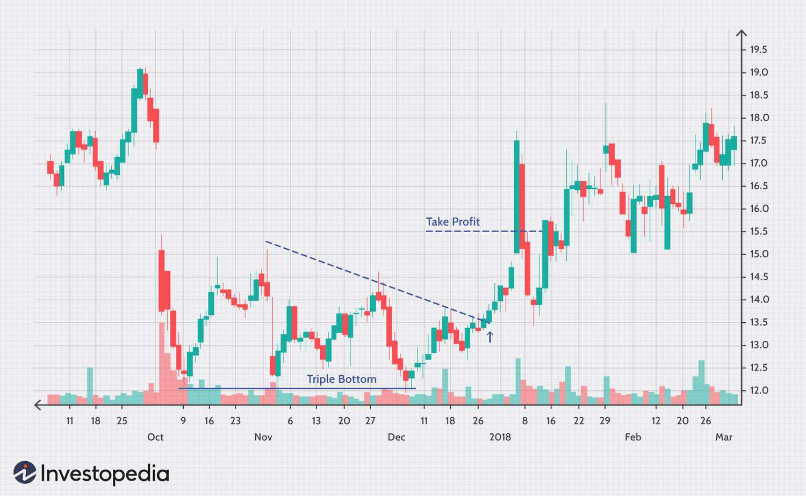

## Table of Contents

## What is a Triple Bottom Chart in technical analysis?

A Triple Bottom Chart is a pattern used in technical analysis to predict a change in the direction of a stock's price. It looks like the letter "W" with three equal lows. This pattern shows up when a stock's price drops to the same level three times but doesn't go lower. Traders see this as a sign that the stock might start going up because it couldn't fall below that level.

When traders spot a Triple Bottom Chart, they often get ready to buy the stock. They wait for the price to break above a certain level, called the resistance, to confirm that the price will likely go up. This pattern is important because it shows that the stock has strong support at that low price, and many traders believe it's a good time to invest before the price increases.

## How can you identify a Triple Bottom pattern on a chart?

To spot a Triple Bottom pattern on a chart, you need to look for a stock's price that goes down and touches the same low point three times. Imagine drawing a straight line across the bottom of these three lows. This line is called the support level. The three lows should be roughly at the same price, forming a shape that looks like the letter "W" with three dips instead of two.

After you see the three lows, watch what happens next. The price should start to go up and break through a higher line, called the resistance level. This resistance is usually drawn across the highest points between the three lows. When the price moves above this resistance, it's a sign that the Triple Bottom pattern is confirmed, and the stock might keep going up. It's like the stock tried to fall three times but couldn't, so it's ready to rise.

## What does a Triple Bottom pattern indicate about market trends?

A Triple Bottom pattern tells us that a stock might be ready to start going up after it tried to go down three times but couldn't. When you see a stock's price hit the same low point three times, it shows that there's a strong support level at that price. Many people want to buy the stock at that price, which stops it from falling any lower. This pattern looks like the letter "W" with three dips instead of two, and it's a sign that the downward trend might be over.

Once the stock's price starts to go up and breaks through the resistance level, it confirms that the Triple Bottom pattern is complete. The resistance level is the highest point the stock reached between the three lows. When the price moves above this level, it suggests that the stock is likely to keep going up. Traders see this as a good time to buy the stock because they believe the price will continue to rise after hitting that strong support three times.

## Can you explain the psychology behind the Triple Bottom pattern?

The Triple Bottom pattern shows us what people are thinking when they buy and sell a stock. When the stock's price hits the same low point three times, it means a lot of people believe that's a good price to buy. They keep buying the stock at that low price, which stops it from falling any lower. This creates a strong support level because so many people want the stock at that price. It's like they are saying, "This stock is worth more than this low price, so I'll buy it."

After the stock hits that low price three times, people start to think the stock might go up. When the price starts to rise and breaks through the highest point it reached between the three lows, it's a sign that more people want to buy than sell. This confirms the Triple Bottom pattern and makes people believe the stock will keep going up. It's like everyone agrees that the stock is ready to rise because it couldn't fall below that support level, no matter how hard it tried.

## What are the key components of a Triple Bottom pattern?

A Triple Bottom pattern has three main parts: the three lows, the support level, and the resistance level. The three lows are the times when the stock's price hits the same low point three times. They should be at about the same price, making a shape that looks like the letter "W" with three dips. The support level is a straight line you can draw across the bottom of these three lows. This line shows that many people want to buy the stock at that price, which stops it from falling any lower.

The resistance level is the highest point the stock reached between the three lows. When the stock's price starts to go up and breaks through this resistance level, it confirms the Triple Bottom pattern. This means more people want to buy the stock than sell it, suggesting that the stock's price will likely keep going up. Traders see this as a good time to buy because they believe the price will continue to rise after hitting that strong support three times.

## How reliable is the Triple Bottom pattern as a trading signal?

The Triple Bottom pattern can be a helpful sign for traders, but it's not perfect. It shows that a stock's price might go up after hitting the same low point three times. When the price breaks through the resistance level, it's a good hint that the stock could keep going up. Many traders use this pattern to decide when to buy a stock, hoping to make money as the price rises.

However, the Triple Bottom pattern doesn't always work. Sometimes, the stock's price might not go up even after breaking through the resistance level. Other things like news about the company or changes in the market can affect the stock's price too. So, while the Triple Bottom pattern can be a useful tool, traders should also look at other signs and information before making a decision. It's like using a map to find your way, but you still need to watch the road signs and traffic.

## What are the common entry and exit strategies when trading a Triple Bottom?

When trading a Triple Bottom, a common entry strategy is to wait for the stock's price to break above the resistance level. The resistance level is the highest point the stock reached between the three lows. Once the price moves above this level, it confirms the Triple Bottom pattern, and traders often see this as a good time to buy the stock. They believe that the price will keep going up because it couldn't fall below the support level three times. To be safe, some traders might wait for the price to close above the resistance level before they buy, to make sure the pattern is really confirmed.

For the [exit](/wiki/exit-strategy) strategy, traders usually set a target price that is about as high as the distance from the support level to the resistance level. They add this distance to the [breakout](/wiki/breakout-trading) point to find where they want to sell the stock. For example, if the distance between the support and resistance is $10, and the breakout happens at $50, the target price would be $60. Another way to exit is to use a stop-loss order, which is a price below the breakout point where traders will sell the stock if it starts to go down. This helps them limit their losses if the stock's price doesn't go up as expected.

## How does volume play a role in confirming a Triple Bottom pattern?

Volume is important when looking at a Triple Bottom pattern. When the stock's price hits the low points, you want to see less [volume](/wiki/volume-trading-strategy). This means fewer people are selling the stock, which shows that the price isn't falling because of a lot of selling. If the volume is low at the lows, it's a good sign that the Triple Bottom pattern might be real.

When the stock's price starts to go up and breaks through the resistance level, you want to see more volume. This means more people are buying the stock, which is a strong sign that the price will keep going up. If the volume is high when the price breaks the resistance, it helps confirm the Triple Bottom pattern and makes traders feel more sure about buying the stock.

## What are the potential risks and limitations of using the Triple Bottom pattern?

Using the Triple Bottom pattern to make trading decisions can be risky. The pattern doesn't always work, and sometimes the stock's price might not go up even after breaking through the resistance level. Other things like news about the company or changes in the market can affect the stock's price too. So, while the Triple Bottom pattern can be a useful tool, traders should also look at other signs and information before making a decision. It's like using a map to find your way, but you still need to watch the road signs and traffic.

Another limitation is that the Triple Bottom pattern can take a long time to form. It needs the stock's price to hit the same low point three times, which might not happen quickly. This means traders might have to wait a while before they can use the pattern to make a trade. Also, it can be hard to tell if the three lows are really at the same price, especially if the stock's price is moving a lot. If the lows are not at the same price, the pattern might not be a Triple Bottom at all, which can lead to wrong trading decisions.

## How does the Triple Bottom pattern differ from other similar chart patterns like the Double Bottom?

The Triple Bottom pattern and the Double Bottom pattern both show that a stock's price might be ready to go up after hitting a low point. But, they are different because the Triple Bottom has three lows instead of two. The Triple Bottom looks like the letter "W" with three dips, while the Double Bottom looks like the letter "W" with just two dips. When you see a Triple Bottom, it means the stock tried to go down three times but couldn't fall below a certain price. This shows that there's a strong support level at that price, and many people want to buy the stock there.

The Double Bottom pattern, on the other hand, only needs the stock's price to hit the same low point twice. It still shows that there's a support level at that low price, but it might not be as strong as the support in a Triple Bottom. Traders might feel more sure about buying a stock when they see a Triple Bottom because it's been tested more times. Both patterns need the stock's price to break through a resistance level to confirm that the price will likely go up, but the Triple Bottom might give traders more confidence because it shows that the support level is really strong.

## Can you provide examples of successful trades based on the Triple Bottom pattern?

One example of a successful trade based on the Triple Bottom pattern happened with a company called XYZ Corp. Their stock price dropped to $20 three times over a few months. Each time it hit $20, it bounced back up, showing a strong support level at that price. Traders noticed this and waited for the price to break above the resistance level, which was at $25. When the stock finally broke through $25 with high volume, many traders bought the stock. The price then went up to $30, which was the target price calculated by adding the distance from the support to the resistance ($5) to the breakout point ($25). Those who bought at $25 made a good profit when they sold at $30.

Another example is with ABC Inc. Their stock formed a Triple Bottom at $15 over several weeks. The resistance level was at $18. When the stock broke above $18 with increased volume, it confirmed the Triple Bottom pattern. Traders who bought at the breakout point of $18 saw the stock rise to $21, which was their target price based on the pattern's measurement. By selling at $21, they made a nice profit. These examples show how the Triple Bottom pattern can help traders find good times to buy and sell stocks, but it's important to remember that not every Triple Bottom trade will be successful.

## How can the Triple Bottom pattern be integrated into a broader trading strategy?

The Triple Bottom pattern can be a helpful part of a bigger trading plan. Traders can use it to find good times to buy a stock, but they should also look at other things to make sure they're making smart choices. For example, they can check the overall market trend to see if it's going up or down. If the market is going up, a Triple Bottom might be a stronger sign that the stock will go up too. Traders can also use other tools like moving averages or the Relative Strength Index (RSI) to see if the stock is in a good spot to rise. By combining the Triple Bottom pattern with these other tools, traders can feel more sure about their decisions.

Another way to use the Triple Bottom pattern in a bigger trading plan is to set clear rules for when to buy and sell. Traders can decide to buy a stock when it breaks above the resistance level with high volume, and they can set a target price to sell based on the pattern's measurement. They can also use a stop-loss order to limit their losses if the stock doesn't go up as expected. By having these rules, traders can make their trading plan more organized and less risky. The Triple Bottom pattern can be a useful part of this plan, but it works best when used with other information and tools.

## How do you trade a triple bottom chart pattern?

Trading the triple bottom pattern effectively requires a strategic approach centered on technical analysis and precise execution of trades. The primary objective is to identify when a breakout occurs, signaling an ideal entry point for a long position. Breakouts are confirmed when the price moves above the resistance level established by the peaks of the pattern.

Once a breakout is verified, initiating a long position becomes the logical step. This involves buying the security with the anticipation that the price will continue to rise. However, traders must secure their positions by implementing stop-loss orders. A stop-loss order should be set just below the resistance level. This strategy acts as a safeguard against unexpected market reversals, thereby minimizing potential losses if the breakout turns out to be a false signal.

For estimating profit targets, a widely employed method is to measure the height of the triple bottom pattern. The height is determined by subtracting the lowest low from the resistance level. This calculated height is then projected upwards from the breakout point to estimate the potential price target. Mathematically, the target price $T$ can be expressed as:

$$
T = R + H
$$

where:

- $R$ is the resistance level
- $H$ is the height of the pattern (calculated as $R - L$, with $L$ representing the lowest low)

The execution of this trading strategy can be further optimized using algorithmic methods. By developing a simple Python script, traders can automate the detection of breakouts in real-time, thereby enhancing the efficiency of trade execution:

```python
import pandas as pd

def calculate_height(resistance, lowest_low):
    return resistance - lowest_low

def estimate_target_price(resistance, height):
    return resistance + height

# Example usage
resistance_level = 150
lowest_low = 130

height = calculate_height(resistance_level, lowest_low)
target_price = estimate_target_price(resistance_level, height)

print(f"Estimated target price: {target_price}")
```

By following these guidelines, traders can effectively capitalize on the potential upward [momentum](/wiki/momentum) following a confirmed triple bottom breakout, while adequately managing risk through the calculated placement of stop-loss orders and the projection of realistic profit targets.

## References & Further Reading

[1]: ["Technical Analysis of the Financial Markets: A Comprehensive Guide to Trading Methods and Applications"](https://www.amazon.com/Technical-Analysis-Financial-Markets-Comprehensive/dp/0735200661) by John J. Murphy

[2]: Bulkowski, Thomas N. ["Encyclopedia of Chart Patterns"](https://www.amazon.com/Encyclopedia-Chart-Patterns-Thomas-Bulkowski/dp/0471668265).

[3]: Chan, Ernest P. ["Algorithmic Trading: Winning Strategies and Their Rationale"](https://github.com/ftvision/quant_trading_echan_book)

[4]: Jansen, Stefan. ["Machine Learning for Algorithmic Trading"](https://github.com/stefan-jansen/machine-learning-for-trading): Discover techniques requested for successful quantitative trading.

[5]: Rosenberg, Jerry M. ["Technical Analysis for Dummies"](https://www.amazon.com/Technical-Analysis-Dummies-Business-Personal/dp/1119596556)