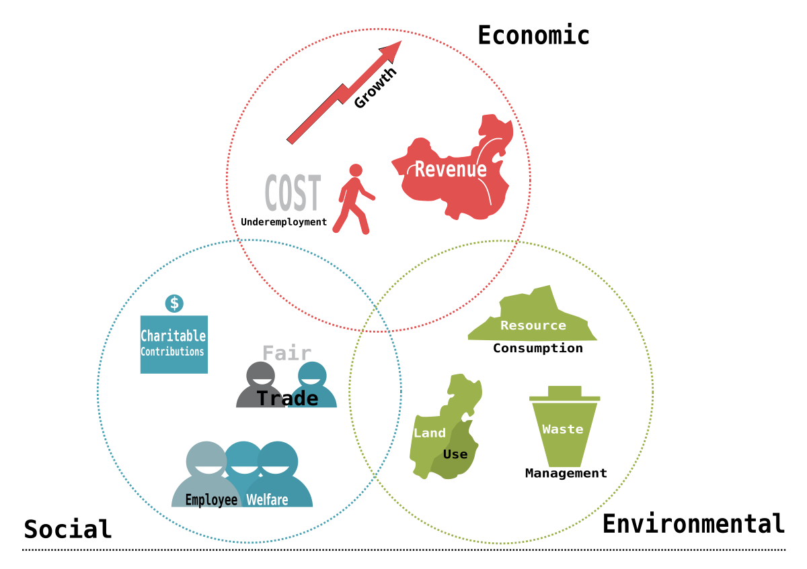

## Table of Contents

## What is the Triple Bottom Line (TBL)?

The Triple Bottom Line (TBL) is a way of measuring a company's success that goes beyond just making money. It looks at three important areas: people, planet, and profit. This means a company should care about its impact on society and the environment, not just its financial performance. The idea is to make sure businesses are responsible and sustainable in the long run.

TBL was first talked about by John Elkington in 1994. He wanted companies to think about more than just their profits. By focusing on the three Ps - people, planet, and profit - businesses can help make the world a better place. This approach encourages companies to be good to their workers, protect the environment, and still make money. It's a way to balance doing well financially with doing good for society and the earth.

## Who coined the term Triple Bottom Line?

The term Triple Bottom Line was coined by John Elkington in 1994. He came up with this idea because he wanted businesses to think about more than just making money. He believed that companies should also care about their impact on people and the planet.

John Elkington's idea was to get companies to focus on three things: people, planet, and profit. This means that a business should be good to its workers and the community, protect the environment, and still make money. The Triple Bottom Line helps companies balance doing well financially with doing good for society and the earth.

## What are the three pillars of the Triple Bottom Line?

The three pillars of the Triple Bottom Line are people, planet, and profit. These three areas help businesses think about more than just making money. They encourage companies to care about their workers and the community, protect the environment, and still make a profit.

People means looking after employees and the community. This can include fair wages, good working conditions, and helping the local area. Planet is about being kind to the environment. This means reducing waste, using less energy, and protecting nature. Profit is still important, but it's not the only thing that matters. A business needs to make money to keep going, but it should do this in a way that also helps people and the planet.

## How does the Triple Bottom Line differ from traditional business metrics?

The Triple Bottom Line (TBL) is different from traditional business metrics because it looks at more than just money. Traditional business metrics focus mainly on profit, like how much money a company makes and how much it spends. They use numbers like revenue, costs, and net income to see if a business is doing well. But the TBL says that a company should also care about people and the planet, not just profit.

The TBL adds two more areas to think about: people and planet. People means taking care of employees and the community, making sure they have good jobs and a good life. Planet means being kind to the environment, like using less energy and making less waste. So, while traditional metrics might say a company is successful if it makes a lot of money, the TBL says a company is truly successful if it also helps people and protects the earth.

## Can you provide examples of companies that use the Triple Bottom Line?

Patagonia is a company that uses the Triple Bottom Line. They care about making good clothes, but they also care about the planet and people. Patagonia tries to use less energy and make less waste. They also help their workers and the community by giving them fair wages and good working conditions. They even give money to groups that protect the environment.

Another company that uses the Triple Bottom Line is Ben & Jerry's. They make ice cream, but they also think about people and the planet. Ben & Jerry's uses fair trade ingredients, which means they pay farmers fairly. They also try to use less energy and make less waste. They help their workers and the community by giving them good jobs and supporting local causes.

## What are the benefits of implementing the Triple Bottom Line in a business?

Implementing the Triple Bottom Line in a business can bring many benefits. It helps a company be more responsible and sustainable. By focusing on people, planet, and profit, a business can make sure it's doing good for the world while still making money. This can make customers and employees happier because they see the company cares about more than just profits. Happy customers might buy more, and happy employees might work harder and stay longer.

Another benefit is that it can help a business stand out. When a company shows it cares about the environment and its workers, it can attract more customers who want to support responsible businesses. This can lead to more sales and a better reputation. Plus, by using resources wisely and reducing waste, a company can save money in the long run. So, the Triple Bottom Line can help a business do well financially while also making a positive impact on the world.

## How can the Triple Bottom Line be measured and reported?

Measuring and reporting the Triple Bottom Line involves looking at three areas: people, planet, and profit. For profit, businesses use traditional financial reports like income statements and balance sheets to show how much money they are making. For the people part, companies can measure things like employee satisfaction, fair wages, and community involvement. They can use surveys, employee feedback, and reports on community projects to show how they are doing in this area. For the planet part, businesses can track their use of energy, water, and materials, as well as their waste and emissions. They can use environmental reports and audits to show how they are reducing their impact on the environment.

Reporting the Triple Bottom Line means putting all this information together in a way that people can understand. A company might create a special report called a sustainability report that includes sections on all three areas: people, planet, and profit. This report can show graphs, numbers, and stories to explain how the company is doing in each area. Some businesses also get their reports checked by outside groups to make sure the information is correct and trustworthy. By sharing this information, a company can show that it cares about more than just making money and is working to be a responsible and sustainable business.

## What are the challenges and criticisms of the Triple Bottom Line approach?

One challenge of the Triple Bottom Line approach is that it can be hard to measure and compare the three areas: people, planet, and profit. While profit is easy to measure with numbers like money made and money spent, measuring the impact on people and the planet is not as simple. For example, how do you put a number on employee happiness or the health of the environment? This makes it hard for businesses to show exactly how well they are doing in all three areas. Another challenge is that focusing on all three areas at once can be costly and time-consuming. Companies might need to spend more money on things like fair wages, environmental protection, and community projects, which can take away from their profits.

There are also criticisms of the Triple Bottom Line approach. Some people say that it can be used as a way for companies to look good without really making big changes. They might talk about their efforts to help people and the planet, but not actually do much. This is called "greenwashing" or "social washing." Another criticism is that the Triple Bottom Line might not go far enough. Some people think that businesses should do more than just balance profit with social and environmental concerns. They believe companies should focus on making the world better, even if it means making less money. This idea is called "shared value" or "corporate social responsibility" and goes beyond the Triple Bottom Line.

## How does the Triple Bottom Line contribute to sustainable development?

The Triple Bottom Line helps businesses contribute to sustainable development by making them think about more than just making money. It encourages companies to care about people and the planet, too. When a business focuses on all three areas - people, planet, and profit - it can help make the world a better place. For example, by treating workers fairly and helping the community, a company can improve people's lives. By using less energy and making less waste, it can protect the environment. This way, the Triple Bottom Line helps businesses be part of sustainable development, which means meeting the needs of today without hurting the future.

However, the Triple Bottom Line is not perfect. It can be hard for companies to measure how well they are doing in all three areas. It's easy to see how much money a business makes, but it's harder to put a number on things like employee happiness or the health of the environment. Also, some people think that the Triple Bottom Line might not go far enough. They believe businesses should do more than just balance profit with social and environmental concerns. They think companies should focus on making the world better, even if it means making less money. Still, the Triple Bottom Line is a good start because it gets businesses thinking about sustainable development and how they can help make the world a better place for everyone.

## What role does the Triple Bottom Line play in corporate social responsibility?

The Triple Bottom Line plays a big role in corporate social responsibility. It helps businesses think about more than just making money. It tells them to care about people and the planet, too. When a company follows the Triple Bottom Line, it tries to be good to its workers and the community. It also tries to protect the environment. This makes the company more responsible and helps it do its part in making the world a better place.

However, using the Triple Bottom Line can be hard. It's easy to see how much money a business makes, but it's harder to measure things like how happy employees are or how healthy the environment is. Some people also think that the Triple Bottom Line might not be enough. They believe businesses should do more than just balance profit with social and environmental concerns. They think companies should focus on making the world better, even if it means making less money. Still, the Triple Bottom Line is a good start because it gets businesses thinking about being responsible and helping the world.

## How can small businesses apply the Triple Bottom Line principles?

Small businesses can apply the Triple Bottom Line by focusing on people, planet, and profit. For people, a small business can start by treating employees well. This means paying fair wages, offering good working conditions, and maybe even helping the local community. For example, a small shop could support local events or charities. By doing these things, the business helps people and builds a good reputation in the community.

For the planet, small businesses can try to use less energy and make less waste. They could switch to energy-saving light bulbs, recycle more, or use eco-friendly materials. Even small steps, like using reusable bags or cups, can make a difference. By being kind to the environment, the business not only helps the planet but can also save money over time. For profit, small businesses need to keep an eye on their money, making sure they earn enough to stay open and grow. By balancing all three areas, a small business can be successful while also doing good for people and the planet.

## What are the future trends and evolutions expected in the Triple Bottom Line framework?

The Triple Bottom Line is likely to keep changing and growing in the future. One big trend is that more and more businesses will start using it. As people care more about the environment and social issues, companies will want to show they are responsible. This means the Triple Bottom Line will become a bigger part of how businesses work. Also, new technology will help companies measure their impact on people and the planet better. This will make it easier for businesses to show how they are doing in all three areas: people, planet, and profit.

Another trend is that the Triple Bottom Line might get more detailed. Right now, it's hard to measure things like employee happiness or environmental health. But in the future, businesses might use new ways to track these things more closely. This could mean using special software or working with experts to get better data. As the Triple Bottom Line gets more detailed, it will help companies make better choices and show the world they are doing their part to make things better.

## References & Further Reading

[1]: Carroll, A. B., & Buchholtz, A. K. (2014). ["Business and Society: Ethics, Sustainability, and Stakeholder Management."](https://books.google.com/books/about/Business_Society_Ethics_Sustainability_S.html?id=TeLdDQAAQBAJ) Cengage Learning.

[2]: Elkington, J. (1997). ["Cannibals with Forks: The Triple Bottom Line of 21st Century Business."](https://link.springer.com/article/10.1023/A:1006129603978) Capstone Publishing.

[3]: Guillet, M. A., Khang, H. V., & Steenbergen, K. V. (2020). ["Algorithmic Trading and Price Efficiency in the Cross-Section of Cryptocurrency Trade."](https://pubmed.ncbi.nlm.nih.gov/33183568/) SSRN Electronic Journal.

[4]: Clune, W. H., & Zehnder, A. J. B. (2018). ["The Triple Bottom Line: Examining the Effectiveness of Corporate Social Responsibility Standards in Defining Sustainable Development."](https://www.ovid.com/journals/hydp/fulltext/10.1002/hyp.15298~quantifying-the-role-of-calibration-strategies-on) Organization & Environment, 31(1), 131-153.

[5]: Jordan, J., & Neubert, M. (2018). ["Sustainability Management and Business Strategy in Asia."](https://link.springer.com/chapter/10.1007/978-3-031-11371-0_2) In Managing Sustainable Business (pp. 23-43). Springer, Dordrecht.