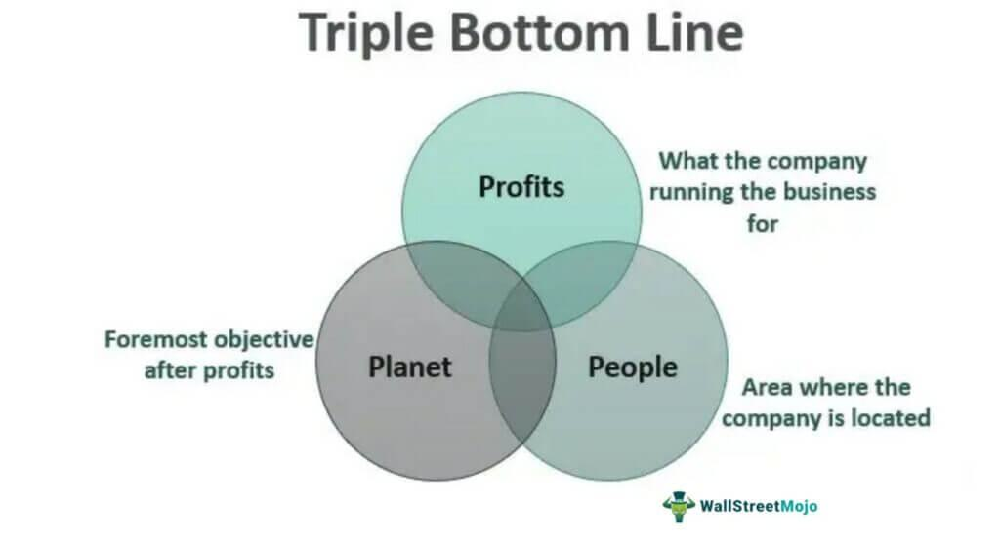

In today's rapidly evolving business landscape, the concepts of corporate social responsibility (CSR), sustainability, business ethics, and algorithmic trading have become significant topics of interest and discussion. These elements are not just independent considerations; rather, they intersect in complex ways that influence business operations and impact broader societal goals. As businesses navigate an increasingly interconnected and transparent world, understanding these themes and their interrelations is essential for remaining competitive and socially responsible.

Corporate social responsibility has evolved from a peripheral business activity to a cornerstone of strategic planning. It involves integrating social and environmental concerns into a company’s operations and interactions with stakeholders. In parallel, sustainability encourages businesses to operate in a manner that ensures the continued availability of resources for future generations, aligning closely with CSR objectives to promote environmental stewardship and social equity. These practices, when incorporated effectively, help businesses contribute positively to society and mitigate negative impacts, enhancing their reputation and securing long-term success.



Business ethics, on the other hand, involves the application of ethical principles to business activities, guiding companies in making decisions that reflect societal values. Ethical frameworks play a critical role in resolving dilemmas and maintaining stakeholder trust, which is crucial given the increasing scrutiny from consumers, investors, and regulators demanding accountability and transparency in business practices.

In the financial sector, algorithmic trading represents a modern approach that uses computational algorithms to automate trading strategies. While it offers efficiency and precision, it also raises ethical concerns related to fairness, transparency, and market manipulation. The integration of ethical considerations in algorithmic trading is pivotal to ensuring these technologies contribute positively to market dynamics rather than exacerbating inequalities or unethical practices.

This article seeks to explore the definitions, interrelations, and implications of these themes for modern businesses. We aim to provide insights into how companies can align their strategies with societal expectations while leveraging the power of technology. Moreover, we will address the role of algorithmic trading, discussing best practices for ethical conduct and its potential contribution to CSR goals and corporate ethics. Through this exploration, we hope to guide businesses in adopting holistic strategies that not only drive economic value but also advance societal well-being.

## Table of Contents

## Understanding Corporate Social Responsibility

Corporate Social Responsibility (CSR) represents a paradigm where businesses not only strive for profitability but also prioritize their impacts on society and the environment. This practice is crucial for fostering an ethical and sustainable business model, where companies act as stewards of both economic and social value. CSR is increasingly recognized as integral to a firm's operational strategy, providing benefits that range from enhanced reputation to increased employee engagement and even financial performance.

CSR is often measured through the Triple Bottom Line (TBL) approach, which expands the traditional reporting framework to consider three dimensions: Profit, People, and Planet. This comprehensive method provides a holistic view of a company's performance:

1. **Profit**: This dimension remains essential as it reflects the financial health of the company. However, CSR encourages firms to generate profit responsibly, avoiding harm to social and environmental structures.

2. **People**: This aspect emphasizes a commitment to social equity by ensuring fair treatment of employees, customers, and communities. Companies may engage in initiatives such as providing fair wages, fostering diversity and inclusion, and investing in community development projects.

3. **Planet**: Environmental stewardship under CSR involves reducing ecological footprints through sustainable resource management and minimizing waste and emissions. Companies might adopt practices such as utilizing renewable energy sources, implementing sustainable supply chain management, and reducing carbon outputs.

Several leading companies have been at the forefront of CSR by integrating these principles into their operations effectively. For example, Unilever's Sustainable Living Plan aims to decouple its environmental impacts from its growth, improve health and well-being outcomes, and enhance livelihoods by 2020. The initiative focuses on reducing the company's ecological footprint while increasing social impact across its entire value chain.

Similarly, Patagonia, a clothing company known for its ecologically responsible practices, has committed to environmental conservation by funding grassroots activists and engaging in corporate accountability efforts. This aligns with Patagonia’s mission to prevent environmental degradation while maintaining profitability.

CSR not only enhances a company's ethical standing but also offers strategic advantages. Firms adopting CSR strategies demonstrate improved customer loyalty and brand differentiation, ultimately leading to competitive advantages in the marketplace. These practices reveal that a commitment to the Triple Bottom Line can be a powerful driver of both social value and business success.

## Sustainability in Business Operations

Sustainability in business operations emphasizes balancing current needs with the preservation of future resources. Businesses are increasingly adopting sustainable practices to integrate ecological and social considerations into their operational frameworks.

### Strategies for Incorporating Sustainable Practices

Incorporating sustainability into business operations involves implementing processes that reduce environmental impact while promoting social equity. Key strategies include:

1. **Resource Efficiency**: This involves minimizing waste and optimizing the use of materials and energy. Adopting circular economy principles, such as recycling and reuse, can significantly diminish ecological footprints.

2. **Sustainable Supply Chains**: Ensuring that the entire supply chain is sustainable is crucial. Companies can work with suppliers to promote sustainable sourcing and reduce emissions and waste. This effort can include selecting partners committed to similar sustainability goals.

3. **Innovation in Product Design**: Developing products that require fewer resources and generate less waste can greatly enhance sustainability. This may involve using biodegradable materials, designing for longevity, and ensuring recyclability.

4. **Employee Engagement and Training**: Educating employees about sustainable practices and engaging them in sustainability initiatives can foster a culture of sustainability. Training programs and incentives can motivate employees to contribute to sustainability goals actively.

5. **Leveraging Technology**: Technology plays a vital role in sustainability. Companies can use data analytics to track resource use and carbon emissions, identify inefficiencies, and optimize operations through automation and improved logistics.

### Role of ESG Criteria in Business

Environmental, Social, and Governance ([ESG](/wiki/esg-investing)) criteria are metrics used to evaluate a company's commitment to sustainable and ethical practices. These criteria guide both operational decisions and investment strategies:

- **Environmental**: Focuses on a company's impact on the natural world, including energy use, waste disposal, pollution control, and conservation efforts.

- **Social**: Examines how a company manages relationships with employees, suppliers, customers, and communities. This includes labor practices, human rights, and community engagement.

- **Governance**: Reviews a company's leadership, executive pay, audits, internal controls, and shareholder rights.

Investors are increasingly using ESG criteria to make informed decisions. Businesses demonstrating strong ESG practices are often more attractive to investors due to perceived lower risks and potential for long-term value.

### Case Studies of Industry Leaders in Sustainability

Several industries have shown remarkable progress in redefining their business models towards sustainability:

- **Automotive Industry**: Companies like Tesla have pioneered electric vehicles (EVs), transforming the industry towards greener alternatives by reducing reliance on fossil fuels and lowering carbon emissions.

- **Technology Sector**: Google has committed to running its data centers on carbon-free energy by 2030. By leveraging machine learning and AI, they optimize energy use, achieving reductions in energy consumption and increased renewable energy integration.

- **Fashion Industry**: Brands such as Patagonia focus on sustainable fashion by using recycled materials, advocating for fair trade, and promoting a circular economy approach to consumer goods, thereby minimizing environmental impact.

These examples demonstrate that by integrating sustainable practices and adhering to ESG standards, companies can not only enhance their environmental and societal contributions but also achieve a competitive advantage that aligns with the expectations of modern consumers and investors.

## Business Ethics and Their Importance

Ethical conduct is a fundamental aspect of sustainable and responsible business practices, serving as an essential guiding principle for companies striving to align their operations with societal values. As businesses navigate a complex landscape of global challenges and opportunities, adhering to robust ethical standards becomes increasingly important to maintain trust and foster long-term success.

Business ethics encompasses the moral principles and standards that guide behavior in the business world. It involves decision-making processes that consider the impact of actions on stakeholders, including employees, customers, suppliers, communities, and the environment. By prioritizing ethical conduct, businesses can ensure their strategies are in harmony with societal expectations and contribute positively to the larger community.

Common ethical dilemmas faced by businesses include conflicts of interest, issues of transparency and honesty, fair treatment of employees, and corporate governance challenges. For instance, a conflict of interest might arise when a decision benefits a particular individual within a company but might not align with the company's or its stakeholders' best interests. Transparency and honesty are critical, as deceptive practices can undermine consumer trust and damage reputations.

To navigate these dilemmas, businesses can rely on ethical frameworks such as utilitarianism, which emphasizes the greatest good for the greatest number, or Kantian ethics, which stresses duty and adherence to universal moral laws. Additionally, codes of conduct and compliance programs can be developed to provide employees with clear guidelines on ethical behavior and decision-making.

The importance of business ethics extends beyond resolving dilemmas; it plays a critical role in maintaining stakeholder trust. Companies that consistently demonstrate ethical behavior can cultivate a positive corporate reputation, attract and retain customers, and foster employee loyalty. Trust is an invaluable asset that translates into a competitive advantage, particularly in markets where consumers are increasingly conscious of corporate conduct.

Moreover, ethical business practices contribute to long-term success by minimizing risks associated with legal issues, regulatory penalties, and reputational damage. As ethical considerations become integral to corporate strategy, businesses can better align with societal values, ensuring resilience and sustainability in their operations.

In conclusion, embedding strong ethical principles within corporate strategies is not merely an obligation but a strategic imperative. Businesses that embrace ethical conduct lay the groundwork for enduring success, positioning themselves as leaders in a rapidly evolving business environment.

## Algorithmic Trading: A Modern Approach

Algorithmic trading has become a cornerstone of modern financial markets, utilizing advanced computational algorithms to automate trading decisions and executions. At its core, [algorithmic trading](/wiki/algorithmic-trading) involves the use of mathematical models and complex formulas to detect patterns, optimize trade execution, and at times predict market movements. This approach leverages high-speed data processing and sophisticated analytics, enabling traders to execute large volumes of trades with precision and speed.

**Mechanics of Algorithmic Trading**

Algorithmic trading relies on a series of predefined rules or algorithms that execute trades based on quantitative data inputs. These algorithms can analyze multiple markets and assets simultaneously, respond to market conditions in real-time, and execute orders at speeds unattainable by human traders. Typically, algorithmic trading strategies include:

1. **Market Making**: Involves placing simultaneous buy and sell orders, aiming to profit from the bid-ask spread.

2. **Trend Following**: Relies on algorithms to identify and exploit market trends using technical indicators.

3. **Arbitrage**: Seeks to profit from price inefficiencies between correlated instruments.

4. **Statistical Arbitrage**: Uses statistical methods to identify price discrepancies over time.

A fundamental aspect of these mechanics is the constant [backtesting](/wiki/backtesting) and optimization of algorithms, often using historical data to predict future performance accurately. Python, with libraries such as NumPy and pandas, is commonly used for implementing backtesting models due to its robust data handling capabilities.

```python
import pandas as pd
import numpy as np

# Simple Example of a Moving Average Crossover Strategy
def moving_average_strategy(data, short_window=40, long_window=100):
    signals = pd.DataFrame(index=data.index)
    signals['signal'] = 0.0

    # Short moving average
    signals['short_mavg'] = data['price'].rolling(window=short_window, min_periods=1, center=False).mean()

    # Long moving average
    signals['long_mavg'] = data['price'].rolling(window=long_window, min_periods=1, center=False).mean()

    # Create the signals
    signals['signal'][short_window:] = np.where(signals['short_mavg'][short_window:] > signals['long_mavg'][short_window:], 1.0, 0.0)   

    return signals
```

**Impact on Market Dynamics**

Algorithmic trading influences market dynamics by enhancing [liquidity](/wiki/liquidity-risk-premium), reducing spreads, and often increasing market [volatility](/wiki/volatility-trading-strategies) due to rapid and high-[volume](/wiki/volume-trading-strategy) trading strategies. Its prominence in high-frequency trading ([HFT](/wiki/high-frequency-trading-strategies)) has led to improvements in market efficiency, yet it has also contributed to significant market events, such as the "flash crash" in 2010, which exemplified the potential for algorithms to amplify volatility.

**Ethical Considerations**

Algorithmic trading raises several ethical concerns. Transparency is a significant issue, as the complex nature of these algorithms means that they can operate with little human oversight, potentially leading to opaqueness and unfair advantages for certain market participants. The fairness of high-frequency trading is often questioned, considering the potential for market manipulation, where algorithms might engage in practices like spoofing or layering to deceive other traders.

**Regulatory Frameworks**

Regulators across the globe have implemented frameworks to mitigate the risks associated with algorithmic trading. In the United States, the Securities and Exchange Commission (SEC) and the Commodity Futures Trading Commission (CFTC) mandate reporting requirements and compliance with strict risk control measures. Similarly, MiFID II in the European Union requires algorithmic traders to have systems that are resilient against market abuse. These regulations aim to ensure that algorithmic trading contributes positively to market integrity and stability while preventing manipulative behaviors.

In conclusion, while algorithmic trading has transformed financial markets, offering numerous benefits in terms of efficiency and liquidity, it also presents challenges that must be managed through ethical responsibility and comprehensive regulatory oversight.

## Integrating CSR, Sustainability, and Business Ethics with Algorithmic Trading

In the contemporary business environment, the integration of Corporate Social Responsibility (CSR), sustainability, and business ethics with algorithmic trading is becoming increasingly feasible and essential. This convergence aims to leverage technologically advanced trading systems to meet societal expectations and ethical standards while maximizing economic benefits.

Algorithmic trading uses automated and computerized trading strategies to execute orders on financial markets. By employing sophisticated algorithms, these systems can analyze vast amounts of data and execute trades at speeds and efficiencies beyond human capabilities. This technological advancement can be harnessed to support CSR and sustainability objectives.

Algorithmic trading can contribute positively to CSR goals and corporate ethics by enhancing transparency, fairness, and accountability in financial markets. Algorithms, when designed with ethical considerations, can ensure that trading practices do not exploit market inefficiencies at the expense of broader societal interests. For instance, algorithmic trading systems can be programmed to avoid strategies that could lead to market manipulation or create systemic risks.

To further integrate these ethical principles, businesses can adopt strategies that use algorithmic trading to reduce environmental impacts. By incorporating ESG criteria into trading algorithms, companies can prioritize investments in companies with strong environmental stewardship records. This approach not only supports sustainable business practices but also encourages companies to improve their own ESG performance to attract investment. For example, algorithms could be used to allocate a higher weight to securities of firms with lower carbon emissions, thereby promoting cleaner technologies and practices through market mechanisms.

Algorithmic trading also holds the potential to improve social equity. By facilitating access to financial markets for previously marginalized groups, it democratizes trading opportunities. This can be achieved by designing algorithms that assess and mitigate biases in financial data, ensuring fair treatment for all market participants, regardless of their economic status or geographical location.

There are already instances where this integration has been successfully implemented. For example, the use of blockchain technology in trading platforms has increased transparency and trust among investors, aligning with CSR principles. Blockchain can be used to verify transactions securely and transparently, reducing the likelihood of fraudulent activities. Companies like Nasdaq have explored blockchain to enhance corporate governance, demonstrating a commitment to ethical transparency in trading operations.

Additionally, firms like BlackRock have integrated sustainability considerations into their investment decision-making processes by using algorithmic strategies that account for ESG factors. This alignment of automated trading with sustainable investment practices exemplifies how businesses can innovate within ethical frameworks to achieve broader societal benefits.

In conclusion, by thoughtfully integrating CSR, sustainability, and business ethics within algorithmic trading systems, businesses can create a more equitable and environmentally responsible financial landscape. These efforts not only align with ethical standards but also foster long-term economic and social value, ultimately driving innovation that supports the greater good.

## Conclusion

The confluence of corporate social responsibility (CSR), sustainability, and algorithmic trading creates both challenges and opportunities for modern businesses. These elements, when effectively integrated, have the potential to transform companies, providing not only economic benefits but also contributing significantly to societal and environmental welfare.

One of the key takeaways is that businesses must adopt holistic strategies that incorporate the principles of CSR and sustainability into their core operations while embracing technological advancements like algorithmic trading. This approach allows companies to navigate the complexities of contemporary markets and meet the evolving expectations of stakeholders. By balancing profit-driven goals with ethical and sustainable practices, organizations can achieve long-term success and foster a positive reputation.

Innovation will be the driving force for businesses as they continue to evolve in a rapidly changing world. The future lies in their ability to develop solutions that adhere to ethical standards and sustainability goals. Incorporating algorithmic trading not only facilitates efficient market operations but also provides an avenue to address CSR objectives, such as reducing carbon footprints or enhancing financial inclusivity.

Business leaders are encouraged to take proactive steps in embracing ethical practices and leveraging technology for broader societal and environmental benefits. With the integration of algorithmic trading into CSR and sustainability frameworks, businesses can enhance transparency, optimize resource use, and promote social equity. This strategic alignment, underpinned by a commitment to ethical standards and innovation, will enable companies to contribute positively to the global community while achieving sustainable growth.

## References & Further Reading

[1]: Carroll, A. B., & Buchholtz, A. K. (2014). ["Business and Society: Ethics, Sustainability, and Stakeholder Management."](https://books.google.com/books/about/Business_Society_Ethics_Sustainability_S.html?id=TeLdDQAAQBAJ) Cengage Learning.

[2]: Elkington, J. (1997). ["Cannibals with Forks: The Triple Bottom Line of 21st Century Business."](https://link.springer.com/article/10.1023/A:1006129603978) Capstone Publishing.

[3]: Guillet, M. A., Khang, H. V., & Steenbergen, K. V. (2020). ["Algorithmic Trading and Price Efficiency in the Cross-Section of Cryptocurrency Trade."](https://pubmed.ncbi.nlm.nih.gov/33183568/) SSRN Electronic Journal.

[4]: Clune, W. H., & Zehnder, A. J. B. (2018). ["The Triple Bottom Line: Examining the Effectiveness of Corporate Social Responsibility Standards in Defining Sustainable Development."](https://www.ovid.com/journals/hydp/fulltext/10.1002/hyp.15298~quantifying-the-role-of-calibration-strategies-on) Organization & Environment, 31(1), 131-153.

[5]: Jordan, J., & Neubert, M. (2018). ["Sustainability Management and Business Strategy in Asia."](https://link.springer.com/chapter/10.1007/978-3-031-11371-0_2) In Managing Sustainable Business (pp. 23-43). Springer, Dordrecht.