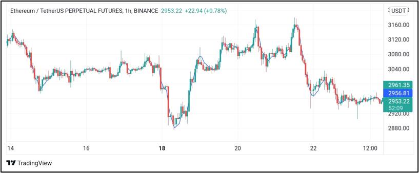

## Table of Contents

## What is a Triple Exponential Moving Average (TEMA)?

A Triple Exponential Moving Average (TEMA) is a type of moving average used in technical analysis to help smooth out price data and make it easier to spot trends. It's called "triple" because it uses three different exponential moving averages (EMAs) combined in a special way to reduce the lag that you often see with regular moving averages. This makes the TEMA more responsive to recent price changes, which can be helpful for traders who want to act quickly on new market information.

The TEMA is calculated using a formula that involves three EMAs with the same period. First, you calculate a single EMA of the price data. Then, you calculate an EMA of that first EMA, and finally, an EMA of the second EMA. These three EMAs are then combined in a way that emphasizes the most recent price data while still smoothing out the overall trend. This method helps to reduce the impact of short-term price fluctuations, making it easier to see the bigger picture in the market.

## How does TEMA differ from Simple Moving Average (SMA) and Exponential Moving Average (EMA)?

TEMA, or Triple Exponential Moving Average, is different from Simple Moving Average (SMA) and Exponential Moving Average (EMA) mainly because it uses three EMAs to make it more responsive to new price changes. SMA is the simplest type of moving average where you just take the average of a set number of past prices. It's easy to understand and calculate, but it can be slow to react to new price movements because it gives equal weight to all the prices in its calculation period. On the other hand, EMA gives more weight to recent prices, so it reacts faster than SMA to changes in the market. Still, EMA can still have a bit of a lag compared to TEMA.

TEMA goes a step further than EMA by using three levels of EMAs in its calculation. This triple smoothing helps to reduce the lag even more, making TEMA quicker to show changes in the market compared to both SMA and EMA. While SMA and EMA are easier to calculate and understand, TEMA is more complex but can provide a clearer picture of the current trend. This makes TEMA useful for traders who need to make quick decisions based on the latest market movements.

## What is the formula for calculating TEMA?

The formula for calculating the Triple Exponential Moving Average (TEMA) involves using three different Exponential Moving Averages (EMAs). First, you start by calculating a regular EMA of the price data. Let's call this EMA1. Then, you calculate an EMA of EMA1, which we'll call EMA2. Finally, you calculate an EMA of EMA2, which we'll call EMA3. All these EMAs use the same time period, which you choose depending on how quickly you want the TEMA to respond to price changes.

After you have these three EMAs, you combine them using a special formula to create the TEMA. The formula is: TEMA = (3 * EMA1) - (3 * EMA2) + EMA3. This formula gives more weight to the most recent prices, which is why TEMA can react faster to price changes than a Simple Moving Average (SMA) or a single EMA. By using this combination of EMAs, TEMA helps to reduce the lag that you often see with other types of moving averages, making it easier to see the current trend in the market.

## Why would a trader use TEMA instead of other moving averages?

A trader might choose to use TEMA instead of other moving averages because it's better at showing the current trend quickly. TEMA uses three levels of exponential moving averages, which helps it respond faster to changes in the market. This is helpful for traders who need to make quick decisions based on the latest price movements. Other moving averages, like the simple moving average (SMA) or the exponential moving average (EMA), can be slower to show changes because they don't use as many levels of smoothing.

For example, if a trader is trying to spot a new trend early, TEMA can help them see it sooner than they would with an SMA or EMA. This can be really important in fast-moving markets where being quick to act can make a big difference. Even though TEMA is more complex to calculate, the advantage of getting a clearer, more up-to-date picture of the market trend can be worth it for many traders.

## How can TEMA be applied in technical analysis?

In technical analysis, traders use TEMA to help them see the direction of the market more clearly and quickly. TEMA is good at smoothing out the ups and downs of price movements, so it can show the overall trend without getting too distracted by short-term changes. For example, if a trader sees that the TEMA line is going up, it might mean the market is in an uptrend, and they might decide to buy. If the TEMA line is going down, it could mean the market is in a downtrend, and the trader might decide to sell.

Traders also use TEMA to find good times to buy or sell by looking for something called a "crossover." This happens when the price of a stock or another asset crosses above or below the TEMA line. If the price goes above the TEMA, it might be a good time to buy because it could mean the start of an uptrend. If the price goes below the TEMA, it might be a good time to sell because it could mean the start of a downtrend. By using TEMA, traders can make decisions based on a clearer picture of what the market is doing right now.

## What are the advantages of using TEMA in trading?

Using TEMA in trading has some big advantages. TEMA is good at showing the direction of the market quickly. It does this by using three levels of smoothing, which makes it better at picking up on new trends without getting confused by short-term price changes. This means traders can see what's happening in the market faster than with other moving averages, like SMA or EMA. When you're trading, being quick to spot a new trend can help you make better decisions, like knowing when to buy or sell.

Another advantage of TEMA is that it helps traders find good times to buy or sell. Traders look for moments when the price of a stock crosses above or below the TEMA line. If the price goes above the TEMA, it might be a good time to buy because it could mean the start of an uptrend. If the price goes below the TEMA, it might be a good time to sell because it could mean the start of a downtrend. This helps traders make decisions based on a clearer picture of what the market is doing right now, without getting distracted by small price movements.

## What are the potential drawbacks or limitations of TEMA?

One potential drawback of using TEMA is that it can be more complicated to calculate than other moving averages like SMA or EMA. Because TEMA uses three levels of exponential moving averages, it requires more steps and can be harder for some people to understand. This complexity might make it less appealing for traders who prefer simpler tools or who are just starting out in trading.

Another limitation of TEMA is that it might give false signals more often than simpler moving averages. Since TEMA is very sensitive to recent price changes, it can react too quickly to small price movements that don't actually mean a new trend is starting. This can lead to traders making decisions based on these false signals, which might result in losses if the market doesn't move the way they expected.

## How does the period length affect the sensitivity of TEMA?

The period length of a TEMA affects how quickly it reacts to changes in the market. A shorter period length, like 10 days, makes the TEMA more sensitive to recent price movements. This means it will show new trends faster, but it might also react too much to small price changes that don't really matter. Traders who want to spot new trends early might choose a shorter period length, but they need to be careful because it can lead to more false signals.

On the other hand, a longer period length, like 50 days, makes the TEMA less sensitive to recent price changes. This means it will take longer to show new trends, but it will be smoother and less likely to react to small price movements. Traders who want a clearer picture of the overall trend without getting distracted by short-term changes might choose a longer period length. The choice of period length depends on what the trader is trying to achieve and how much risk they are willing to take.

## Can TEMA be used effectively in different market conditions?

TEMA can be used in different market conditions, but it works best in markets that are trending. When the market is moving clearly up or down, TEMA helps traders see the trend quickly and make decisions based on it. In a strong uptrend, TEMA can show when the price is moving above it, suggesting a good time to buy. In a strong downtrend, TEMA can show when the price is moving below it, suggesting a good time to sell. Because TEMA reacts fast to price changes, it helps traders catch these trends early.

However, TEMA can be less effective in markets that are moving sideways or not showing a clear trend. In these conditions, TEMA might give false signals because it reacts to small price movements that don't mean a new trend is starting. Traders might think they see a new trend starting when it's just the market bouncing around. So, in choppy or sideways markets, TEMA might lead to more wrong decisions. Traders need to be careful and maybe use other tools along with TEMA to get a better picture of what's happening in the market.

## How can TEMA be combined with other indicators for better trading signals?

Traders often use TEMA along with other indicators to get better trading signals. One common way is to use TEMA with the Relative Strength Index (RSI). RSI helps show if a stock is overbought or oversold. If the TEMA line starts going up and the RSI is below 30, it might be a good time to buy because it suggests the stock is starting a new uptrend from an oversold position. If the TEMA line starts going down and the RSI is above 70, it might be a good time to sell because it suggests the stock is starting a new downtrend from an overbought position.

Another way to use TEMA is with the Moving Average Convergence Divergence (MACD). MACD helps show the strength and direction of a trend. If the TEMA line crosses above the price and the MACD line crosses above its signal line, it can be a strong buy signal because it shows both that the price is moving up and the trend is getting stronger. If the TEMA line crosses below the price and the MACD line crosses below its signal line, it can be a strong sell signal because it shows both that the price is moving down and the trend is getting weaker. By using TEMA with other indicators, traders can get a clearer picture of the market and make better trading decisions.

## What are some common strategies that incorporate TEMA?

One common strategy that uses TEMA is the crossover strategy. In this strategy, traders watch for when the price of a stock crosses above or below the TEMA line. If the price goes above the TEMA, it might mean the stock is starting a new uptrend, so traders might decide to buy. If the price goes below the TEMA, it might mean the stock is starting a new downtrend, so traders might decide to sell. This strategy helps traders spot new trends quickly and act on them.

Another strategy is to use TEMA with other indicators like the Relative Strength Index (RSI). Traders look at the TEMA line to see the overall trend and use the RSI to check if the stock is overbought or oversold. If the TEMA line is going up and the RSI is below 30, it might be a good time to buy because the stock could be starting a new uptrend from an oversold position. If the TEMA line is going down and the RSI is above 70, it might be a good time to sell because the stock could be starting a new downtrend from an overbought position. This strategy helps traders make more informed decisions by combining different pieces of information.

A third strategy involves using TEMA with the Moving Average Convergence Divergence (MACD). Traders use TEMA to see the current trend and the MACD to check the strength of that trend. If the TEMA line goes above the price and the MACD line crosses above its signal line, it can be a strong buy signal because it shows both that the price is moving up and the trend is getting stronger. If the TEMA line goes below the price and the MACD line crosses below its signal line, it can be a strong sell signal because it shows both that the price is moving down and the trend is getting weaker. This strategy helps traders confirm their trading decisions with more confidence.

## How can one optimize the settings of TEMA for specific trading instruments?

To optimize the settings of TEMA for specific trading instruments, a trader needs to think about the instrument's usual price movements and their own trading goals. Different instruments, like stocks, forex, or commodities, can have different levels of volatility and trend behavior. For example, if you're trading a stock that moves a lot in a short time, you might want to use a shorter period length for TEMA, like 10 days, to catch quick trends. If you're trading something that moves more slowly, like a commodity, you might use a longer period length, like 50 days, to see the bigger picture.

Another way to optimize TEMA is by trying out different period lengths and seeing which one works best for your trading style. You can do this by looking at past price data, called backtesting, to see how well different TEMA settings would have worked. For example, you might find that a 20-day TEMA works well for a certain stock because it shows trends early without reacting too much to small price changes. By adjusting the period length and testing it on past data, you can find the best TEMA settings for your specific trading instrument and goals.

## How do you calculate a Triple Exponential Moving Average (TEMA)?

The Triple Exponential Moving Average (TEMA) is a sophisticated indicator used by traders to reduce lag and provide a clearer perspective on price trends. Calculating TEMA involves multiple layers of exponential moving averages (EMAs), which smooth out price data more effectively than standard EMAs. This process starts with the calculation of the initial EMA and advances through a series of steps to refine the data.

### Calculation Steps

1. **Initial EMA (EMA1):**
   The initial EMA is calculated over a specified period. This period could be any chosen timeframe, such as 10 days, 20 days, etc. The formula for calculating EMA is:
$$
   \text{EMA1}_{t} = \left( \frac{P_{t} - \text{EMA1}_{t-1}}{N+1} \right) + \text{EMA1}_{t-1}

$$

   where $P_{t}$ is the current price, $\text{EMA1}_{t-1}$ is the previous period's EMA, and $N$ is the number of periods.

2. **Second EMA (EMA2):**
   Calculate the EMA of the EMA1 values obtained in the previous step. This effectively smooths out the series further. The formula remains the same but applies to the EMA1 data series:
$$
   \text{EMA2}_{t} = \left( \frac{\text{EMA1}_{t} - \text{EMA2}_{t-1}}{N+1} \right) + \text{EMA2}_{t-1}

$$

3. **Third EMA (EMA3):**
   Similarly, compute the EMA of the EMA2 series, which adds another level of smoothing:
$$
   \text{EMA3}_{t} = \left( \frac{\text{EMA2}_{t} - \text{EMA3}_{t-1}}{N+1} \right) + \text{EMA3}_{t-1}

$$

4. **Calculate the TEMA:**
   With EMA1, EMA2, and EMA3 established, TEMA can now be computed using the formula:
$$
   \text{TEMA} = (3 \times \text{EMA1}) - (3 \times \text{EMA2}) + \text{EMA3}

$$

   This equation weights EMA1 heavily while adjusting for the over-smoothing that may be encountered in EMA2 and EMA3, thereby providing a faster response to recent price changes.

### Python Code Implementation

Here's a simple Python implementation to calculate TEMA for a given dataset using the `pandas` library:

```python
import pandas as pd

def calculate_ema(series, span):
    return series.ewm(span=span, adjust=False).mean()

def calculate_tema(prices, span):
    ema1 = calculate_ema(prices, span)
    ema2 = calculate_ema(ema1, span)
    ema3 = calculate_ema(ema2, span)
    tema = (3 * ema1) - (3 * ema2) + ema3
    return tema

# Example usage with a Pandas DataFrame 'df' and a column 'Close' for prices.
# df['TEMA'] = calculate_tema(df['Close'], span=10)
```

### Significance of Each Step

- **EMA1** focuses on smoothing the raw price data, which helps in managing volatility.
- **EMA2** further refines this smoothed data, allowing for a reduced lag in signal interpretation.
- **EMA3** finalizes the smoothing process to minimize noise, preparing the data for accurate TEMA calculation.

By following these steps, traders can utilize TEMA to quickly react to market trends while mitigating lag, a common issue with simpler moving averages.

## What are the Frequently Asked Questions?

**How does TEMA differ from other moving averages?**

The Triple Exponential Moving Average (TEMA) distinguishes itself from other moving averages such as the Simple Moving Average (SMA) and the Exponential Moving Average (EMA) by its methodology and purpose. While the SMA calculates an average of prices over a specified period, offering a direct but often lagging indicator, the EMA provides more weight to recent prices, reducing lag but still sensitive to false signals. TEMA, developed by Patrick Mulloy, further minimizes lag by utilizing a complex algorithm that combines three EMAs: 

$$
\text{TEMA} = (3 \times \text{EMA}_1) - (3 \times \text{EMA}_2) + \text{EMA}_3
$$

Where $\text{EMA}_1$ is the EMA of the original data, $\text{EMA}_2$ is the EMA of $\text{EMA}_1$, and $\text{EMA}_3$ is the EMA of $\text{EMA}_2$. This three-layer calculation provides TEMA with a smoother response to price changes, enhancing its suitability for fast-paced trading environments like algorithmic trading.

**What are its main advantages and disadvantages?**

**Advantages:**
1. **Reduced Lag:** TEMA's primary advantage lies in its ability to reduce the lag commonly associated with moving averages. This allows traders to react more swiftly to market changes.
2. **Improved Signal Clarity:** The smoothing effect minimizes noise, making trends and reversals more apparent.
3. **Versatility:** TEMA's sensitivity makes it adaptable for various trading strategies, including trend-following and mean-reversion.

**Disadvantages:**
1. **Sensitivity to Whipsaws:** While reduced lag is advantageous, it also makes TEMA prone to producing false signals in volatile markets.
2. **Not Ideal for Sideways Markets:** In periods of market consolidation, TEMA may struggle to provide accurate signals due to its responsiveness to minor price fluctuations.
3. **Complexity:** The intricate calculation and requirement for multiple EMAs can make it less intuitive for beginners compared to other moving averages.

**How is TEMA applied in trading strategies?**

TEMA is widely used in algorithmic trading due to its ability to quickly adapt to price changes. Common applications include:
- **Trend Identification:** Traders use TEMA to confirm the direction of a trend, leveraging its responsiveness to capture profitable movements early.
- **Crossover Strategies:** By pairing TEMA with another moving average, traders can identify entry and exit points based on crossovers.
- **Combining with Other Indicators:** Integrating TEMA with indicators like the Moving Average Convergence Divergence (MACD) or Relative Strength Index (RSI) can enhance decision-making and signal reliability.

By understanding these differentiations and applications, traders can effectively incorporate TEMA into their trading arsenal, allowing for more nuanced and responsive strategies in algorithmic environments.

## References & Further Reading

[1]: Mulloy, P. (1994). ["Smoothing Data with Faster Moving Averages."](https://chartschool.stockcharts.com/table-of-contents/technical-indicators-and-overlays/technical-overlays/double-exponential-moving-average-dema) Technical Analysis of Stocks & Commodities Magazine.

[2]: Aronson, D. R. (2006). ["Evidence-Based Technical Analysis: Applying the Scientific Method and Statistical Inference to Trading Signals."](https://www.amazon.com/Evidence-Based-Technical-Analysis-Scientific-Statistical/dp/0470008741) Wiley.

[3]: Chan, E. P. (2008). ["Quantitative Trading: How to Build Your Own Algorithmic Trading Business."](https://github.com/ftvision/quant_trading_echan_book) John Wiley & Sons.

[4]: de Prado, M. L. (2018). ["Advances in Financial Machine Learning."](https://www.amazon.com/Advances-Financial-Machine-Learning-Marcos/dp/1119482089) Wiley.

[5]: Jansen, S. (2020). ["Machine Learning for Algorithmic Trading."](https://github.com/stefan-jansen/machine-learning-for-trading) Packt Publishing.