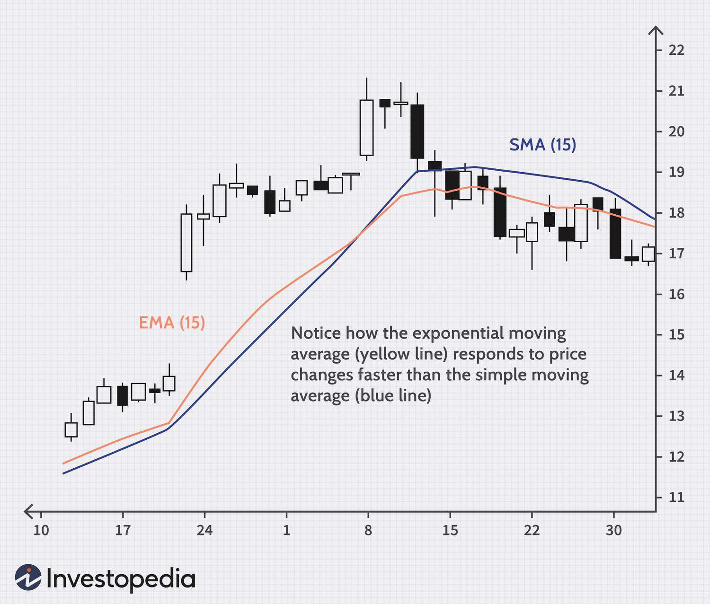

Technical indicators are essential tools in trading analysis and algorithmic trading, allowing traders to interpret market data to make informed decisions. Among these indicators, the Triple Exponential Moving Average (TEMA) is notably effective in smoothing price data and identifying trends due to its advanced smoothing techniques, which help reduce the lag typically associated with traditional moving averages.

TEMA was developed to address some of the limitations of conventional moving averages by utilizing multiple exponential moving averages in its calculation. This unique approach provides a more responsive indicator that captures price movements with greater accuracy, thus offering a clearer picture of underlying market trends. The significance of TEMA in trading lies not only in its ability to smooth price data but also in its capacity to help traders swiftly react to market changes, a critical aspect in the fast-paced world of financial trading.



This article aims to comprehensively explore TEMA by discussing its calculation method and showcasing its application in algorithmic trading. We will examine how the integration of TEMA into trading algorithms can enhance decision-making by providing timely buy and sell signals based on trends and potential support or resistance levels. Additionally, the article will address the benefits and limitations of TEMA, emphasizing the importance of using it alongside other technical indicators to avoid reliance on a single metric.

Finally, the article will outline popular strategies and best practices for incorporating TEMA in algorithmic trading systems, highlighting how traders can leverage this technical indicator to optimize their trading performance. By understanding and applying TEMA effectively, traders can enhance their ability to make informed and strategic trading decisions.

## Table of Contents

## Understanding Technical Indicators

Technical indicators are mathematical tools used extensively in financial markets to evaluate historical price and volume data of assets. These indicators provide traders with insights for identifying market trends, determining potential entry and exit points, and assessing overall market momentum. By analyzing past market behaviors, technical indicators facilitate decision-making processes, aiding traders in navigating the complexities of financial markets.

Indicators can be broadly classified into several categories including trend, momentum, volume, and volatility indicators. Trend indicators, such as moving averages, assist in identifying the primary direction of market movements. Momentum indicators, like the Relative Strength Index (RSI), measure the speed and change of price movements, helping traders recognize overbought or oversold conditions. Volume indicators, for example, On-Balance Volume (OBV), reflect the flow of money into or out of a security, providing insight into the strength of a market move. Volatility indicators, such as the Bollinger Bands, indicate the stability or instability of price movements, essential for assessing market risk.

The integration of technical indicators into trading strategies is significantly enhanced through [algorithmic trading](/wiki/algorithmic-trading). Algorithmic trading involves the use of computer programs to execute trades based on predefined criteria and rules, often incorporating technical indicators to generate buy or sell signals. This approach reduces human error and emotional bias, allowing for more disciplined and consistent trading decisions. In Python, for example, one might use libraries such as pandas and ta (technical analysis) to calculate and apply various technical indicators in an algorithmic trading system.

For instance, a simple implementation in Python to calculate a moving average might look like this:

```python
import pandas as pd

# Sample DataFrame of historical prices
data = {'price': [100, 102, 104, 103, 105, 107, 109]}
df = pd.DataFrame(data)

# Calculate a simple moving average
df['SMA'] = df['price'].rolling(window=3).mean()

print(df)
```

The central role of technical indicators in automated trading systems emphasizes their importance in modern finance. By providing a quantitative foundation for trading strategies, they enable traders to respond dynamically and objectively to changing market conditions. Nonetheless, effective use of these indicators demands a comprehensive understanding and careful consideration of market context, coupled with [backtesting](/wiki/backtesting) to ascertain the robustness of trading strategies under various conditions.

## The Role of TEMA in Trading

TEMA, or Triple Exponential Moving Average, serves as a powerful trend indicator designed to help traders efficiently identify and track market trends by minimizing the lag that typically accompanies traditional moving averages. This characteristic makes TEMA particularly advantageous in fast-moving markets, where timely decisions are crucial. Developed in the 1990s by Patrick Mulloy, TEMA employs a series of exponential moving averages, strategically layered to smooth out price data while maintaining sensitivity to price fluctuations.

The essence of TEMA's design is in its calculation process, leveraging multiple exponential moving averages (EMAs) to achieve its effect. By applying multiple EMAs (EMA1, EMA2, and EMA3), TEMA effectively reduces lag, allowing traders to detect trend changes more rapidly than simple or exponential moving averages. In practical terms, this enables traders to react quicker to evolving market conditions, an essential [factor](/wiki/factor-investing) for successful trading in trending markets, where price movements are more directional and less ambiguous.

While TEMA is highly effective in trending markets, it is important to acknowledge its limitations in range-bound markets, where price movements lack a clear direction. In such conditions, the indicator may produce false signals, leading traders to erroneous conclusions about market trends. Consequently, while TEMA offers substantial benefits, it should be applied with caution in non-trending market scenarios.

TEMA also provides insight into potential support and resistance levels, key areas in price charts where price movements may pause or reverse. When the TEMA crosses over these levels, it can serve as a signal for potential buy or sell opportunities, helping traders to strategically position themselves in anticipation of market shifts.

Furthermore, TEMA is frequently used alongside other technical analysis tools, such as the Moving Average Convergence Divergence (MACD), to enhance the comprehensiveness of market analysis. By integrating TEMA with MACD, traders can obtain a more robust understanding of market [momentum](/wiki/momentum) and trend strength, improving their ability to forecast future price movements. This combination leverages the strengths of both indicators, compensating for individual limitations and strengthening trading strategies with multi-faceted analysis.

## Calculating the Triple Exponential Moving Average

Calculating the Triple Exponential Moving Average (TEMA) requires a systematic approach that ensures precision in smoothening data and reducing lag. The process begins with the calculation of the Exponential Moving Average (EMA) for a predetermined time period. An EMA is essentially a type of weighted moving average that gives more importance to recent data points, making it more responsive to recent price changes compared to a simple moving average. 

The formula to calculate EMA is:

$$
EMA_t = \left( \frac{2}{n+1} \right) \times (P_t - EMA_{t-1}) + EMA_{t-1}
$$

where $EMA_t$ is the EMA at time $t$, $P_t$ is the current price, and $n$ is the number of periods.

Once the initial EMA (denoted as EMA1) is determined, the calculation becomes recursive to build subsequent EMAs. The second EMA (EMA2) is computed on the values of EMA1, and then, the third EMA (EMA3) is calculated on the values of EMA2. These steps are essential for the development of the TEMA formula.

The TEMA formula combines these three EMAs to effectively adjust for lag inherent in each individual EMA, resulting in a more agile and responsive indicator. The final TEMA is calculated using the following formula:

$$
TEMA = (3 \times EMA1) - (3 \times EMA2) + EMA3
$$

This structure helps TEMA rapidly respond to market movements while maintaining significant noise reduction.

Traders can manipulate the lookback period $n$ in the EMA calculations to fine-tune the TEMA's responsiveness to market data. Shorter lookback periods make the TEMA more sensitive to short-term trends, useful for high-frequency trading or [day trading](/wiki/day-trading-spy). Conversely, longer lookback periods generate a smoother line, mitigating noise but potentially delaying the signal response, which is ideal for capturing long-term trends. 

Practical implementation of these calculations can be simplified using programming languages like Python. Here's a basic example of how to calculate TEMA using Python with the pandas library:

```python
import pandas as pd

def calculate_ema(series, span):
    return series.ewm(span=span, adjust=False).mean()

def calculate_tema(series, span):
    ema1 = calculate_ema(series, span)
    ema2 = calculate_ema(ema1, span)
    ema3 = calculate_ema(ema2, span)
    return (3 * ema1) - (3 * ema2) + ema3

data = pd.Series([...])  # Replace [...] with your data series
tema = calculate_tema(data, span=9)  # Example with a span of 9
```

This code demonstrates the fundamental logic behind calculating TEMA, allowing traders to adapt and implement it within broader trading strategies.

## Incorporating TEMA in Algorithmic Trading

Algorithmic trading leverages predefined criteria and rules to execute trades, often incorporating technical indicators like the Triple Exponential Moving Average (TEMA) to enhance decision-making. TEMA is particularly valuable in algorithmic trading due to its ability to reduce lag time, allowing algorithms to respond swiftly to fluctuations in the market. This increased responsiveness helps minimize emotional biases that can affect trading decisions, ensuring that trades are performed systematically and consistently.

When integrating TEMA into trading algorithms, traders can automate the generation of buy or sell signals by analyzing TEMA's direction and its proximity to potential support or resistance levels. This indicates when a security may continue in its current trend or when a reversal may occur. For example, a crossing of the price above the TEMA may signal a buying opportunity, while a drop below could initiate a sell order.

Implementing TEMA efficiently requires rigorous backtesting to confirm that strategies perform effectively under various market conditions. Backtesting involves running the trading strategy on historical data to evaluate its viability and adjust parameters as needed. This process is critical to ensuring that TEMA-integrated strategies are robust, especially in volatile environments, to avoid false signals that might arise from market noise.

Enhancing trading strategies further involves combining TEMA with other technical indicators, such as [volume](/wiki/volume-trading-strategy) measures or [volatility](/wiki/volatility-trading-strategies) metrics. This complementary use of multiple indicators can provide a more comprehensive market view. For instance, confirming a TEMA signal with an increased trading volume can add an extra layer of validation to the algorithm’s decision to enter or [exit](/wiki/exit-strategy) a trade.

The implementation of TEMA in algorithmic trading can be achieved through coding in languages like Python, known for its rich libraries and frameworks that facilitate technical analysis. A simple script to calculate TEMA using Python might start with libraries like `pandas` for data manipulation and `numpy` for numerical calculations, allowing traders to customize and refine their strategies efficiently. 

Overall, incorporating TEMA into algorithmic trading systems offers traders a systematic approach to capturing trends and executing trades with precision, but it requires careful integration and continuous optimization to adapt to evolving market conditions.

## Benefits and Limitations of TEMA

The Triple Exponential Moving Average (TEMA) is a valuable tool in trading analysis due to its ability to address the lag present in traditional moving averages. One of its primary benefits is its reduced lag, which facilitates a more accurate reflection of recent price trends. By incorporating multiple layers of exponential smoothing, TEMA offers improved trend detection and enables quicker reactions to market changes, making it particularly advantageous in fast-moving markets. This ability to swiftly adapt to price movements allows traders to potentially capitalize on new trends earlier than they might with simple or traditional exponential moving averages.

Furthermore, TEMA aids in managing volatility by effectively smoothing price fluctuations. This smoothing quality can provide traders with a clearer view of the market's underlying trend, filtering out the noise associated with high volatility. This attribute is especially useful during periods of market turbulence, where identifying the true directional movement of a price series can be challenging.

However, TEMA is not without its limitations. Its effectiveness diminishes in ranging markets, where prices tend to fluctuate within a narrow band without establishing a definitive trend. In such scenarios, TEMA, like other trend-following indicators, may not provide reliable signals. It can result in whipsaws or false signals, which may lead to suboptimal trading decisions. Additionally, in highly volatile market conditions, TEMA can sometimes generate false signals due to rapid and erratic price changes, potentially leading to losses if used in isolation.

For this reason, traders are advised not to depend solely on TEMA but to combine it with other technical indicators and analysis techniques. Integrating TEMA with additional tools, such as volatility indicators or other trend confirmation indicators, can enhance the robustness of trading strategies. By doing so, traders can construct a more comprehensive analytical framework that mitigates the risk of false signals and improves decision-making accuracy.

## Conclusion

The Triple Exponential Moving Average (TEMA) provides significant benefits for traders and analysts focused on trend identification and informed trading decision-making. By minimizing the lag traditionally associated with moving averages, TEMA allows traders to rapidly identify market trends and react to shifts in asset prices. This agility makes TEMA particularly valuable in fast-paced trading environments where timely decision-making is crucial.

Incorporating TEMA into algorithmic trading systems enhances both efficiency and effectiveness, as it enables automated responses to market dynamics. Algorithmic strategies deploying TEMA can swiftly generate buy and sell signals, capitalizing on evolving trends without the subjective influence of human emotion. This automated approach can result in more consistent trading outcomes, provided the strategies are well-crafted.

To fully leverage TEMA's advantages, traders are encouraged to combine it with other technical indicators. This combination can provide a more comprehensive market analysis and mitigate the limitations inherent to TEMA when used in isolation. For example, pairing TEMA with volume indicators or volatility measures can deliver a robust basis for strategy formulation.

Backtesting remains essential to validate the efficacy of strategies implementing TEMA across varying market conditions. By testing historical data, traders can fine-tune their approaches, ensuring that they account for different market scenarios and reduce the likelihood of unexpected outcomes.

Ultimately, successful trading strategies require a well-rounded approach that extends beyond technical analysis. Traders should balance the insights afforded by indicators like TEMA with market intuition and rigorous risk management practices. This holistic strategy blends quantitative analysis with qualitative assessments, paving the way for informed and strategic decision-making in the trading arena.

## References & Further Reading

[1]: Mulloy, P. (1994). ["Smoothing Data with Faster Moving Averages."](http://technical.traders.com/archive/title/keyword.asp?keyword=SMOOTHING%20DATA%20WITH) *Technical Analysis of Stocks & Commodities Magazine*.

[2]: Pring, M. J. (2002). ["Technical Analysis Explained: The Successful Investor's Guide to Spotting Investment Trends and Turning Points"](https://www.amazon.com/Technical-Analysis-Explained-Fifth-Successful/dp/0071825177). McGraw-Hill Education.

[3]: Kaufman, P. J. (2013). ["Trading Systems and Methods"](https://onlinelibrary.wiley.com/doi/book/10.1002/9781119202561). Wiley.

[4]: Lopez de Prado, M. (2018). ["Advances in Financial Machine Learning"](https://www.amazon.com/Advances-Financial-Machine-Learning-Marcos/dp/1119482089). Wiley.

[5]: Chan, E. P. (2008). ["Quantitative Trading: How to Build Your Own Algorithmic Trading Business"](https://github.com/ftvision/quant_trading_echan_book). Wiley.

[6]: Aronson, D. (2006). ["Evidence-Based Technical Analysis: Applying the Scientific Method and Statistical Inference to Trading Signals"](https://www.amazon.com/Evidence-Based-Technical-Analysis-Scientific-Statistical/dp/0470008741). Wiley.

[7]: Jansen, S. (2018). ["Machine Learning for Algorithmic Trading"](https://github.com/stefan-jansen/machine-learning-for-trading). Packt Publishing.

[8]: Hull, J. (2012). ["Options, Futures, and Other Derivatives"](https://www.semanticscholar.org/paper/Options%2C-Futures%2C-and-Other-Derivatives-Hull/89bdee500c8623864fc9eb7a471546aa713acc44). Pearson.