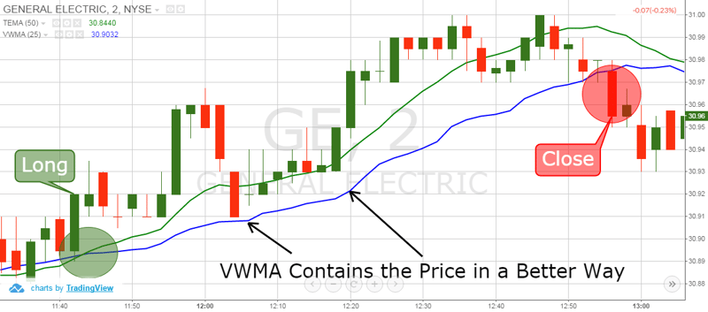

## Table of Contents

## What is a Triple Exponential Moving Average (TEMA)?

A Triple Exponential Moving Average (TEMA) is a type of moving average that helps smooth out price data over time. It's called "triple" because it uses three different exponential moving averages (EMAs) to reduce the lag that is common in simpler moving averages. This makes TEMA more responsive to recent price changes, which can be helpful for traders who want to make quick decisions.

TEMA works by first calculating a single EMA, then using that to calculate a second EMA, and finally using the second EMA to calculate a third EMA. The final TEMA value is a combination of these three EMAs, designed to give a clearer picture of the trend without being too delayed. Because of its complexity, TEMA is often used by more experienced traders who need a more accurate tool for their trading strategies.

## How does TEMA differ from Simple Moving Average (SMA) and Exponential Moving Average (EMA)?

TEMA, or Triple Exponential Moving Average, is different from Simple Moving Average (SMA) and Exponential Moving Average (EMA) mainly because it uses three EMAs to smooth out price data. SMA is the simplest of the three, calculating the average price over a certain number of periods. It gives equal weight to all prices in that period, which can make it slow to react to new price changes. EMA, on the other hand, gives more weight to recent prices, making it more responsive than SMA. But it still can lag behind the latest price movements.

TEMA goes a step further by combining three EMAs to reduce the lag even more. It takes the first EMA, then calculates a second EMA from the first one, and then a third EMA from the second one. This triple smoothing helps TEMA to react quickly to price changes while still smoothing out the data. This makes TEMA a more complex but also more accurate tool for traders who need to make quick decisions based on the latest trends.

In simple terms, if you imagine SMA as a slow-moving truck, EMA would be a faster car, and TEMA would be like a sports car that can speed up and slow down very quickly. Each has its use, depending on how fast you need to react to changes in the market.

## Why would a trader use TEMA in their analysis?

A trader might use TEMA in their analysis because it helps them see the trend of a stock or another financial product more clearly and quickly. TEMA uses three different moving averages to smooth out price data. This makes it good at showing the direction of the trend without being too slow to react to new price changes. Traders who need to make quick decisions based on the latest market movements find TEMA very helpful because it can catch up with the price changes faster than simpler moving averages like SMA or EMA.

Another reason traders use TEMA is that it can reduce the "noise" or small ups and downs in the price data. This noise can make it hard to see the real trend. By using three levels of smoothing, TEMA helps to show a clearer picture of where the price is going. This can be especially useful for traders who are looking for the best times to buy or sell, as TEMA can help them spot important turning points in the market more accurately than other moving averages.

## How is TEMA calculated?

To calculate TEMA, you start with a single Exponential Moving Average (EMA). First, you find the EMA of the price data over a certain number of periods. This is done by giving more weight to recent prices, so it's more responsive to new changes than a Simple Moving Average (SMA). Let's call this first EMA as EMA1.

Next, you calculate a second EMA, called EMA2, from the first EMA (EMA1). This second EMA smooths out the first EMA even more. Then, you calculate a third EMA, called EMA3, from the second EMA (EMA2). This third EMA is even smoother. Finally, to get the TEMA, you use a special formula that combines these three EMAs. The formula is: TEMA = 3 * EMA1 - 3 * EMA2 + EMA3. This formula helps to reduce the lag and make the moving average more responsive to recent price changes.

In simpler terms, TEMA takes three steps to smooth out the price data. It starts with one EMA, then uses that to calculate another EMA, and then uses that second EMA to calculate a third one. By combining these three EMAs in a special way, TEMA can show the trend more clearly and quickly than other moving averages.

## What are the key parameters to set when using TEMA?

When using TEMA, the main parameter you need to set is the period length. This is the number of days or periods over which you want to calculate the moving average. A shorter period, like 10 days, will make the TEMA react quickly to price changes, which is good for short-term trading. A longer period, like 50 days, will make the TEMA smoother and slower to react, which is better for looking at longer-term trends.

Another important thing to think about is how you will use the TEMA in your trading strategy. You might use it to find when to buy or sell by looking for when the price crosses over the TEMA line. Or you might use it to see the overall direction of the market by comparing the TEMA to other moving averages. Knowing what you want to use the TEMA for will help you set the right period length and use it effectively in your trading decisions.

## Can you explain the lag reduction feature of TEMA?

TEMA, or Triple Exponential Moving Average, is designed to reduce lag, which means it reacts to price changes faster than other moving averages like SMA or EMA. Lag happens because moving averages smooth out price data over time, and this smoothing can make them slow to show new trends. TEMA uses three different EMAs to cut down on this lag. By using three levels of smoothing, TEMA can show you the trend more quickly and accurately.

Think of it like this: if you're driving and you need to know if the road is turning, a slow-moving average like SMA might show you the turn too late. EMA would show you the turn a bit sooner, but TEMA would show you the turn almost as soon as it starts happening. This quick reaction time helps traders make decisions faster, which is really important in trading where every second counts.

## What are the common trading strategies that incorporate TEMA?

One common trading strategy that uses TEMA is called the crossover strategy. In this strategy, traders watch for when the price of a stock or another financial product crosses over the TEMA line. If the price goes above the TEMA, it might be a good time to buy because it could mean the price is starting to go up. If the price goes below the TEMA, it might be a good time to sell because it could mean the price is starting to go down. This strategy helps traders find the right times to enter or [exit](/wiki/exit-strategy) the market based on the quick reactions of the TEMA.

Another strategy is using TEMA to find trends. Traders look at the direction of the TEMA line to see if the market is going up or down. If the TEMA is going up, it means there might be an uptrend, and traders might want to buy. If the TEMA is going down, it means there might be a downtrend, and traders might want to sell. This strategy helps traders understand the bigger picture of the market's direction and make decisions that follow the trend.

Some traders also use TEMA with other indicators, like the Relative Strength Index (RSI) or the Moving Average Convergence Divergence (MACD). They look at the TEMA to see the trend and then use these other indicators to find the best times to buy or sell. For example, if the TEMA shows an uptrend and the RSI shows the stock is not overbought, it might be a good time to buy. This combination of indicators can help traders make more accurate decisions by using the quick reactions of TEMA along with other helpful tools.

## How can TEMA be used to identify trend directions?

TEMA can help traders see which way the market is going by looking at the direction of the TEMA line. If the TEMA line is going up, it means the market might be in an uptrend. This can be a good time for traders to buy because prices are likely to keep going up. On the other hand, if the TEMA line is going down, it means the market might be in a downtrend. This can be a good time for traders to sell because prices are likely to keep going down. By watching the TEMA line, traders can get a clear picture of the market's direction and make decisions that follow the trend.

Traders also use TEMA to spot when the trend might be changing. If the TEMA line starts to flatten out or change direction, it could mean the trend is about to switch from up to down or from down to up. This can be a signal for traders to get ready to change their strategy. For example, if the TEMA line was going up but starts to flatten or go down, traders might want to sell their stocks before the price drops too much. By using TEMA to watch for these changes, traders can stay ahead of the market and make smart trading choices.

## What are the potential pitfalls or limitations of using TEMA?

Using TEMA can be tricky because it might give you false signals. Sometimes, the TEMA line might suggest that the market is going up or down, but then the price doesn't follow that direction. This can lead traders to make wrong decisions, like buying when they should sell or selling when they should buy. Because TEMA is very sensitive to price changes, it can react too quickly to small movements that don't mean much in the long run. This can make it hard to tell the difference between real trends and just noise in the market.

Another problem with TEMA is that it can be hard to set up correctly. You need to choose the right period length, and if you pick the wrong one, the TEMA might not work well for your trading strategy. A shorter period might make the TEMA too jumpy, while a longer period might make it too slow to catch the latest trends. Also, TEMA is more complex than simpler moving averages like SMA or EMA, so it can be confusing for new traders who might not understand how it works. This complexity means you need to spend more time learning how to use it right, which can be a challenge.

## How does TEMA perform in different market conditions, such as trending vs. ranging markets?

TEMA works well in trending markets, where prices are going up or down in a clear direction. Because TEMA reacts quickly to price changes, it can help traders see the trend early and make decisions to buy or sell at the right times. For example, if the market is going up, TEMA will show that trend faster than simpler moving averages like SMA or EMA, helping traders jump on the trend sooner. This quick reaction can be a big advantage in a trending market where timing is important.

In ranging markets, where prices are moving sideways without a clear trend, TEMA can be trickier to use. Because TEMA is very sensitive, it might give traders false signals, making them think a trend is starting when it's not. This can lead to wrong trading decisions, like buying or selling at the wrong times. Traders need to be careful and might want to use other tools along with TEMA to make sure they're not fooled by the ups and downs in a ranging market.

## Can TEMA be effectively combined with other technical indicators, and if so, how?

Yes, TEMA can be used with other technical indicators to make trading decisions more accurate. One common way is to use TEMA with the Relative Strength Index (RSI). RSI helps traders see if a stock is overbought or oversold. If the TEMA shows an uptrend and the RSI is not in the overbought zone, it might be a good time to buy. This combination can help traders avoid buying at the top of a trend. On the other hand, if the TEMA shows a downtrend and the RSI is not in the oversold zone, it might be a good time to sell. This way, traders can use TEMA to spot the trend and RSI to find the best times to trade.

Another way to use TEMA is with the Moving Average Convergence Divergence (MACD). MACD helps traders see if the trend is getting stronger or weaker. If the TEMA shows an uptrend and the MACD line crosses above the signal line, it might be a strong buy signal. This can help traders confirm that the trend is real and not just noise. If the TEMA shows a downtrend and the MACD line crosses below the signal line, it might be a strong sell signal. By using TEMA and MACD together, traders can get a clearer picture of the market's direction and strength, which can lead to better trading decisions.

## What are some advanced techniques for optimizing TEMA settings for specific trading instruments?

To optimize TEMA settings for specific trading instruments, traders often start by testing different period lengths. They use a process called [backtesting](/wiki/backtesting), where they look at past price data to see how well different TEMA settings would have worked. For example, if you're trading a fast-moving stock, you might try a shorter period length like 10 days to catch quick trends. But if you're trading something that moves slower, like a commodity, you might use a longer period length like 50 days to smooth out the price data more. By trying out different settings and seeing which ones work best with the past data, traders can find the right TEMA settings for their specific instrument.

Another advanced technique is to use TEMA with other indicators to fine-tune the settings. For example, traders might combine TEMA with the Average True Range (ATR) to see how much the price is moving. If the ATR shows that the price is very volatile, traders might use a shorter TEMA period to react quickly to the big price swings. If the ATR shows that the price is stable, they might use a longer TEMA period to get a smoother trend line. By looking at other indicators along with TEMA, traders can adjust the settings to match the specific behavior of the trading instrument they're using.

## How do you calculate the Triple Exponential Moving Average?

Calculating the Triple Exponential Moving Average (TEMA) requires a systematic approach that ensures precision in smoothening data and reducing lag. The process begins with the calculation of the Exponential Moving Average (EMA) for a predetermined time period. An EMA is essentially a type of weighted moving average that gives more importance to recent data points, making it more responsive to recent price changes compared to a simple moving average. 

The formula to calculate EMA is:

$$
EMA_t = \left( \frac{2}{n+1} \right) \times (P_t - EMA_{t-1}) + EMA_{t-1}
$$

where $EMA_t$ is the EMA at time $t$, $P_t$ is the current price, and $n$ is the number of periods.

Once the initial EMA (denoted as EMA1) is determined, the calculation becomes recursive to build subsequent EMAs. The second EMA (EMA2) is computed on the values of EMA1, and then, the third EMA (EMA3) is calculated on the values of EMA2. These steps are essential for the development of the TEMA formula.

The TEMA formula combines these three EMAs to effectively adjust for lag inherent in each individual EMA, resulting in a more agile and responsive indicator. The final TEMA is calculated using the following formula:

$$
TEMA = (3 \times EMA1) - (3 \times EMA2) + EMA3
$$

This structure helps TEMA rapidly respond to market movements while maintaining significant noise reduction.

Traders can manipulate the lookback period $n$ in the EMA calculations to fine-tune the TEMA's responsiveness to market data. Shorter lookback periods make the TEMA more sensitive to short-term trends, useful for high-frequency trading or [day trading](/wiki/day-trading-spy). Conversely, longer lookback periods generate a smoother line, mitigating noise but potentially delaying the signal response, which is ideal for capturing long-term trends. 

Practical implementation of these calculations can be simplified using programming languages like Python. Here's a basic example of how to calculate TEMA using Python with the pandas library:

```python
import pandas as pd

def calculate_ema(series, span):
    return series.ewm(span=span, adjust=False).mean()

def calculate_tema(series, span):
    ema1 = calculate_ema(series, span)
    ema2 = calculate_ema(ema1, span)
    ema3 = calculate_ema(ema2, span)
    return (3 * ema1) - (3 * ema2) + ema3

data = pd.Series([...])  # Replace [...] with your data series
tema = calculate_tema(data, span=9)  # Example with a span of 9
```

This code demonstrates the fundamental logic behind calculating TEMA, allowing traders to adapt and implement it within broader trading strategies.

## References & Further Reading

[1]: Mulloy, P. (1994). ["Smoothing Data with Faster Moving Averages."](http://technical.traders.com/archive/title/keyword.asp?keyword=SMOOTHING%20DATA%20WITH) *Technical Analysis of Stocks & Commodities Magazine*.

[2]: Pring, M. J. (2002). ["Technical Analysis Explained: The Successful Investor's Guide to Spotting Investment Trends and Turning Points"](https://www.amazon.com/Technical-Analysis-Explained-Fifth-Successful/dp/0071825177). McGraw-Hill Education.

[3]: Kaufman, P. J. (2013). ["Trading Systems and Methods"](https://onlinelibrary.wiley.com/doi/book/10.1002/9781119202561). Wiley.

[4]: Lopez de Prado, M. (2018). ["Advances in Financial Machine Learning"](https://www.amazon.com/Advances-Financial-Machine-Learning-Marcos/dp/1119482089). Wiley.

[5]: Chan, E. P. (2008). ["Quantitative Trading: How to Build Your Own Algorithmic Trading Business"](https://github.com/ftvision/quant_trading_echan_book). Wiley.

[6]: Aronson, D. (2006). ["Evidence-Based Technical Analysis: Applying the Scientific Method and Statistical Inference to Trading Signals"](https://www.amazon.com/Evidence-Based-Technical-Analysis-Scientific-Statistical/dp/0470008741). Wiley.

[7]: Jansen, S. (2018). ["Machine Learning for Algorithmic Trading"](https://github.com/stefan-jansen/machine-learning-for-trading). Packt Publishing.

[8]: Hull, J. (2012). ["Options, Futures, and Other Derivatives"](https://www.semanticscholar.org/paper/Options%2C-Futures%2C-and-Other-Derivatives-Hull/89bdee500c8623864fc9eb7a471546aa713acc44). Pearson.