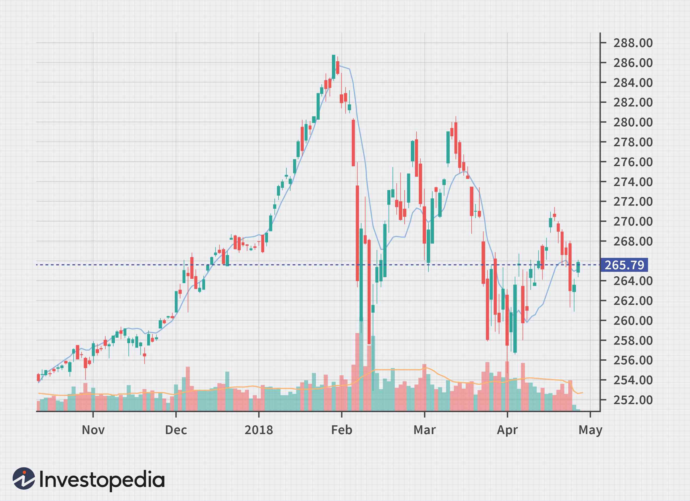

The financial markets offer a dynamic environment where both investors and traders strive to profit by predicting price movements. Technical analysis is a critical practice within these markets, employing statistical tools to evaluate investment opportunities and identify strategic trading moments. Among the tools available, the Triple Exponential Average (TRIX) is particularly noteworthy for its distinctive ability to minimize market noise, allowing for clearer analysis of market trends.

The TRIX indicator, as a part of technical analysis, focuses on providing traders with a more refined view of price trends, helping to distinguish significant movements from inconsequential fluctuations. It achieves this through a unique methodology that involves triple smoothing, making it an essential component for anyone looking to enhance their trading strategies. This article will explore the TRIX indicator in depth, including its calculation methods and its application in developing robust trading strategies. By the end, readers will have a comprehensive understanding of how the TRIX can be applied to improve market analysis and trading outcomes.



## Table of Contents

## What is the TRIX Indicator?

The Triple Exponential Average (TRIX) is a sophisticated momentum indicator employed by traders to examine price trends and market dynamics. Conceptualized by Jack Hutson in the early 1980s, TRIX measures the rate of change of a triple smoothed exponential moving average. This unique smoothing process is designed to filter short-term market noise, offering traders clearer insights into genuine market trends and preventing the distraction caused by minor price fluctuations.

As an oscillator, TRIX operates by oscillating around a zero line. This behavior assists traders in identifying potential overbought and oversold conditions in the market, where the indicator signals whether an asset might be overvalued or undervalued. By interpreting these signals, traders can make more informed decisions about entering or exiting positions.

The TRIX indicator shares similarities with the Moving Average Convergence Divergence (MACD) indicator, a well-known tool in technical analysis. Both indicators are designed to identify momentum and trend direction; however, TRIX offers smoother results due to its triple smoothing approach. This refined smoothing technique reduces the lag typically associated with moving averages and allows for earlier detection of trend reversals and continuations. This makes TRIX particularly valuable for traders who prioritize minimizing noise while still capturing significant market movements.

## How TRIX Works

TRIX works by applying exponential moving averages (EMAs) in a triple smoothed manner to the price data. This approach is designed to filter out minor price fluctuations, providing a clearer representation of the overall trend. The initial step involves calculating an n-period EMA of the closing prices. This EMA serves as the foundation for the next level of smoothing.

In the second step, a second EMA is computed based on the results of the first EMA, thus creating a double EMA. The process is repeated a third time, resulting in a triple EMA, which further smooths the data and reduces market noise. This triple smoothing ensures that the TRIX indicator is less susceptible to insignificant price movements.

TRIX values oscillate around a central zero line, providing a straightforward method to identify market trends. When TRIX crosses above the zero line, it indicates a bullish trend and is typically considered a buy signal. Conversely, when TRIX crosses below the zero line, it suggests a bearish trend, prompting a sell signal. This straightforward interpretation makes it easier for traders to identify potential trading opportunities and trend shifts.

## Calculating the TRIX Indicator

To calculate the TRIX indicator, follow these steps:

1. **Initial Exponential Moving Average (EMA):** Begin with calculating an n-period EMA of the closing prices. The EMA is a type of weighted moving average that places a greater significance on the most recent data points. It can be calculated using the formula:
$$
   EMA_t = \left(\frac{Closing\ Price_t - EMA_{t-1}}\right) \times \left(\frac{2}{n+1}\right) + EMA_{t-1}

$$

   Here, $EMA_t$ is the EMA at time $t$, and $n$ is the number of periods.

2. **Double EMA:** Once you have the first EMA, compute the EMA of the initial EMA to derive the double EMA. This adds another layer of data smoothing, which reduces short-term fluctuations.

3. **Triple EMA:** Apply the EMA a third time to the double EMA to obtain a triple EMA. This third smoothing step ensures that the resulting data maintains only the most meaningful trends while minimizing noise from market volatility.

4. **Determine the TRIX Value:** Calculate the TRIX by evaluating the percentage change between the current and previous period's triple EMA. The TRIX formula is expressed as:
$$
   TRIX_t = \left(\frac{Triple\ EMA_t - Triple\ EMA_{t-1}}{Triple\ EMA_{t-1}}\right) \times 100

$$

   The resulting TRIX value oscillates around a zero line, where positive values suggest bullish conditions and negative values indicate potential bearish conditions.

For a practical implementation, a Python code snippet for calculating TRIX could look like this:

```python
import pandas as pd

def calculate_ema(prices, period):
    return prices.ewm(span=period, adjust=False).mean()

def calculate_trix(prices, period):
    single_ema = calculate_ema(prices, period)
    double_ema = calculate_ema(single_ema, period)
    triple_ema = calculate_ema(double_ema, period)
    trix_raw = triple_ema.pct_change() * 100
    return trix_raw

# Example usage with hypothetical 'closing_prices' data
closing_prices = pd.Series([21.32, 21.22, 21.22, 21.17, 21.20])  # Example data
trix_period = 15  # Common default period for TRIX
trix_values = calculate_trix(closing_prices, trix_period)

print(trix_values)
```

This Python code employs the `pandas` library to perform exponential moving average calculations and then computes the TRIX of a given price series. Traders can use this tool to incorporate TRIX into their market analyses, aiding in identifying significant price trends while reducing noise.

## Using TRIX in Trading Strategies

TRIX can be a powerful component in trading strategies, particularly when used alongside other technical analysis tools. Its capability to smooth out fluctuations makes it a useful indicator for identifying potential buy and sell opportunities. One effective strategy involves the use of the TRIX in a crossover approach. This method focuses on the points where the TRIX line crosses the zero line, signaling potential shifts in market trends. When the TRIX line crosses above the zero line, it can signal a buying opportunity, implying a potential upward trend. Conversely, when the TRIX line crosses below the zero line, it could be an indication to sell, suggesting a potential downturn in price movements.

Integrating TRIX with Fibonacci retracement levels can further enhance the robustness of trading strategies. Fibonacci retracement levels are used to predict potential support and resistance levels in financial markets. Combining these levels with TRIX can provide traders with a comprehensive view, helping to confirm trends and anticipate reversals more effectively. For example, if a TRIX crossover aligns with a key Fibonacci retracement level, it strengthens the signal, possibly indicating a more reliable trading opportunity.

Divergence analysis is another critical technique where traders observe the relationship between TRIX values and price action to foresee possible reversals. Divergence occurs when the price of an asset moves in the opposite direction to the TRIX indicator. A bullish divergence might be observed when prices are making new lows, but TRIX fails to confirm the new lows and starts climbing. On the other hand, a bearish divergence happens when prices hit new highs, but TRIX does not follow and begins dropping. Such divergences can serve as early warnings of a change in market direction.

For Python enthusiasts, implementing TRIX alongside other indicators can be streamlined. Using libraries like Pandas for data manipulation and NumPy for mathematical operations, traders can create a custom strategy incorporating TRIX with moving averages and Fibonacci levels. Here's a simple example of how to calculate TRIX using Python:

```python
import pandas as pd

def calculate_trix(df, n):
    """
    Calculate TRIX indicator for a given DataFrame and period n.
    """
    # First, calculate the single exponential moving average (EMA)
    ema1 = df['close'].ewm(span=n, adjust=False).mean()

    # Calculate the double EMA
    ema2 = ema1.ewm(span=n, adjust=False).mean()

    # Calculate the triple EMA
    ema3 = ema2.ewm(span=n, adjust=False).mean()

    # Calculate TRIX by determining the percentage change between current and previous triple EMA
    trix = ema3.pct_change() * 100

    return trix

# Example usage
# df is a DataFrame containing the price data with 'close' column
# n is the chosen period, for example, 15
df['TRIX'] = calculate_trix(df, 15)
```

In conclusion, the TRIX indicator offers substantial utility in developing trading strategies, especially when used in conjunction with other analytical methods. This integration not only highlights potential market trends and reversals but also enhances the predictive power of technical analysis models.

## Pros and Cons of TRIX

The TRIX indicator, renowned for its unique ability to filter out market noise, offers several advantages and disadvantages worth considering.

**Pros:**

1. **Noise Reduction and Smoother Signals:** The TRIX indicator excels at filtering out minor price fluctuations, providing smoother trend signals than many other momentum indicators, such as the Moving Average Convergence Divergence (MACD). TRIX eliminates short-term market noise by using a triple exponential smoothing process, allowing traders to focus on significant trend movements and make more informed decisions.

2. **Early Trend Detection:** Due to its sophisticated smoothing methodology, TRIX can detect emerging trends early. By applying exponential moving averages (EMA) three times, it reduces the impact of fleeting price changes, potentially allowing traders to identify trends before they become apparent through other indicators. This early detection can offer a tactical advantage, particularly for traders looking to capitalize on nascent market movements.

**Cons:**

1. **Lagging Nature and Suitability for Market Conditions:** As a lagging indicator, TRIX is based on historical price data, which means it may not respond instantaneously to rapid market changes. While it excels in trending markets, TRIX may be less effective in sideways or choppy market conditions where price movements are range-bound. Traders in such markets might experience delayed signals that can impact trading decisions.

2. **Potential for False Signals:** Like many technical indicators, TRIX is not immune to generating false signals. Its reliance on past price data can lead to erroneous buy or sell signals, particularly in volatile or non-trending markets. To mitigate this risk, it is advisable to use TRIX in conjunction with other technical indicators or analysis techniques. Combining indicators, such as incorporating TRIX with support and resistance levels or other momentum indicators, can enhance accuracy and provide better confirmation of potential market movements.

## Conclusion

The TRIX indicator is a valuable tool for technical traders looking to identify trends and potential reversals in financial markets. By smoothing price data through a triple exponential moving average, TRIX reduces market noise and highlights key movements, providing clearer insights into market dynamics. This allows traders to make more informed decisions based on trends rather than short-term fluctuations.

To maximize the effectiveness of the TRIX indicator, traders should experiment with different parameter settings, such as the period length used in the exponential moving averages, to tailor it to specific trading contexts. Successful integration of TRIX into trading strategies often involves combining it with other analytical tools, such as moving averages or Fibonacci retracement levels, to enhance accuracy and confirm signals.

Mastering the use of the TRIX indicator requires understanding its nuances and consistently testing its application in various market conditions. When fully leveraged, TRIX can significantly improve market analysis and refine trading strategies, enabling traders to anticipate potential reversals and capitalize on emerging trends.

## Frequently Asked Questions

### Frequently Asked Questions

**How does TRIX differ from MACD?**

TRIX and the Moving Average Convergence Divergence (MACD) are both [momentum](/wiki/momentum) indicators used to identify trends and potential buy/sell signals. While MACD uses the difference between short-term and long-term exponential moving averages (EMAs) along with a signal line to indicate market momentum, TRIX is distinct because it incorporates triple exponential smoothing. This triple smoothing process reduces market noise more effectively and provides smoother signals. As a result, TRIX focuses more on longer-term movements and might generate fewer false signals in choppy markets compared to MACD.

**What is the ideal period setting for TRIX?**

The ideal period setting for the TRIX indicator often varies based on the asset being traded and the trader's specific strategy. However, a commonly used default is a 15-period TRIX. Traders can adjust this period setting to suit their trading style; shorter periods might make the TRIX more sensitive to price changes, which can be useful for short-term trading, but at the cost of potentially more noise. Conversely, longer periods provide smoother results, beneficial for identifying more stable trends.

**Can TRIX be used on all asset classes?**

Yes, TRIX can be applied to a variety of asset classes, including stocks, commodities, and [forex](/wiki/forex-system). Its versatility makes it a popular choice among traders who engage in multiple markets. However, it is important to recognize that the effectiveness of TRIX might vary depending on the inherent [volatility](/wiki/volatility-trading-strategies) and characteristics of the specific asset class. Traders should test and fine-tune the TRIX settings to align with the asset's typical market behavior.

**Is TRIX suitable for short-term trading?**

TRIX is generally tailored more to medium-to-long-term trend identification due to its smoothing process, which filters out short-term market noise. However, traders can adjust the period settings to make TRIX more responsive, enabling its use in short-term trading strategies. By selecting a shorter period, traders can increase the indicator’s sensitivity, possibly making it more suitable for capturing quick market movements. Despite this, traders should keep in mind that doing so may also increase the likelihood of false signals.

**How can TRIX be combined with other indicators for better results?**

TRIX is often most effective when combined with other technical indicators. For instance, integrating it with simple moving averages can help confirm trend directions. Additionally, using TRIX alongside support and resistance levels or Fibonacci retracement levels can provide more accurate entry and [exit](/wiki/exit-strategy) points. Another strategy involves looking for divergences between TRIX and price action, which may signal potential trend reversals. By coupling TRIX with non-correlated indicators, traders can enhance their overall strategy and gain a more comprehensive view of the market.

## References & Further Reading

[1]: Hutson, J. (1983). "The TRIX: Triple Exponential Smooth Oscillator," Technical Analysis of Stocks & Commodities Magazine.

[2]: Perry, S. K. (1991). ["Technical Analysis to Beat the Market: A Top Dow Theorist Reveals the Plan That Transformed His Portfolio."](https://en.wikipedia.org/wiki/Alpo_Martinez) Probus Publishing Co.

[3]: Achelis, S. B. (2001). ["Technical Analysis from A to Z"](https://archive.org/details/technicalanalysi00ache) (2nd ed.). McGraw Hill.

[4]: Murphy, J. J. (1999). ["Technical Analysis of the Financial Markets: A Comprehensive Guide to Trading Methods and Applications."](https://archive.org/details/technicalanalysi0000murp) New York Institute of Finance.

[5]: Pring, M. J. (2002). ["Technical Analysis Explained: The Successful Investor's Guide to Spotting Investment Trends and Turning Points."](https://www.amazon.com/Technical-Analysis-Explained-Fifth-Successful/dp/0071825177) McGraw Hill.

[6]: Elder, A. (2002). ["Come Into My Trading Room: A Complete Guide to Trading."](https://www.amazon.com/Come-Into-My-Trading-Room/dp/0471225347) Wiley Trading Series.