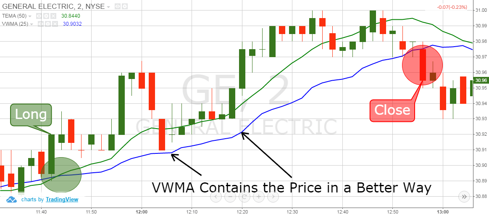

## Table of Contents

## What is a Triple Exponential Moving Average (TEMA)?

A Triple Exponential Moving Average (TEMA) is a type of moving average that tries to reduce the lag seen in traditional moving averages. It does this by using three different exponential moving averages (EMAs) together. The TEMA is more responsive to recent price changes than a simple moving average or even a double exponential moving average. This makes it a popular choice among traders who want to spot trends quickly and accurately.

To calculate a TEMA, you start by finding the first EMA of the price data. Then, you take an EMA of that first EMA to get the second EMA. Finally, you take an EMA of the second EMA to get the third EMA. The TEMA is then a combination of these three EMAs, designed to smooth out the data and reduce the lag even more. While it might sound complicated, the goal is simple: to give traders a clearer and faster picture of where the market might be heading.

## How does TEMA differ from Simple Moving Average (SMA) and Exponential Moving Average (EMA)?

A Triple Exponential Moving Average (TEMA) is different from a Simple Moving Average (SMA) and an Exponential Moving Average (EMA) mainly because it tries to be even faster at showing changes in the market. A Simple Moving Average (SMA) is the simplest kind of moving average. It just takes the average price of a certain number of past days. For example, a 10-day SMA would add up the closing prices of the last 10 days and divide by 10. This can be slow to show new trends because it gives equal weight to all days in the period. An Exponential Moving Average (EMA) is a bit faster because it gives more weight to recent prices. So, if the price changes suddenly, the EMA will start to show that change sooner than the SMA.

A TEMA goes a step further than the EMA. It uses three EMAs to make the moving average even more responsive to recent price changes. First, it calculates an EMA of the price data. Then, it takes an EMA of that first EMA, and finally, it takes an EMA of the second EMA. By doing this, the TEMA tries to reduce the lag that even an EMA might have. This makes the TEMA a good choice for traders who want to catch trends as early as possible. While the TEMA might be more complicated to calculate, its goal is simple: to give a clearer and quicker picture of where the market might be going next.

## What is the formula for calculating TEMA?

To calculate a Triple Exponential Moving Average (TEMA), you need to use three Exponential Moving Averages (EMAs). First, you find the EMA of the price data over a certain number of periods. Let's call this first EMA "EMA1." Next, you take an EMA of EMA1 over the same number of periods. This second EMA is called "EMA2." Finally, you take an EMA of EMA2 over the same number of periods, and this third EMA is called "EMA3."

Once you have these three EMAs, you can calculate the TEMA using a simple formula. The TEMA is equal to three times EMA1, minus three times EMA2, plus EMA3. In other words, TEMA = 3 * EMA1 - 3 * EMA2 + EMA3. This formula combines the three EMAs to create a moving average that is more responsive to recent price changes than a single EMA.

## Why was TEMA developed and what problem does it aim to solve?

The Triple Exponential Moving Average (TEMA) was developed to help traders spot trends in the market faster than they could with other moving averages. The main problem it aims to solve is the lag that comes with traditional moving averages like the Simple Moving Average (SMA) and the Exponential Moving Average (EMA). These moving averages can be slow to show changes in the market because they give too much weight to older data or don't respond quickly enough to new price movements.

TEMA tries to fix this by using three different EMAs together. By combining these EMAs in a special way, TEMA can show changes in the market more quickly. This makes it easier for traders to see new trends as they start to happen, helping them make better decisions about when to buy or sell. While TEMA might be a bit more complicated to calculate, its goal is simple: to give traders a clearer and faster picture of where the market might be heading.

## How can TEMA be used in trading strategies?

Traders often use TEMA to spot new trends in the market faster than with other moving averages. By showing price changes more quickly, TEMA helps traders decide when to buy or sell. For example, if the price of a stock goes above the TEMA line, it might mean the stock is starting to go up. This could be a good time to buy. On the other hand, if the price drops below the TEMA line, it might mean the stock is starting to go down. This could be a good time to sell.

TEMA can also be used with other tools to make trading strategies even better. For example, traders might use TEMA along with other indicators like the Relative Strength Index (RSI) or the Moving Average Convergence Divergence (MACD). If both the TEMA and another indicator show the same trend, it can make traders more confident in their decisions. This way, TEMA helps traders not only spot trends faster but also make more informed choices about when to trade.

## What are the advantages of using TEMA over other moving averages?

Using TEMA can help traders see new trends in the market faster than with other moving averages like SMA or EMA. TEMA is designed to be very quick at showing changes in price. This is because it uses three different EMAs together, which helps reduce the lag that you might see with other moving averages. By being more responsive, TEMA lets traders catch new trends as they start, which can be really helpful for making quick trading decisions.

Another advantage of TEMA is that it can be used with other tools to make trading strategies better. For example, if TEMA shows a new trend and another indicator like RSI agrees, it can make traders more confident in their choices. This combination can help traders make more informed decisions about when to buy or sell. While TEMA might be a bit more complicated to calculate, its main goal is simple: to give traders a clearer and faster picture of where the market might be heading.

## What are the potential drawbacks or limitations of using TEMA?

Using TEMA can have some problems. One big issue is that it can be more complicated to calculate than other moving averages like SMA or EMA. This might make it harder for some traders to use, especially if they don't have the right tools or knowledge. Another problem is that TEMA can be too sensitive to small price changes. This means it might give signals that are not really important, making traders buy or sell too often. This can lead to more trading costs and might not be good for their overall profits.

Also, because TEMA is so quick to show changes, it can sometimes give false signals. This happens when the market moves in a way that looks like a new trend but then quickly changes back. Traders might make decisions based on these false signals, which can lead to losses. So, while TEMA can help spot trends faster, it's important for traders to use it carefully and maybe with other tools to check its signals.

## How does the choice of period length affect the performance of TEMA?

The period length you choose for TEMA can really change how it works. A shorter period, like 5 or 10 days, makes the TEMA react very quickly to price changes. This can be good if you want to catch new trends fast, but it can also make the TEMA jump around a lot. It might give you signals that are not really important, and you could end up trading too much. On the other hand, a longer period, like 50 or 200 days, makes the TEMA move more slowly. This can help you see bigger trends more clearly, but it might be too slow to catch new trends as they start.

Finding the right period length for TEMA is a bit like finding the right balance. If you choose a period that's too short, you might get a lot of false signals and trade too often. If you choose a period that's too long, you might miss out on good trading opportunities because the TEMA is too slow. Many traders try different period lengths to see what works best for them and the market they are trading in. It's all about finding the period that gives you the best signals without making you trade too much or miss out on trends.

## Can TEMA be combined with other indicators, and if so, how?

Yes, TEMA can be combined with other indicators to make trading decisions better. One common way to do this is to use TEMA with the Relative Strength Index (RSI). RSI helps traders see if a stock is overbought or oversold. If TEMA shows a new trend and RSI agrees, it can make traders more sure about their choices. For example, if TEMA starts going up and RSI is not in the overbought area, it might be a good time to buy.

Another way to use TEMA with other indicators is with the Moving Average Convergence Divergence (MACD). MACD helps traders see the strength and direction of a trend. If TEMA and MACD both show the same trend, it can give a stronger signal. For example, if TEMA goes above the price and MACD shows a bullish crossover, it might mean it's a good time to buy. Combining TEMA with other indicators can help traders make more informed decisions and catch trends more reliably.

## How does TEMA perform in different market conditions?

TEMA can work well in different market conditions, but it behaves differently depending on whether the market is moving up, down, or staying the same. In a trending market, where prices are clearly going up or down, TEMA can be very helpful. It's quick to show these trends, so traders can make decisions faster. For example, if the market is going up, TEMA will start to go up too, giving traders a signal to buy. This can be really useful for catching trends early and making profits.

In a market that's not moving much, or what we call a sideways market, TEMA can be trickier to use. Because it's so sensitive to small price changes, it might give a lot of false signals. Traders might think they see a new trend starting, but it could just be the market moving up and down a little. This can lead to more trading and higher costs, without making much profit. So, in a sideways market, it's important for traders to be careful and maybe use TEMA with other tools to check its signals.

## What are some practical examples of TEMA applications in financial markets?

Traders often use TEMA to spot new trends in the stock market. For example, imagine a trader looking at the price of a company's stock. If the stock price starts to go above the TEMA line, it might mean the stock is starting to go up. This could be a good time for the trader to buy the stock. On the other hand, if the stock price drops below the TEMA line, it might mean the stock is starting to go down. This could be a good time for the trader to sell the stock. By using TEMA, traders can make quicker decisions based on the latest price movements.

In the [forex](/wiki/forex-system) market, TEMA can also be very useful. Forex traders might use TEMA to see if a currency pair is starting a new trend. For example, if the price of the EUR/USD pair goes above the TEMA line, it could mean the euro is getting stronger against the dollar. This might be a good time for the trader to buy euros. If the price goes below the TEMA line, it could mean the euro is getting weaker. This might be a good time to sell euros. By using TEMA, forex traders can catch these trends early and make better trading decisions.

## How can one optimize the parameters of TEMA for better performance?

To make TEMA work better, you need to choose the right period length. This means trying out different numbers of days to see which one gives the best results. A shorter period, like 5 or 10 days, makes TEMA react quickly to price changes. This can be good for catching new trends fast, but it might also make TEMA jump around a lot and give false signals. On the other hand, a longer period, like 50 or 200 days, makes TEMA move more slowly. This can help you see bigger trends more clearly, but it might be too slow to catch new trends as they start. The best period length depends on the market you're trading in and how quickly you want to spot trends.

Another way to optimize TEMA is to use it with other tools. For example, you can combine TEMA with the Relative Strength Index (RSI) or the Moving Average Convergence Divergence (MACD). If TEMA and another indicator both show the same trend, it can make you more confident in your trading decisions. This can help you avoid false signals and make better choices about when to buy or sell. By trying different period lengths and using TEMA with other indicators, you can find the best way to use it for your trading strategy.

## How do you calculate the TRIX Indicator?

To calculate the TRIX indicator, follow these steps:

1. **Initial Exponential Moving Average (EMA):** Begin with calculating an n-period EMA of the closing prices. The EMA is a type of weighted moving average that places a greater significance on the most recent data points. It can be calculated using the formula:
$$
   EMA_t = \left(\frac{Closing\ Price_t - EMA_{t-1}}\right) \times \left(\frac{2}{n+1}\right) + EMA_{t-1}

$$

   Here, $EMA_t$ is the EMA at time $t$, and $n$ is the number of periods.

2. **Double EMA:** Once you have the first EMA, compute the EMA of the initial EMA to derive the double EMA. This adds another layer of data smoothing, which reduces short-term fluctuations.

3. **Triple EMA:** Apply the EMA a third time to the double EMA to obtain a triple EMA. This third smoothing step ensures that the resulting data maintains only the most meaningful trends while minimizing noise from market volatility.

4. **Determine the TRIX Value:** Calculate the TRIX by evaluating the percentage change between the current and previous period's triple EMA. The TRIX formula is expressed as:
$$
   TRIX_t = \left(\frac{Triple\ EMA_t - Triple\ EMA_{t-1}}{Triple\ EMA_{t-1}}\right) \times 100

$$

   The resulting TRIX value oscillates around a zero line, where positive values suggest bullish conditions and negative values indicate potential bearish conditions.

For a practical implementation, a Python code snippet for calculating TRIX could look like this:

```python
import pandas as pd

def calculate_ema(prices, period):
    return prices.ewm(span=period, adjust=False).mean()

def calculate_trix(prices, period):
    single_ema = calculate_ema(prices, period)
    double_ema = calculate_ema(single_ema, period)
    triple_ema = calculate_ema(double_ema, period)
    trix_raw = triple_ema.pct_change() * 100
    return trix_raw

# Example usage with hypothetical 'closing_prices' data
closing_prices = pd.Series([21.32, 21.22, 21.22, 21.17, 21.20])  # Example data
trix_period = 15  # Common default period for TRIX
trix_values = calculate_trix(closing_prices, trix_period)

print(trix_values)
```

This Python code employs the `pandas` library to perform exponential moving average calculations and then computes the TRIX of a given price series. Traders can use this tool to incorporate TRIX into their market analyses, aiding in identifying significant price trends while reducing noise.

## References & Further Reading

[1]: Hutson, J. (1983). "The TRIX: Triple Exponential Smooth Oscillator," Technical Analysis of Stocks & Commodities Magazine.

[2]: Perry, S. K. (1991). ["Technical Analysis to Beat the Market: A Top Dow Theorist Reveals the Plan That Transformed His Portfolio."](https://en.wikipedia.org/wiki/Alpo_Martinez) Probus Publishing Co.

[3]: Achelis, S. B. (2001). ["Technical Analysis from A to Z"](https://archive.org/details/technicalanalysi00ache) (2nd ed.). McGraw Hill.

[4]: Murphy, J. J. (1999). ["Technical Analysis of the Financial Markets: A Comprehensive Guide to Trading Methods and Applications."](https://archive.org/details/technicalanalysi0000murp) New York Institute of Finance.

[5]: Pring, M. J. (2002). ["Technical Analysis Explained: The Successful Investor's Guide to Spotting Investment Trends and Turning Points."](https://www.amazon.com/Technical-Analysis-Explained-Fifth-Successful/dp/0071825177) McGraw Hill.

[6]: Elder, A. (2002). ["Come Into My Trading Room: A Complete Guide to Trading."](https://www.amazon.com/Come-Into-My-Trading-Room/dp/0471225347) Wiley Trading Series.