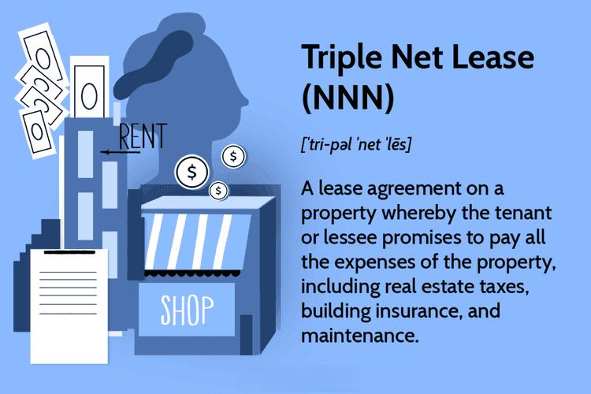

## Table of Contents

## What is a triple net lease?

A triple net lease, often called an NNN lease, is a type of commercial real estate agreement where the tenant is responsible for paying not only the rent but also the property's operating expenses. These expenses typically include property taxes, insurance, and maintenance costs. This type of lease is common in commercial properties like retail stores, office buildings, and industrial spaces.

In a triple net lease, the tenant takes on more financial responsibility than in other lease types, which can benefit the landlord by reducing their costs and risks. For tenants, this can mean more predictable expenses since they control the maintenance and other costs directly. However, it also means they need to be prepared to handle potential increases in these expenses over time.

## How does a triple net lease differ from other types of leases?

A triple net lease is different from other leases because it makes the tenant pay for more things. In a triple net lease, the tenant pays the rent, but also pays for the property taxes, insurance, and maintenance costs. This is different from a single net lease, where the tenant only pays the rent and property taxes, and the landlord pays for insurance and maintenance. It's also different from a double net lease, where the tenant pays rent, property taxes, and insurance, but the landlord pays for maintenance.

In a gross lease, which is another type of lease, the tenant just pays the rent. The landlord pays for all the other costs like taxes, insurance, and maintenance. This makes it easier for the tenant because they know exactly how much they will pay each month. But in a triple net lease, the tenant's costs can go up if taxes, insurance, or maintenance costs increase. This makes triple net leases more common for businesses that want control over these costs, while gross leases are often used for apartments or offices where tenants prefer a fixed rent.

## What are the three 'nets' in a triple net lease?

The three 'nets' in a triple net lease are property taxes, insurance, and maintenance costs. These are the extra things that the tenant has to pay for, on top of the rent. Property taxes are what the government charges for owning the property. Insurance is what protects the building from damage or accidents. Maintenance costs are what you pay to keep the building in good shape, like fixing the roof or painting the walls.

In a triple net lease, the tenant is responsible for all three of these 'nets'. This means that if the property taxes go up, or if the insurance gets more expensive, or if there are big repairs needed, the tenant has to pay for it. This is different from other leases where the landlord might pay for some or all of these costs. A triple net lease gives the tenant more control over these expenses, but it also means they have to be ready to handle any increases in these costs.

## Who typically uses triple net leases?

Triple net leases are often used by businesses that want to rent commercial spaces like stores, offices, or warehouses. These businesses like triple net leases because they can control the costs of taxes, insurance, and maintenance. This can be good for them because they can plan their budgets better and make sure the property stays in good shape.

Landlords also like triple net leases because they don't have to worry about paying for taxes, insurance, and maintenance. This makes it easier for them to predict their income from the property. Triple net leases are common in places like shopping centers, where big companies rent spaces and want to manage the property themselves.

## What are the benefits of a triple net lease for landlords?

Triple net leases are good for landlords because they make things simpler and less risky. When a landlord uses a triple net lease, the tenant pays for the property taxes, insurance, and maintenance costs. This means the landlord doesn't have to worry about these expenses going up. They can predict their income better because they know exactly how much rent they will get each month, without any surprises.

Another benefit for landlords is that they can attract bigger and more stable tenants with triple net leases. Big companies often like these leases because they can control the costs and take care of the property themselves. This can make the property more valuable and easier to rent out. Plus, if the tenant is responsible for keeping the property in good shape, the landlord doesn't have to spend time and money on maintenance.

## What are the benefits of a triple net lease for tenants?

Triple net leases can be good for tenants because they give them more control over the costs of the property. When a tenant signs a triple net lease, they pay for the property taxes, insurance, and maintenance. This means they can choose how much to spend on these things and make sure the property stays in good shape. For businesses, this can be helpful because they can plan their budgets better and make sure the place they are renting meets their needs.

Another benefit for tenants is that triple net leases can offer more stability. Since tenants are responsible for the costs, they don't have to worry about the landlord raising the rent to cover unexpected expenses. This can make it easier for businesses to predict their costs over time. Plus, if a tenant takes good care of the property, it can be easier to renew the lease or even buy the property in the future.

## What are the potential drawbacks of a triple net lease for landlords?

One potential drawback for landlords with a triple net lease is that they might have less control over the property. Since the tenant is responsible for maintenance, the landlord can't always make sure the property is taken care of the way they want. If the tenant doesn't keep up with maintenance, the property could lose value, which is bad for the landlord.

Another issue is that finding the right tenant for a triple net lease can be harder. These leases are usually longer and need tenants who are willing to take on more responsibility. If a landlord can't find a good tenant, they might have to lower the rent or wait longer to rent out the property. This can make it harder for the landlord to make money from the property.

## What are the potential drawbacks of a triple net lease for tenants?

One big drawback for tenants with a triple net lease is that they have to pay for a lot more than just rent. They have to pay for the property taxes, insurance, and maintenance costs too. This means if any of these costs go up, the tenant has to pay more. It can be hard to predict how much they will have to spend each month, which can make budgeting tricky.

Another problem is that tenants might have to spend a lot of time and effort managing the property. They need to make sure the taxes are paid, the insurance is up to date, and the building is kept in good shape. This can be a lot of work, especially for small businesses that might not have the resources to handle it all. If they don't do a good job, they could end up in trouble with the landlord or even lose their lease.

## How is the rent structured in a triple net lease?

In a triple net lease, the rent is usually set as a fixed amount that the tenant pays to the landlord each month. This rent is separate from the other costs the tenant has to pay, like property taxes, insurance, and maintenance. The landlord and tenant agree on the rent amount at the start of the lease, and it might stay the same for the whole lease term or go up a little bit each year.

Sometimes, the rent in a triple net lease can be based on how well the tenant's business is doing. This is called a percentage rent. The tenant pays the fixed rent plus a part of their sales or profits. This can be good for the landlord because they can make more money if the tenant's business does well. But it can be harder for the tenant to predict their costs because their rent depends on how much money they make.

## What types of properties are most commonly associated with triple net leases?

Triple net leases are most often used for commercial properties like retail stores, shopping centers, and office buildings. These types of properties are good for triple net leases because big businesses often rent them. These businesses like to have control over the costs of taxes, insurance, and maintenance. This helps them plan their budgets better and make sure the property stays in good shape.

Another type of property that often uses triple net leases is industrial spaces, like warehouses. Companies that need a lot of space for storage or manufacturing might choose a triple net lease because it lets them manage the property themselves. This can be important for businesses that need to make sure the property meets their specific needs.

## How can a tenant negotiate a triple net lease?

When a tenant wants to negotiate a triple net lease, they should start by understanding all the costs they will have to pay. This includes the rent, property taxes, insurance, and maintenance. They can ask the landlord for a breakdown of these costs and see if there are any ways to lower them. For example, the tenant might be able to get a better deal on insurance or find a cheaper way to do maintenance. They can also talk about the length of the lease and see if they can get a shorter term or options to renew.

Another important thing for tenants to negotiate is the rent amount. They can try to get a lower rent by showing the landlord that they are a good tenant who will take care of the property. If the tenant is a big company or has a good credit history, this can help them get a better deal. They can also ask about percentage rent, where part of the rent depends on how well their business does. This can be good for the tenant if their business is not doing well, but they need to be careful because it can also mean paying more if the business does well.

## What are the tax implications of a triple net lease for both landlords and tenants?

For landlords, a triple net lease can have some good tax benefits. Since the tenant pays for the property taxes, insurance, and maintenance, the landlord doesn't have to pay these costs. This means the landlord can deduct less from their income for these expenses, but they still get to keep the rent money. The rent they receive is considered taxable income, so they need to report it on their taxes. But because the tenant is paying for the other costs, the landlord's overall tax situation might be simpler and more predictable.

For tenants, a triple net lease means they have to pay for the property taxes, insurance, and maintenance, which can be a lot. These costs are usually tax-deductible for the tenant if they are using the property for business. This means the tenant can subtract these costs from their business income when they file their taxes, which can lower their tax bill. But they need to keep good records of all these expenses to make sure they can claim the deductions correctly.

## References & Further Reading

[1]: Carn, Neil. (2002). ["Real Estate Finance: Theory & Practice."](https://archive.org/details/realestatefinanc00clau) Prentice Hall.

[2]: Tenenbaum, Jeffrey. (2020). ["Mastering Commercial Real Estate: The Art of Success"](https://www.showcase.com/p/jeffrey-tanenbaum/3969699/) Kindle Direct Publishing.

[3]: Tittman, Joel. (2018). ["Commercial Real Estate Investing: A Strategic Approach."](https://www.goodreads.com/book/show/6887391-commercial-real-estate-investment) Wiley.

[4]: Damodaran, Aswath. (2012). ["Investment Valuation: Tools and Techniques for Determining the Value of Any Asset"](https://books.google.com/books/about/Investment_Valuation.html?id=5SRHAAAAQBAJ) Wiley Finance.

[5]: Holland, Simon. (2019). ["Python for Finance: Mastering Data-Driven Finance with Python"](https://www.amazon.com/Python-Finance-Mastering-Data-Driven/dp/1492024333) Apress.

[6]: Chou, Ray. et al. (2009). ["Real Estate and the Challenges of Binary Economies."](http://www.economicus.org/library/harvard-chapter2-basic-real-estate-economics.pdf) Journal of Financial Research.

[7]: "Global Trends in Commercial Real Estate: Automation and Machine Learning" (2019) - [J.P. Morgan Insights](https://www.jpmorgan.com/insights/real-estate/commercial-real-estate)

[8]: Huston, Shaun A. (2011). ["Algorithmic Trading and DMA: An Introduction to Direct Access Trading Strategies"](https://archive.org/details/algorithmictradi0000john) 4Myeloma Press.

[9]: "The Future of Real Estate: Sustainability, Climate Change and Governance" (2021). [McKinsey & Company](https://www.linkedin.com/in/verlinda-attipoe).