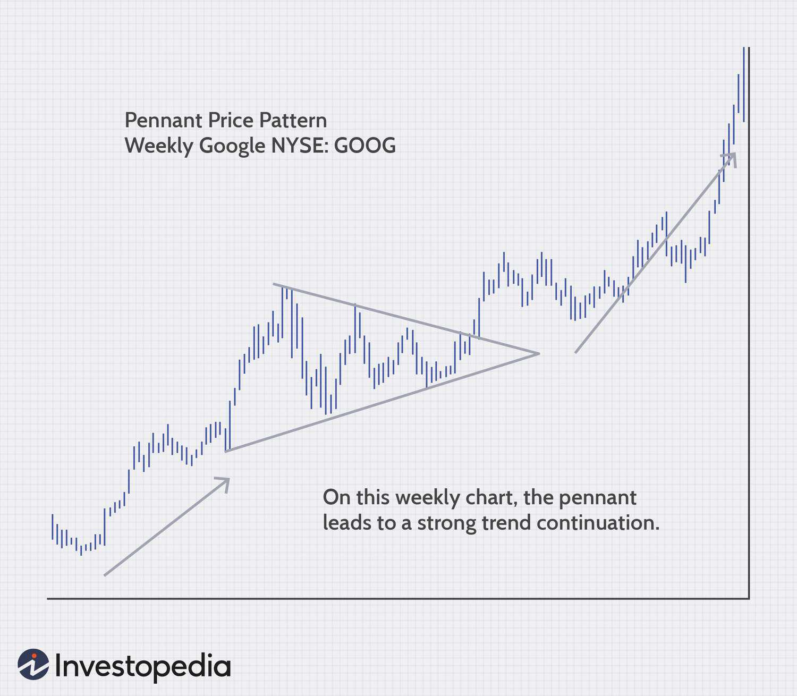

Algorithmic trading, or algo trading, represents a profound evolution in the operations of financial markets. By leveraging sophisticated algorithms, this trading approach facilitates not only accelerated but also more precise executions of trades compared to traditional methods. At its core, algorithmic trading utilizes complex mathematical models and formulas to make decisions in milliseconds, operating without the delays inherent in human decision-making processes. This advancement allows traders and financial institutions to handle vast volumes of transactions with remarkable efficiency.

A significant aspect of stock trading that aligns closely with algorithmic trading is the concept of a 'triple play.' This term, frequently employed within the investment community, describes a scenario where a company surpasses predictions on three critical financial fronts: revenue, earnings, and future performance guidance. Achieving a triple play is considered a robust indicator of a company’s strong current and future performance, often resulting in substantial gains in stock prices. For investors and traders, identifying a triple play event can signal a potential opportunity to capitalize on favorable stock movements.



This article's primary focus is to investigate the confluence of triple play scenarios and algorithmic trading strategies. It aims to weigh the unique advantages and possible drawbacks associated with each, offering insights into how they can be harmoniously integrated to optimize trading outcomes. Through exploring these intersections, traders can potentially enhance their decision-making processes and exploit lucrative market conditions efficiently.

## Table of Contents

## Understanding Triple Play in Trading

A "triple play" in trading represents a substantial achievement for a stock as it occurs when a company exceeds market expectations in three critical areas: earnings, revenue, and future guidance. This milestone not only marks a notable accomplishment within the business community but also serves as a robust performance indicator that can significantly influence trading strategies. The origins of the "triple play" concept are deeply rooted in the investment community, where it has become synonymous with exceptional corporate performance. Recognizing a triple play scenario enables traders and investors to capitalize on the potential for favorable share price movements.

Understanding the implications of a triple play involves evaluating the individual components of earnings, revenue, and future guidance. Earnings, commonly expressed as earnings per share (EPS), provide insight into the company's profitability and are often of primary interest to investors. Revenue figures reveal the company's ability to generate sales and are critical for assessing growth potential. Future guidance offers a preview of the company's expected performance, aiding traders in decision-making and strategic planning.

For traders and investors, identifying a triple play can unlock unique opportunities to take advantage of stock price fluctuations. Companies that consistently deliver triple plays are often viewed as high-performing and may attract increased attention from institutional investors and hedge funds. Consequently, triple play announcements can lead to heightened trading volumes and significant price movements. The impact of a triple play may be particularly pronounced in scenarios where the broader market conditions are favorable and economic indicators align positively with the company's industry.

In practice, traders can analyze historical occurrences of triple plays to identify patterns and potential leading indicators of future performance. By doing so, they can refine their trading strategies to include alerts for companies poised to achieve a triple play, thus enabling a proactive rather than reactive approach to trading. Additionally, advances in data analytics and technology have empowered traders with tools to sift through vast amounts of financial data, detect triple play scenarios, and execute trades with precision. 

Despite the opportunities presented by triple plays, traders must remain vigilant of potential risks. Market [volatility](/wiki/volatility-trading-strategies), regulatory changes, and unexpected company disclosures can swiftly alter the trading landscape, emphasizing the need for comprehensive risk management strategies. Therefore, while a triple play can offer significant benefits, it is crucial for traders to incorporate a balanced approach, combining it with other performance metrics and market insights to optimize their investment outcomes.

## Examples of Triple Play Stocks

One illustrative example of a triple play stock is Medtronic PLC (MDT), which experienced notable investor attention in 2019. During this period, Medtronic not only surpassed earnings and revenue expectations but also issued optimistic guidance for future performance. As a result, the positive sentiment generated by these triple play conditions contributed to an upward movement in Medtronic's stock price. This case exemplifies how the alignment of three key performance indicators (earnings, revenue, and future guidance) can enhance perceived company value and influence stock prices positively.

Triple play scenarios, like that observed with Medtronic, represent a powerful catalyst for stock valuation. However, despite their potential benefits, traders should exercise caution. Numerous variables, such as market sentiment, economic conditions, and competitive pressures, can affect the outcome of a triple play scenario. In some instances, a company might surpass expectations, yet external or unforeseen factors may mitigate or even negate the impact on stock prices. Investors must carefully assess these variables and market expectations before making trading decisions based on triple play announcements. 

By evaluating historical performance and market reactions, traders can better understand the implications of triple plays and refine their strategies accordingly. While investing in triple play stocks can offer substantial rewards, informed judgment and strategic foresight remain critical to managing the inherent risks involved.

## Pros and Cons of Algorithmic Trading

Algorithmic trading significantly enhances the efficiency of executing trades by utilizing sophisticated algorithms to process vast amounts of market data swiftly. One primary advantage of [algorithmic trading](/wiki/algorithmic-trading) is its speed; algorithms can execute trades much faster than a human trader could. This speed advantage is crucial in financial markets where price movements often happen in fractions of a second. Python, with its robust libraries like NumPy and pandas, allows for rapid data manipulation and analysis, essential for algo trading. For example, an algorithm can quickly backtest trading strategies against historical data to determine their viability.

Accuracy is another critical benefit of algorithmic trading. Algorithms follow predefined rules and execute trades precisely according to those parameters, minimizing human error. In addition, the capability to handle large volumes of data enables algorithms to identify trends, patterns, and [arbitrage](/wiki/arbitrage) opportunities more effectively than traditional trading methods. For instance, a Python script using [machine learning](/wiki/machine-learning) could be developed to predict future price movements based on historical data patterns:

```python
import pandas as pd
from sklearn.ensemble import RandomForestClassifier
from sklearn.model_selection import train_test_split

# Example of loading financial data
data = pd.read_csv('financial_data.csv')

# Preprocessing data
X = data.drop('future_price', axis=1)
y = data['future_price']

# Splitting data
X_train, X_test, y_train, y_test = train_test_split(X, y, test_size=0.2, random_state=42)

# Training the model
model = RandomForestClassifier()
model.fit(X_train, y_train)

# Making predictions
predictions = model.predict(X_test)
```

While the advantages of algorithmic trading are compelling, several limitations and risks are associated with it. The reliance on technology means that any failure in the technical infrastructure, such as server outages or connectivity issues, can interrupt trading operations. Moreover, the algorithms themselves are not infallible and can contain errors or be based on incorrect assumptions, leading to substantial financial losses. 

Market volatility can also be exacerbated by algorithmic trading. As algorithms react to market conditions, they may trigger large volumes of trades in a short period, causing significant price swings. This phenomenon was notably observed in events like the 2010 Flash Crash, where rapid, automated trades contributed to a drastic drop in market indices.

Emotionless trading is both a benefit and a drawback of algorithmic systems. While it removes human emotions such as fear and greed, which can lead to poor trading decisions, it also means algorithms can persist in executing trades even when market conditions are unpredictable or rapidly changing. This rigidity can result in unfavorable outcomes if the market behaves contrary to the algorithm's expectations.

In conclusion, while algorithmic trading provides several advantages, such as increased speed, accuracy, and data processing capabilities, traders must be aware of its inherent challenges. The reliance on technology, potential for algorithmic errors, and market volatility are significant factors that need to be managed carefully. Balancing these pros and cons is vital for successful implementation in today's fast-paced financial markets.

## Integrating Triple Play Analysis in Algo Trading

By integrating triple play analysis into algorithmic trading strategies, traders gain a robust tool for enhancing decision-making processes with data-driven insights. A triple play scenario, characterized by a company exceeding expectations in earnings, revenue, and future guidance, presents lucrative trading opportunities. To capitalize on these scenarios, traders can design algorithms to automatically detect and respond to such events.

To implement this, algorithms can be set to monitor scheduled earnings announcements and analyze the results in real-time. The key components of a triple play—earnings surprise, revenue surprise, and positive future guidance—must be clearly defined within the algorithm. For example:

- **Earnings Surprise ($ES$)**: 
$$
  ES = \frac{\text{Actual Earnings} - \text{Expected Earnings}}{\text{Expected Earnings}}

$$
- **Revenue Surprise ($RS$)**: 
$$
  RS = \frac{\text{Actual Revenue} - \text{Expected Revenue}}{\text{Expected Revenue}}

$$

The algorithm must be capable of parsing financial statements and earnings call transcripts, utilizing Natural Language Processing (NLP) to detect sentiment and forward guidance. Here is a simplified Python snippet demonstrating how one might set up a basic alert system:

```python
import requests
from textblob import TextBlob

def get_financial_data(ticker):
    # Fetch financial data from an API (mock function)
    response = requests.get(f"https://api.financialdata.com/{ticker}")
    return response.json()

def analyze_earnings(earnings_data):
    actual = earnings_data['actual']
    expected = earnings_data['expected']
    return (actual - expected) / expected

def analyze_transcript(transcript):
    text_blob = TextBlob(transcript)
    return text_blob.sentiment.polarity

def detect_triple_play(ticker):
    data = get_financial_data(ticker)
    es = analyze_earnings(data['earnings'])
    rs = analyze_earnings(data['revenue'])
    guidance_polarity = analyze_transcript(data['guidance_transcript'])

    if es > 0.05 and rs > 0.05 and guidance_polarity > 0:
        return True
    return False

# Example Usage
if detect_triple_play('ABC'):
    print("Triple Play detected! Consider adjusting trading strategy.")
```

Such automated analysis enables traders to systematically identify potential triple play stocks without human intervention, offering the capability to execute trades instantaneously based on predefined criteria.

In this context, the challenge lies in fine-tuning the algorithms to minimize false positives and adapt to ever-changing market conditions. Machine learning models can be further employed to refine predictability by learning from historical triple play data, increasing the accuracy in forecasting stock price movements post-announcement.

Algorithmic strategies that incorporate triple play analysis represent a synthesis of speed, precision, and predictive analytics. This integration can offer traders a competitive advantage by swiftly reacting to positive market opportunities as they arise, thereby potentially optimizing return on investment. Nevertheless, it is crucial to maintain vigilance over algorithm performance and adapt continuously to the dynamic market environment.

## Conclusion

In analyzing the dynamics of today's financial markets, both triple play stocks and algorithmic trading have emerged as powerful tools, each offering distinct advantages to traders. Algorithmic trading, with its focus on speed and precision, allows for rapid execution of trades by analyzing colossal datasets beyond human capability. This method reduces latency and mitigates errors that can occur during manual trading, offering a significant edge, especially in time-sensitive environments.

On the other hand, triple play scenarios present unique opportunities. When a company exceeds expectations in revenue, earnings, and future guidance, it provides a clear sign of strength and growth potential, often leading to favorable stock price movements. Recognizing these scenarios enables traders to capitalize on potential upside swells, enhancing return possibilities.

However, a successful strategy requires the careful balancing of these approaches, being mindful of the inherent risks and dependencies involved. Algorithmic trading, while efficient, is heavily reliant on technology and susceptible to errors within the programming logic and unforeseen market disturbances. Meanwhile, triple play opportunities, though promising, are not immune to other unpredictable market factors.

To harness the full potential of these strategies, traders must adopt a critically balanced approach, leveraging the speed and analytical power of algorithmic systems while incorporating insightful analytical criteria derived from triple play recognitions. This dual approach may not only amplify gains but also foster resilience against market volatility and operational risks. As the landscape of trading continues to evolve, the synthesis of algorithmic precision with strategic insights from triple play scenarios could become a cornerstone of successful investment strategies.

## FAQs

### What is the significance of a triple play in trading?
A triple play in trading signifies a pivotal moment when a company exceeds market expectations across three crucial financial metrics: earnings, revenue, and future guidance. This is a reliable indicator of a company's robust financial health and potential for future growth, often leading to significant market interest and share price movements. Traders watch for triple play scenarios as they can signal a lucrative trading opportunity where the stock price may experience upward [momentum](/wiki/momentum) due to increased investor confidence and demand.

### How does algorithmic trading enhance trading performance?
Algorithmic trading enhances trading performance primarily through speed and precision. Algorithms are capable of executing trades in milliseconds, far faster than human traders. This speed is crucial for capitalizing on fleeting opportunities in the market. Moreover, algorithmic systems use large datasets to analyze market conditions, identify patterns, and make informed trading decisions, minimizing the chances of human errors. These algorithms can also operate continuously, monitoring market conditions and executing trades based on predefined criteria without the emotional biases that often affect human traders.

### Are there risks associated with relying on algorithmic trading for triple play opportunities?
While algorithmic trading presents numerous advantages, it also carries risks, particularly when used to leverage triple play opportunities. The primary risk is that algorithms might not adapt well to unforeseen market conditions or anomalies, leading to potential financial losses. There's also a chance of algorithmic errors, such as mismatched coding or incorrect data inputs, which can amplify negative outcomes during market volatility. Additionally, since many traders use algorithmic strategies, it can lead to crowded trades, increasing the risk of sudden price spikes or crashes, particularly if algorithms trigger automatic sell-offs or buy-ins en masse.

### How can traders mitigate the technological risks inherent in algo trading?
Traders can take several steps to mitigate the technological risks in algorithmic trading. Firstly, they should rigorously backtest algorithms using historical data to ensure they perform well under various market scenarios. It's also essential to set up robust real-time monitoring systems to detect and address any anomalies or issues promptly. Employing risk management strategies, such as setting stop-loss orders or diversifying trading strategies, can help minimize potential losses. Furthermore, ensuring system redundancy and maintaining up-to-date infrastructure can prevent disruptions due to hardware or software failures. Continuous improvement and tweaking of algorithms based on market changes can also enhance their resilience and performance.

## References & Further Reading

[1]: Avellaneda, M., & Stoikov, S. (2008). ["High-frequency trading in a limit order book."](https://people.orie.cornell.edu/sfs33/LimitOrderBook.pdf) Quantitative Finance, 8(3), 217-224.

[2]: Aldridge, I. (2013). ["High-Frequency Trading: A Practical Guide to Algorithmic Strategies and Trading Systems."](https://www.amazon.com/High-Frequency-Trading-Practical-Algorithmic-Strategies/dp/1118343506) John Wiley & Sons.

[3]: Duhigg, C. (2009). ["Stock Traders Find Speed Pays, in Milliseconds."](https://www.nytimes.com/2009/07/24/business/24trading.html) The New York Times.

[4]: De Prado, M. L. (2018). ["Advances in Financial Machine Learning."](https://www.amazon.com/Advances-Financial-Machine-Learning-Marcos/dp/1119482089) Wiley.

[5]: Chan, E. P. (2009). ["Quantitative Trading: How to Build Your Own Algorithmic Trading Business."](https://github.com/ftvision/quant_trading_echan_book) Wiley Trading.