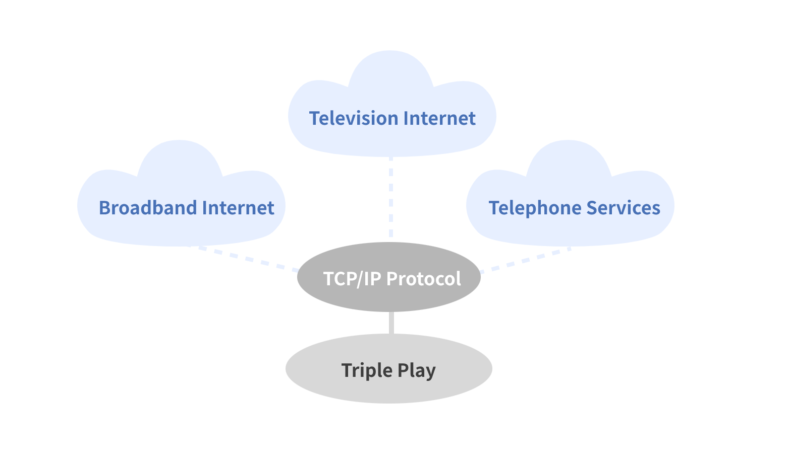

## Table of Contents

## What is a triple play in baseball?

A triple play in baseball happens when the defense gets three outs in one play. It is very rare and exciting to see. It usually happens when there are runners on base and the batter hits the ball.

There are different ways a triple play can happen. One common way is when the batter hits a line drive that is caught, and then two runners are tagged out before they can get back to their bases. Another way is when a ground ball is hit, and the defense quickly throws the ball to different bases to get three outs. Triple plays show how fast and smart the defense can be.

## How often do triple plays occur in baseball?

Triple plays do not happen very often in baseball. They are one of the rarest events in the game. On average, there are only about 1 or 2 triple plays in a whole season of Major League Baseball. This means that fans might see just one triple play in hundreds of games.

Because triple plays are so rare, they are very exciting when they happen. Teams and fans remember them for a long time. It takes a lot of skill and quick thinking for a team to pull off a triple play. When it happens, it can change the game and make it more interesting.

## What are the different types of triple plays?

There are several types of triple plays in baseball. One type is called an "around-the-horn" triple play. This happens when a ground ball is hit, and the defense quickly throws the ball from third base to second base, and then to first base to get three outs. Another type is a "line drive" triple play. This happens when the batter hits a line drive that is caught by a fielder, and then two runners are tagged out before they can get back to their bases.

Another kind of triple play is the "5-4-3 triple play." This is similar to the around-the-horn triple play but starts with the third baseman (position 5) throwing to the second baseman (position 4), who then throws to the first baseman (position 3). There's also the "6-4-3 triple play," which starts with the shortstop (position 6) throwing to the second baseman (position 4), who then throws to the first baseman (position 3).

Triple plays can also happen in other ways, like when runners get caught off base or when there are special situations on the field. Each type of triple play shows how fast and smart the defense can be. Because they are so rare, every triple play is exciting and memorable.

## Can you explain the mechanics of an unassisted triple play?

An unassisted triple play is when one player gets all three outs by themselves. It is very rare and hard to do. It usually happens when there are runners on first and second base, and the batter hits a line drive right to the player who is trying to make the triple play. The player catches the ball for the first out, then steps on a base to get the second out, and finally tags a runner for the third out. It all has to happen very quickly.

One famous example of an unassisted triple play happened in Major League Baseball. It shows how fast and smart a player has to be. The player has to catch the ball, know where the runners are, and make the right moves all in a few seconds. Because it is so hard, an unassisted triple play is very exciting and people remember it for a long time.

## What are some notable triple plays in baseball history?

One of the most famous triple plays in baseball history happened on July 14, 1990. It was an unassisted triple play by shortstop Ozzie Smith of the St. Louis Cardinals. He caught a line drive, stepped on second base to get the second out, and then tagged a runner coming from first base for the third out. This play is special because unassisted triple plays are very rare, and Ozzie Smith was known for his amazing defense.

Another notable triple play happened on April 20, 2007, during a game between the Colorado Rockies and the Atlanta Braves. It was a 4-6-3 triple play, which means the second baseman caught a line drive, threw to the shortstop at second base, and then the shortstop threw to the first baseman. This triple play was special because it was the first triple play in Rockies history, and it helped them win the game.

These triple plays show how exciting and rare they are in baseball. Fans and players remember them for a long time because they show how fast and smart the defense can be. Every triple play is a big moment in the game and can change how the game goes.

## How does a triple play impact the outcome of a game?

A triple play can have a big impact on the outcome of a baseball game. When it happens, it can stop the other team from scoring runs. If there are runners on base and the team is close to scoring, a triple play can change the game quickly. It can make the team that was about to score feel frustrated and can give the other team a big boost of energy and confidence.

Also, a triple play can change the [momentum](/wiki/momentum) of the game. It is a rare and exciting event that can make the fans cheer loudly and make the players on the field feel more motivated. The team that makes the triple play might play better after it happens because they feel good about their defense. On the other hand, the team that loses three outs in one play might feel down and have a harder time getting back into the game.

## What strategies do teams use to attempt a triple play?

Teams don't usually plan to do a triple play because they happen so rarely. But when the chance comes, players need to be quick and smart. They have to know where the ball is going and where the runners are on the bases. If a ground ball is hit, the players might try to throw the ball fast around the bases to get three outs. If a line drive is hit, a player might catch it and then quickly tag runners or step on bases to get more outs.

Sometimes, teams use special plays to try and get more outs. For example, if there are runners on first and second base, the infielders might move closer to the bases to be ready for a quick throw. They might also talk to each other to make sure they know what to do if a triple play chance comes up. Even though these strategies can help, a triple play still needs a bit of luck and perfect timing.

## How has the frequency of triple plays changed over time?

The number of triple plays in baseball has gone down over the years. In the early days of baseball, triple plays happened more often than they do now. This is because the rules and how the game is played have changed. For example, in the past, there were fewer restrictions on where fielders could stand, which sometimes made it easier to get three outs in one play.

In modern baseball, triple plays are very rare. This is because players are better at hitting and running, and teams use more strategies to avoid getting into situations where a triple play might happen. Also, umpires and rules now make sure that plays are fair, which can make triple plays harder to do. So, while triple plays were more common a long time ago, today they are special and exciting events that don't happen very often.

## What statistical data is available on triple plays?

Triple plays are very rare in baseball. In Major League Baseball, there are usually only about 1 or 2 triple plays in a whole season. This means that fans might see just one triple play in hundreds of games. Over the years, the total number of triple plays in MLB history is around 700. This shows how special and rare they are.

The frequency of triple plays has gone down over time. In the early days of baseball, they happened more often. But as the game changed and players got better, triple plays became less common. Now, with modern rules and strategies, it is even harder for a triple play to happen. This makes each triple play a big moment that everyone remembers.

## How do triple plays affect player and team statistics?

Triple plays affect player and team [statistics](/wiki/bayesian-statistics) in a few important ways. When a player is involved in a triple play, it gets added to their defensive stats. For example, if a shortstop makes an unassisted triple play, it counts as three outs for them in one play. This can make their defensive stats look really good. For the team, a triple play means three quick outs, which can lower their opponents' batting average and on-base percentage for that game.

Also, triple plays can change how a team's pitching stats look. If a pitcher is on the mound when a triple play happens, it can help their stats because it stops the other team from scoring runs. This can lower the pitcher's earned run average (ERA) and make their performance look better. So, even though triple plays are rare, they can have a big impact on both player and team stats.

## What role does technology and analytics play in understanding triple plays?

Technology and analytics help us learn more about triple plays in baseball. With cameras and computers, we can watch and study triple plays in slow motion. This helps us see exactly how the players move and what they do to make the triple play happen. Analytics can also look at lots of data from past games to find patterns and see when triple plays are more likely to happen. This can help teams understand the game better and maybe even plan for these rare moments.

Analytics can also show how triple plays affect the game. By looking at numbers, we can see how a triple play changes a team's chances of winning. It can also tell us how triple plays affect players' stats, like their batting average or fielding percentage. With technology and analytics, we can learn a lot about triple plays and use that information to make baseball even more exciting and interesting.

## How are triple plays analyzed in advanced baseball analytics?

Advanced baseball analytics use a lot of data to study triple plays. They look at things like where the ball was hit, how fast the players ran, and where the fielders were standing. This helps analysts understand the exact steps that led to the triple play. They can see if the batter hit the ball in a special way or if the fielders made quick and smart moves. By looking at this data, analysts can figure out what makes a triple play more likely to happen.

Analytics also help us see how triple plays change the game. They can show how a triple play affects the chances of a team winning or losing. For example, if a team makes a triple play, it can stop the other team from scoring and make the game closer. Analysts can also see how triple plays change players' stats, like their batting average or fielding percentage. By using advanced analytics, we learn a lot about triple plays and how they make baseball more exciting and interesting.

## How can Triple Play Analysis be integrated into Algo Trading?

By integrating triple play analysis into [algorithmic trading](/wiki/algorithmic-trading) strategies, traders gain a robust tool for enhancing decision-making processes with data-driven insights. A triple play scenario, characterized by a company exceeding expectations in earnings, revenue, and future guidance, presents lucrative trading opportunities. To capitalize on these scenarios, traders can design algorithms to automatically detect and respond to such events.

To implement this, algorithms can be set to monitor scheduled earnings announcements and analyze the results in real-time. The key components of a triple play—earnings surprise, revenue surprise, and positive future guidance—must be clearly defined within the algorithm. For example:

- **Earnings Surprise ($ES$)**: 
$$
  ES = \frac{\text{Actual Earnings} - \text{Expected Earnings}}{\text{Expected Earnings}}

$$
- **Revenue Surprise ($RS$)**: 
$$
  RS = \frac{\text{Actual Revenue} - \text{Expected Revenue}}{\text{Expected Revenue}}

$$

The algorithm must be capable of parsing financial statements and earnings call transcripts, utilizing Natural Language Processing (NLP) to detect sentiment and forward guidance. Here is a simplified Python snippet demonstrating how one might set up a basic alert system:

```python
import requests
from textblob import TextBlob

def get_financial_data(ticker):
    # Fetch financial data from an API (mock function)
    response = requests.get(f"https://api.financialdata.com/{ticker}")
    return response.json()

def analyze_earnings(earnings_data):
    actual = earnings_data['actual']
    expected = earnings_data['expected']
    return (actual - expected) / expected

def analyze_transcript(transcript):
    text_blob = TextBlob(transcript)
    return text_blob.sentiment.polarity

def detect_triple_play(ticker):
    data = get_financial_data(ticker)
    es = analyze_earnings(data['earnings'])
    rs = analyze_earnings(data['revenue'])
    guidance_polarity = analyze_transcript(data['guidance_transcript'])

    if es > 0.05 and rs > 0.05 and guidance_polarity > 0:
        return True
    return False

# Example Usage
if detect_triple_play('ABC'):
    print("Triple Play detected! Consider adjusting trading strategy.")
```

Such automated analysis enables traders to systematically identify potential triple play stocks without human intervention, offering the capability to execute trades instantaneously based on predefined criteria.

In this context, the challenge lies in fine-tuning the algorithms to minimize false positives and adapt to ever-changing market conditions. Machine learning models can be further employed to refine predictability by learning from historical triple play data, increasing the accuracy in forecasting stock price movements post-announcement.

Algorithmic strategies that incorporate triple play analysis represent a synthesis of speed, precision, and predictive analytics. This integration can offer traders a competitive advantage by swiftly reacting to positive market opportunities as they arise, thereby potentially optimizing return on investment. Nevertheless, it is crucial to maintain vigilance over algorithm performance and adapt continuously to the dynamic market environment.

## References & Further Reading

[1]: Avellaneda, M., & Stoikov, S. (2008). ["High-frequency trading in a limit order book."](https://people.orie.cornell.edu/sfs33/LimitOrderBook.pdf) Quantitative Finance, 8(3), 217-224.

[2]: Aldridge, I. (2013). ["High-Frequency Trading: A Practical Guide to Algorithmic Strategies and Trading Systems."](https://www.amazon.com/High-Frequency-Trading-Practical-Algorithmic-Strategies/dp/1118343506) John Wiley & Sons.

[3]: Duhigg, C. (2009). ["Stock Traders Find Speed Pays, in Milliseconds."](https://www.nytimes.com/2009/07/24/business/24trading.html) The New York Times.

[4]: De Prado, M. L. (2018). ["Advances in Financial Machine Learning."](https://www.amazon.com/Advances-Financial-Machine-Learning-Marcos/dp/1119482089) Wiley.

[5]: Chan, E. P. (2009). ["Quantitative Trading: How to Build Your Own Algorithmic Trading Business."](https://github.com/ftvision/quant_trading_echan_book) Wiley Trading.