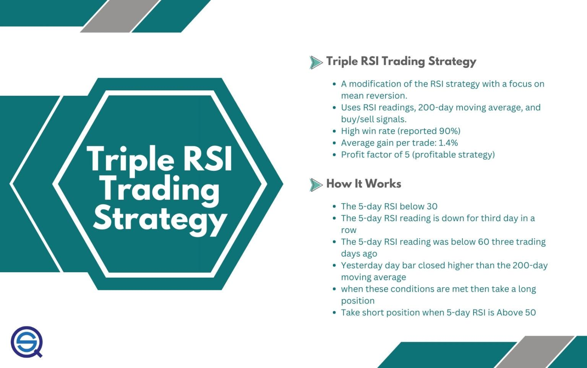

## Table of Contents

## What is the Triple RSI Trading Strategy?

The Triple RSI Trading Strategy is a method used by traders to make decisions about buying and selling assets. It uses the Relative Strength Index (RSI), which is a tool that measures how fast and how much a price of an asset changes. In this strategy, traders use three different RSIs set to different time periods to get a better understanding of the market. The idea is that by looking at the RSI over short, medium, and long periods, traders can spot trends and make better trading decisions.

When using the Triple RSI strategy, traders look for times when all three RSIs give the same signal. For example, if all three RSIs show that an asset is overbought (meaning its price might be too high and could go down soon), a trader might decide to sell. On the other hand, if all three RSIs show that an asset is oversold (meaning its price might be too low and could go up soon), a trader might decide to buy. By waiting for all three RSIs to agree, traders hope to make more accurate predictions about future price movements.

## How does the Relative Strength Index (RSI) work?

The Relative Strength Index (RSI) is a tool that helps traders see if a stock or other asset is being bought or sold too much. It measures how quickly the price of something is going up or down over a certain number of days, usually 14 days. The RSI gives a number between 0 and 100. If the RSI number is above 70, it means the asset might be overbought, which could mean the price is too high and might go down soon. If the RSI number is below 30, it means the asset might be oversold, which could mean the price is too low and might go up soon.

Traders use the RSI to help them decide when to buy or sell. For example, if the RSI goes above 70 and then starts to go down, a trader might think it's a good time to sell because the price might drop. If the RSI goes below 30 and then starts to go up, a trader might think it's a good time to buy because the price might rise. The RSI can also show something called divergence, where the price of the asset and the RSI are moving in different directions. This can be a sign that the current trend might be about to change.

## What are the key components of the Triple RSI Strategy?

The Triple RSI Strategy uses three different Relative Strength Index (RSI) settings to help traders make better decisions about buying and selling. Each RSI is set to a different time period: a short-term RSI, a medium-term RSI, and a long-term RSI. The short-term RSI might be set to 5 days, the medium-term RSI to 14 days, and the long-term RSI to 30 days. By looking at these three different time periods, traders can get a clearer picture of what's happening in the market over different lengths of time.

The main idea behind the Triple RSI Strategy is to wait for all three RSIs to give the same signal before making a trade. For example, if all three RSIs show that an asset is overbought (above 70), a trader might decide to sell because the price might be too high and could go down soon. If all three RSIs show that an asset is oversold (below 30), a trader might decide to buy because the price might be too low and could go up soon. By waiting for all three RSIs to agree, traders hope to make more accurate predictions about future price movements and reduce the risk of making a bad trade.

## How do you set up the Triple RSI indicators on a trading platform?

To set up the Triple RSI indicators on a trading platform, you first need to find the RSI tool in your platform's list of indicators. Once you find it, you'll need to add it to your chart three times, each time with a different setting. For the first RSI, set the period to 5 days for the short-term RSI. For the second RSI, set the period to 14 days for the medium-term RSI. For the third RSI, set the period to 30 days for the long-term RSI. Make sure each RSI is clearly labeled on your chart so you can tell them apart.

After you've added all three RSIs to your chart, you'll see three lines moving up and down. The short-term RSI will move the most because it's looking at the price changes over just 5 days. The medium-term RSI will move less because it's looking at 14 days, and the long-term RSI will move the least because it's looking at 30 days. When you're ready to trade, look for times when all three RSIs are above 70 or below 30 at the same time. If they're all above 70, it might be a good time to sell. If they're all below 30, it might be a good time to buy.

## What timeframes are best suited for the Triple RSI Strategy?

The Triple RSI Strategy can work well on different timeframes, but it often works best on daily and 4-hour charts. These timeframes give you a good balance between seeing enough price movement to make decisions and not getting too many false signals. On a daily chart, you look at the price changes over each day, which can help you see bigger trends. On a 4-hour chart, you look at the price changes every 4 hours, which can help you catch trends a bit earlier but still avoid too much noise.

If you use the Triple RSI Strategy on shorter timeframes like 1-hour or 30-minute charts, you might see more signals, but they can be less reliable. Shorter timeframes can have a lot of ups and downs that don't mean much in the bigger picture. On the other hand, using the strategy on longer timeframes like weekly charts can be good for seeing very big trends, but you might miss out on some trading opportunities because the signals come less often. So, daily and 4-hour charts are usually the best choice for most traders using the Triple RSI Strategy.

## How do you interpret the signals from the Triple RSI Strategy?

When you use the Triple RSI Strategy, you're looking for times when all three RSIs give the same signal. This means you want to see all three RSIs either above 70 or below 30 at the same time. If all three RSIs are above 70, it means the asset might be overbought. This could be a good time to sell because the price might be too high and could go down soon. On the other hand, if all three RSIs are below 30, it means the asset might be oversold. This could be a good time to buy because the price might be too low and could go up soon.

It's important to wait for all three RSIs to agree before making a trade. This helps you make more accurate predictions about what the price might do next. Sometimes, one or two RSIs might give a signal, but if the third one doesn't agree, it's better to wait. By waiting for all three to line up, you can feel more confident in your trading decisions and reduce the chance of making a bad trade.

## What are the entry and exit rules for the Triple RSI Strategy?

The entry rules for the Triple RSI Strategy are simple. You should look to enter a trade when all three RSIs give the same signal. If all three RSIs are above 70, it means the asset might be overbought, so you might want to sell. If all three RSIs are below 30, it means the asset might be oversold, so you might want to buy. It's important to wait for all three RSIs to agree before you make your move. This helps you make a more confident decision because you're looking at the price over short, medium, and long periods.

The exit rules for the Triple RSI Strategy are also straightforward. You should think about exiting your trade when the RSIs start to move away from the overbought or oversold levels. If you've sold because all three RSIs were above 70, you might want to buy back when one or more of the RSIs drop below 70. If you've bought because all three RSIs were below 30, you might want to sell when one or more of the RSIs rise above 30. Another good time to exit is if you see the RSIs start to move in different directions, which could mean the trend is changing.

## Can the Triple RSI Strategy be used for both long and short positions?

Yes, the Triple RSI Strategy can be used for both long and short positions. For a long position, you would look to buy an asset when all three RSIs are below 30, which means the asset is oversold. This suggests that the price might be too low and could go up soon. You would then hold onto the asset until the RSIs start to move away from the oversold level, or if you see the RSIs start to move in different directions, which could mean the trend is changing.

For a short position, you would look to sell an asset when all three RSIs are above 70, which means the asset is overbought. This suggests that the price might be too high and could go down soon. You would then buy back the asset when the RSIs start to move away from the overbought level, or if you see the RSIs start to move in different directions, which could mean the trend is changing. By using the Triple RSI Strategy for both long and short positions, you can take advantage of different market conditions.

## What are the common pitfalls and how can they be avoided when using the Triple RSI Strategy?

One common pitfall when using the Triple RSI Strategy is relying too much on the signals without considering other factors. The RSI is just one tool, and it can give false signals sometimes. For example, if the market is in a strong trend, the RSI might stay overbought or oversold for a long time, which can trick you into making a bad trade. To avoid this, you should always look at other things like the overall market trend, news, and other indicators before you make a trade. This way, you can make a more informed decision and not just follow the RSI signals blindly.

Another pitfall is not waiting for all three RSIs to agree before making a trade. It can be tempting to trade when just one or two RSIs give a signal, but this can lead to more losses. The whole point of the Triple RSI Strategy is to wait for all three RSIs to line up, which gives you a stronger signal. To avoid this pitfall, be patient and only make a trade when all three RSIs are above 70 or below 30 at the same time. This helps you make more accurate predictions and reduces the risk of making a bad trade.

## How can the Triple RSI Strategy be combined with other technical indicators for better results?

To get better results with the Triple RSI Strategy, you can use it together with other technical indicators. One good indicator to use is the Moving Average Convergence Divergence (MACD). The MACD can help you see if the trend is strong and in what direction it's going. If the Triple RSI signals match up with what the MACD is showing, you can feel more confident in your trade. For example, if the Triple RSI says to buy and the MACD also shows a strong upward trend, it's a good sign that the price might go up.

Another helpful indicator to use with the Triple RSI Strategy is the Bollinger Bands. Bollinger Bands show you how much the price is moving around. If the price is near the top of the Bollinger Bands and the Triple RSI says the asset is overbought, it might be a good time to sell. If the price is near the bottom of the Bollinger Bands and the Triple RSI says the asset is oversold, it might be a good time to buy. By using the Triple RSI Strategy with other indicators like the MACD and Bollinger Bands, you can make better trading decisions and reduce the chance of making a bad trade.

## What are some real-world examples of the Triple RSI Strategy in action?

Imagine you're looking at a stock chart for a company called ABC Inc. You've set up the Triple RSI Strategy with RSIs for 5 days, 14 days, and 30 days. One day, you notice that all three RSIs are below 30, which means the stock might be oversold. The price of ABC Inc. has been going down for a while, but now it looks like it might be a good time to buy. You decide to buy some shares of ABC Inc. A few days later, the RSIs start to move up and away from the oversold level. You see this as a sign to sell your shares and make a profit.

In another example, you're watching the price of gold. You've got the Triple RSI Strategy set up on your chart, and you see that all three RSIs are above 70, which means gold might be overbought. The price of gold has been going up a lot lately, but now it looks like it might be a good time to sell. You decide to sell some of your gold holdings. A week later, the RSIs start to move down and away from the overbought level. You see this as a sign to buy back some gold at a lower price, making a profit from the difference.

## How can the Triple RSI Strategy be optimized for different market conditions?

The Triple RSI Strategy can be optimized for different market conditions by adjusting the time periods of the RSIs. In a fast-moving market, you might want to use shorter time periods for the RSIs, like 3 days, 10 days, and 20 days. This way, you can catch quick changes in the price and make trades faster. In a slow-moving market, you might want to use longer time periods, like 7 days, 21 days, and 42 days. This helps you see bigger trends and avoid getting tricked by small price movements that don't mean much.

Another way to optimize the Triple RSI Strategy is by using it with other indicators that fit the market conditions. In a trending market, you can use the Triple RSI Strategy with the Moving Average Convergence Divergence (MACD) to see if the trend is strong. If the Triple RSI signals match up with the MACD, you can feel more confident in your trades. In a choppy or sideways market, you might want to use the Triple RSI Strategy with Bollinger Bands to see how much the price is moving around. If the price is near the top or bottom of the Bollinger Bands and the Triple RSI agrees, it can be a good time to trade. By adjusting the RSI periods and using other indicators, you can make the Triple RSI Strategy work better in different market conditions.

## References & Further Reading

[1]: Bergstra, J., Bardenet, R., Bengio, Y., & Kégl, B. (2011). ["Algorithms for Hyper-Parameter Optimization."](https://dl.acm.org/doi/10.5555/2986459.2986743) Advances in Neural Information Processing Systems 24.

[2]: ["Advances in Financial Machine Learning"](https://www.amazon.com/Advances-Financial-Machine-Learning-Marcos/dp/1119482089) by Marcos Lopez de Prado

[3]: ["Evidence-Based Technical Analysis: Applying the Scientific Method and Statistical Inference to Trading Signals"](https://www.amazon.com/Evidence-Based-Technical-Analysis-Scientific-Statistical/dp/0470008741) by David Aronson

[4]: ["Machine Learning for Algorithmic Trading"](https://github.com/stefan-jansen/machine-learning-for-trading) by Stefan Jansen

[5]: ["Quantitative Trading: How to Build Your Own Algorithmic Trading Business"](https://www.amazon.com/Quantitative-Trading-Build-Algorithmic-Business/dp/1119800064) by Ernest P. Chan