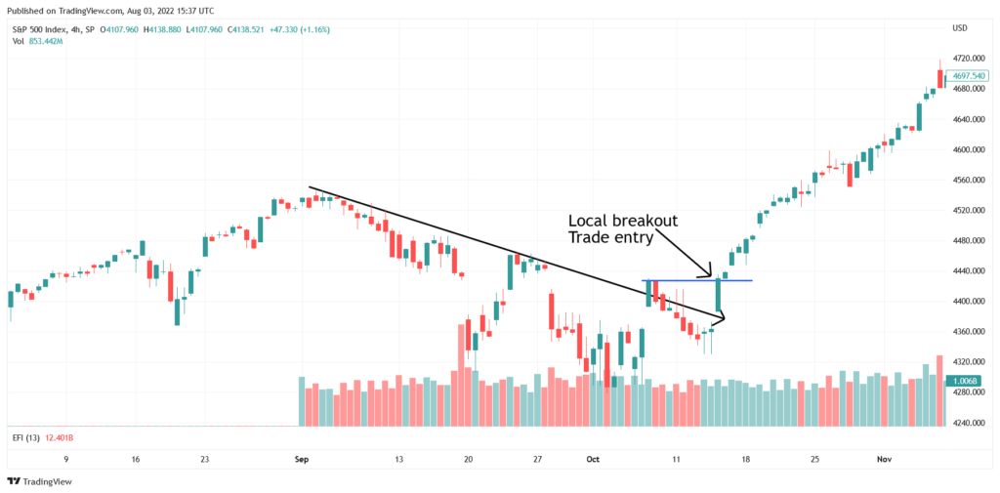

In the dynamic world of financial markets, trading strategies play a crucial role in navigating complex market conditions. Among the numerous strategies available, the Triple Screen Trading Strategy, developed by Dr. Alexander Elder, distinguishes itself as a robust method. Established in 1985, this strategy offers a systematic approach by combining trend-following indicators with oscillators to effectively filter out contradictory signals and provide clearer trading opportunities.

The Triple Screen Trading Strategy's primary objective is to provide a multi-dimensional view of market behavior. It leverages the strengths of different technical indicators through a series of three "screens" or tests, thereby offering a comprehensive framework for making informed trading decisions. This systematic methodology addresses the inherent limitations of relying on a single indicator, allowing traders to assess market trends, identify potential reversals, and determine optimal entry and exit points.



With the advent and increasing prominence of algorithmic trading, the Triple Screen Strategy has gained renewed attention due to its structured approach. Algorithmic trading platforms enable traders to automate this strategy, facilitating not only real-time implementation but also extensive backtesting and optimization. This capability allows traders to refine their strategy based on historical data, reducing the impact of emotional biases and enhancing decision-making accuracy.

This article explores the components of the Triple Screen Trading Strategy, its execution within an algorithmic trading framework, and its compelling advantages. Readers will gain insights into how adopting this multifaceted strategy can enhance trading outcomes through systematic analysis, offering a disciplined path towards effective trading in today's fast-paced financial markets.

## Table of Contents

## Understanding the Triple Screen Trading Strategy

The Triple Screen Trading Strategy, conceptualized by Dr. Alexander Elder in 1985, represents a paradigm shift from the traditional reliance on single-indicator strategies. This approach acknowledges the inherent limitations of any solitary indicator and proposes a layered methodology that integrates multiple indicators to achieve a more holistic market analysis.

At its core, the Triple Screen Trading Strategy is designed around three distinct tests or 'screens.' Each screen is crafted to dissect the market from varying perspectives, allowing traders to make informed and robust decisions. The first screen focuses on trend-following indicators, establishing the prevailing market direction. Indicators like moving averages are typically employed, as they smooth out price data to highlight trends over a specific period. By understanding the broader trend, traders can develop a foundational bias, whether bullish or bearish.

The second screen is dedicated to oscillators, such as the Relative Strength Index (RSI) or the stochastic oscillator, which are instrumental in identifying potential market reversals. These oscillators excel at pinpointing overbought or oversold conditions, highlighting moments when the market may be poised for a reversal or pullback. This screen serves to validate signals from the first screen by confirming whether a continuation or reversal is more probable.

The final screen emphasizes precise trade timing. This focus on timing utilizes tools such as support and resistance levels or candlestick patterns to accurately pinpoint entry and [exit](/wiki/exit-strategy) points. By honing in on these specific levels, traders can refine their timing to optimize their trade executions.

A defining feature of the Triple Screen Trading Strategy is its adaptability across various timeframes. This flexibility not only enhances its effectiveness in diverse market conditions but also allows traders of different profiles, from day traders to swing traders, to apply the strategy in alignment with their trading style. In practice, this means a trader could apply a long-term moving average for the first screen, a medium-term oscillator for the second, and short-term patterns for the third, seamlessly integrating insights across time horizons.

By combining trend analysis, oscillators, and precise timing, the Triple Screen Trading Strategy offers a comprehensive framework that addresses the multifaceted nature of market movements. This structured approach reduces the dependency on potentially flawed individual indicators, providing a more thorough and nuanced market analysis.

## Key Components of the Triple Screen Strategy

The Triple Screen Trading Strategy is structured around a systematic approach involving three distinct screens. Each screen utilizes different types of indicators that work together to provide a comprehensive analysis of market conditions.

The first screen is dedicated to trend-following indicators, which are essential for identifying the prevailing market direction. These indicators, such as moving averages, serve as the strategy's foundation by establishing a directional bias. For example, a simple moving average (SMA) can be used to smooth out price data over a specific period, helping traders determine whether a market is in an uptrend or downtrend. When the price is above the moving average, a bullish trend is indicated, while a position below suggests a bearish trend. This initial analysis guides traders in aligning their positions with the broader market trend.

The second screen employs oscillators like the Relative Strength Index (RSI) or the Stochastic Oscillator to detect potential market reversals. These indicators are particularly useful in identifying overbought or oversold conditions, which can signal an impending change in market direction. For instance, the RSI involves calculating the average gains and losses over a set period, typically represented as:
$$
\text{RSI} = 100 - \left( \frac{100}{1 + RS} \right)
$$
where $RS$ is the average of $x$ periods' up closes divided by the average of $x$ periods' down closes. Values above 70 indicate overbought conditions, while values below 30 suggest oversold conditions. By confirming potential reversal points, oscillators provide additional validation to the trend signals identified in the first screen.

The third screen focuses on precise trade timing, which can be achieved through support and resistance levels or candlestick patterns. This step is crucial for determining the exact entry and exit points of trades. Traders might look for key levels where price historically struggles to move beyond as support or resistance, or they might use candlestick patterns such as doji or engulfing patterns to predict short-term price movements. This screen refines the strategy by incorporating technical elements that aid in optimizing the timing of trades, ensuring traders can capitalize on the signals confirmed by the preceding screens.

Overall, the Triple Screen Trading Strategy's structured methodology enables traders to make more informed and systematic decisions, integrating trend direction with potential reversals and optimal execution timing.

## Advantages of the Triple Screen Strategy in Algorithmic Trading

Implementing the Triple Screen Strategy within an [algorithmic trading](/wiki/algorithmic-trading) framework offers substantial benefits. This approach fundamentally enhances decision accuracy by leveraging a multi-layered analysis of the market. By employing diverse indicators and combining them across multiple timeframes, the strategy significantly reduces the probability of false signals, a common challenge in trading strategies reliant on single indicators.

A key advantage of the Triple Screen Strategy in algorithmic trading is its compatibility with modern trading platforms that can automate its application. Automation facilitates [backtesting](/wiki/backtesting) and optimization, allowing traders to refine and perfect their strategies before they are deployed in live market conditions. Backtesting enables the simulation of trades over historical data, providing insights into the strategy's performance and potential areas for improvement. This systematic method helps traders identify the most effective parameters for each screen of the strategy.

Moreover, the algorithmic execution of the Triple Screen Strategy promotes a methodical and consistent trading process. By structuring trades around a pre-determined set of rules and conditions, traders can minimize emotional biases that might otherwise influence their decisions. This discipline is crucial for maintaining consistency and reliability in trading outcomes.

For instance, Python libraries like [backtrader](/wiki/backtrader) allow traders to code the Triple Screen Strategy, facilitating detailed backtesting and execution. An example code snippet might involve using moving averages for trend-following in the first screen and oscillators like the Relative Strength Index (RSI) for the second screen to identify entry points:

```python
import backtrader as bt

class TripleScreenStrategy(bt.Strategy):
    params = (
        ('short_ma', 10),
        ('long_ma', 30),
        ('rsi_period', 14),
        ('rsi_oversold', 30),
        ('rsi_overbought', 70),
    )

    def __init__(self):
        self.short_ma = bt.indicators.SMA(self.data.close, period=self.p.short_ma)
        self.long_ma = bt.indicators.SMA(self.data.close, period=self.p.long_ma)
        self.rsi = bt.indicators.RSI_SMA(self.data.close, period=self.p.rsi_period)

    def next(self):
        if self.short_ma > self.long_ma and self.rsi < self.p.rsi_oversold:
            self.buy()
        elif self.short_ma < self.long_ma and self.rsi > self.p.rsi_overbought:
            self.sell()
```

Such automation facilitates the evaluation and adjustment of strategies to ensure their alignment with current market dynamics. The structured and rigorous nature of the Triple Screen Strategy, when applied through algorithmic trading, offers traders a significant edge in complex financial markets.

## Practical Application and Backtesting of Triple Trading Strategies

Backtesting is an essential component in evaluating the efficacy of the Triple Screen Trading Strategy, as it provides insights into how the strategy would have performed in historical market scenarios. By simulating trades with past market data, traders can assess the robustness and reliability of the strategy before its live execution.

A comprehensive approach to backtesting involves applying the strategy across multiple asset classes and varying timeframes. This diversification ensures that the strategy is not only optimized for specific market conditions but is also adaptable to a wide array of trading environments. For instance, applying the strategy to equities, [forex](/wiki/forex-system), and commodities markets can highlight its versatility and potential limitations.

Advanced backtesting can be conducted using automated trading platforms and tools, such as TradingView and the Python library Backtrader. These platforms enable traders to create and test their strategies efficiently. For example, TradingView provides a robust scripting language known as Pine Script for developing custom indicators and strategies. Meanwhile, Backtrader is a Python-based framework that allows for flexible strategy development and execution. Here is a brief example of how one might set up a simple backtest in Python using Backtrader:

```python
import backtrader as bt

class TripleScreenStrategy(bt.SignalStrategy):
    def __init__(self):
        self.ma = bt.indicators.SimpleMovingAverage(self.data, period=30)
        self.rsi = bt.indicators.RSI(self.data, period=14)

    def next(self):
        if not self.position:  # Check if no position is open
            if self.data.close > self.ma and self.rsi < 30:
                self.buy()
        elif self.data.close < self.ma or self.rsi > 70:
            self.sell()

cerebro = bt.Cerebro()
cerebro.addstrategy(TripleScreenStrategy)
data = bt.feeds.YahooFinanceData(dataname='AAPL', fromdate=datetime(2020, 1, 1), todate=datetime(2021, 1, 1))
cerebro.adddata(data)
cerebro.run()
cerebro.plot()
```

This code snippet illustrates a basic implementation of the Triple Screen Strategy, involving a moving average for trend detection and the RSI oscillator for timing trades. By utilizing such tools, traders can systematically optimize their strategies, adjust parameters, and iteratively refine their approach based on performance feedback from backtesting sessions.

The ability to simulate past trades and analyze outcomes ensures that only the most promising strategies make it to the live trading phase. This disciplined method not only aids in refining the strategy itself but also reduces the likelihood of emotional biases influencing trading decisions. Continuous backtesting remains a vital practice for maintaining the strategy's alignment with ever-evolving market dynamics, thereby enhancing its application in a real-world scenario.

## Conclusion

The Triple Screen Trading Strategy provides traders with a robust framework to enhance decision-making processes. Its primary strength lies in the amalgamation of trend analysis, oscillators, and precise timing mechanisms, which together offer a comprehensive insight into market dynamics. By employing a multi-layered approach, this strategy effectively minimizes the impact of false signals that can often lead to suboptimal trading outcomes.

While the Triple Screen Strategy is not infallible, its structured methodology provides substantial benefits to traders dedicated to strategy development and refinement. With the integration of diverse technical indicators across multiple timeframes, traders can achieve a more nuanced market perspective, enhancing the accuracy and reliability of their decisions. This intricacy, however, requires an investment in rigorous backtesting and iterative refinement to align the strategy with prevailing market conditions.

Algorithmic trading platforms facilitate the automation of this strategy, making backtesting and optimization more accessible and manageable. By leveraging tools such as TradingView or backtrader in Python, traders can simulate trades, analyze performance, and refine strategies before actual deployment. This process of continuous evaluation and iteration is vital for adapting to ever-changing market dynamics and for maximizing the strategy's potential benefits.

In conclusion, the Triple Screen Trading Strategy offers a sophisticated means to navigate financial markets. It rewards those who invest time and effort into its development and continuous improvement, enhancing algorithmic trading outcomes and contributing to more consistent and informed trading decisions.

## References & Further Reading

[1]: Elder, A. (1993). ["Trading for a Living: Psychology, Trading Tactics, Money Management."](https://www.amazon.com/Trading-Living-Psychology-Tactics-Management/dp/0471592242) John Wiley & Sons.

[2]: Pring, M. J. (1991). ["Technical Analysis Explained: The Successful Investor's Guide to Spotting Investment Trends and Turning Points."](https://archive.org/details/technicalanalysi00prin) McGraw-Hill.

[3]: Kirkpatrick, C. D., & Dahlquist, J. R. (2010). ["Technical Analysis: The Complete Resource for Financial Market Technicians."](https://ptgmedia.pearsoncmg.com/images/9780134137049/samplepages/9780134137049.pdf) FT Press.

[4]: Murphy, J. J. (1999). ["Technical Analysis of the Financial Markets: A Comprehensive Guide to Trading Methods and Applications."](https://archive.org/details/technicalanalysi0000murp) New York Institute of Finance.

[5]: ["Dr. Elder’s Triple Screen Trading System."](https://www.mql5.com/en/blogs/post/731016) Elder.com