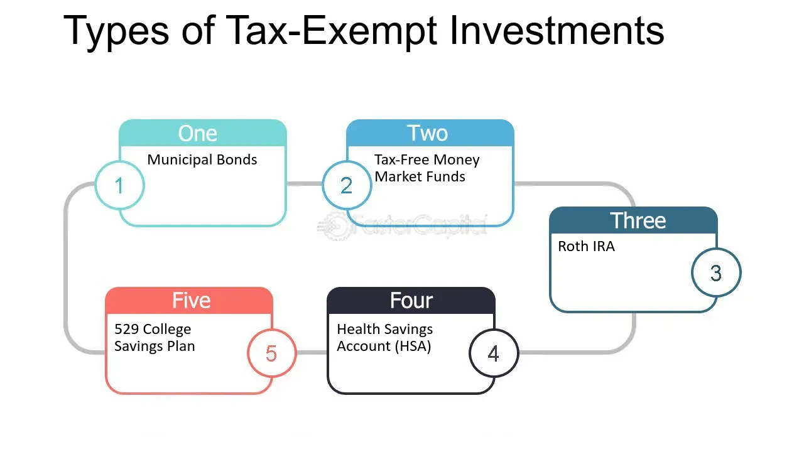

## Table of Contents

## What is triple tax exemption?

Triple tax exemption is a special benefit that some investments have. It means that the money you earn from these investments is not taxed three times: when you earn it, when it grows, and when you take it out. This is different from many other investments where you might have to pay taxes at each of these stages.

This kind of exemption is often found in certain types of municipal bonds. These bonds help fund public projects like schools or roads. Because they help the community, the government gives them this tax break. This can make them a good choice for people looking to save on taxes while also supporting public projects.

## Which types of investments typically offer triple tax exemption?

Triple tax exemption is mostly found in certain municipal bonds. These bonds are issued by states, cities, or other local governments to raise money for things like building schools, roads, or hospitals. When you invest in these bonds, the interest you earn is not taxed by the federal government, the state government, or the local government. This makes them very attractive for people who want to keep more of their investment earnings.

There are two main types of municipal bonds that offer this benefit: general obligation bonds and revenue bonds. General obligation bonds are backed by the full faith and credit of the issuing government, meaning they promise to use their taxing power to pay back the bond. Revenue bonds, on the other hand, are paid back from the money earned by the specific project they fund, like a toll road or a utility service.

Not all municipal bonds offer triple tax exemption. It depends on where the bond is issued and where the investor lives. For example, if you live in the state that issued the bond, you might get this triple tax benefit. But if you live in a different state, you might only get a double tax exemption, where you don't pay federal or state taxes on the interest, but you might still owe local taxes.

## How does triple tax exemption benefit investors?

Triple tax exemption helps investors by letting them keep more of the money they earn from their investments. When you invest in something like a municipal bond that has this benefit, you don't have to pay taxes on the interest you earn at three different levels: federal, state, and local. This means more money stays in your pocket instead of going to taxes.

This can make a big difference, especially for people in higher tax brackets or those who live in states with high taxes. By not having to pay these taxes, the actual return on their investment can be much higher than with other investments that don't have this tax advantage. It's like getting a bonus just for choosing the right type of investment.

## Can you explain the difference between single, double, and triple tax exemption?

Single tax exemption means you don't have to pay one type of tax on your investment earnings. Usually, this is the federal tax. So, if you earn interest from a bond that has a single tax exemption, you won't have to pay federal taxes on that interest, but you might still have to pay state and local taxes.

Double tax exemption means you don't have to pay two types of taxes on your earnings. This is often the federal tax and the state tax. So, if you live in the state that issued the bond, you won't have to pay federal or state taxes on the interest you earn, but you might still owe local taxes.

Triple tax exemption is the best of all. It means you don't have to pay federal, state, or local taxes on your investment earnings. This is usually found in certain municipal bonds, and it's a big benefit because it lets you keep all the interest you earn without losing any of it to taxes.

## What are the specific taxes that are exempted under triple tax exemption?

Triple tax exemption means you don't have to pay three types of taxes on the money you earn from your investment. These taxes are federal income tax, state income tax, and local income tax. When you have an investment with triple tax exemption, like certain municipal bonds, the interest you earn is free from all these taxes.

This can make a big difference in how much money you actually get to keep from your investment. For example, if you earn $1,000 in interest from a bond, you get to keep all of it if it's triple tax exempt. Without this exemption, you might have to pay part of that $1,000 in taxes, leaving you with less money. So, triple tax exemption can make your investment more valuable because you don't lose any of your earnings to taxes.

## How does the mechanism of triple tax exemption work in practice?

When you invest in something like a municipal bond that has triple tax exemption, you don't have to pay federal, state, or local taxes on the interest you earn. This means if you get $100 in interest from the bond, you keep all of it. The government gives this special tax break to encourage people to invest in projects that help the community, like building schools or fixing roads.

To get this benefit, you need to live in the state where the bond was issued. For example, if you live in New York and you buy a bond issued by New York City, you won't have to pay any taxes on the interest. But if you live in another state, like California, you might only get a double tax exemption, where you don't pay federal or state taxes but might still owe local taxes. So, it's important to check where the bond is from and where you live to see if you can get the full triple tax exemption.

## What are the eligibility criteria for investments to qualify for triple tax exemption?

To qualify for triple tax exemption, an investment usually needs to be a certain type of municipal bond. These bonds are issued by states, cities, or other local governments to fund public projects like building schools or roads. The key thing is that the bond must be issued in the same state where the investor lives. This is because triple tax exemption means you don't have to pay federal, state, or local taxes on the interest you earn, and that only applies if you live in the state that issued the bond.

For example, if you live in New York and you buy a bond issued by New York City, you can get triple tax exemption. This means you won't have to pay any taxes on the interest you earn from that bond. But if you live in a different state, like California, and you buy the same New York City bond, you might only get a double tax exemption, where you don't pay federal or state taxes but might still owe local taxes. So, to get the full triple tax exemption, you need to live in the state where the bond is issued.

## Are there any limitations or caps on the amount that can be invested under triple tax exemption?

There are no specific caps on the amount you can invest in bonds that offer triple tax exemption. This means you can invest as much money as you want in these bonds, and you won't have to pay federal, state, or local taxes on the interest you earn, as long as you live in the state where the bond was issued.

However, there are some things to keep in mind. For example, if you earn a lot of money from these bonds, it might affect how much you can deduct from your taxes in other areas. Also, while there's no cap on how much you can invest, there might be limits on how many of these bonds are available for sale, depending on how much money the government needs to raise for their projects.

## How does triple tax exemption impact long-term investment strategies?

Triple tax exemption can make a big difference in long-term investment strategies because it lets you keep more of your earnings. If you invest in municipal bonds that have this benefit, you won't have to pay federal, state, or local taxes on the interest you earn. This means your investment grows faster over time because you're not losing money to taxes. For people who are planning for the long term, like saving for retirement, this can be a smart choice because it can help your savings grow bigger without the drag of taxes.

Another thing to think about is where you live. To get the full triple tax exemption, you need to live in the same state where the bond was issued. This can affect your long-term plans if you move to a different state. You might still get some tax benefits, like not paying federal or state taxes, but you might have to pay local taxes. So, when you're planning your investments for the long term, it's important to think about where you'll be living and how that might change your tax situation.

## What are the potential risks or downsides associated with investments offering triple tax exemption?

One risk of investing in bonds that offer triple tax exemption is that they might not give you as high a return as other investments. These bonds are often seen as safe because they are backed by the government, but this safety means they usually pay less interest than riskier investments like stocks. So, if you're looking to grow your money quickly, these bonds might not be the best choice.

Another downside is that the value of these bonds can go down if interest rates go up. When interest rates rise, new bonds come out with higher interest rates, making older bonds with lower rates less attractive. This can cause the price of your bond to drop if you want to sell it before it matures. Also, if you move to a different state, you might lose the triple tax exemption and only get a double or single exemption, which could change how much you benefit from the investment.

## How do federal, state, and local governments fund the triple tax exemption?

Federal, state, and local governments fund the triple tax exemption by not collecting taxes on the interest earned from certain municipal bonds. When you invest in these bonds, you're basically lending money to the government to help pay for things like schools or roads. Instead of paying you back with interest and then taxing that interest, the government lets you keep all the interest without any taxes. This makes the bonds more attractive to investors and helps the government raise money for important projects.

The money that the government would have collected in taxes from the interest on these bonds comes from other sources. For example, the federal government might get less tax revenue, but it can still fund its operations through other taxes like income tax or sales tax. State and local governments might also rely on other taxes or fees to make up for the lost revenue. So, while the triple tax exemption means less tax money from these specific bonds, the government finds other ways to cover its costs.

## What legislative changes have affected triple tax exemption policies in recent years?

In recent years, there haven't been many big changes to the laws about triple tax exemption. The main rule is still the same: if you buy a special kind of municipal bond from the state where you live, you don't have to pay federal, state, or local taxes on the interest you earn. This hasn't changed much, and it's still a good way for governments to get people to invest in things like schools and roads.

However, there have been some small changes that might affect how much you benefit from triple tax exemption. For example, the Tax Cuts and Jobs Act of 2017 changed some rules about how much you can deduct from your taxes. This might mean that even if you get triple tax exemption on your bond interest, you might not be able to deduct as much from your taxes in other areas. So, while the basic idea of triple tax exemption hasn't changed, these little tweaks can make a difference in how much money you actually save.

## What are Triple-Tax-Free Investments and how can they be explored?

Triple-tax-free investments, primarily represented by municipal bonds, offer a compelling investment strategy due to their unique tax-exempt status across municipal, state, and federal levels. This characteristic makes them an attractive option for devising tax-efficient portfolios.

### Mechanics of Triple-Tax-Free Investments

Municipal bonds are debt securities issued by cities, states, and other governmental entities to finance public projects. The interest earned on these bonds is typically exempt from federal income taxes. Furthermore, if the investor resides in the state or locality where the bond is issued, the interest can also be exempt from state and local taxes, effectively making it a triple-tax-free investment. 

This tax exemption can be mathematically illustrated as follows: if $I$ represents the interest income from a municipal bond investment, then the after-tax income for a taxable investment would be $I \cdot (1 - t)$, where $t$ is the combined tax rate. For a triple-tax-free investment, the after-tax income is simply $I$, as the tax rate $t = 0$. This advantage is significant in optimizing net returns, particularly for high-income individuals facing higher marginal tax rates.

### Appeal for Different Income Brackets

Triple-tax-free investments are particularly attractive to investors in higher income brackets due to the proportional benefit of tax savings. For individuals in the highest federal tax brackets, avoiding federal, state, and local taxes can substantially enhance their effective [interest rate](/wiki/interest-rate-trading-strategies) compared to taxable securities. This can be calculated using the formula for a taxable equivalent yield:

$$
\text{Taxable Equivalent Yield} = \frac{\text{Tax-Free Yield}}{1 - \text{Tax Rate}}
$$

For lower-income investors, the appeal might be less potent since their tax savings would be lower, yet the inherent security of municipal bonds might still provide value as a low-risk component of a diversified portfolio.

### Security and Risks

Municipal bonds are generally considered low-risk investments, with government entities typically reliable in meeting their debt obligations. However, they are not entirely without risk. Factors such as economic downturns, mismanagement, or budget deficits can affect a municipal issuer's ability to make timely interest payments or return the principal at maturity. Nevertheless, historically low default rates make them a suitable choice for risk-averse investors.

### Rationale for Triple-Tax-Free Status

The rationale for providing a triple-tax-free status to municipal bonds lies in the incentivization of investment in public infrastructure and community development projects. By reducing the tax burden on investors, municipalities can attract more capital towards essential projects like schools, hospitals, highways, and utilities. This mutual benefit paradigm helps municipalities finance significant projects while providing investors with a relatively stable and tax-efficient investment option.

Overall, triple-tax-free municipal bonds offer a blend of tax efficiency and security, making them an attractive investment for those seeking to enhance returns via tax-exempt income. Understanding the mechanics of these tax advantages is crucial for investors aiming to include them effectively in diversified investment strategies.

## What is Triple-Tax-Free Algorithmic Trading?

Triple-tax-free [algorithmic trading](/wiki/algorithmic-trading) represents a unique blend of tax-advantaged investments and advanced trading techniques. This approach primarily capitalizes on trading securities that are exempt from municipal, state, and federal taxes, thereby potentially enhancing net returns. Algorithmic trading, which utilizes computer programs to execute trades based on predefined criteria, can amplify the benefits of such tax-exempt securities.

### Implications of Tax Benefits for Algorithmic Trading Strategies

Algorithmic trading algorithms often incorporate a variety of factors such as market data, historical trends, and trading volumes. By integrating tax benefits into these algorithms, traders can optimize the post-tax returns. For instance, the expected return $R_e$ of a security can be adjusted as:

$$
R_{net} = R_g \times (1 - T)
$$

where $R_g$ is the gross return and $T$ is the effective tax rate. When the tax rate becomes zero, as is the case with tax-exempt securities, the net return equals the gross return, improving the overall attractiveness of the asset.

### Employing Algorithmic Trading in Tax-Exempt Securities

The potential to capitalize on tax-exempt securities through algorithmic trading is substantial. Municipal bonds, often cited as quintessential triple-tax-free investments, can form an integral part of an algorithmic trading strategy. Algorithms can be designed to not only identify patterns and optimal entry and [exit](/wiki/exit-strategy) points but also to ensure portfolio allocations favor tax-efficient assets. This ensures that investors retain a greater share of their investment returns, particularly appealing for high-net-worth individuals within higher tax brackets.

```python
# Example Python code snippet to select tax-exempt securities

def select_tax_exempt_securities(securities):
    """
    Filter and select tax-exempt securities from a list.

    Parameters:
    securities (list of dict): List containing security details.

    Returns:
    list of dict: Filtered list of tax-exempt securities.
    """
    return [sec for sec in securities if sec.get('is_tax_exempt')]

# Example usage
all_securities = [{'name': 'Municipal Bond A', 'is_tax_exempt': True},
                  {'name': 'Corporate Bond B', 'is_tax_exempt': False}]

tax_exempt_securities = select_tax_exempt_securities(all_securities)
```

### Impact of Recent Tax Proposals on Algorithmic Trading in Crypto

Recent tax proposals aimed at digital assets have introduced a complex landscape for algorithmic traders. These proposals suggest more lenient tax structures, potentially allowing for crypto trades to assume some tax advantages traditionally reserved for other asset classes. As the regulatory environment evolves, algorithmic traders must adapt their strategies to optimize for new tax scenarios, potentially incorporating tax-efficient cryptos into their models.

### Opportunities and Challenges for Digital Asset Traders

Digital asset traders face unique opportunities amid tax changes. On the one hand, advantageous tax proposals could spur increased interest and trading volumes in cryptocurrencies, leading to enhanced [liquidity](/wiki/liquidity-risk-premium) and potentially higher returns. On the other hand, the dynamic nature of tax regulation poses significant challenges. Traders must constantly update their algorithms to stay compliant and optimize for tax efficiency, maintaining a balance between maximizing returns and adhering to the evolving tax code.

The dynamic interplay between algorithmic trading, tax exemptions, and digital assets offers a multitude of pathways to enhance trading efficiency while minimizing tax burdens. As tax policies continue to evolve, the integration of tax considerations into algorithmic trading remains a crucial area for innovation and optimization, promising pathways to potentially maximizing post-tax investment returns.

## References & Further Reading

[1]: Fabozzi, F. J. (2007). ["The Handbook of Municipal Bonds"](https://onlinelibrary.wiley.com/doi/book/10.1002/9781119198093). John Wiley & Sons.

[2]: ["Elgar Companion to Taxation"](https://www.elgaronline.com/abstract/book/9781784715489/C77.xml) by Robert W. McGee.

[3]: Cheng, I. H., & Wall Street Journal (2011). ["The Tax Consequences of Municipal Bonds"](https://onlinelibrary.wiley.com/doi/full/10.1111/1475-679X.12361).

[4]: Luszczynski, J. D., & Szwagrzak, P. (2020). ["Municipal Bonds Taxation and Trading Prices"](http://www.giulia-brancaccio.com/files/papers/Learning.pdf). Journal of Financial and Quantitative Analysis.

[5]: Pompian, M. (2012). ["Behavioral Finance and Wealth Management: How to Build Investment Strategies That Account for Investor Biases"](https://onlinelibrary.wiley.com/doi/book/10.1002/9781119202400). John Wiley & Sons.