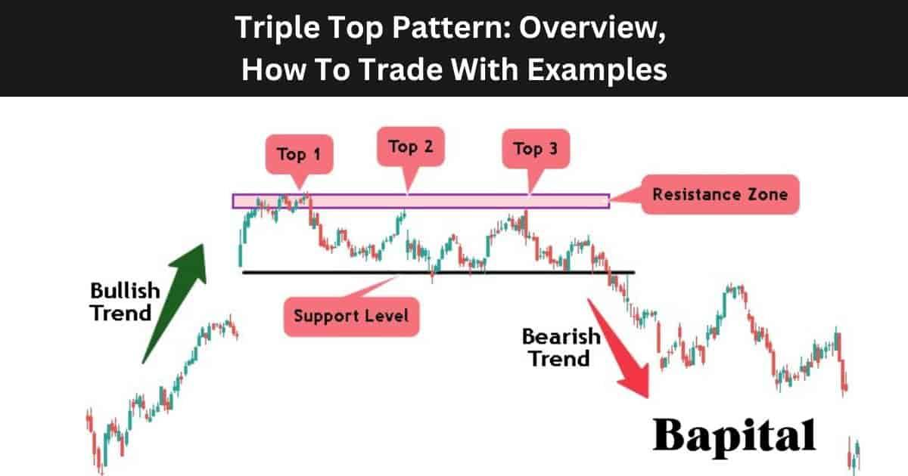

## Table of Contents

## What is a Triple Top chart pattern?

A Triple Top chart pattern is a type of technical analysis pattern that traders use to predict when a stock's price might go down. It looks like three peaks at about the same high price level, with dips in between. When you see this pattern, it means the price tried to go up three times but couldn't break through a certain level, showing that buyers are losing strength and sellers might take over soon.

Once the price falls below the lowest point between the three peaks, called the neckline, it's a signal that the price might keep going down. Traders often use this signal to sell their stocks or to start betting that the price will go down. It's important to wait for the price to break the neckline before acting, to make sure the pattern is confirmed.

## How can you identify a Triple Top pattern on a chart?

To spot a Triple Top pattern on a chart, look for three clear peaks that reach about the same high price. These peaks should be spaced out with valleys or dips in between them. The key thing to watch is that each time the price tries to go higher, it can't get past a certain point, creating those three similar peaks.

Once you see these three peaks, the next important part is the neckline. This is an imaginary line drawn at the lowest point between the peaks. If the price drops below this neckline after the third peak, it's a sign that the Triple Top pattern is confirmed. This drop below the neckline suggests that the price might keep going down, so it's a signal for traders to think about selling or betting on a price drop.

## What does a Triple Top pattern signify in terms of market sentiment?

A Triple Top pattern shows that the market is feeling less sure about a stock going up. When you see three peaks at about the same high price, it means the price tried to go higher three times but couldn't. This tells us that the people who want to buy the stock are getting tired, and they're not as strong as before. It's like they're running out of energy to push the price higher.

Once the price falls below the neckline, which is the lowest point between the peaks, it's a sign that the sellers are starting to take over. This drop below the neckline means that more people are now thinking the price will go down, not up. So, the Triple Top pattern shows a shift in how people feel about the stock, from hopeful to worried, which can lead to more selling and a lower price.

## What are the key components of a Triple Top pattern?

A Triple Top pattern has three main parts that you need to know about. First, there are three peaks that reach about the same high price. These peaks show that the price tried to go up three times but couldn't break through a certain level. It's like the price hit a ceiling it couldn't get past. The second part is the valleys or dips between these peaks. These dips show that after each attempt to go higher, the price fell back down a bit.

The third and very important part is the neckline. This is an imaginary line you draw at the lowest point between the peaks. When the price finally drops below this neckline after the third peak, it's a big signal. It means the pattern is confirmed, and it's likely that the price will keep going down. This drop below the neckline tells us that the people who want to sell are now stronger than the people who want to buy, so it's a sign for traders to think about selling their stocks or betting on the price going down.

## How does the Triple Top pattern differ from a Double Top pattern?

A Triple Top pattern and a Double Top pattern are both used to predict when a stock's price might go down, but they have some differences. A Double Top pattern has two peaks at about the same high price with a valley in between. When the price drops below the valley, called the neckline, it's a sign that the price might keep going down. On the other hand, a Triple Top pattern has three peaks at about the same high price, with two valleys in between. The price needs to drop below the lowest valley, which is also called the neckline, to confirm the pattern and suggest that the price will go down.

The main difference between these two patterns is the number of peaks. A Double Top shows two attempts to go higher, while a Triple Top shows three attempts. This extra peak in the Triple Top can make the pattern a bit more reliable because it shows that the price tried to go up more times but still couldn't break through. Both patterns tell us that buyers are getting tired and sellers might take over, but the Triple Top gives a bit more evidence of this shift in market sentiment.

## What are the typical price targets when trading a Triple Top breakout?

When you see a Triple Top pattern and the price drops below the neckline, you might want to know where the price could go next. A common way to guess this is by looking at the height of the pattern. You measure the distance from the highest peak to the neckline. Once the price breaks below the neckline, you take that distance and subtract it from the neckline. This gives you a target price where the stock might go.

Another way to set a price target is to look at other support levels on the chart. These are points where the price has stopped falling before. If there's a clear support level below the neckline, the price might drop to that level after breaking out of the Triple Top. Traders often use these methods together to get a better idea of where the price might go after a Triple Top [breakout](/wiki/breakout-trading).

## What are the best entry points for trading a Triple Top pattern?

The best time to start trading a Triple Top pattern is when the price drops below the neckline. The neckline is the lowest point between the three peaks. When the price goes below this line, it's a strong sign that the pattern is real and the price might keep going down. This is a good time to sell the stock or to start betting that the price will go down. Waiting for this drop helps make sure the pattern is working and not just a fake move.

Another good entry point is right after the third peak, but before the price breaks the neckline. If you're really sure the Triple Top is happening, you might want to start selling or betting on a price drop a bit early. But this is riskier because the price could still go back up. It's safer to wait for the price to go below the neckline, but if you're quick and confident, you might get a better price by starting a bit earlier.

## How should stop-loss orders be placed when trading a Triple Top?

When you're trading a Triple Top and betting that the price will go down, it's smart to use a stop-loss order to protect yourself. A stop-loss order is like a safety net that tells your broker to sell your stock if the price goes up to a certain point. For a Triple Top, a good place to set your stop-loss is just above the highest peak of the three. This way, if the price goes back up and breaks above that peak, it might mean the Triple Top pattern isn't working and the price could keep going up. By setting your stop-loss there, you can limit how much money you might lose if the pattern fails.

Another way to set your stop-loss is a bit more careful. You can place it just above the neckline, which is the lowest point between the peaks. If the price goes back up and crosses the neckline, it could mean the Triple Top isn't going to work out. Setting your stop-loss here can help you get out of the trade with less loss if the price starts to go up again. Both ways help you manage your risk, but where you put your stop-loss depends on how much risk you're okay with and how sure you are about the pattern.

## What are common mistakes traders make when trading Triple Top patterns?

One common mistake traders make when trading Triple Top patterns is jumping into a trade too early, before the price breaks the neckline. They see the three peaks and think the pattern is confirmed, but they don't wait for the price to drop below the neckline. This can lead to losses if the price goes back up instead of down. It's important to wait for that break below the neckline to make sure the pattern is real and not just a fake move.

Another mistake is not setting a proper stop-loss order. Traders might not place a stop-loss at all, or they might put it too far away from the current price. This can lead to big losses if the Triple Top pattern fails and the price goes up instead of down. A good stop-loss should be just above the highest peak or just above the neckline to limit how much money you could lose if the pattern doesn't work out.

Lastly, traders often ignore other market signs and focus only on the Triple Top pattern. They might not pay attention to things like overall market trends, news that could affect the stock, or other chart patterns that could be happening at the same time. It's important to look at the big picture and not just rely on one pattern to make trading decisions.

## Can Triple Top patterns be used in conjunction with other technical indicators?

Yes, Triple Top patterns can be used with other technical indicators to make better trading decisions. For example, traders might use moving averages to see the general trend of the stock. If the price is below a long-term moving average when a Triple Top forms, it might be a stronger sign that the price will go down. Another useful indicator is the Relative Strength Index (RSI). If the RSI shows that the stock is overbought when the Triple Top appears, it can add to the belief that the price might fall soon.

Volume is also an important thing to look at. If the [volume](/wiki/volume-trading-strategy) goes up when the price breaks the neckline of a Triple Top, it can mean more people are selling, making the pattern more reliable. Traders might also use other chart patterns or trend lines to confirm what the Triple Top is telling them. By looking at these other signs along with the Triple Top, traders can feel more sure about their trades and maybe make better choices.

## How does volume play a role in confirming a Triple Top pattern?

Volume is really important when you're trying to figure out if a Triple Top pattern is real. When the price is making those three peaks, you want to see lower volume on the way up to each peak. This means fewer people are buying the stock, which is a sign that the buyers are getting tired. But, when the price finally breaks below the neckline after the third peak, you want to see a big jump in volume. This big volume means a lot of people are selling the stock, which makes the Triple Top pattern more believable.

So, if you see the volume going down as the price tries to go up to each peak, and then the volume jumps up when the price breaks the neckline, it's a strong sign that the Triple Top pattern is working. This helps traders feel more sure about betting that the price will go down, because the high volume on the breakout shows that more people agree the price should fall.

## What are advanced strategies for trading Triple Top patterns in different market conditions?

When trading Triple Top patterns in a strong downtrend, traders can use the pattern to add to their short positions. If the market is already going down and a Triple Top forms, it's a sign that the downtrend might keep going. Traders can wait for the price to break below the neckline and then sell more of the stock or increase their bets that the price will go down. They can also look at other signs like the Relative Strength Index (RSI) or moving averages to make sure the downtrend is strong. If the RSI shows the stock is overbought when the Triple Top appears, it adds to the belief that the price will fall.

In a sideways or choppy market, trading Triple Top patterns can be trickier. Here, traders need to be careful and might want to use smaller positions to limit risk. They can look for other signs like a drop in volume as the price tries to go up to each peak, and a big jump in volume when the price breaks the neckline. This can help them feel more sure about the pattern. Also, they might want to use other chart patterns or trend lines to confirm the Triple Top. If the market is moving up and down a lot, waiting for the price to break the neckline and then quickly going into the trade can help traders catch the move down without staying in the trade too long.

In a strong uptrend, Triple Top patterns might be less reliable, but they can still be used to spot possible short-term pullbacks. Traders can look for signs that the uptrend is getting weak, like lower volume on the way up to each peak. If a Triple Top forms and the price breaks the neckline, it could be a good time to bet on a short-term drop. But, because the overall trend is up, traders should be ready to get out of the trade quickly if the price starts to go back up. Using a tight stop-loss just above the highest peak can help limit losses if the uptrend continues.

## How does the Triple Top Pattern work?

The triple top pattern emerges after an uptrend, identifying a potential reversal in price movement. This pattern is defined by three distinct peaks occurring at roughly the same price level. Each peak represents a failed attempt to breach a resistance level, suggesting diminishing bullish [momentum](/wiki/momentum).

The formation process begins as the asset experiences an upward trajectory. As the price approaches a significant resistance point, the first peak manifests. A pullback ensues, leading to a temporary price decline and forming a swing low. The price rallies once more, reaching a similar peak level, only to retreat again, creating the second swing low. This cycle repeats a third time, solidifying the appearance of three peaks interrupted by two valleys, all approximately at the same horizontal level.

Key to confirming the triple top pattern is the break below the lowest swing low, which acts as a support line. This breakdown serves as a vital bearish signal. The formula can be expressed as:

$$
\text{Confirmed Breakdown if: } P < SL_{\text{min}}
$$

where $P$ represents the current price level and $SL_{\text{min}}$ is the minimum value among the swing lows. This indicates the asset is likely to enter a further decline, prompting traders to anticipate a bearish market movement. Identifying these trend reversals accurately is critical for making informed trading decisions.

## References & Further Reading

[1]: Bergstra, J., Bardenet, R., Bengio, Y., & Kégl, B. (2011). ["Algorithms for Hyper-Parameter Optimization."](https://papers.nips.cc/paper/4443-algorithms-for-hyper-parameter-optimization) Advances in Neural Information Processing Systems 24.

[2]: ["Advances in Financial Machine Learning"](https://www.amazon.com/Advances-Financial-Machine-Learning-Marcos/dp/1119482089) by Marcos Lopez de Prado

[3]: ["Evidence-Based Technical Analysis: Applying the Scientific Method and Statistical Inference to Trading Signals"](https://www.amazon.com/Evidence-Based-Technical-Analysis-Scientific-Statistical/dp/0470008741) by David Aronson

[4]: ["Machine Learning for Algorithmic Trading"](https://github.com/stefan-jansen/machine-learning-for-trading) by Stefan Jansen

[5]: ["Quantitative Trading: How to Build Your Own Algorithmic Trading Business"](https://books.google.com/books/about/Quantitative_Trading.html?id=j70yEAAAQBAJ) by Ernest P. Chan