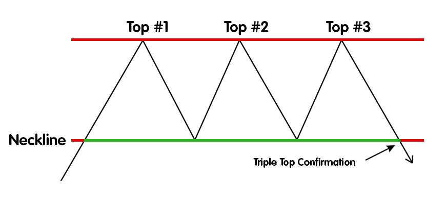

## Table of Contents

## What is a Triple Top pattern in technical analysis?

A Triple Top pattern is a type of chart pattern used in technical analysis to predict a reversal in the price of a stock or other financial asset. It forms when the price of an asset reaches a high point three times, but fails to break through that level, creating three peaks at roughly the same price level. This pattern suggests that the asset is struggling to move higher and that the upward momentum is weakening, which could signal that a downward trend is about to start.

When you see a Triple Top pattern, it's a hint that the asset might be losing its strength to keep going up. The pattern is confirmed when the price falls below the support level, which is the lowest point between the three peaks. Traders often use this pattern to decide when to sell their holdings or to enter short positions, expecting the price to drop further. It's important to wait for the price to break the support level before acting, to avoid false signals.

## How does a Triple Top pattern form on a price chart?

A Triple Top pattern forms when the price of an asset tries to go up three times but can't get past a certain high point. Each time the price reaches this high, it creates a peak. These three peaks look like three mountains of the same height on the chart. The price goes up to the same level three times because there are a lot of people selling at that price, which stops the price from going higher.

Between these peaks, the price drops to a lower level, called the support level. This happens twice, creating two valleys between the three peaks. The support level is important because it shows where buyers step in to push the price back up. But if the price falls below this support level after the third peak, it means the Triple Top pattern is complete. This tells traders that the price might keep going down, so they might decide to sell or bet on the price falling further.

## What are the key characteristics of a Triple Top pattern?

A Triple Top pattern is easy to spot on a price chart. It looks like three mountains that are about the same height. These mountains, or peaks, show that the price tried to go up three times but couldn't get past a certain high point. Each time the price reaches this high, it gets pushed back down because a lot of people are selling at that price. This creates three peaks that are roughly at the same level.

Between these peaks, there are two valleys where the price drops to a lower level. This lower level is called the support level. It's where buyers step in and push the price back up towards the high point again. The Triple Top pattern is complete when the price falls below this support level after the third peak. This tells traders that the price might keep going down, so they might decide to sell or bet on the price falling further.

## What does a Triple Top pattern indicate about market sentiment?

A Triple Top pattern shows that the market is feeling less confident about the price going up. When the price tries to go higher three times but can't get past a certain point, it means there are a lot of people selling at that high price. This creates three peaks that look like mountains on the chart. Each time the price reaches this high, it shows that sellers are strong enough to stop the price from going higher. This tells us that the market is not as excited about the price going up anymore.

When the price finally drops below the support level after the third peak, it's a clear sign that the market sentiment has changed. The support level is where buyers used to step in and push the price back up. But if the price falls below this level, it means buyers are not as strong anymore. This change in sentiment suggests that more people now think the price will go down, and they might start selling or betting on the price to fall further.

## How can a beginner identify a Triple Top pattern on a chart?

A beginner can identify a Triple Top pattern on a chart by looking for three peaks that are about the same height. These peaks look like three mountains on the chart. They happen when the price of an asset tries to go up three times but can't get past a certain high point. Each time the price reaches this high, it gets pushed back down because a lot of people are selling at that price. This creates three peaks that are roughly at the same level.

Between these peaks, there are two valleys where the price drops to a lower level. This lower level is called the support level. It's where buyers step in and push the price back up towards the high point again. To confirm the Triple Top pattern, a beginner should watch for the price to fall below this support level after the third peak. When the price drops below this level, it's a sign that the pattern is complete and the price might keep going down.

## What are the common time frames where Triple Top patterns are observed?

Triple Top patterns can be seen on different time frames, from short-term to long-term charts. On short-term charts, like those showing minutes or hours, the pattern might form quickly over a few days. These short-term patterns can be useful for traders who like to make quick trades, but they might not be as reliable because the market can change fast.

On longer time frames, like daily or weekly charts, the Triple Top pattern takes more time to form, sometimes over several months. These patterns are often seen as more reliable because they show a stronger trend of the price struggling to go up. Traders who look at these longer time frames might use the pattern to make decisions about holding or selling their investments over a longer period.

## What is the significance of volume in confirming a Triple Top pattern?

Volume plays an important role in confirming a Triple Top pattern. When the price reaches the high point and forms each of the three peaks, you should look at the trading [volume](/wiki/volume-trading-strategy). If the volume is high during the first peak, it shows strong interest in the asset. But if the volume gets lower with each subsequent peak, it suggests that fewer people are interested in buying at that high price. This decrease in volume supports the idea that the upward [momentum](/wiki/momentum) is weakening.

When the price finally breaks below the support level after the third peak, the volume should increase. A higher volume at this point confirms that more people are selling and that the pattern is likely to lead to a downward trend. If the volume stays low when the price breaks the support level, it might be a false signal, and the pattern might not be as reliable. So, watching the volume helps traders trust the Triple Top pattern more and make better decisions.

## How reliable is the Triple Top pattern as a trading signal?

The Triple Top pattern can be a good sign for traders, but it's not always perfect. It's more reliable when you see it on longer time frames like daily or weekly charts. These patterns take time to form, so they show a stronger trend of the price struggling to go up. When you also see the volume going down as each peak forms and then going up when the price breaks the support level, it makes the pattern even more trustworthy. But, no pattern works all the time, so it's smart to use it with other tools to make better trading choices.

Sometimes, the Triple Top pattern can trick traders. This happens more often on shorter time frames, like hourly charts, where the market can change quickly. If the volume doesn't support the pattern, or if the price doesn't stay below the support level for long, the pattern might not be a good signal. That's why it's important to wait for the price to break the support level and to look at other signs in the market before making a trade based on a Triple Top pattern.

## What are the potential entry and exit points when trading based on a Triple Top pattern?

When trading based on a Triple Top pattern, the entry point for a short position is usually when the price breaks below the support level after the third peak. This break signals that the pattern is complete and that the price might keep going down. Traders should wait for this break to happen and confirm it with an increase in volume to make sure it's a good time to enter the trade. It's also smart to look at other signs in the market to be more sure about the trade.

The [exit](/wiki/exit-strategy) point for the trade is a bit trickier. One common way to decide when to exit is to set a target price based on the height of the pattern. You can measure the distance from the highest peak to the support level and then subtract that distance from the support level to find a target price for selling. Another way is to use a stop-loss order just above the last peak to limit losses if the price goes back up. It's important to keep watching the market and be ready to exit the trade if other signs show that the downward trend might be over.

## How can traders use other technical indicators to confirm a Triple Top pattern?

Traders can use other technical indicators to make sure a Triple Top pattern is a good sign. One helpful indicator is the Relative Strength Index (RSI). If the RSI shows the asset is overbought when the price reaches the third peak, it can confirm that the price might be ready to go down. Another useful tool is the Moving Average Convergence Divergence (MACD). If the MACD line crosses below the signal line around the time the price breaks the support level, it's another sign that the downward trend might start.

It's also smart to look at the volume when using other indicators. If the volume goes down as each peak forms and then goes up when the price breaks the support level, it supports the Triple Top pattern. Using these indicators together can help traders feel more confident about their trades. But, no pattern or indicator works all the time, so it's important to keep watching the market and be ready to change plans if needed.

## What are some common mistakes traders make when interpreting Triple Top patterns?

One common mistake traders make when interpreting Triple Top patterns is acting too soon. They might start selling or betting on the price to go down before the price actually breaks the support level. This can lead to false signals and losses because the pattern isn't complete until the price falls below the support level. It's important to wait for this break and look for other signs, like an increase in volume, to confirm the pattern.

Another mistake is ignoring the volume. Volume is a big clue in confirming a Triple Top pattern. If the volume goes down as each peak forms and then goes up when the price breaks the support level, it makes the pattern more reliable. But if traders don't pay attention to the volume, they might miss important information and make bad trades. It's smart to always check the volume along with the pattern to make better decisions.

Lastly, traders sometimes rely too much on the Triple Top pattern without using other tools. The pattern can be helpful, but it's not perfect and can trick traders. Using other indicators like the RSI or MACD can help confirm the pattern and make trading decisions more reliable. It's important to look at the bigger picture and use different tools together to avoid mistakes and improve trading success.

## How does the Triple Top pattern compare to other reversal patterns like the Double Top or Head and Shoulders?

The Triple Top, Double Top, and Head and Shoulders patterns are all used to predict when a price might start going down after going up for a while. The Triple Top pattern looks like three mountains that are about the same height. It means the price tried to go up three times but couldn't get past a certain high point. The Double Top pattern is similar, but it only has two peaks instead of three. It's a bit quicker to form and can be a sign that the price might go down soon. The Head and Shoulders pattern is different because it has three peaks too, but the middle peak is higher than the other two, making it look like a head with two shoulders. This pattern shows that the price went up a lot once, but then couldn't get that high again, which can also mean the price might start going down.

While all three patterns can tell traders that a price might reverse, they each give a bit different information. The Triple Top pattern shows a longer struggle to go up because it takes three tries to reach the high point. This can make it a stronger signal than the Double Top, which only needs two tries. The Head and Shoulders pattern is useful because it shows a clear high point in the middle, which can help traders see where the price couldn't go higher. But, no pattern works perfectly all the time, so it's smart to use other tools like volume and other indicators to make sure the pattern is a good sign before making a trade.

## What is the Triple Top Pattern and how can it be understood?

The Triple Top pattern is a significant chart formation in technical analysis, identifiable by three peaks reaching similar price levels. This pattern purports a bearish reversal, suggesting a shift from an uptrend to a potential downtrend. As the market experiences these three oscillations to the same resistance level, the pattern signifies that the buying pressure is dissipating.

The completion of a Triple Top pattern occurs when the price retraces and breaches the prior support level established between the peaks. This breakdown below the support level serves as confirmation of the bearish reversal, indicating that sellers have gained control. Traders often look for additional bearish signals, such as increased volume on the [breakout](/wiki/breakout-trading), to validate the pattern’s legitimacy further.

Mathematically, let $P_1, P_2,$ and $P_3$ represent the nearly equal peaks, and $S_1$ and $S_2$ denote the support levels between these peaks. The pattern's confirmation point is when the closing price $C$ satisfies:

$$
C < \min(S_1, S_2)
$$

This condition signals the end of the pattern and the start of a downtrend. Recognizing this transition point is crucial for executing trades that capitalize on the anticipated bearish shift.

## References & Further Reading

[1]: Bulkowski, T. N. (2005). ["Encyclopedia of Chart Patterns"](https://www.amazon.com/Encyclopedia-Chart-Patterns-Thomas-Bulkowski/dp/0471668265). John Wiley & Sons.

[2]: Pring, M. J. (2002). ["Technical Analysis Explained: The Successful Investor's Guide to Spotting Investment Trends and Turning Points"](https://www.amazon.com/Technical-Analysis-Explained-Fifth-Successful/dp/0071825177). McGraw-Hill Education.

[3]: Nison, S. (1991). ["Japanese Candlestick Charting Techniques: A Contemporary Guide to the Ancient Investment Techniques of the Far East"](https://drive.google.com/file/d/0B_CADMk621uLNDEyZTEzZjYtMmZjOS00ZmUyLTlhYmYtN2E1YTViOWRiOTdi/view). Prentice Hall Press.

[4]: Murphy, J. J. (1999). ["Technical Analysis of the Financial Markets: A Comprehensive Guide to Trading Methods and Applications"](https://archive.org/details/technicalanalysi0000murp). New York Institute of Finance.

[5]: De Prado, M. L. (2018). ["Advances in Financial Machine Learning"](https://www.amazon.com/Advances-Financial-Machine-Learning-Marcos/dp/1119482089). Wiley.