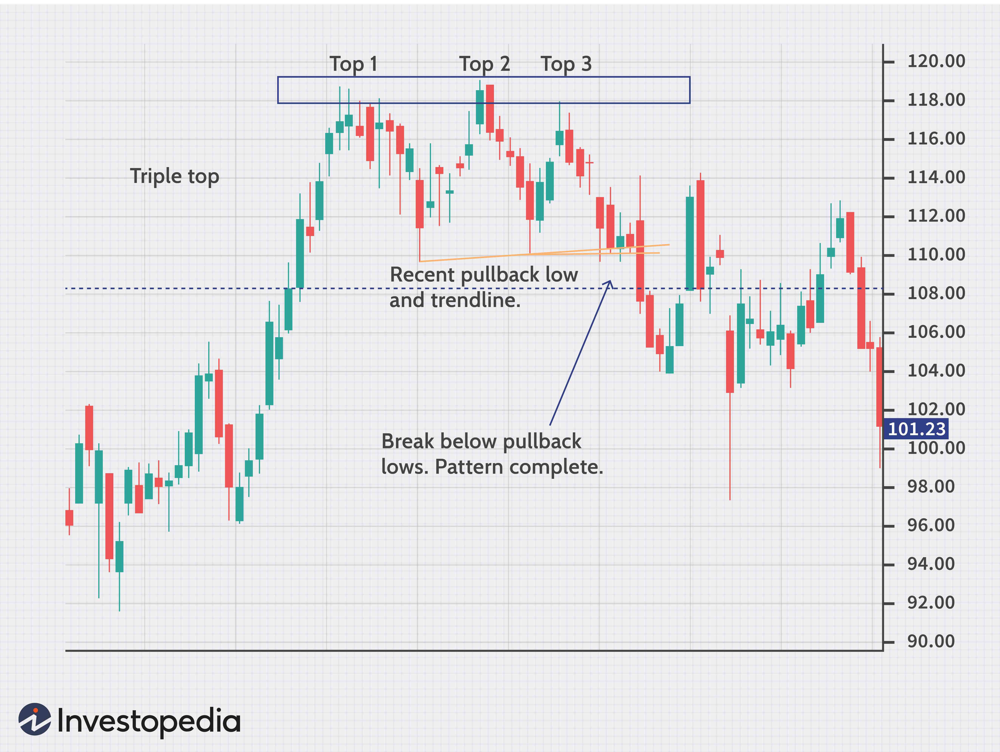

Chart patterns are fundamental tools in technical analysis and algorithmic trading, providing traders with visual representations that help predict potential market movements. Among these patterns, the Triple Top is particularly important due to its role in signaling potential reversals in an ongoing uptrend. A Triple Top pattern occurs when the price reaches a resistance level three times without breaking through, suggesting that the upward momentum may be exhausted and a downward trend could follow.

This article explores the Triple Top chart pattern in depth, highlighting its formation process, the implications it holds for market trends, and strategies traders can adopt to harness this pattern for profitable trading outcomes. Understanding the nuances of the Triple Top not only aids traders in anticipating market reversals but also enhances their ability to implement strategic entries and exits in their trading activities. By combining technical analysis insights with algorithmic trading techniques, traders can optimize their use of the Triple Top pattern to improve trading efficiency and potential returns.



## Table of Contents

## Understanding the Triple Top Pattern

The Triple Top pattern is a significant chart formation in technical analysis, identifiable by three peaks reaching similar price levels. This pattern purports a bearish reversal, suggesting a shift from an uptrend to a potential downtrend. As the market experiences these three oscillations to the same resistance level, the pattern signifies that the buying pressure is dissipating.

The completion of a Triple Top pattern occurs when the price retraces and breaches the prior support level established between the peaks. This breakdown below the support level serves as confirmation of the bearish reversal, indicating that sellers have gained control. Traders often look for additional bearish signals, such as increased volume on the breakout, to validate the pattern’s legitimacy further.

Mathematically, let $P_1, P_2,$ and $P_3$ represent the nearly equal peaks, and $S_1$ and $S_2$ denote the support levels between these peaks. The pattern's confirmation point is when the closing price $C$ satisfies:

$$
C < \min(S_1, S_2)
$$

This condition signals the end of the pattern and the start of a downtrend. Recognizing this transition point is crucial for executing trades that capitalize on the anticipated bearish shift.

## How the Triple Top Pattern Works

The Triple Top pattern is identifiable through the formation of three distinct peaks, each reaching a similar resistance level but failing to break through. This consistent resistance level suggests an equilibrium point where bullish [momentum](/wiki/momentum) is insufficient to push the price higher, highlighting the potential for a trend reversal.

Initially, the price advances to form the first peak, encountering resistance that forces a pullback. This pullback leads to a swing low, where the market temporarily regroups before making another attempt to surpass the initial resistance level. The price once again reaches the resistance, forming the second peak, and undergoes another pullback, creating another swing low. This sequence repeats, leading to the formation of the third peak. The failure to break the resistance three times reflects diminishing buying pressure, while each pullback gives traders valuable insights into the market's sentiment.

The pattern completes and confirms its bearish implications when the price breaks below the support established by the swing lows after the third peak. This breakdown signals that sellers have gained control, and the previous support has now turned into a new resistance level. Consequently, traders interpret this as a confirmation of a downtrend, prompting them to consider entering short positions or exiting long positions.

In conclusion, the Triple Top pattern provides a systematic approach to understanding market sentiment shifts. The sequential testing of resistance followed by consistent pullbacks indicates a weakening bullish trend, culminating in a bearish reversal once the established support is breached.

## Significance of the Triple Top Pattern

The Triple Top pattern's significance lies primarily in its ability to signal a potential reversal from an uptrend to a downtrend, which is crucial for traders aiming to anticipate market movements. The formation of this pattern suggests that the buying pressure is diminishing, as evidenced by the price failing to break through a consistent resistance level over three distinct peaks. This resistance level acts as a barrier that the market tried but repeatedly failed to surpass, indicating a weakening bullish momentum.

The presence of this pattern implies that the sellers are beginning to gain control, and without sufficient buying power to push the price beyond the resistance, a downward correction or reversal is likely. Traders often interpret the Triple Top as a precursor to a larger bearish move. Therefore, recognizing this pattern allows traders to prepare by either exiting long positions or entering short positions as part of risk management and profit potential strategies.

This pattern's ability to predict reversals is a powerful tool in trading, as it helps traders avoid potential losses from remaining in a security that may soon depreciate in value. It also provides opportunities for profitable trades by aligning trading strategies with the anticipated downward movement. Consequently, the Triple Top pattern can be an invaluable component of a trader’s toolkit, enhancing one's ability to make informed and strategic trading decisions.

## Trading Strategies Using the Triple Top Pattern

Traders often employ the Triple Top pattern to make strategic trading decisions aimed at capitalizing on potential bearish reversals. Once the Triple Top pattern is confirmed, traders typically enter short positions or [exit](/wiki/exit-strategy) existing long positions. This approach aims to benefit from the anticipated decline in the asset’s price following the completion of the pattern.

A critical component of any trading strategy involving chart patterns like the Triple Top is risk management. To minimize potential losses in case the pattern fails and the price continues to rise, traders set stop-loss orders. These stop-loss orders are strategically placed above the resistance peaks of the Triple Top pattern, ensuring that positions are automatically closed if the market moves against the trader’s anticipated direction.

Volume analysis plays a vital role in validating the Triple Top pattern. During the formation of the pattern's [breakout](/wiki/breakout-trading), increased selling [volume](/wiki/volume-trading-strategy) serves as a strong indicator that the bearish reversal is likely to be genuine. A significant rise in trading volume during the price breakdown below the support level adds credibility to the pattern, suggesting that the market sentiment is shifting towards the sellers.

Below is a basic Python script that traders might use to identify the Triple Top pattern and manage positions accordingly:

```python
# Importing necessary libraries
import pandas as pd

# Sample data
price_data = pd.Series(...)

# Function to identify Triple Top pattern
def identify_triple_top(price_data):
    # Your logic to detect triple top from historical data
    detected_peaks = []
    # Assume you've identified peaks, proceed further

    if len(detected_peaks) >= 3:
        # Logic to check if they form a Triple Top pattern
        # Example: Confirm and verify resistance level stability
        resistance_level = max(detected_peaks)  # hypothetical resistance calculation
        # Check for breakout
        for price in price_data:
            if price < resistance_level:  # Executing trade on breakout
                # Code to enter short position or exit long position
                print("Triple Top confirmed. Trading action executed.")
                break

# Function call
identify_triple_top(price_data)
```

In practice, such algorithms can be more sophisticated, integrating technical indicators like Moving Average Convergence Divergence (MACD) or the Relative Strength Index (RSI) to improve the accuracy and robustness of pattern detection and trade execution.

In conclusion, the Triple Top pattern offers a structured framework for traders aiming to leverage anticipated market downturns. By employing disciplined risk management strategies and integrating volume analysis, traders can effectively utilize this pattern to enhance their trading profitability.

## Real-World Examples of Triple Top Patterns

An illustrative example of a Triple Top pattern is found in the trading activity of Bruker Corp. (BRKR). This pattern emerged after several attempts, a hallmark of the Triple Top formation, which typically unfolds with three distinct peaks at a similar price level. In this instance, the price repeatedly encountered resistance around the $36.50 mark, signaling a significant barrier that the market failed to overcome.

During the development of this pattern, each peak was met with a subsequent pullback, creating three swing highs at approximately the same resistance level. These retracements between the peaks underscored the inability of buyers to push the price beyond this threshold. The reluctance to break past $36.50 indicated weakening bullish momentum, which is central to the formation of a Triple Top.

The confirmation of the pattern occurred when the price eventually declined, breaking below the level of prior pullbacks, known as the neckline. This breach confirmed the bearish reversal, suggesting a shift in sentiment where sellers gained control, leading to further price depreciation. In practical trading scenarios, this breakout would serve as a signal for traders to exit their long positions or consider short selling.

In coding terms, detecting such a pattern algorithmically involves analyzing historical price data to identify specific characteristics like the formation of three peaks and a break below the neckline. A simple Python script using pandas and numpy can help automate this detection:

```python
import pandas as pd
import numpy as np

def find_triple_top(data, resistance_level, tolerance=0.01):
    peaks = []
    neckline = None

    # Identifying peaks near the resistance level
    for i in range(1, len(data)-1):
        if data['Close'][i] > max(data['Close'][i-1], data['Close'][i+1]):
            if np.isclose(data['Close'][i], resistance_level, atol=tolerance):
                peaks.append(i)

    # Ensure there are exactly three peaks
    if len(peaks) == 3:
        for i in range(peaks[1], len(data)-1):
            if data['Close'][i] < data['Close'][i+1] < data['Close'][i+2]:
                neckline = data['Close'][i]
                break

    return peaks, neckline

# Example usage
# Assuming `df` is a DataFrame with a 'Close' column containing your stock data
resistance_level = 36.50
peaks, neckline = find_triple_top(df, resistance_level)

if len(peaks) == 3 and neckline:
    print(f"Triple Top Confirmed at indices: {peaks} with neckline: {neckline}")
```

This code identifies potential triple tops where the price hits a predefined resistance level multiple times before breaking down past a critical support, thereby confirming the pattern. Such automation enhances a trader's ability to recognize chart patterns efficiently, especially when dealing with large datasets.

## Incorporating Algo Trading with Triple Top Patterns

Algorithmic trading enables traders to automate strategies for detecting and acting on Triple Top chart patterns, a bearish reversal signal indicating potential market declines. Incorporating technical indicators like the Moving Average Convergence Divergence (MACD) or the Relative Strength Index (RSI) can enhance the accuracy and reliability of pattern detection in algorithmic systems.

### Leveraging Technical Indicators

The MACD indicator is an effective tool in [algorithmic trading](/wiki/algorithmic-trading), assisting in identifying momentum changes by calculating the difference between two moving averages. A typical MACD strategy involves using the difference between a 12-day and a 26-day exponential moving average (EMA), with a 9-day EMA as the signal line. When integrated with Triple Top pattern detection, the MACD can confirm weakening bullish momentum as the pattern forms.

Similarly, the RSI is used to gauge overbought or oversold conditions in the market. An RSI value above 70 typically indicates that an asset is overbought, while a value below 30 suggests it is oversold. In the context of a Triple Top, the RSI can provide additional confirmation when the pattern forms around a resistance level without breaking through, indicating a potential reversal.

### Backtesting Strategies

Backtesting plays a crucial role in validating algorithmic trading strategies. By applying a strategy to historical market data, traders can assess the potential effectiveness of detecting Triple Top patterns in real-time trading. Backtesting enables traders to refine algorithms, optimize parameters, and evaluate risk management tactics.

For example, in Python, traders can employ libraries like Pandas for data manipulation and Matplotlib for visualization to backtest their algorithms. The following Python snippet illustrates a basic framework for [backtesting](/wiki/backtesting) a Triple Top detection strategy:

```python
import pandas as pd
import numpy as np
import matplotlib.pyplot as plt

# Load historical data
data = pd.read_csv('historical_data.csv')

# Calculate MACD and RSI
data['EMA12'] = data['Close'].ewm(span=12, adjust=False).mean()
data['EMA26'] = data['Close'].ewm(span=26, adjust=False).mean()
data['MACD'] = data['EMA12'] - data['EMA26']
data['Signal_line'] = data['MACD'].ewm(span=9, adjust=False).mean()

data['RSI'] = 100 - (100 / (1 + data['Close'].diff(1).apply(np.sign).rolling(window=14).mean()))

# Simple Triple Top detection logic (for illustrative purposes)
def detect_triple_top(data):
    # Detection logic for three peaks and a break below support
    # Placeholder for illustrative purposes
    return np.random.choice([True, False], size=len(data))

data['Triple_Top'] = detect_triple_top(data)

# Visualize the results
plt.figure(figsize=(12, 6))
plt.plot(data['Close'], label='Close')
plt.scatter(data.index, data['Close'][data['Triple_Top']], color='red', label='Triple Top')
plt.title('Triple Top Pattern with MACD and RSI')
plt.legend()
plt.show()
```

This script loads historical market data, calculates the MACD and RSI, and applies a simple algorithm to detect the Triple Top pattern. Though rudimentary, this framework can be expanded upon and refined to increase the robustness and precision of the trading algorithm.

By integrating technical indicators and conducting comprehensive backtests, traders can develop automated trading strategies that effectively capitalize on the predictive power of Triple Top patterns, enhancing both trading efficiency and profitability.

## Conclusion

The Triple Top pattern is a valuable asset for traders aiming to identify potential bearish reversals in the market. Recognizing and comprehending its formation and significance enables traders to execute informed decisions, which are crucial for protecting their investments against potential downturns. By detecting a change in momentum where multiple failed attempts at breaking a resistance level occur, traders can anticipate a trend shift and adjust their strategies to either exit long positions or initiate short positions effectively.

Incorporating algorithmic trading further enhances the practicality and efficiency of using the Triple Top pattern. Algorithms designed to automatically detect this pattern reduce the likelihood of human error and allow for quicker response times. These algorithms can be implemented using technical indicators such as the Moving Average Convergence Divergence (MACD) or the Relative Strength Index (RSI) to improve pattern detection accuracy. By integrating these tools, traders can execute trades more precisely and consistently, leading to potentially higher profitability.

Moreover, backtesting these algorithms against historical data provides a robust mechanism for validating their effectiveness. Leveraging past market data allows traders to refine their strategies, optimizing for various market conditions to enhance the likelihood of successful trades in future scenarios. Consequently, the combination of the Triple Top pattern's analytical insights with algorithmic trading offers a formidable approach for achieving trading efficiency and maximizing potential profits.

## References & Further Reading

[1]: Bulkowski, T. N. (2005). ["Encyclopedia of Chart Patterns"](https://www.amazon.com/Encyclopedia-Chart-Patterns-Thomas-Bulkowski/dp/0471668265). John Wiley & Sons.

[2]: Pring, M. J. (2002). ["Technical Analysis Explained: The Successful Investor's Guide to Spotting Investment Trends and Turning Points"](https://www.amazon.com/Technical-Analysis-Explained-Fifth-Successful/dp/0071825177). McGraw-Hill Education.

[3]: Nison, S. (1991). ["Japanese Candlestick Charting Techniques: A Contemporary Guide to the Ancient Investment Techniques of the Far East"](https://drive.google.com/file/d/0B_CADMk621uLNDEyZTEzZjYtMmZjOS00ZmUyLTlhYmYtN2E1YTViOWRiOTdi/view). Prentice Hall Press.

[4]: Murphy, J. J. (1999). ["Technical Analysis of the Financial Markets: A Comprehensive Guide to Trading Methods and Applications"](https://archive.org/details/technicalanalysi0000murp). New York Institute of Finance.

[5]: De Prado, M. L. (2018). ["Advances in Financial Machine Learning"](https://www.amazon.com/Advances-Financial-Machine-Learning-Marcos/dp/1119482089). Wiley.