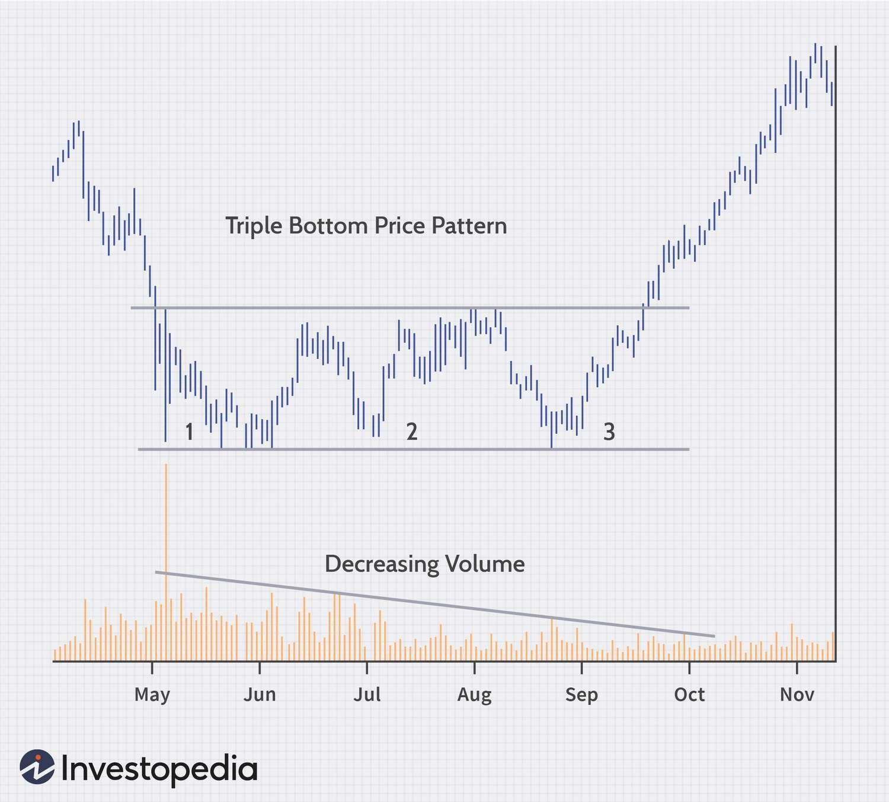

## Table of Contents

## What are triple tops and bottoms in technical analysis?

Triple tops and bottoms are patterns in technical analysis that traders use to predict future price movements of a stock or other financial asset. A triple top pattern occurs when the price of an asset reaches a high point three times, but fails to break through to a new high each time. This pattern suggests that the price may be about to fall, as it shows that the asset is having trouble moving higher. On the other hand, a triple bottom pattern happens when the price hits a low point three times, but doesn't drop below that level. This indicates that the price might start to rise, as it shows that the asset is finding strong support at that level.

These patterns are important because they can signal a potential reversal in the current trend. For a triple top, after the third peak, if the price starts to decline and breaks below the support level (the lowest point between the peaks), it confirms the pattern and suggests that a bearish trend might be starting. For a triple bottom, if the price rises above the resistance level (the highest point between the lows) after the third trough, it confirms the pattern and indicates that a bullish trend might be beginning. Traders often use these patterns along with other indicators to make more informed decisions about buying or selling assets.

## How can you identify a triple top pattern on a chart?

To spot a triple top pattern on a chart, you need to look for three clear peaks that are about the same height. These peaks should happen over a period of time, and they show that the price keeps trying to go higher but can't get past a certain point. Between each peak, the price will drop to a similar level, creating two valleys that are about the same depth. This shows that the price is struggling to break through the high point, and it might start to go down instead.

Once you see the three peaks and the two valleys, you need to watch what happens next. If the price falls below the level of the valleys after the third peak, it confirms the triple top pattern. This drop below the valleys is a sign that the price might keep going down, and it could be a good time to think about selling or getting ready for a price drop. Always remember to use other tools and indicators too, to make sure your guess about the pattern is right.

## How can you identify a triple bottom pattern on a chart?

To spot a triple bottom pattern on a chart, you need to look for three clear lows that are about the same level. These lows should happen over time, showing that the price keeps trying to go down but can't get past a certain point. Between each low, the price will rise to a similar level, creating two peaks that are about the same height. This shows that the price is struggling to break through the low point, and it might start to go up instead.

Once you see the three lows and the two peaks, you need to watch what happens next. If the price rises above the level of the peaks after the third low, it confirms the triple bottom pattern. This rise above the peaks is a sign that the price might keep going up, and it could be a good time to think about buying or getting ready for a price increase. Always remember to use other tools and indicators too, to make sure your guess about the pattern is right.

## What does a triple top indicate about market trends?

A triple top pattern shows that the market might be getting ready to change from going up to going down. When you see three peaks at about the same high level, it means the price tried to go higher three times but couldn't. This tells us that the people buying the asset are not strong enough to push the price past that high point anymore. If the price then drops below the lowest point between the peaks, it's a sign that the market trend might be turning bearish, meaning prices could start to fall.

Traders watch for this pattern because it can help them decide when to sell their assets or get ready for a price drop. It's important to wait for the price to break below the support level after the third peak to be sure the pattern is confirmed. Using other tools and indicators along with the triple top pattern can help traders make better decisions about what might happen next in the market.

## What does a triple bottom indicate about market trends?

A triple bottom pattern shows that the market might be getting ready to change from going down to going up. When you see three lows at about the same level, it means the price tried to go lower three times but couldn't. This tells us that the people selling the asset are not strong enough to push the price past that low point anymore. If the price then rises above the highest point between the lows, it's a sign that the market trend might be turning bullish, meaning prices could start to rise.

Traders watch for this pattern because it can help them decide when to buy assets or get ready for a price increase. It's important to wait for the price to break above the resistance level after the third low to be sure the pattern is confirmed. Using other tools and indicators along with the triple bottom pattern can help traders make better decisions about what might happen next in the market.

## What are the key differences between triple tops and double tops?

Triple tops and double tops are both patterns that traders look for to predict when a price might start to go down. The main difference is in the number of peaks. A double top has two peaks that are about the same height, while a triple top has three peaks at about the same height. Both patterns show that the price is having trouble going higher, but the triple top shows this struggle happening over a longer period of time because it takes three tries instead of two.

Another difference is how strong the signal is. A triple top is often seen as a stronger sign that the price might go down because it shows the price failing to break through a high point three times instead of just two. This can make traders more confident that a bearish trend is starting. Both patterns need the price to drop below a certain level to be confirmed, but the triple top's extra peak can make the signal seem more reliable.

## What are the key differences between triple bottoms and double bottoms?

Triple bottoms and double bottoms are patterns that traders use to guess when a price might start to go up. The main difference is in the number of lows. A double bottom has two lows that are about the same level, while a triple bottom has three lows at about the same level. Both patterns show that the price is having trouble going lower, but the triple bottom shows this struggle happening over a longer time because it takes three tries instead of two.

Another difference is how strong the signal is. A triple bottom is often seen as a stronger sign that the price might go up because it shows the price failing to break through a low point three times instead of just two. This can make traders more confident that a bullish trend is starting. Both patterns need the price to rise above a certain level to be confirmed, but the triple bottom's extra low can make the signal seem more reliable.

## How reliable are triple top and bottom patterns in predicting price movements?

Triple top and bottom patterns can be useful for guessing what might happen to prices, but they are not always right. These patterns show that the price is having trouble going higher or lower, which can be a sign that the price might start to move in the opposite direction. But, the market can be tricky, and sometimes the price does not do what the pattern suggests. Traders often use other tools and signs along with these patterns to make better guesses about what might happen next.

The reliability of triple top and bottom patterns can depend on a few things. How clear the pattern is on the chart, how long it takes to form, and how much trading is happening can all affect how well the pattern works. If the pattern is very clear and takes a long time to form, it might be more reliable. But, even with these things in mind, these patterns are just one part of understanding the market, and they should be used with other information to make the best decisions.

## What are the best practices for trading based on triple top patterns?

When trading based on triple top patterns, it's important to wait for the pattern to be confirmed before making any moves. A triple top is confirmed when the price drops below the lowest point between the three peaks. This drop shows that the price might keep going down, so it could be a good time to sell or get ready for a price drop. Don't rush into selling just because you see three peaks; make sure the price breaks the support level first.

Using other tools and signs along with the triple top pattern can help you make better guesses about what might happen next. Look at things like trading [volume](/wiki/volume-trading-strategy), other chart patterns, and technical indicators to see if they agree with what the triple top is telling you. If everything points in the same direction, you can feel more sure about your trading decision. Remember, the market can be tricky, so always be ready for surprises and have a plan for what to do if things don't go as expected.

## What are the best practices for trading based on triple bottom patterns?

When trading based on triple bottom patterns, it's important to wait for the pattern to be confirmed before making any moves. A triple bottom is confirmed when the price rises above the highest point between the three lows. This rise shows that the price might keep going up, so it could be a good time to buy or get ready for a price increase. Don't rush into buying just because you see three lows; make sure the price breaks the resistance level first.

Using other tools and signs along with the triple bottom pattern can help you make better guesses about what might happen next. Look at things like trading volume, other chart patterns, and technical indicators to see if they agree with what the triple bottom is telling you. If everything points in the same direction, you can feel more sure about your trading decision. Remember, the market can be tricky, so always be ready for surprises and have a plan for what to do if things don't go as expected.

## How can volume analysis enhance the identification of triple tops and bottoms?

Volume analysis can help make the triple top and bottom patterns clearer and more reliable. When you see a triple top, you want to see the volume go up as the price tries to reach the third peak. If the volume is high but the price still can't go higher, it shows that a lot of people are trying to push the price up, but it's not working. This makes the pattern stronger because it shows that the buying power is not enough to break through the high point. On the other hand, if the volume is low during the third peak, it might mean the pattern is not as strong, and you should be careful before deciding to sell.

For a triple bottom, you want to see the volume go up as the price tries to reach the third low. If the volume is high but the price still can't go lower, it shows that a lot of people are trying to push the price down, but it's not working. This makes the pattern stronger because it shows that the selling power is not enough to break through the low point. If the volume is low during the third low, it might mean the pattern is not as strong, and you should be careful before deciding to buy. By looking at the volume along with the price, you can get a better idea of how strong the triple top or bottom pattern is and make better trading decisions.

## What are some advanced strategies for incorporating triple tops and bottoms into a broader trading system?

Using triple tops and bottoms in a bigger trading plan can make your guesses about the market better. One way to do this is by mixing these patterns with other signs and tools. For example, you can use things like moving averages, the Relative Strength Index (RSI), or the Moving Average Convergence Divergence (MACD) to see if they agree with what the triple top or bottom is telling you. If the RSI shows the price is overbought when you see a triple top, or oversold when you see a triple bottom, it can make you feel more sure about your trading choice. Also, looking at the volume when the pattern is forming can help you see how strong the pattern is. If the volume is high when the price can't break through the high or low point, it's a stronger sign that the price might change direction.

Another good way to use triple tops and bottoms is by setting clear rules for when to buy or sell. For example, you can decide to sell when the price breaks below the support level after a triple top, and buy when it breaks above the resistance level after a triple bottom. But, don't just rely on these patterns alone. Use them as part of a bigger plan that includes other ways to manage risk, like setting stop-loss orders to limit how much you could lose if the price doesn't go the way you expect. Also, think about the bigger picture of the market, like what's happening with the economy or big news events, because these things can affect how well the patterns work. By putting triple tops and bottoms into a full trading system, you can make smarter choices and be ready for different things that might happen in the market.

## References & Further Reading

[1]: Bergstra, J., Bardenet, R., Bengio, Y., & Kégl, B. (2011). ["Algorithms for Hyper-Parameter Optimization."](https://papers.nips.cc/paper/4443-algorithms-for-hyper-parameter-optimization) Advances in Neural Information Processing Systems 24.

[2]: ["Advances in Financial Machine Learning"](https://www.amazon.com/Advances-Financial-Machine-Learning-Marcos/dp/1119482089) by Marcos Lopez de Prado

[3]: ["Evidence-Based Technical Analysis: Applying the Scientific Method and Statistical Inference to Trading Signals"](https://www.amazon.com/Evidence-Based-Technical-Analysis-Scientific-Statistical/dp/0470008741) by David Aronson

[4]: ["Machine Learning for Algorithmic Trading"](https://github.com/stefan-jansen/machine-learning-for-trading) by Stefan Jansen

[5]: ["Quantitative Trading: How to Build Your Own Algorithmic Trading Business"](https://www.amazon.com/Quantitative-Trading-Build-Algorithmic-Business/dp/1119800064) by Ernest P. Chan