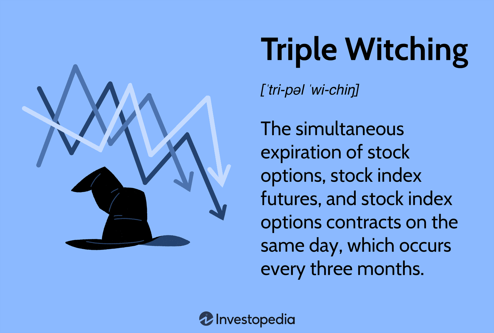

## Table of Contents

## What is triple witching?

Triple witching is a term used in the stock market. It happens on the third Friday of March, June, September, and December. On these days, three types of financial contracts expire at the same time. These contracts are stock options, index options, and index futures. Because of this, there can be a lot of trading activity and the market can be more volatile.

When these contracts expire, traders need to decide whether to buy or sell the underlying stocks. This can lead to big price swings. Many traders and investors watch triple witching days closely. They try to predict how the market will move and make their trading decisions based on that. It's an important event that can affect the whole market.

## When does triple witching occur?

Triple witching happens on the third Friday of March, June, September, and December. It's a big deal in the stock market because three types of financial contracts all expire on the same day. These contracts are stock options, index options, and index futures.

When these contracts expire, it can cause a lot of trading. Traders have to decide if they want to buy or sell the stocks that the contracts are based on. This can make the market move a lot and be more unpredictable. People who trade and invest pay close attention to these days because they can affect the whole market.

## What types of contracts expire during triple witching?

During triple witching, three types of financial contracts expire at the same time. These are stock options, index options, and index futures. Stock options give the holder the right to buy or sell a specific stock at a set price before the option expires. Index options are similar but are based on a stock market index, like the S&P 500. Index futures are agreements to buy or sell a stock index at a future date for a price agreed upon today.

When these contracts all expire on the same day, it can lead to a lot of trading. Traders need to decide whether to buy or sell the stocks that the contracts are based on. This can cause big price swings in the market. Because of this, triple witching days can be more unpredictable and volatile than other days. People who trade and invest often watch these days closely to see how the market might move.

## How does triple witching affect stock market volatility?

Triple witching can make the stock market more volatile because it's when three types of financial contracts all expire at the same time. These contracts are stock options, index options, and index futures. When they expire, traders have to decide if they want to buy or sell the stocks that the contracts are based on. This can lead to a lot of trading and big price swings in the market.

Because of this, the market can be more unpredictable on triple witching days. Traders and investors watch these days closely because they know the market might move a lot. They try to predict how the market will react and make their trading decisions based on that. It's an important event that can affect the whole market.

## What is the significance of the final hour of trading on triple witching days?

The final hour of trading on triple witching days is really important. It's when a lot of the action happens because that's when all the stock options, index options, and index futures expire. Traders have to make their final decisions about buying or selling the stocks that these contracts are based on. This can lead to a lot of trading and big price changes in the market.

Because of all this activity, the last hour can be very unpredictable. Traders and investors pay close attention to what's happening during this time. They try to guess how the market will move and make their trading choices based on that. It's a key time that can affect the whole market, so everyone watches it carefully.

## Can you explain the mechanics of options and futures expiring on the same day?

When options and futures expire on the same day, it's called triple witching. This happens on the third Friday of March, June, September, and December. Options are contracts that give you the right to buy or sell a stock at a certain price before they expire. Futures are agreements to buy or sell a stock index at a set price on a future date. When both of these contracts expire at the same time, it can cause a lot of trading because people have to decide what to do with their contracts.

This can make the stock market more unpredictable and volatile. Traders have to make their final decisions about buying or selling the stocks that the options and futures are based on. This can lead to big price swings in the market, especially in the last hour of trading. People who trade and invest watch this time closely because they know the market might move a lot. It's an important event that can affect the whole market.

## How do traders typically prepare for triple witching?

Traders get ready for triple witching by watching the market closely. They look at how the stocks and indexes are doing in the days and weeks before the big day. They try to guess how the market will move when the options and futures expire. Some traders might decide to close their positions early to avoid the big swings that can happen on triple witching days. Others might wait until the last minute to make their moves, hoping to take advantage of the price changes.

On the day of triple witching, traders pay extra attention to the last hour of trading. This is when a lot of the action happens because that's when the options and futures expire. Traders have to make their final decisions about buying or selling the stocks that the contracts are based on. This can lead to a lot of trading and big price changes in the market. Because of this, the market can be more unpredictable on triple witching days, so traders need to be ready for anything.

## What strategies can be employed to take advantage of triple witching?

Traders can use different strategies to take advantage of triple witching. One common strategy is to watch the market closely in the days and weeks before the event. They look at how stocks and indexes are doing and try to guess how the market will move when the options and futures expire. Some traders might decide to close their positions early to avoid the big swings that can happen on triple witching days. This way, they can lock in their profits or cut their losses before things get too wild.

Another strategy is to wait until the last minute to make moves. Some traders think they can make money by taking advantage of the big price changes that happen in the final hour of trading on triple witching days. They might buy or sell stocks quickly, hoping to make a quick profit from the market's ups and downs. This can be risky, but it can also be rewarding if they guess right. Either way, traders need to be ready for anything because triple witching can make the market more unpredictable.

## How does triple witching impact different market sectors?

Triple witching can affect different market sectors in different ways. Some sectors might see more trading and bigger price changes than others. This is because the options and futures that expire on triple witching days are based on different stocks and indexes. If a lot of the contracts are tied to stocks in a certain sector, like technology or finance, that sector might see more action. Traders might buy or sell a lot of stocks in that sector, which can make the prices go up and down a lot.

The impact on each sector can also depend on what's happening in the market and the economy at the time. If there's a lot of news or events that affect a certain sector, triple witching might make things even more unpredictable. For example, if there's a big news story about a tech company, the tech sector might see more trading and bigger price swings on triple witching day. Traders and investors need to watch what's happening in each sector closely to understand how triple witching might affect them.

## What historical data shows about market behavior during triple witching?

Historical data shows that the stock market can be more unpredictable and volatile on triple witching days. This is because a lot of trading happens when stock options, index options, and index futures all expire at the same time. Traders have to make quick decisions about buying or selling stocks, which can lead to big price swings. Studies have shown that the market often sees higher trading volumes and more [volatility](/wiki/volatility-trading-strategies) on these days. For example, the last hour of trading on triple witching days can be especially wild because that's when the contracts expire.

Looking at past triple witching days, it's clear that some sectors of the market can be affected more than others. If a lot of the expiring contracts are tied to stocks in a certain sector, like technology or finance, that sector might see more trading and bigger price changes. The impact can also depend on what's happening in the economy and the market at the time. If there's big news or events that affect a certain sector, triple witching might make things even more unpredictable. Overall, historical data helps traders and investors understand what to expect and how to prepare for these important days.

## How do institutional investors influence the market during triple witching?

Institutional investors, like big banks and investment firms, have a lot of power in the stock market. During triple witching, they can make the market move even more. They have a lot of money to spend, so when they buy or sell stocks, it can change the prices a lot. On triple witching days, they have to decide what to do with their options and futures contracts. If they decide to buy or sell a lot of stocks at the same time, it can make the market go up or down quickly.

Because of this, institutional investors can make triple witching days even more unpredictable. They might use special strategies to take advantage of the big price changes. For example, they might wait until the last minute to make their moves, hoping to make a quick profit. Other traders and investors watch what the big players are doing closely. They try to guess how the market will move based on what the institutional investors are doing. This can make the market even more exciting and unpredictable on triple witching days.

## What are the potential risks and rewards of trading during the final hour on triple witching days?

Trading during the final hour on triple witching days can be risky but also rewarding. The big risk is that the market can move a lot and be hard to predict. When options and futures expire, traders have to make quick decisions about buying or selling stocks. This can lead to big price swings. If you guess wrong, you could lose money fast. It's like trying to catch a fast-moving ball - if you miss, it can hurt.

On the other hand, the rewards can be big if you guess right. Some traders wait until the last minute to make their moves, hoping to make a quick profit from the market's ups and downs. If you can buy low and sell high in a short time, you can make a lot of money. It's like riding a roller coaster - it's scary, but if you stay on, you might have a thrilling ride and come out on top.

## References & Further Reading

[1]: Harris, L. (2003). ["Trading and Exchanges: Market Microstructure for Practitioners."](https://academic.oup.com/book/52292) Oxford University Press.

[2]: Lopez de Prado, M. (2018). ["Advances in Financial Machine Learning."](https://www.amazon.com/Advances-Financial-Machine-Learning-Marcos/dp/1119482089) Wiley.

[3]: Chan, E. P. (2008). ["Quantitative Trading: How to Build Your Own Algorithmic Trading Business."](https://github.com/ftvision/quant_trading_echan_book) Wiley.

[4]: Aronson, D. (2007). ["Evidence-Based Technical Analysis: Applying the Scientific Method and Statistical Inference to Trading Signals."](https://www.amazon.com/Evidence-Based-Technical-Analysis-Scientific-Statistical/dp/0470008741) Wiley.

[5]: Jansen, S. (2020). ["Machine Learning for Algorithmic Trading: Explore Intuitive Algorithms to Leverage Machine Learning Techniques and Reinforcement Learning to Design Smarter Trading Systems."](https://www.amazon.com/Machine-Learning-Algorithmic-Trading-intelligence/dp/1789346416) Packt Publishing.