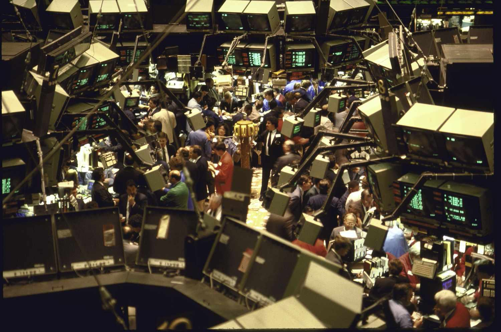

Triple witching is a phenomenon in the stock market that occurs when the expiration of stock options, stock index futures, and stock index option contracts coincide on a single trading day. This event takes place quarterly on the third Friday of March, June, September, and December. Triple witching is significant due to its tendency to cause substantial changes in trading volumes and market volatility. As traders prepare to close or roll over their positions to the next expiration date, the market can experience substantial fluctuations in price, leading to increased activity and volatility. 

Triple witching is particularly relevant for traders, investors, and financial analysts as it can create both risks and opportunities. On these days, traders might notice increased volatility as the expiration of these derivatives often leads to large volumes of contract buying and selling. This heightened activity can cause abrupt price movements in the underlying assets. These swings can be attributed to traders adjusting hedges, closing positions, or speculative trading, creating an environment ripe for significant market movements.



Algorithmic trading, defined as the use of electronic systems to execute trades based on predetermined criteria, has become increasingly prevalent in modern financial markets. Leveraging sophisticated algorithms, these systems can process vast amounts of data and execute trades at speeds significantly surpassing human capabilities. The growing reliance on algorithmic trading is marked by its capacity to enhance trade execution efficiency, reduce the cost of transactions, and manage large-scale trades with precision. 

The purpose of this article is to explore the impact of triple witching on algorithmic trading strategies. By understanding how these expiration events influence market dynamics, traders and financial strategists can better adapt their approaches to capture potential opportunities or mitigate risks. This discussion is particularly pertinent given the increasing complexity and volume of algorithmically executed trades.

In this article, we will examine various aspects of triple witching and its effects on trading behavior and market conditions. Subsequent sections will provide an in-depth explanation of triple witching, analyze its impact on market volatility, and offer an overview of algorithmic trading, including its benefits and challenges. We will also explore specific algorithmic trading strategies employed during triple witching days and discuss potential risks and future developments as technology and market conditions evolve. The article aims to equip readers with a comprehensive understanding of how market events like triple witching can shape algorithmic trading strategies.

## Table of Contents

## Understanding Triple Witching

Triple witching refers to the simultaneous expiration of stock options, stock index futures, and stock index option contracts, occurring four times a year on the third Friday of March, June, September, and December. These expiration events mark significant dates in the financial calendar because they often result in heightened trading activity, increased volatility, and strategic repositioning by investors and traders.

The historical context of these days traces back to when options and futures markets were developing and gaining prominence. As derivative products became more integrated into trading strategies, the alignment of their expirations began to influence market behavior more noticeably. The term "witching" reflects the unpredictable nature of market movements on these days, reminiscent of the chaotic outcomes associated with witchcraft in folklore.

During triple witching days, the convergence of multiple derivatives reaching expiration often leads to a phenomenon called "pin risk". Pin risk arises when the price of the underlying asset is close to the strike price of numerous options contracts, creating a push-and-pull effect as traders contend with whether to exercise, close out, or roll their positions. Such dynamics contribute to atypically high trading volumes and can result in rapid price swings as market participants react to both the opportunities and risks presented.

In comparison to standard trading days, triple witching days distinguish themselves through their potential to distort typical market conditions. Regular trading days experience organic price and [volume](/wiki/volume-trading-strategy) changes driven by fundamental news, economic data releases, and technical factors. In contrast, triple witching days are characterized by the [liquidity](/wiki/liquidity-risk-premium)-driven forces associated with large-scale derivative contract settlements. The balancing of portfolios, unwinding of hedges, and strategic realignment by market participants, such as institutional investors and hedge funds, magnify the impact of these days.

Understanding the mechanics of triple witching and its implications is crucial for traders and investors. Recognizing the patterns associated with these days can guide more informed decision-making and risk management. Despite the challenges they pose, triple witching days offer unique opportunities for those with strategies designed to capitalize on [volatility](/wiki/volatility-trading-strategies) and volume spikes inherent to these expiration events.

## The Impact of Triple Witching on Market Volatility

Triple witching, occurring quarterly on the third Friday of March, June, September, and December, is marked by the simultaneous expiration of stock options, stock index futures, and stock index option contracts. This convergence often results in a remarkable increase in trading volumes and market volatility due to the massive number of derivative contracts reaching their maturity. 

During triple witching days, trading volumes can swell significantly, sometimes doubling compared to regular days. This surge is driven by traders and investors rebalancing, rolling over, or closing out their expiring positions. The closing minutes of the trading day, often called the "triple witching hour," typically see the highest levels of activity. 

The implications for liquidity are multifaceted. On the positive side, the heightened trading volumes can improve liquidity in certain market segments, making it easier for traders to execute large orders without adversely affecting the asset’s price. Increased liquidity can help narrow bid-ask spreads, providing a more efficient pricing mechanism. However, the downside is that this temporary surge can also lead to liquidity shortages in thinly traded stocks or options, leading to price distortions and increased costs for executing trades.

Statistical analysis of triple witching days often shows a spike in both volume and volatility. For instance, historical data from the New York Stock Exchange (NYSE) and the Chicago Mercantile Exchange (CME) corroborate these patterns, demonstrating that average trading volumes tend to increase by approximately 60-120% on triple witching days compared to non-witching Fridays. Volatility metrics, such as the VIX—a popular measure of the stock market's expectation of volatility—tend to increase as well, indicating a more tumultuous trading environment.

Here is a Python snippet to illustrate the significant volume change using hypothetical data:

```python
import matplotlib.pyplot as plt

# Hypothetical volume data
dates = ['Week1', 'Week2', 'Triple Witching', 'Week4']
volumes = [1000000, 1200000, 2800000, 1100000]

plt.bar(dates, volumes, color=['blue', 'blue', 'red', 'blue'])
plt.title('Trading Volume During a Triple Witching Month')
plt.ylabel('Volume (in millions)')
plt.xlabel('Weeks')
plt.show()
```

Investors react in diverse ways during these volatile periods. Institutional investors and hedge funds often adopt more aggressive strategies to profit from the volatility, such as using [algorithmic trading](/wiki/algorithmic-trading) to exploit minute price discrepancies or enhance order execution through advanced techniques like [market making](/wiki/market-making) or [arbitrage](/wiki/arbitrage). Retail investors, conversely, might either hold back due to the increased risk or actively engage, attempting to capture gains from short-term price swings.

Overall, the triple witching day phenomenon underscores the dynamic nature of financial markets, where large-scale expirations and contract settlements exert profound effects on market behavior, necessitating a strategic approach by market participants to navigate periods of heightened volatility.

## Algorithmic Trading: An Overview

Algorithmic trading, often referred to as algo trading, involves the use of computer algorithms to execute trading orders. These algorithms employ a set of pre-defined instructions or rules based on various market parameters such as price, timing, and volume. By leveraging the speed and efficiency of computers, algorithmic trading allows for decision-making and trade execution at a pace that is unattainable manually, playing a crucial role in modern financial markets by enhancing market liquidity and efficiency.

The technologies in algorithmic trading primarily consist of high-frequency trading systems, [statistical arbitrage](/wiki/statistical-arbitrage) models, and [machine learning](/wiki/machine-learning) algorithms. High-frequency trading ([HFT](/wiki/high-frequency-trading-strategies)) employs sophisticated algorithms to execute a large number of orders at extremely high speeds, often exploiting minute price discrepancies across different markets. Statistical arbitrage, on the other hand, involves strategies that use statistical and econometric techniques to identify and exploit pricing inefficiencies between correlated financial instruments. Machine learning, an increasingly popular component of algorithmic trading, allows for the development of adaptive algorithms that improve decision-making processes by learning from historical market data.

Algorithmic trading offers numerous advantages over traditional trading methods. Firstly, it increases the speed and accuracy of trade execution, minimizing the risk of significant market impact and allowing traders to capitalize on fleeting market opportunities. Secondly, it reduces transaction costs by optimizing the timing and size of trades, thereby improving overall trading efficiency. Thirdly, algorithmic trading can operate continuously without human intervention, providing consistent and objective trade execution that is not susceptible to human emotions or biases.

Despite its advantages, algorithmic trading faces notable challenges, especially during periods of high market volatility. One primary challenge is the risk of slippage, which occurs when an order is executed at a worse price than expected due to rapid market movements. Another challenge is the susceptibility to execution errors, such as incorrect order sizes or directions, mostly stemming from software bugs or network delays. Furthermore, during volatile periods, the efficacy of predictive models can diminish due to increased market unpredictability, leading to potential losses.

In summary, while algorithmic trading stands as a cornerstone of modern financial markets with its speed, efficiency, and cost-effectiveness, it also presents significant challenges that must be adeptly managed, particularly in turbulent market conditions.

## Algorithmic Trading Strategies During Triple Witching

Algorithmic trading during triple witching days requires strategies that can effectively handle the increased volatility and trading volumes associated with these events. Algorithms often employ statistical and computational techniques to capitalize on short-term trading opportunities while mitigating risks.

### Specific Algorithmic Strategies

1. **Market Making and Arbitrage Strategies**: These strategies are prevalent during triple witching due to the heightened liquidity and price discrepancies. Market making involves quoting both buy and sell prices in a security to capture the spread, while arbitrage exploits price differences of similar or related financial instruments. The algorithms are designed to execute trades swiftly to capitalize on fleeting opportunities.

2. **Trend Following and Momentum Strategies**: Given the volatility spikes during triple witching, trend following strategies can be adapted to respond to rapid price movements. Algorithms are programmed to identify and follow short-term price trends, capitalizing on momentum before volatility subsides. 

3. **Volatility Arbitrage**: This strategy focuses on exploiting the difference between implied and realized volatility. Algorithms assess options pricing models to identify mispriced options and execute trades that aim to profit from corrections in volatility pricing.

### Role of Speed and Accuracy

Speed and accuracy are crucial in managing the risks associated with triple witching. The ability to process large datasets quickly and execute trades at optimal prices offers a competitive edge. High-frequency trading (HFT) systems are often used, leveraging low-latency connections and sophisticated algorithms to minimize slippage and optimize trade execution.

### Impact of Increased Volatility

While increased volatility can present trading opportunities, it also poses challenges for algorithms. Volatility can lead to wider spreads, increased slippage, and potential mispricing. Algorithms must be robustly tested to manage these scenarios, incorporating risk management techniques such as dynamic stop-loss orders and real-time risk assessment models.

### Case Studies and Examples

Historically, several instances highlight successful algorithmic navigation of triple witching days. For example, a firm employing a [momentum](/wiki/momentum)-based strategy might have adjusted its algorithms to tighter timeframes, enabling it to capture short-lived price movements. In contrast, another firm might have utilized machine learning models to predict volatility changes and adjust its positioning accordingly.

These strategies demonstrate the adaptability and precision required for algorithmic trading during periods of market stress and excitement. As market conditions evolve, continuous refinement of these algorithms ensures their efficacy in navigating the complexities introduced by triple witching.

## Challenges and Risks for Algo Traders

Algorithmic traders face several challenges on triple witching days due to heightened market activity and increased volatility. These challenges include slippage, execution errors, unexpected market movements, and regulatory considerations, all of which can significantly impact trading strategies.

**Slippage**

Slippage occurs when a trade is executed at a price different from the expected price. On triple witching days, the surge in trading volumes often leads to rapid price changes, causing orders to be filled at less favorable prices. This can disrupt the timing and profitability of algorithmic trading strategies designed to operate within specific price thresholds. Mitigating slippage requires employing adaptive algorithms capable of dynamically adjusting order sizes and entry points based on real-time market conditions.

**Execution Errors**

Execution errors are more prevalent during periods of elevated trading activity, such as triple witching days. These errors can result from system overloads or latency issues, leading to untimely or incorrect order execution. To address this, traders can distribute their orders across multiple execution venues and implement robust order management systems. Additionally, continuous stress-testing of trading systems ensures resilience under extreme market conditions.

**Unexpected Market Movements**

Triple witching days can bring about unexpected market movements due to the simultaneous expiration of multiple derivative contracts. This can lead to rapid shifts in supply and demand, impacting asset prices unpredictably. Algorithmic trading systems must incorporate sophisticated risk management protocols, potentially utilizing machine learning models to identify and respond to unusual market patterns swiftly. Employing hedging strategies can also offset potential losses from unforeseen price swings.

**Regulatory Considerations**

Regulatory bodies impose guidelines to ensure market stability and integrity, especially during volatile periods like triple witching days. Algorithms must comply with regulations pertaining to order execution, market manipulation, and transparency. Violations can result in penalties or trading restrictions. It's crucial for traders to regularly update their algorithms to reflect evolving regulatory standards and to perform thorough compliance testing.

**Risk Mitigation Strategies**

To mitigate these risks effectively, algorithmic traders can implement several strategies:

1. **Enhanced Monitoring:** Deploy real-time monitoring tools to track market conditions and the performance of trading algorithms. This allows for immediate intervention if anomalies are detected.

2. **Algorithm Optimization:** Regularly backtest and optimize algorithms to ensure they remain effective across different market environments, including high-volatility scenarios like triple witching days.

3. **Dynamic Position Sizing:** Adjust position sizes dynamically based on predicted market volatility to minimize exposure during adverse conditions.

4. **Diversification:** Spread investments across a range of assets and markets to reduce the impact of specific market events on the overall portfolio.

By understanding and addressing these challenges, algorithmic traders can enhance their resilience and improve performance during the disruptive periods associated with triple witching days.

## The Future of Triple Witching and Algo Trading

The landscape of financial markets is continuously evolving, with triple witching and algorithmic trading both proving crucial in shaping their future. As technology advances, the impact of triple witching is likely to transform, driven by several key factors.

Algorithmic trading is poised for significant advancements that may redefine its role during triple witching days. Innovations in trading algorithms are expected to enhance their efficiency and adaptability in handling large volumes and high volatility. One area of potential growth involves the integration of [artificial intelligence](/wiki/ai-artificial-intelligence) (AI) and machine learning algorithms, which offer the ability to discern complex patterns and adapt to unforeseen market changes. These technologies can improve the prediction of price movements, optimize execution strategies, and manage risks more effectively.

The deployment of AI and machine learning during triple witching days presents an opportunity to fine-tune the precision of trading strategies. Machine learning models, such as neural networks, can process vast amounts of historical market data and identify correlations that may not be immediately apparent to human traders. These models can continuously update and refine trading strategies based on real-time data, presenting a more dynamic approach to managing volatility.

```python
import numpy as np
from sklearn.linear_model import LinearRegression

# Example of a simple linear regression model for predicting price movement
# Assuming 'features' is a matrix of predictive indicators and 'prices' is the historical price movement

model = LinearRegression()
features = np.array([
    # Sample feature data
])
prices = np.array([
    # Sample price data
])

# Fitting the model
model.fit(features, prices)

# Predicting future price movement
predictions = model.predict(features)
```

Despite the potential of fully automated trading systems, human oversight remains vital to ensuring robustness, especially on high-stakes days like triple witching. A balanced approach that includes both human and machine intelligence could mitigate risks associated with unforeseen market events. Human traders bring intuition and the ability to interpret qualitative information, which complements the quantitative strengths of algorithms.

The future may also see increased regulatory scrutiny, necessitating transparent and accountable algo trading practices. Regulations could impact how algorithms operate, particularly concerning risk management and order execution.

Predicting the precise trajectory of triple witching and algo trading involves navigating uncertainties. However, continuous innovation and balanced integration of technology and human expertise are essential to successfully leveraging these market dynamics. As algorithms become more sophisticated, the capacity to manage and capitalize on triple witching days could see a further evolutionary leap, heralding a new era of strategic trading practices.

## Conclusion

Triple witching plays a pivotal role in shaping the landscape of algorithmic trading strategies. Its impact on market volatility and trading volumes necessitates a deep understanding of how these days differ from typical trading days. This comprehension allows algorithmic traders to tailor their strategies effectively, not just to mitigate risks but also to capitalize on the opportunities presented by the heightened trading activity.

The dynamic nature of financial markets underscores the critical importance of continuous innovation and adaptation in algorithmic trading. As market conditions evolve, so too must the algorithms that seek to navigate them. The rapid advancements in technology, particularly in AI and machine learning, provide traders with sophisticated tools to enhance the accuracy and efficiency of their trading systems. These technologies are crucial for adjusting to the rapid market shifts that can occur during triple witching days, enabling traders to maintain an edge.

Traders must remain informed and proactive about changes in market conditions and trading technologies. This awareness is vital not only for reacting to immediate market phenomena but also for anticipating future trends and challenges. By staying abreast of developments, traders can ensure their strategies are robust, flexible, and capable of delivering sustained performance even in highly dynamic environments.

To maintain a strategic advantage in trading, it is essential to balance technological innovation with robust risk management practices. This approach allows traders to handle the complexities of triple witching days effectively. Emphasizing the alliance of advanced technology with strategic foresight and adaptability can empower traders to thrive in an era of rapid change and uncertainty in financial markets.

## References & Further Reading

[1]: Harris, L. (2003). ["Trading and Exchanges: Market Microstructure for Practitioners."](https://academic.oup.com/book/52292) Oxford University Press.

[2]: Lopez de Prado, M. (2018). ["Advances in Financial Machine Learning."](https://www.amazon.com/Advances-Financial-Machine-Learning-Marcos/dp/1119482089) Wiley.

[3]: Chan, E. P. (2008). ["Quantitative Trading: How to Build Your Own Algorithmic Trading Business."](https://github.com/ftvision/quant_trading_echan_book) Wiley.

[4]: Aronson, D. (2007). ["Evidence-Based Technical Analysis: Applying the Scientific Method and Statistical Inference to Trading Signals."](https://www.amazon.com/Evidence-Based-Technical-Analysis-Scientific-Statistical/dp/0470008741) Wiley.

[5]: Jansen, S. (2020). ["Machine Learning for Algorithmic Trading: Explore Intuitive Algorithms to Leverage Machine Learning Techniques and Reinforcement Learning to Design Smarter Trading Systems."](https://www.amazon.com/Machine-Learning-Algorithmic-Trading-intelligence/dp/1789346416) Packt Publishing.