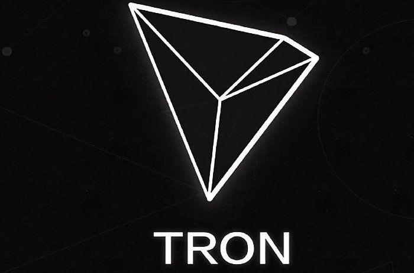

## Table of Contents

## What is TRON (TRX) and its primary purpose?

TRON (TRX) is a type of cryptocurrency that was created to help people share digital content like videos and music more easily. It was started by a company called TRON Foundation, which wants to build a platform where creators can share their work directly with their audience without needing big companies in the middle. This means that artists and creators can keep more of the money they earn from their content.

The main goal of TRON is to make a fair and open internet where everyone can use and share digital content freely. They do this by using something called blockchain technology, which is like a big, secure notebook that keeps track of all the transactions and content sharing on the platform. By using TRX, people can pay for content or get paid for sharing their own content, all without needing a bank or a big company to handle the money.

## Who founded TRON and when was it launched?

TRON was founded by a man named Justin Sun. He is from China and wanted to make a new way for people to share things like music and videos online. Justin Sun used to work at a big company called Ripple, which also deals with money and technology. He decided to start TRON because he thought there should be a better way for creators to share their work and get paid for it.

TRON was launched in 2017. That's when it first became available for people to use and buy the TRX cryptocurrency. Since then, TRON has grown a lot and now many people around the world use it to share content and earn money from their creations.

## How does the TRON blockchain work?

The TRON blockchain is like a big, shared notebook that keeps track of everything that happens on the TRON platform. It uses something called a decentralized system, which means there's no one big boss in charge. Instead, lots of computers all over the world work together to keep the notebook safe and up to date. When someone wants to share content or send TRX to someone else, they make a record of it in the notebook. This record is called a transaction, and it gets checked by the other computers to make sure it's correct. Once everyone agrees, the transaction gets added to the notebook and can't be changed.

To make sure the TRON blockchain runs smoothly, it uses a special way of choosing which computers get to add new records to the notebook. This method is called Delegated Proof of Stake (DPoS). In DPoS, people who own TRX can vote for certain computers, called "super representatives," to help manage the blockchain. These super representatives are responsible for adding new transactions to the notebook and keeping everything running smoothly. By using DPoS, TRON can process transactions quickly and cheaply, which makes it easier for people to use the platform to share content and earn money.

## What are the key features of the TRON network?

The TRON network has some important features that make it special. One of the main features is its speed and low cost. TRON can process transactions very quickly and it doesn't cost a lot to use, which is great for people who want to share content and get paid without spending too much money. Another key feature is its use of Delegated Proof of Stake (DPoS). This system lets people who own TRX vote for super representatives who help manage the network. It makes the network run smoothly and fairly.

Another important feature of TRON is its focus on helping content creators. The network is designed so that artists, musicians, and other creators can share their work directly with their audience and get paid for it without needing big companies in the middle. This means creators can keep more of the money they earn. TRON also uses smart contracts, which are like automatic agreements that can do things like pay creators when someone buys their content. This makes it easier for everyone to use the platform and trust that they will get paid fairly.

## How can someone acquire TRX tokens?

Someone can acquire TRX tokens by buying them on a cryptocurrency exchange. These are websites where people can trade different types of cryptocurrencies. To do this, you first need to sign up for an account on an exchange that supports TRX, like Binance or Huobi. Once you have an account, you can deposit money into it, usually in the form of another cryptocurrency like Bitcoin or Ethereum, or sometimes even with regular money like dollars. After that, you can use the exchange's trading platform to buy TRX with your deposited funds.

Another way to get TRX tokens is through a process called "mining," but this is a bit more complicated. On the TRON network, mining isn't about solving math problems like in some other cryptocurrencies. Instead, it's about being a super representative or voting for them. If you own TRX, you can vote for super representatives, and if they get chosen, you might earn more TRX as a reward. This method requires you to already have some TRX, so it's more of a way to increase your holdings rather than a way to get your first TRX tokens.

## What is the role of TRX in the TRON ecosystem?

TRX is the main money used in the TRON ecosystem. It's like the dollars or euros of the TRON world. People use TRX to buy and sell things on the platform, like music, videos, or other digital content. When someone wants to watch a video or listen to a song, they can pay for it with TRX. And when someone shares their own content, they can get paid in TRX. This makes it easy for everyone to use the platform without needing to use regular money or go through banks.

TRX also helps keep the TRON network running smoothly. People who own TRX can vote for super representatives, who are important for managing the network. These super representatives help add new transactions to the blockchain and make sure everything works well. By voting and helping choose these representatives, people with TRX play a big part in how the TRON network is run. This makes TRX not just a way to buy things, but also a way to be involved in the TRON community.

## What are some popular applications built on the TRON blockchain?

One popular application built on the TRON blockchain is BitTorrent. BitTorrent is a way for people to share files like movies, music, and games over the internet. It's been around for a long time, but now it uses TRON's technology to make sharing even easier and faster. With BitTorrent on TRON, people can also use TRX to pay for things or get paid for sharing their files. This makes it a cool way for creators to share their work and earn money directly from their fans.

Another popular app on the TRON blockchain is JustSwap. JustSwap is like a big online store where people can trade different types of cryptocurrencies. It's easy to use and doesn't cost a lot of money to make trades. JustSwap uses TRON's fast and cheap transactions to help people swap their TRX for other cryptocurrencies or vice versa. This makes it a handy tool for anyone who wants to use different kinds of digital money on the TRON network.

## How does TRON handle scalability and transaction speed?

TRON handles scalability and transaction speed really well. It uses a special system called Delegated Proof of Stake (DPoS) to make sure transactions happen quickly. In DPoS, people who own TRX can vote for super representatives. These super representatives are in charge of adding new transactions to the blockchain. Because only a few super representatives are chosen to do this job, the network can process transactions much faster than if everyone had to agree on every transaction.

This system also helps TRON handle a lot of transactions at the same time. With DPoS, TRON can process thousands of transactions per second. This is much faster than many other blockchains. Because it's so fast and can handle so many transactions, TRON is great for things like sharing content and making payments. It makes the whole process smooth and easy for everyone using the platform.

## What is the TRON Virtual Machine (TVM) and its significance?

The TRON Virtual Machine, or TVM, is like a special computer inside the TRON network. It helps run smart contracts, which are like automatic agreements that do things on their own when certain conditions are met. For example, a smart contract can automatically pay a creator when someone buys their content. The TVM makes sure these smart contracts work correctly and safely on the TRON blockchain.

The TVM is really important because it makes the TRON network more useful and flexible. It lets developers create all sorts of apps and games that can run on TRON. Because the TVM is fast and doesn't cost a lot to use, it's easier for people to build and use these apps. This helps make TRON a popular place for creators and developers to share their work and earn money.

## How does TRON's governance model work?

TRON's governance model is all about letting the people who own TRX have a say in how the network is run. They do this through a system called voting. People who own TRX can vote for super representatives, who are like the leaders of the network. These super representatives are in charge of adding new transactions to the blockchain and making sure everything runs smoothly. By voting, TRX owners can help choose who gets to be a super representative, which means they have a big part in deciding how TRON works.

This voting system makes TRON a fair and open place. It's not just a few people making all the decisions; it's everyone who owns TRX. This way, the network can change and grow based on what the community wants. It also helps keep the network safe and trustworthy because the super representatives are chosen by the people who use TRON. So, everyone has a voice in how the TRON network is managed and can help make it better for everyone.

## What are the future development plans for TRON?

TRON has big plans for the future. They want to keep making their network faster and easier to use. One of their main goals is to help more creators share their work and earn money directly from their fans. They're working on new tools and apps that will make it even simpler for people to create and share content on the TRON platform. They also want to make sure that the network stays safe and secure, so they're always looking for ways to improve their technology.

Another important part of TRON's future plans is to grow their community. They want more people to use TRON and be part of their ecosystem. To do this, they're working on partnerships with other companies and projects that can help bring more users to the platform. They're also focusing on education, so they can teach more people about how to use TRON and why it's a good choice for sharing and earning from digital content. By doing all these things, TRON hopes to become an even bigger and better place for creators and users around the world.

## How does TRON compare to other blockchain platforms like Ethereum?

TRON and Ethereum are both blockchain platforms, but they have some big differences. One main difference is how fast and cheap they are. TRON is known for being really fast and not costing a lot to use. It can handle thousands of transactions per second, which is much faster than Ethereum. This makes TRON a good choice for things like sharing content and making quick payments. Ethereum, on the other hand, can be slower and more expensive, but it's been around longer and has a lot of apps and projects built on it.

Another big difference is how they handle their networks. TRON uses a system called Delegated Proof of Stake (DPoS), where people who own TRX can vote for super representatives to help manage the network. This makes the network run smoothly and lets everyone have a say in how it's run. Ethereum uses a different system called Proof of Stake (PoS), where people can earn rewards for helping keep the network safe. Both systems have their own benefits, but TRON's DPoS is designed to be faster and more efficient.

## References & Further Reading

[1]: Junius Ho. (2019). ["TRON: Decentralize the Web"](https://tron.network/) - TRON Whitepaper. 

[2]: Antonopoulos, A. M. (2017). ["Mastering Bitcoin: Unlocking Digital Cryptocurrencies"](https://books.google.com/books/about/Mastering_Bitcoin.html?id=IXmrBQAAQBAJ) - O'Reilly Media.

[3]: Lewis, A. (2018). ["The Basics of Bitcoins and Blockchains"](https://www.amazon.com/Basics-Bitcoins-Blockchains-Introduction-Cryptocurrencies/dp/1633538001) - Mango Publishing.

[4]: Marr, B. (2016). ["Big Data in Practice"](https://onlinelibrary.wiley.com/doi/book/10.1002/9781119278825) - Wiley.

[5]: Tapscott, D., & Tapscott, A. (2016). ["Blockchain Revolution: How the Technology Behind Bitcoin and Other Cryptocurrencies is Changing the World"](https://www.amazon.com/Blockchain-Revolution-Technology-Cryptocurrencies-Changing/dp/1101980141) - Portfolio.

[6]: ["Bitcoin and Cryptocurrency Technologies"](https://www.coursera.org/learn/cryptocurrency) by Arvind Narayanan, Joseph Bonneau, Edward Felten, Andrew Miller, Steven Goldfeder