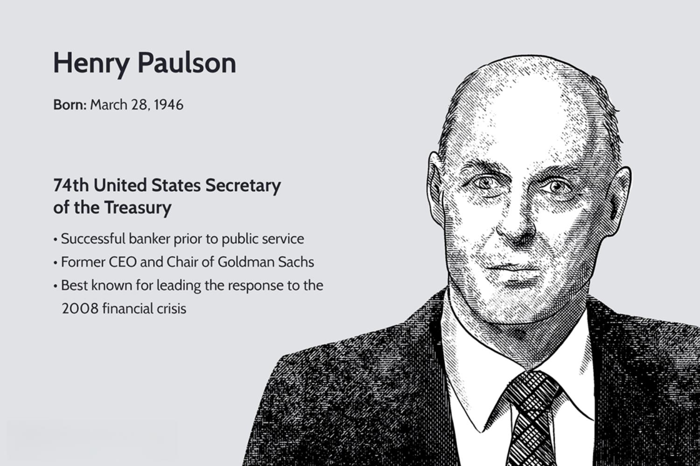

The 2008 financial crisis marked a defining moment in economic history, characterized by extraordinary disruptions in global markets and a shattered trust in financial institutions. The shockwaves of this crisis reverberated across economies, prompting government interventions of a scale and scope not seen in recent history. Central to these interventions was the Troubled Asset Relief Program (TARP), a controversial yet pivotal initiative introduced to stabilize the financial sector at a critical juncture.

TARP was launched with the aim of purchasing distressed assets and injecting capital into key financial institutions to avert a complete systemic collapse. While its conception was marred by public skepticism and criticism, the program represented a decisive action by the U.S. government to restore confidence in a faltering financial system. By addressing the immediate liquidity needs and the toxic assets clogging the financial pipes, TARP sought to prevent a deeper economic downturn.



This article will explore TARP's role in the financial crisis, shedding light on its economic implications and the ripple effect it had on global financial practices. The intricate relationship between TARP's implementation and the emergence of algorithmic trading as a technological response is particularly significant. Algorithmic trading, with its reliance on complex models and rapid execution capabilities, has since become a mainstay in modern financial markets.

Understanding TARP is crucial for comprehending the interconnectedness of global markets and the evolution of trading technologies that followed. As financial institutions grappled with the repercussions of the crisis, the rise of algorithmic trading marked a technological shift aimed at achieving greater efficiencies and risk management. This section sets the stage for a comprehensive analysis of TARP, its criticisms, its contributions to economic recovery, and its lasting influence on financial regulation and technology. As we dissect these components, the lessons learned from TARP provide valuable insights into the balance between government intervention and market dynamics in navigating economic crises.

## Table of Contents

## The Genesis and Objectives of TARP

The Troubled Asset Relief Program (TARP) was created in response to the financial crisis of 2008, aiming to stabilize the faltering financial system of the United States. The onset of the crisis saw financial institutions grappling with 'toxic' assets—primarily subprime mortgages—that threatened to precipitate a systemic collapse. TARP was legislated under the Emergency Economic Stabilization Act of 2008, signed into law by President George W. Bush on October 3, 2008. The program authorized the United States Department of the Treasury to purchase up to $700 billion in troubled assets to restore liquidity and enable affected institutions to resume lending.

The primary objective of TARP was to bolster confidence in the financial sector and facilitate economic stability. Initially, the plan focused on buying distressed mortgage-backed securities (MBS) and other illiquid assets from financial institutions. These 'toxic' assets severely undermined the balance sheets of banks, threatening their solvency and, by extension, the broader financial system. By removing these assets, TARP aimed to reduce uncertainty and foster a robust credit market. This involvement was seen as crucial to arrest the downward economic spiral and prevent a more profound financial depression.

The Troubled Asset Relief Program, however, underwent significant modification shortly after its inception. Instead of primarily purchasing toxic assets, the program shifted towards recapitalizing financial institutions through direct equity investments. This operational pivot was largely motivated by the realization that directly injecting capital would more efficiently stabilize institutions’ balance sheets while simultaneously supporting lending operations. Under the Capital Purchase Program (CPP), a component of TARP, the Treasury invested directly in banks by purchasing preferred stock, thereby providing these entities with the necessary capital buffer to absorb losses and facilitate economic recovery.

Overall, TARP's flexible implementation was pivotal in addressing the immediate [liquidity](/wiki/liquidity-risk-premium) crisis facing financial institutions and quelling widespread panic in financial markets. Its evolution from purchasing toxic assets to recapitalizing banks underscores the complexity of economic interventions during periods of financial turmoil and the need for agile policy responses.

## Economic Impact and Criticism of TARP

The Troubled Asset Relief Program (TARP) was a seminal intervention during the 2008 financial crisis, with over $400 billion deployed to stabilize the banking system. Its economic impact and the ensuing criticisms remain a subject of significant debate.

Critics of TARP argue that the program failed to adequately address the housing crisis, which was a central element of the financial turmoil. The initiative primarily focused on injecting capital into large financial institutions that were deemed "too big to fail," which led to perceptions of it being a bailout for Wall Street at the expense of ordinary taxpayers. Many believed that TARP disproportionately benefited large banks while doing little to prevent foreclosures or aid struggling homeowners. There was a widespread view that the program favored financial institutions over individual borrowers, perpetuating inequality and failing to provide immediate relief to those most affected by the crisis.

Conversely, proponents of TARP contend that it was a crucial step in preventing a more severe economic depression. By providing financial stability to key institutions, TARP helped to sustain credit flow and restore some measure of confidence in the financial markets. The program potentially averted the collapse of major banks, which could have led to a wider systemic failure. Furthermore, supporters highlight that TARP ultimately recouped a significant portion of its investments. According to official U.S. Treasury reports, by 2014, the U.S. government had earned $441.7 billion back from TARP outlays, thus recovering more than the initial expenditures. This outcome was interpreted by some as evidence of TARP's financial soundness and effectiveness in limiting taxpayers' exposure to losses.

While the discussion around TARP's success and shortcomings continues, this dichotomy demonstrates the complexities inherent in large-scale government interventions in economic crises. The program's legacy is seen in its immediate impact on financial stability and the broader historical debate over government roles in economic stabilization.

## Legacy of TARP in the Regulatory Framework

The Troubled Asset Relief Program (TARP), established in response to the 2008 financial crisis, played a significant role in shaping the regulatory landscape that emerged in its aftermath. As a pivotal component of the U.S. government's strategy to stabilize the financial sector, TARP provided a template for future interventions and spurred important regulatory changes. One of the most significant outcomes influenced by TARP was the enactment of the Dodd-Frank Wall Street Reform and Consumer Protection Act in 2010. This comprehensive piece of legislation aimed to prevent the recurrence of a similar financial crisis by enhancing the regulatory framework governing financial institutions. 

TARP's implementation underscored the necessity for increased oversight and transparency within the financial sector. Right from the outset, there was a clear recognition of the lack of stringent regulatory mechanisms that allowed the risky practices which contributed to the crisis. One of the objectives of TARP was to inject capital into banks to prevent systemic failure; however, it also brought to light the opaqueness in bank operations and the inadequate levels of accountability at various financial entities.

The experience with TARP revealed that government interventions could be instrumental in managing economic crises, yet they required careful execution and monitoring to minimize misuse and ensure their intended effectiveness. The controversy that surrounded TARP, stemming from debates over its implementation and the perception that it primarily benefited large financial institutions, highlighted the critical need for a balanced approach in policy-making. TARP thus emphasized the importance of risk management and preventive measures within financial regulatory frameworks.

In the regulatory reforms that followed, including the Dodd-Frank Act, there was an enhanced focus on supervising financial institutions' activities, reducing systemic risk, and protecting consumers. Measures such as the establishment of the Financial Stability Oversight Council (FSOC) and the Consumer Financial Protection Bureau (CFPB) were direct outcomes aiming to rectify the regulatory gaps exposed by the crisis and TARP's deployment.

Moreover, TARP's legacy in regulatory reforms continues to be reflected in the ongoing discussions about financial stability, market integrity, and the balance between innovative financial products and risk. The program highlighted the dual necessity of government intervention during financial turmoil and the indispensable need for robust regulatory systems to enforce transparency and accountability in the financial industry. As financial markets evolve, the insights gained from TARP remain crucial for developing strategies that safeguard against future economic disruptions.

## Algorithmic Trading: A Technological Response to Financial Crises

The financial crisis of 2008 catalyzed significant changes in financial market practices, most notably the rapid adoption of [algorithmic trading](/wiki/algorithmic-trading). This method leverages complex algorithms and substantial computing power to execute trades at enhanced speeds and with increased precision. As traditional trading methods struggled to cope with the volatile and rapidly changing market conditions during the crisis, algorithmic trading emerged as an efficient means of managing risk and seizing market opportunities.

Algorithmic trading utilizes advanced quantitative models to analyze vast datasets, identifying trading opportunities unavailable to human traders due to their complexity or speed. One of the primary advantages of algorithmic trading is its ability to minimize the impact of human emotion and error on trading decisions. This is achieved through the automation of pre-defined trading strategies, which are executed based on specific market signals without the need for human intervention.

To understand the operational mechanism of algorithmic trading, consider a simple moving average crossover strategy. This strategy might involve buying a financial asset when its short-term moving average exceeds the long-term moving average and selling when the opposite occurs. The algorithm is programmed to monitor these moving averages continuously and execute trades as soon as the crossover is detected, far faster than a human trader could respond.

```python
def moving_average(data, window_size):
    return data.rolling(window=window_size).mean()

def crossover_strategy(prices, short_window, long_window):
    short_ma = moving_average(prices, short_window)
    long_ma = moving_average(prices, long_window)
    signals = (short_ma > long_ma).astype(int).diff()
    return signals
```

Algorithmic trading has reshaped financial markets by providing considerable advantages in terms of speed and efficiency. However, it has also presented new challenges, particularly concerning market stability. High-frequency trading ([HFT](/wiki/high-frequency-trading-strategies)), a subset of algorithmic trading, has been scrutinized for its potential to exacerbate market [volatility](/wiki/volatility-trading-strategies) and contribute to 'flash crashes'—sudden, severe price collapses within extremely short timeframes.

The 2010 Flash Crash exemplifies these concerns. During this event, the Dow Jones Industrial Average plunged nearly 1,000 points within minutes, partly due to the high [volume](/wiki/volume-trading-strategy) of trades executed by algorithms reacting to the same market signals. This incident highlighted the need for enhanced oversight and robust systems to mitigate such risks.

In summary, while algorithmic trading offers significant benefits, including increased liquidity and reduced transaction costs, it also requires careful management to avoid unintended consequences. Regulators and market participants continue to grapple with finding the right balance between harnessing the advantages of algorithmic trading while ensuring that markets remain fair, transparent, and stable.

## TARP’s Influence on Modern Financial Practices

Following the 2008 financial crisis and the introduction of the Troubled Asset Relief Program (TARP), a notable shift occurred in financial practices, with an increasing reliance on technology and data analytics for decision-making. This transformation was characterized by the rapid development of financial technology (fintech) and automated trading systems, which have since significantly redefined market dynamics.

The rise of fintech has facilitated the integration of innovative technologies in various financial processes, including payment systems, lending, and investment management. This sector has allowed financial firms to enhance efficiency, improve customer experience, and expand access to financial services. Fintech solutions leverage advanced data analytics, [machine learning](/wiki/machine-learning), and [artificial intelligence](/wiki/ai-artificial-intelligence) (AI) to analyze vast amounts of data, generate insights, and optimize decision-making processes.

Automated trading systems, often referred to as algorithmic trading, have become a cornerstone of modern financial markets. These systems utilize complex algorithms and high-speed computing to execute trades based on predetermined criteria and market conditions. By automating the trading process, financial institutions aim to minimize human error, reduce transaction costs, and capitalize on market opportunities with enhanced precision and speed. The adoption of algorithmic trading has led to increased market liquidity but also posed challenges regarding market stability and the potential for systemic risks.

The legacy of TARP has fueled ongoing discussions about the balance between innovation, regulation, and financial stability. Regulators and policymakers have recognized the need for new regulatory frameworks to address the evolving landscape of financial markets influenced by technological advancements. These frameworks aim to ensure that innovation in financial services contributes positively to the economy while safeguarding against possible adverse effects.

To maintain financial stability, regulators have introduced measures to enhance oversight and risk management practices in financial institutions adopting these technologies. This includes implementing robust cybersecurity protocols, establishing stringent data protection regulations, and promoting transparency in algorithmic trading practices. The complexity of modern financial markets necessitates collaboration between industry participants and regulators to foster a resilient and adaptive financial system.

Overall, while TARP was initially a response to an unprecedented economic crisis, its aftermath has significantly influenced the trajectory of financial innovation. The continuing interplay between technological progress and regulatory measures highlights the necessity for a dynamic approach to managing financial stability in an ever-evolving market environment.

## Conclusion: Lessons Learned and the Road Ahead

The 2008 financial crisis, marked by the implementation of the Troubled Asset Relief Program (TARP), provided crucial insights that continue to inform the strategies of policymakers and financial institutions. One of the most significant lessons is the necessity of balancing regulatory frameworks with the inevitability of technological advancements in trading practices.

Algorithmic trading emerged as a prominent force post-crisis, fueled by the need for faster, more efficient trading mechanisms. Its continued evolution underscores the urgent need for robust regulatory frameworks capable of addressing the rapid shifts in financial markets. Regulatory bodies must adapt to the complexities introduced by algorithm-driven activities to prevent systemic risks that could catalyze future crises. As these digital trading innovations advance, ensuring trader transparency and managing algorithmic-induced volatility should be a regulatory priority.

TARP's legacy, a blend of controversy and perceived necessity, illustrates the complex interplay between government intervention and market dynamics. Critics and proponents of TARP often debated its effectiveness and fairness, yet it undeniably played a role in stabilizing a precarious financial environment. The dual nature of TARP underscores the need for government actions to be both decisive and carefully calibrated, ensuring they support economic recovery without fostering undue dependency or inequality.

As we consider the road ahead, the lessons from TARP and the financial crisis should inform a cautious yet innovative approach to financial regulation and market management. Evolving technologies and trading practices call for vigilant oversight but also provide opportunities to enhance market efficiency and stability. The challenges that arise from these developments remind stakeholders of the critical importance of maintaining equilibrium between fostering innovation and safeguarding financial stability.

## References & Further Reading

[1]: Paulson, H. M. (2010). ["On the Brink: Inside the Race to Stop the Collapse of the Global Financial System"](https://www.amazon.com/Brink-Inside-Collapse-Global-Financial/dp/0446561932). Business Plus.

[2]: Geithner, T. F. (2014). ["Stress Test: Reflections on Financial Crises"](https://www.amazon.com/Stress-Test-Reflections-Financial-Crises/dp/0804138613). Crown.

[3]: Sorkin, A. R. (2009). ["Too Big to Fail: The Inside Story of How Wall Street and Washington Fought to Save the Financial System—and Themselves"](https://www.amazon.com/Too-Big-Fail-Washington-System/dp/0143118242). Viking.

[4]: Duffie, D. (2010). ["Presidential Address: Asset Price Dynamics with Slow-Moving Capital"](https://www.darrellduffie.com/uploads/1/4/8/0/148007615/duffieafapresidentialaddress2010.pdf). The Review of Financial Studies, 24(6), 1669-1707.

[5]: Johnson, S., & Kwak, J. (2010). ["13 Bankers: The Wall Street Takeover and the Next Financial Meltdown"](https://www.emerald.com/insight/content/doi/10.1108/17422041111149543/full/html). Pantheon Books.

[6]: Lewis, M. (2015). ["Flash Boys: A Wall Street Revolt"](https://en.wikipedia.org/wiki/Flash_Boys). W. W. Norton & Company.

[7]: Bernanke, B. S. (2015). ["The Courage to Act: A Memoir of a Crisis and Its Aftermath"](https://archive.org/details/couragetoactmemo0000bern). W. W. Norton & Company.