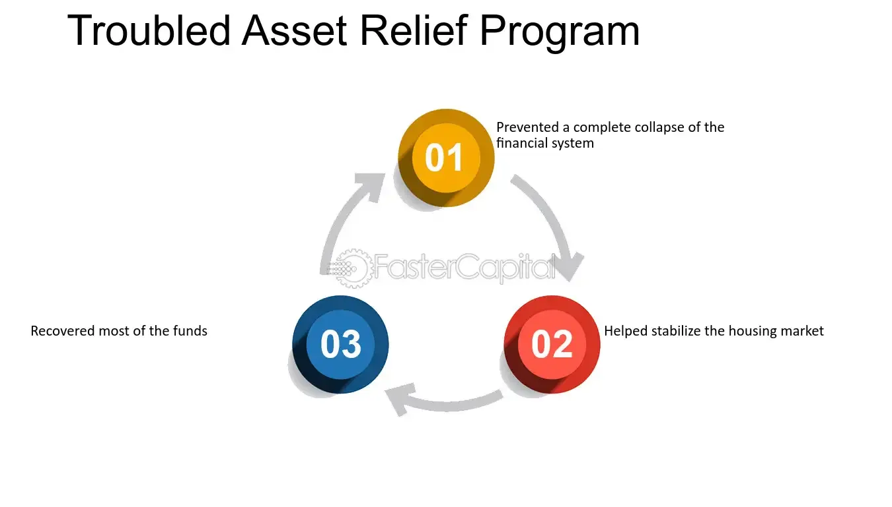

## Table of Contents

## What is the Troubled Asset Relief Program (TARP)?

The Troubled Asset Relief Program, or TARP, is a program that the U.S. government started in 2008. It was made to help fix problems in the economy after a big financial crisis. The main goal of TARP was to help banks and other big financial companies that were in trouble. By giving them money, the government hoped to stop these companies from failing, which could make the economy even worse.

TARP worked by the government buying or insuring bad loans and other assets from these companies. This helped the companies have more money to lend to people and businesses. Over time, TARP helped to calm down the financial markets and get the economy moving again. Even though it was controversial and some people didn't like it, many experts believe TARP was important in preventing an even bigger economic disaster.

## When was TARP established and why was it needed?

TARP was established on October 3, 2008. It was needed because the U.S. was going through a big financial crisis. Many banks and big financial companies were in trouble because they had made bad loans and investments. These bad loans were called "troubled assets." If these companies failed, it could cause a lot of problems for the whole economy. The government wanted to stop this from happening.

The financial crisis started to hurt regular people and businesses too. People were losing their jobs and homes, and businesses were struggling. The government thought that by helping the banks and financial companies, they could help the whole economy get better. TARP was a way to give money to these companies so they could keep lending money to people and businesses. This was important to stop the economy from getting even worse.

## Who administers TARP and what is their role?

The U.S. Department of the Treasury administers TARP. Their job is to manage the program and make sure the money is used the right way. They decide which banks and financial companies get help and how much money they get. They also keep track of how the money is being used and make sure it's helping the economy.

The Treasury Department works with other groups too. They work with the Federal Reserve and other government agencies to make sure TARP is working well. They also have to report to Congress about how TARP is going and answer any questions lawmakers might have. This helps make sure the program is fair and open to the public.

## What types of assets were considered 'troubled' under TARP?

Under TARP, 'troubled assets' were mainly bad loans and investments that banks and financial companies had made. These included mortgage-backed securities, which are investments based on home loans. Many of these loans were given to people who couldn't pay them back, so the value of these securities dropped a lot. This caused big problems for the banks that owned them.

Another type of troubled asset was toxic assets, which are investments that lost a lot of value and became hard to sell. These could include different kinds of securities and loans that were no longer worth what the banks paid for them. By buying or insuring these troubled assets, the government hoped to help the banks get rid of them and start lending money again.

## How was TARP funded and what was the total amount allocated?

TARP was funded by the U.S. government using taxpayer money. The total amount allocated to TARP was $700 billion. This money came from the government's budget, and Congress had to approve it before it could be used.

The government used this money to buy or insure the troubled assets from banks and financial companies. By doing this, they hoped to help these companies get back on their feet and start lending money again. This was important to stop the economy from getting even worse during the financial crisis.

## What were the main programs initiated under TARP?

TARP had several main programs to help fix the financial crisis. One big program was the Capital Purchase Program (CPP). This program gave money directly to banks so they could keep lending to people and businesses. The government bought special shares in these banks, which helped them have more money to work with. Another important program was the Automotive Industry Financing Program (AIFP). This program gave money to big car companies like General Motors and Chrysler to help them stay in business. Without this help, these companies might have gone bankrupt, which would have been bad for the economy.

Another key program under TARP was the Home Affordable Modification Program (HAMP). This program helped people who were having trouble paying their home loans. It worked by changing the terms of their loans to make them easier to pay. This helped people keep their homes and stopped more homes from being taken away. TARP also had the Public-Private Investment Program (PPIP), which helped banks sell their troubled assets. By working with private investors, the government helped banks get rid of these bad investments and start lending again. These programs all worked together to help fix the economy during a tough time.

## How did TARP aim to stabilize the financial system?

TARP aimed to stabilize the financial system by giving money to banks and big financial companies that were in trouble. These companies had made bad loans and investments, which were called troubled assets. By buying or insuring these troubled assets, the government helped the banks get rid of them. This made the banks more stable and able to lend money again. When banks can lend money, it helps people and businesses, which is good for the whole economy.

TARP also had special programs to help different parts of the economy. For example, it gave money to car companies to keep them from going bankrupt. It also helped people who were struggling to pay their home loans by changing the terms to make them easier to pay. By helping these different areas, TARP worked to stop the financial crisis from getting worse and to get the economy moving again. Even though some people didn't like TARP, many experts think it was important in preventing an even bigger economic disaster.

## What were the eligibility criteria for institutions to receive TARP funds?

To get TARP money, banks and financial companies had to show they were in trouble because of bad loans and investments. These bad loans were called troubled assets. The government wanted to help banks that were important to the economy. So, they looked at how big the bank was and how much it helped the economy. If a bank was really important and had a lot of troubled assets, it was more likely to get TARP money.

The government also wanted to make sure the TARP money was used the right way. So, they set rules for the banks that got the money. Banks had to agree to let the government watch how they used the money. They also had to follow special rules about how much they paid their top people. This was to make sure the TARP money helped the economy and not just the people running the banks.

## How were the funds disbursed under TARP and what were the repayment terms?

The funds under TARP were given out in different ways depending on the program. For the Capital Purchase Program, the government bought special shares in banks. This gave the banks more money to lend to people and businesses. For the Automotive Industry Financing Program, the government gave loans directly to car companies like General Motors and Chrysler. This helped them stay in business and keep making cars. The Home Affordable Modification Program worked by changing the terms of home loans to make them easier to pay, which helped people keep their homes.

The repayment terms for TARP funds were different for each program. For the Capital Purchase Program, banks had to pay back the money they got from the government, plus interest. They could do this by selling the special shares back to the government. For the Automotive Industry Financing Program, car companies had to pay back the loans they got, plus interest. They did this over time as they got better financially. The Home Affordable Modification Program didn't need direct repayment because it worked by changing loan terms, but the government still got money back through fees from the banks that took part in the program.

## What impact did TARP have on the economy and financial markets?

TARP helped the economy and financial markets a lot during the big financial crisis. It stopped many banks and big financial companies from failing. By giving them money, TARP helped these companies get rid of bad loans and investments, which were called troubled assets. This made the banks more stable and able to lend money again. When banks can lend money, it helps people buy homes and cars, and it helps businesses grow. This was important because it stopped the financial crisis from getting even worse.

TARP also helped other parts of the economy. It gave money to big car companies like General Motors and Chrysler, which kept them from going bankrupt. It also helped people who were having trouble paying their home loans by changing the loan terms to make them easier to pay. This helped people keep their homes and stopped more homes from being taken away. Even though some people didn't like TARP and thought it was unfair, many experts believe it was important in preventing an even bigger economic disaster. It helped calm down the financial markets and get the economy moving again.

## What were the criticisms and controversies surrounding TARP?

Some people didn't like TARP because they thought it was unfair to use taxpayer money to help big banks and companies. They felt that the government was bailing out the same people who caused the financial crisis. Many people were angry because they were struggling with their own money problems, like losing jobs or homes, while the banks got help. There was also worry that the government wasn't watching the banks closely enough to make sure they used the money the right way. Some thought that the banks might use the money to pay their top people a lot of money instead of helping the economy.

Another big criticism was that TARP didn't do enough to help regular people. Some felt that the program focused too much on banks and big companies, and not enough on helping people who were losing their homes. There were also questions about how well TARP worked. Some people thought that the government could have done a better job of fixing the financial crisis without spending so much money. Even though many experts think TARP helped stop a bigger economic disaster, these criticisms and controversies made a lot of people unhappy with the program.

## How has TARP been evaluated in terms of its effectiveness and cost to taxpayers?

TARP has been looked at a lot to see if it worked well and what it cost taxpayers. Many experts think TARP helped stop a bigger economic disaster. It gave money to banks and big companies that were in trouble, which helped them keep lending money to people and businesses. This was important because it stopped the financial crisis from getting even worse. The government got a lot of the money back too. By the end, the government said it made a small profit from TARP because it got back more money than it spent. This made some people feel better about the program.

But not everyone thinks TARP was a good idea. Some people were mad because they thought it was unfair to use taxpayer money to help big banks and companies. They felt that the government was helping the same people who caused the financial crisis. There was also worry that the government wasn't watching the banks closely enough to make sure they used the money the right way. Some thought that the banks might use the money to pay their top people a lot of money instead of helping the economy. Even though TARP helped in some ways, these criticisms made a lot of people unhappy with the program.

## References & Further Reading

[1]: Paulson, H. M. (2010). ["On the Brink: Inside the Race to Stop the Collapse of the Global Financial System"](https://www.amazon.com/Brink-Inside-Collapse-Global-Financial/dp/0446561932). Business Plus.

[2]: Geithner, T. F. (2014). ["Stress Test: Reflections on Financial Crises"](https://www.amazon.com/Stress-Test-Reflections-Financial-Crises/dp/0804138613). Crown.

[3]: Sorkin, A. R. (2009). ["Too Big to Fail: The Inside Story of How Wall Street and Washington Fought to Save the Financial System—and Themselves"](https://www.amazon.com/Too-Big-Fail-Washington-System/dp/0143118242). Viking.

[4]: Duffie, D. (2010). ["Presidential Address: Asset Price Dynamics with Slow-Moving Capital"](https://www.darrellduffie.com/uploads/1/4/8/0/148007615/duffieafapresidentialaddress2010.pdf). The Review of Financial Studies, 24(6), 1669-1707.

[5]: Johnson, S., & Kwak, J. (2010). ["13 Bankers: The Wall Street Takeover and the Next Financial Meltdown"](https://www.emerald.com/insight/content/doi/10.1108/17422041111149543/full/html). Pantheon Books.

[6]: Lewis, M. (2015). ["Flash Boys: A Wall Street Revolt"](https://en.wikipedia.org/wiki/Flash_Boys). W. W. Norton & Company.

[7]: Bernanke, B. S. (2015). ["The Courage to Act: A Memoir of a Crisis and Its Aftermath"](https://archive.org/details/couragetoactmemo0000bern). W. W. Norton & Company.