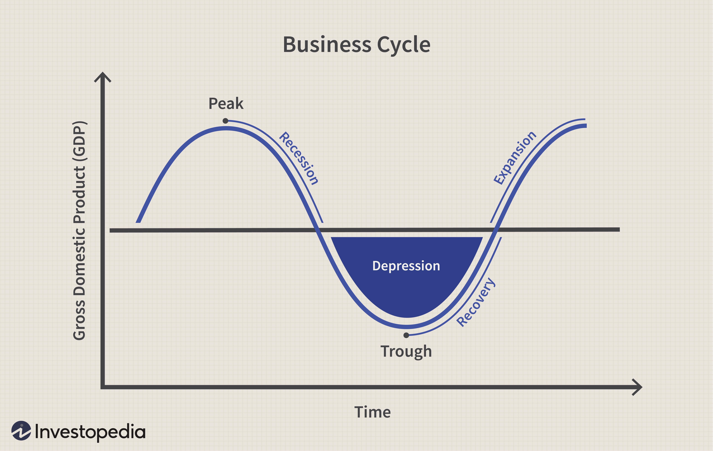

## Table of Contents

## What is a business cycle?

A business cycle is the natural ups and downs that happen in an economy over time. It's like a roller coaster that goes through periods of growth and periods of slowdown. When the economy is growing, more people have jobs, businesses make more money, and people feel confident about spending. This is called an expansion. But eventually, the economy can slow down, and this is called a contraction. During a contraction, businesses might make less money, people might lose their jobs, and people might spend less money.

These cycles can last for different amounts of time, sometimes a few years or even longer. Economists try to predict and understand these cycles to help make better decisions. They look at things like how many people have jobs, how much people are spending, and how much businesses are making. By understanding the business cycle, governments and businesses can try to make things better during tough times and keep things going well during good times.

## What is a trough in the business cycle?

A trough in the business cycle is like the lowest point of a roller coaster. It's the time when the economy is at its weakest, after a period of getting worse. During a trough, you might see more people out of work, businesses making less money, and people spending less because they're worried about the future. It's a tough time, but it's also a turning point because things start to get better after hitting the trough.

After the trough, the economy starts to recover and grow again. This is called an expansion. People start to feel more confident, businesses begin to make more money, and more jobs are created. The trough is important because it shows us that even when things seem really bad, they can start to improve. It's like the darkest part of the night before the dawn starts to break.

## How can you identify a trough in the business cycle?

You can tell a trough is happening when the economy has been getting worse for a while and then it starts to level off or get a little better. Look at things like how many people have jobs, how much stuff businesses are selling, and how much people are spending. When these things stop going down and start to go up, even if it's just a little bit, it might mean you're at the trough. It's like when you're sick and you start to feel a tiny bit better - that's a sign you're getting to the bottom of the illness.

Another way to spot a trough is by watching economic reports and news. Economists and experts keep an eye on lots of numbers and data. They look at things like how fast the economy is growing, how much stuff is being made, and how confident people feel about the future. When these reports show that things are starting to improve after being bad for a while, it's a good hint that you're at the trough. It's like watching the weather forecast to see when the storm is going to pass and the sun will come out again.

## What are the economic indicators that signal a trough?

Economic indicators that signal a trough are like signs that tell us the economy is starting to get better after being at its worst. One important sign is the unemployment rate. When it stops going up and starts to go down, even just a little, it might mean we're at the trough. Another sign is the Gross Domestic Product (GDP), which measures how much stuff a country makes and sells. If GDP stops shrinking and starts growing, it's a good hint that we're at the bottom and things are about to improve.

Another indicator is consumer spending. When people start spending a bit more money after a time of spending less, it's a sign that they feel more confident about the future. Business activity is also important. If businesses start to make and sell more stuff after a period of making less, it's another clue that we're at the trough. These signs together help economists and experts figure out when the economy is turning around.

Lastly, look at things like industrial production and housing starts. Industrial production measures how much factories are making, and if it starts to increase after falling, it's a good sign. Housing starts show how many new homes are being built, and an increase here can also signal a trough. By watching all these indicators, we can see when the economy is at its lowest point and ready to start growing again.

## Can you provide historical examples of troughs in business cycles?

One famous trough happened during the Great Depression in the 1930s. The economy got really bad after the stock market crashed in 1929. By 1933, things were at their worst. Lots of people were out of work, businesses were failing, and people were scared. But then, slowly, things started to get better. The government started new programs to help people find jobs and the economy began to grow again. This trough in 1933 marked the bottom of the Great Depression, and from there, the economy started to recover.

Another example of a trough was during the early 1980s. The economy had been struggling with high inflation and high unemployment. By late 1982, things hit rock bottom. Many people were out of work, and businesses were not doing well. But then, things started to turn around. The government made changes to help the economy, and soon, more people started finding jobs, businesses began to grow, and the economy started to expand again. This trough in 1982 was the start of a long period of growth that lasted for many years.

A more recent example of a trough was during the Great Recession in the late 2000s. The economy started to get bad in 2007 and got really bad by 2009. Many people lost their jobs, and the housing market crashed. But by mid-2009, things started to get a little better. The government stepped in with programs to help, and slowly, the economy began to recover. This trough in 2009 marked the end of the worst part of the Great Recession, and from there, the economy started to grow again.

## How do troughs affect employment and unemployment rates?

Troughs in the business cycle are when the economy is at its lowest point. During a trough, many businesses struggle because people are not buying as much stuff. When businesses don't make as much money, they often have to let workers go. This means that the unemployment rate goes up a lot during a trough. More people are out of work and looking for jobs, but there are fewer jobs available. It's a tough time for workers because finding a new job can be really hard.

But after hitting the trough, things start to get better. As the economy begins to recover, businesses start to make more money again. They need more workers to help them grow, so they start hiring again. This means the unemployment rate starts to go down. People who were out of work can find new jobs, and the job market starts to feel better. The trough is like the darkest part of the night, but once it's over, the sun starts to come up again, and things get brighter for workers.

## What are the typical durations of troughs in business cycles?

Troughs in business cycles can last for different amounts of time. Usually, a trough might last from a few months to about a year. It depends on how bad the economy got before hitting the bottom and how quickly things start to get better. Sometimes, if the economy was really bad, the trough might last longer because it takes more time for things to start improving.

For example, during the Great Depression, the trough lasted for a while because the economy was in really bad shape. It took time for new programs and policies to help the economy start growing again. On the other hand, the trough during the early 1980s was shorter because the economy bounced back more quickly after hitting the bottom. So, the length of a trough can vary, but it's usually not too long before things start to get better.

## How do businesses and investors typically respond to a trough?

When businesses see a trough coming, they often get ready for tough times. They might cut back on spending and try to save money. Sometimes, they have to let workers go because they can't afford to pay them. But businesses also look for new ways to make money. They might start selling new products or find cheaper ways to make things. Smart businesses use the trough to get ready for when the economy starts to grow again. They know that after the trough, things will get better, so they plan for the future.

Investors also change what they do during a trough. They might be more careful about where they put their money. They look for safe places to invest, like bonds, because they don't want to lose money. But some investors see a trough as a chance to buy things at lower prices. They might buy stocks or other investments that they think will go up in value when the economy gets better. Investors know that after a trough, the economy will start to grow again, so they try to be ready for that.

## What government policies are often implemented during a trough?

During a trough, governments often step in to help the economy get better. They might use something called fiscal policy, which means they spend more money on things like building roads or helping people find jobs. This can help because when the government spends money, it can create jobs and make people feel more confident about spending their own money. Governments might also cut taxes so that people and businesses have more money to spend. This can help the economy start growing again.

Another thing governments do during a trough is use monetary policy. This means the central bank might lower interest rates to make it cheaper for people and businesses to borrow money. When borrowing is cheaper, people might buy more things like houses or cars, and businesses might invest in new projects. This can help the economy start to recover. Governments and central banks work together to try to make the trough as short as possible and get the economy growing again.

## How does a trough transition into a recovery phase?

A trough is like the bottom of a valley in the economy. When the economy hits a trough, things start to get a little better. Businesses might start making more stuff because they see that people are starting to spend a bit more money. The government might help by spending money on projects that create jobs, like building roads or schools. They might also lower taxes so people have more money to spend. The central bank could make borrowing money cheaper by lowering interest rates. All these things help the economy start to climb out of the trough.

As the economy starts to recover, more people find jobs. When people have jobs, they feel more confident and start spending more money. This helps businesses make more money, and they might hire even more people. It's like a snowball effect where one good thing leads to another. Slowly, the economy grows stronger and moves into a phase called expansion. The trough is important because it's the turning point where things start to get better, and the economy begins its journey back to health.

## What are the global impacts of a trough in the business cycle?

When a big economy like the United States or China hits a trough, it can affect the whole world. These countries buy and sell a lot of stuff with other countries. If they're not buying as much because they're in a trough, other countries can feel it too. They might sell less stuff and their own economies might start to slow down. It's like when one friend stops playing, it can make the whole game less fun for everyone.

But it's not all bad news. When a big economy starts to recover from a trough, it can help other countries too. As people in the big economy start spending more money, they buy more things from other countries. This can help those countries' economies start to grow again. It's like when the sun comes out after a storm, it makes everything feel better, not just in one place but all around the world.

## How can advanced econometric models predict the onset and end of a trough?

Advanced econometric models help predict when a trough might start and end by looking at lots of numbers and data. These models use things like how many people have jobs, how much stuff businesses are making, and how much people are spending. They also look at things like interest rates and how much money the government is spending. By putting all this information together, the models can see patterns and guess when the economy might hit a trough. It's like using a weather forecast to predict when it might rain or when the sun will come out.

These models are really good at finding signs that a trough is coming or going away. For example, if the models see that the unemployment rate is going up a lot and businesses are making less stuff, they might predict that a trough is starting soon. On the other hand, if they see that the unemployment rate is starting to go down and businesses are making more stuff, they might predict that the trough is ending and the economy is starting to get better. By watching these signs, econometric models help people and governments get ready for tough times and plan for when things will get better.

## References & Further Reading

[1]: Blinder, A. S., & Zandi, M. (2015). ["The Financial Crisis: Lessons for the Next One."](https://www.cbpp.org/research/the-financial-crisis-lessons-for-the-next-one) Hutchins Center on Fiscal and Monetary Policy at Brookings.

[2]: ["Business Cycles and Forecasting"](https://www.studocu.com/en-za/document/high-school-south-africa/economics/chapter-2-business-cycles-and-forecasting/10090769) by Lloyd M. Valentine and R. Carter Hill

[3]: Reis, R. (2018). ["Is Something Really Wrong with Macroeconomics?"](https://personal.lse.ac.uk/reisr/papers/18-wrong.pdf) NBER Working Paper No. 23645.

[4]: ["Algorithmic Trading: Winning Strategies and Their Rationale"](https://www.wiley.com/en-us/Algorithmic+Trading%3A+Winning+Strategies+and+Their+Rationale-p-9781118746912) by Ernie P. Chan

[5]: "Gross Domestic Product (GDP) as an Indicator" - ("Measuring Worth," [GDP Calculation and Data Analysis](https://en.wikipedia.org/wiki/Economic_history_of_the_United_States))

[6]: Gordon, R. J. (2016). ["The Rise and Fall of American Growth: The U.S. Standard of Living Since the Civil War."](https://www.jstor.org/stable/j.ctvc77bwm) Princeton University Press.

[7]: ["Principles of Macroeconomics"](https://open.umn.edu/opentextbooks/textbooks/192) by OpenStax

[8]: Thomas, L. B., & Zyren, J. (2004). ["Evaluation and Review of the Market Price Estimation of Crude Oil."](https://www.semanticscholar.org/paper/A-Short-Run-Crude-Oil-Price-Forecast-Model-with-Ye-Zyren/5bf68ba0b3ae5e56cb7e98cc5b65df10a485aeb3) U.S. Energy Information Administration.