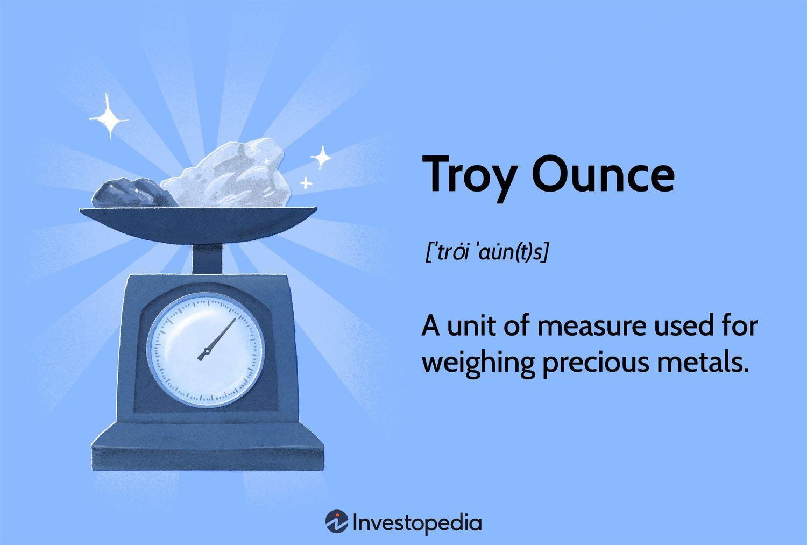

The world of precious metals and gold trading is steeped in tradition, and these markets often utilize unique units of measurement. One such unit is the troy ounce, a measurement historically associated with precious metals like gold. Distinct from the standard ounce commonly used in everyday contexts, the troy ounce plays a pivotal role in the valuation, trading, and investment in gold and other precious metals. 

Gold trading is not only about acquiring and holding the metal but also involves understanding its measurement and valuation systems, particularly for those participating in algorithmic trading, where precision in measurements can impact trading strategies significantly. Algorithmic trading in gold markets leverages complex algorithms to optimize trading decisions, and a fundamental understanding of units like the troy ounce is essential for minimizing errors and enhancing strategic outcomes.



In this article, we will explore the significance of the troy ounce in gold measurement, examine how conversion algorithms affect trading, and discuss the influence of these concepts on algorithmic trading. Proficiency in these areas is not just beneficial but necessary for investors and traders seeking to navigate the modern gold markets effectively. Understanding these intricate systems ensures that participants can make informed decisions, optimize their strategies, and anticipate market movements with greater accuracy.

## Table of Contents

## What is a Troy Ounce?

A troy ounce is a unit of measurement specifically used for weighing precious metals, such as gold, silver, and platinum. Unlike the more commonly known avoirdupois ounce, which is used in everyday transactions in the United States and equals approximately 28.35 grams, the troy ounce weighs 31.1035 grams. The term "troy" is thought to have originated from the city of Troyes in France, a significant trading hub in the Middle Ages, where this system of measurement was widely utilized.

The use of the troy ounce is deeply embedded in the historical traditions of precious metals markets. This unit of measurement is critical because it provides a standardized means of quantifying and trading gold across global markets. As gold is traded internationally, the troy ounce represents a consistent and recognized unit that ensures all parties are on the same page when it comes to weight, regardless of local measurement systems.

In today's gold market, the troy ounce remains the principal unit of measurement. Its importance is underscored by the way gold prices are quoted worldwide, typically per troy ounce. This consistency is vital for ensuring accuracy and fairness in trading, hedging, and investing activities. Additionally, major gold exchanges, such as the New York Mercantile Exchange (NYMEX) and the London Bullion Market Association (LBMA), list their gold futures and physical gold prices using troy ounces, further cementing its role as a standardized measure.

The continued use of the troy ounce is not merely a nod to tradition but also a practical measure that facilitates international trade and investment. Given the fluctuations in gold prices and the precious nature of these commodities, even minor inaccuracies can lead to significant financial discrepancies. Thus, the precision offered by the troy ounce is invaluable to both individual investors and institutional traders in the current gold market landscape.

## Understanding the Troy Ounce in Gold Measurement

The troy ounce is an essential unit of measurement in the gold market, setting it apart from other commodities where the standard ounce is more commonly used. Unlike the standard ounce, which weighs 28.35 grams, the troy ounce is approximately 31.1035 grams. This weight differentiation is crucial for maintaining consistency and accuracy in trading practices. Gold, as a precious metal, has retained this archaic measurement unit due to its historical significance and the need for a universal metric that can be understood globally by traders and investors.

The preference for the troy ounce in gold trading is rooted in its establishment as a tradition in precious metals trading that dates back to medieval European markets, particularly in the city of Troyes, France. This enduring legacy underscores the deep historical connection and trust that global markets place in the troy ounce system. Consequently, it offers investors a stable and universally accepted measure that facilitates the seamless exchange of gold across international borders.

For investors, the consistent use of the troy ounce in gold measurement implies a reliable appraisal system where gold's weight and purity can be uniformly assessed. This minimizes discrepancies in valuation and ensures that their investments can be compared on a like-for-like basis in global markets. Understanding the nuances of this measurement can affect investment valuations and strategies, highlighting its critical importance to market participants focused on precious metals.

The continued dominance of the troy ounce in gold trading showcases its role as a trusted and standardized metric. Despite advancements in technology and trading practices, including the rise of [algorithmic trading](/wiki/algorithmic-trading), this traditional measurement remains pivotal. Recognizing the distinctions between the troy ounce and the standard ounce is indispensable for investors aiming to navigate the complexities of gold markets and optimize their investment strategies.

## Troy Ounce Conversion and Its Importance

Understanding the conversion between the troy ounce and other units of weight is essential for those engaged in gold investments. This knowledge is particularly pertinent for ensuring accurate transactions and optimizing investment strategies. The troy ounce, weighing 31.1035 grams, distinguishes itself from the avoirdupois ounce, commonly used in the United States, which weighs 28.35 grams.

The conversion from troy ounces to other units can be calculated using straightforward mathematical formulas. For instance, to convert troy ounces to grams, multiply the number of troy ounces by 31.1035. Conversely, to convert grams to troy ounces, divide the number of grams by 31.1035. Below is a simple reference table illustrating these conversions:

| Troy Ounces | Grams  | Avoirdupois Ounces |
|-------------|--------|--------------------|
| 1           | 31.1035| 1.097              |
| 5           | 155.517| 5.485              |
| 10          | 311.035| 10.971             |
| 50          | 1555.175| 54.857            |
| 100         | 3110.35| 109.714            |

For further conversions, such as from kilograms to troy ounces, you can use the relationship where 1 kilogram equals 32.1507 troy ounces.

Understanding these conversions is particularly advantageous for investors and traders, as they directly affect the pricing and valuation of gold in different markets and currencies. Investment strategies can be significantly impacted by exchange rate fluctuations, as these often necessitate swift and accurate conversions between weight units to capitalize on market opportunities. 

Algorithmically inclined traders might also consider implementing conversion algorithms within their trading software to automate these calculations, reducing the potential for human error. A simple Python implementation for conversion could look like this:

```python
def grams_to_troy_ounces(grams):
    return grams / 31.1035

def troy_ounces_to_grams(troy_ounces):
    return troy_ounces * 31.1035

def kilograms_to_troy_ounces(kilograms):
    return kilograms * 32.1507
```

Such tools enable traders to make faster decisions when trading international gold assets, allowing for more strategic investments worldwide. Understanding the intricacies of weight unit conversions and effectively utilizing them can, therefore, be a significant asset in optimizing the success of gold investment strategies.

## The Role of Gold in Algorithmic Trading

Algorithmic trading has revolutionized financial markets by employing sophisticated algorithms to execute trades with speed and precision. Gold, a staple in commodity trading, is no exception to the algorithmic advancement. Understanding the role of troy ounces in gold measurement is important in algorithmic trading strategies as it impacts trading decisions and performance metrics.

Algorithmic trading algorithms often depend on the precise quantification of assets for fair valuation, risk assessment, and strategy formulation. In the context of gold, the troy ounce is the standard unit of measurement, weighing approximately 31.1035 grams per ounce. Misinterpreting this can lead to significant errors in algorithms where weight measurements directly affect trade volumes, pricing models, and ultimately profitability.

When developing and refining trading algorithms, the accurate conversion between weight measurements is critical. For instance, converting between troy ounces and metric tons requires precision:

$$
\text{Weight in metric tons} = \frac{\text{Weight in troy ounces} \times 31.1035}{1,000,000}
$$

Adopting this precise conversion allows algorithms to consistently evaluate the gold's value, aligning trading actions with market realities.

Furthermore, algorithmic trading leverages historical data for predictive analytics, where accurate historical price and [volume](/wiki/volume-trading-strategy) data based on the troy ounce ensures more reliable predictive models. Algorithms utilize these models to forecast market movements and optimize entry and [exit](/wiki/exit-strategy) points in trading. Any deviation in measurement could skew input data, leading to erroneous predictions and inefficient trades.

Moreover, the integration of accurate troy ounce conversions enables algorithms to calculate necessary margins for leveraged positions more effectively. In high-frequency trading, minor discrepancies can be magnified across multiple trades, leading to increased exposure to financial risks.

An example Python snippet demonstrates how coding practices consider troy ounce conversions in an algorithmic trading setup:

```python
def convert_troy_ounces_to_metric_tons(troy_ounces):
    GRAMS_PER_TROY_OUNCE = 31.1035
    GRAMS_PER_METRIC_TON = 1_000_000
    return (troy_ounces * GRAMS_PER_TROY_OUNCE) / GRAMS_PER_METRIC_TON

# Example usage
troy_ounces = 320
metric_tons = convert_troy_ounces_to_metric_tons(troy_ounces)
print(f"{troy_ounces} troy ounces is equal to {metric_tons:.6f} metric tons.")
```

This snippet encapsulates a small yet crucial element of broader trading frameworks reliant on precise measurements for profitability and risk control.

In conclusion, within algorithmic frameworks, the correctness of troy ounce conversions affects every trading decision concerning gold. For traders aiming to optimize their strategies and predict market trends effectively, an in-depth understanding and application of these units in algorithmic contexts is indispensable. This knowledge bridges traditional trading standards with modern algorithmic advancements, enabling more informed and data-driven decision-making in the ever-competitive gold trading arena.

## Investing in Gold and Other Precious Metals

Gold has consistently been viewed as a safe-haven asset, attracting investors seeking stability amidst market [volatility](/wiki/volatility-trading-strategies). This precious metal's allure lies not only in its physical properties but also in its perceived intrinsic value, rendering it a vital component of diversified investment portfolios. However, investing in gold requires an understanding of its unique trading metrics and the various methodologies for gaining exposure.

### Investment Strategies

#### 1. Exchange-Traded Funds (ETFs)

Gold ETFs offer an opportunity for investors to participate in the gold market without physically owning the metal. These funds are designed to track the price of gold, and shares can be bought and sold on stock exchanges, making them highly liquid. ETFs are typically backed by physical gold stored in secure vaults, ensuring that the share price closely mirrors the actual market price of gold. This method is advantageous for investors who prefer a straightforward approach to gold investment, devoid of the complexities of storage and insurance.

#### 2. Mutual Funds

Unlike ETFs, which are passively managed, mutual funds that invest in gold are actively managed by professional fund managers. These funds may hold shares of gold mining companies or directly invest in gold bullions. The active management aspect allows for potential outperformance of the gold spot price but also introduces additional variables, such as management fees and market risk from related equities. Investors inclined towards a more diversified approach may consider mutual funds for exposure to both gold and broader market trends.

#### 3. Direct Purchases

Direct ownership of gold, through bullion bars and coins, offers a tangible form of investment. This method involves purchasing gold in its physical form, with an emphasis on the precise measurement units, such as the troy ounce, to ascertain value and facilitate trade. Investors opting for direct purchases must consider additional costs related to storage, security, and insurance. The reliability of the troy ounce measurement ensures that the trading and valuation of gold remain consistent across transactions.

### Advanced Market Products

Advanced market products, such as options and futures, integrate troy ounce metrics to enable investors to hedge risks or speculate on future gold price movements. Futures contracts allow investors to agree on a price today for gold to be delivered in the future, with the troy ounce serving as the standardized unit of measurement. Options provide the right, but not the obligation, to buy or sell gold at a predetermined price. Both products require a sophisticated understanding of the markets and can be leveraged to optimize investment strategies through detailed analysis and forecasting.

Understanding the troy ounce and its role in quantifying gold is critical for accurate pricing and trading. As such, investors who are knowledgeable about these various investment strategies and the importance of standardized units are better equipped to make informed decisions, potentially safeguarding their portfolios against market uncertainties.

## Conclusion

The troy ounce remains a fundamental unit in the gold trading world, providing a consistent metric for investors globally. Its historical significance and precise measurement offer an enduring standard that continues to underpin the trading of precious metals. In an era where technological advancements drive market dynamics, understanding the conversion and application of the troy ounce has become increasingly vital.

Algorithmic trading, a method that uses pre-set algorithms to execute trades at speeds and frequencies that surpass human capability, is reshaping the landscape of financial markets, including those for gold trading. Precise measurement units like the troy ounce are integral to these trading algorithms, ensuring accuracy and consistency. For instance, the troy ounce's universal acceptance and standardization allow traders to develop algorithms that can predict price movements and optimize trading strategies regardless of geographical location. By utilizing the formula:

$$
\text{Price per gram} = \frac{\text{Price per troy ounce}}{31.1035}
$$

traders can convert gold prices accurately and apply these figures to sophisticated trading models, enhancing decision-making processes and reducing risk.

The integration of such traditional units with modern trading technologies symbolizes a harmonious merging of time-tested practices and cutting-edge innovations. Investors and traders who adapt to these changes by fully comprehending the intricacies of the troy ounce and its conversions stand to gain a competitive edge. As the financial markets continue to evolve, the ability to bridge the gap between historical trading metrics and algorithmic advancements will be crucial in optimizing investment outcomes.

## References & Further Reading

[1]: Meese, R. A., & Rogoff, K. (1983). ["The Out-of-Sample Failure of Empirical Exchange Rate Models."](https://scholar.harvard.edu/rogoff/publications/empirical-exchange-rate-models-seventies-do-they-fit-out-sample) In Exchange Rates and International Macroeconomics.

[2]: Cuthbertson, K., & Nitzsche, D. (2004). ["Quantitative Financial Economics: Stocks, Bonds and Foreign Exchange."](https://www.amazon.com/Quantitative-Financial-Economics-Foreign-Exchange/dp/0470091711) Wiley.

[3]: Hull, J. C. (2018). ["Options, Futures, and Other Derivatives."](https://www.semanticscholar.org/paper/Options%2C-Futures%2C-and-Other-Derivatives-Hull/89bdee500c8623864fc9eb7a471546aa713acc44) Pearson.

[4]: Cline, P. (2015). ["Algorithmic and High-Frequency Trading."](https://assets.cambridge.org/97811070/91146/frontmatter/9781107091146_frontmatter.pdf) Cambridge University Press.

[5]: Johnson, B. (2010). ["Algorithmic Trading & DMA: An Introduction to Direct Access Trading Strategies."](https://archive.org/details/algorithmictradi0000john) 4Myeloma Press.