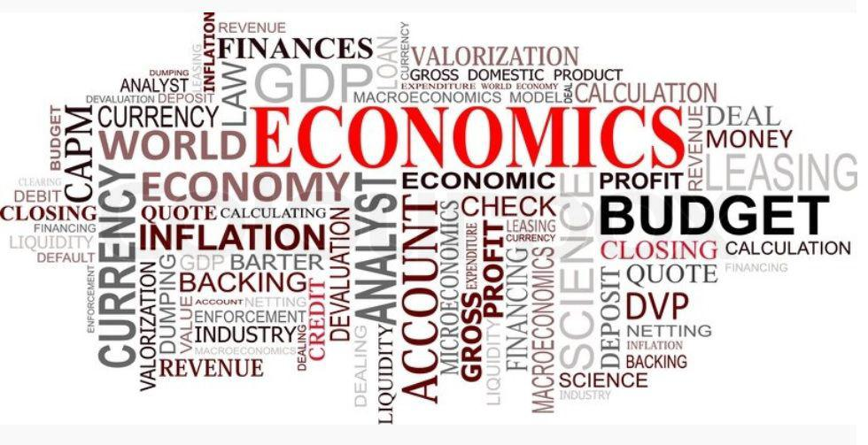

In today's rapidly evolving financial landscape, sustainability is increasingly at the forefront of economic discussions. As global awareness of environmental challenges and social equity grows, there is a pressing need to reassess traditional economic paradigms that often overlook the broader impacts of production and consumption. True cost economics offers a compelling framework to understand and internalize the hidden costs associated with these activities. This approach emphasizes accounting for externalities—particularly those that negatively affect the environment and public well-being—that are typically excluded from conventional pricing mechanisms. 

Algorithmic trading, commonly known as algo trading, plays a significant role in contemporary financial markets. Utilizing complex algorithms and advanced computing power, it executes trades at extraordinarily high speeds and volumes. While this technological advancement increases market efficiency and liquidity, it also raises important questions regarding economic impact and sustainability. The potential for algorithmic trading to exacerbate market volatility or overlook sustainable practices in pursuit of financial gains is an area of growing concern. 

This article explores the intersections of sustainability, true cost economics, and algorithmic trading, assessing their collective economic impact. By doing so, it aims to shed light on the challenges and opportunities that arise as we strive for a more sustainable economic system while embracing technological advancements in finance. Balancing these elements is critical for fostering an economic environment that is not only viable in the present but also equitable and resilient for future generations.

## Table of Contents

## Understanding True Cost Economics

True cost economics seeks to redefine how we value products and services by internalizing externalities that traditional pricing models often ignore. Externalities are costs or benefits affecting parties who did not choose to incur that cost or benefit, and they can be positive or negative. In the context of true cost economics, the focus is on negative externalities, such as environmental pollution, depletion of natural resources, and public health impacts that arise from production and consumption processes.

Traditional economic models frequently overlook these externalities. For example, the market price of a product rarely reflects the environmental damage caused by its production, such as carbon emissions or water pollution. Similarly, the health costs resulting from exposure to pollutants are not considered in the price consumers pay. This omission can lead to a misallocation of resources, wherein environmentally harmful products are underpriced and overconsumed, further exacerbating ecological and social issues.

True cost economics proposes a solution by incorporating these overlooked costs into the financial evaluation of goods and services. This approach encourages businesses to adopt sustainable practices by accounting for the ecological and social impacts of their operations. For instance, a company might invest in cleaner production technologies or sustainable sourcing practices to reduce its environmental footprint.

Mathematically, true cost pricing can be expressed as:

$$
\text{True Cost} = \text{Market Price} + \text{External Costs}
$$

Where the external costs represent the monetized value of the negative impacts associated with the production and consumption of goods or services.

The implementation of true cost economics involves several challenges, including accurately measuring and assigning monetary value to externalities, which can be complex and context-dependent. Despite these challenges, this economic model holds the potential to foster sustainable economic growth by aligning business practices with ecological and social well-being.

## The Role of Algorithmic Trading

Algorithmic trading utilizes advanced algorithms to execute trades at speeds that far surpass human capabilities, making it a dominant force in today's financial markets. Algorithms, often designed using statistical and mathematical models, analyze vast amounts of market data in real-time to identify trading opportunities. The speed of execution allows traders to capitalize on minuscule price differences, often within fractions of a second, which can result in significant aggregate profits.

While its efficiency is undeniable, [algorithmic trading](/wiki/algorithmic-trading) raises issues concerning market stability. One of the most notable instances is the Flash Crash of May 6, 2010, when the U.S. stock market witnessed a rapid and deep decline, only to recover quickly within minutes. Investigations revealed that algorithmic trading contributed to the exacerbation of the crash due to high-frequency trading ([HFT](/wiki/high-frequency-trading-strategies)) algorithms reacting to volatile market conditions and amplifying price movements. This incident highlighted the susceptibility of financial markets to systemic risks linked to the automation and speed of algorithmic trading (U.S. Securities and Exchange Commission & Commodity Futures Trading Commission, 2010).

Another significant concern is the ethical implications of algorithmic trading, particularly concerning sustainability. The primary design of trading algorithms is to maximize profit, often without consideration for broader economic, environmental, or social impacts. This can lead to prioritizing short-term financial gains over long-term sustainability objectives. For example, trading strategies based on exploiting short-term market inefficiencies may contribute to increased market [volatility](/wiki/volatility-trading-strategies) and disregarding environment-related externalities in favor of immediate profit maximization.

Balancing algorithmic trading with sustainable economic practices presents a modern economic challenge. Regulators and financial institutions are exploring ways to integrate environmental, social, and governance ([ESG](/wiki/esg-investing)) factors into trading algorithms to promote sustainable investment strategies. Doing so requires revisiting and potentially redesigning algorithms to align financial performance with sustainability principles. Advances in [machine learning](/wiki/machine-learning) and [artificial intelligence](/wiki/ai-artificial-intelligence) hold promise in crafting algorithms capable of assessing ESG criteria alongside traditional financial metrics.

Policymakers have an essential role in encouraging sustainable algorithmic trading. Regulatory frameworks that mandate ESG reporting and incentivize sustainable investment practices can channel algorithmic trading toward sustainability goals. Collaboration between stakeholders in the financial sector and technological innovators is crucial to create a market environment where sustainable practices are both financially rewarding and ethically responsible.

## Economic Impact of True Cost Economics

Implementing true cost economics is a pivotal approach in redefining how goods and services are valued. By integrating the full range of ecological and social costs, this economic model aims to present a more accurate depiction of a product’s total impact, fostering greater transparency in the marketplace. This systemic change addresses the traditional oversight of externalities—unintended side effects of economic activity not factored into market prices—such as pollution, resource depletion, and adverse health effects. When these factors are incorporated into the pricing models, it encourages producers to adopt more sustainable practices. 

The economic impact of adopting true cost economics is profound. By openly acknowledging and pricing the hidden costs of production and consumption, this model prioritizes the reduction of environmental harm. For example, if a company recognizes that its manufacturing process generates pollution, true cost pricing would reflect the environmental remediation costs. This act not only promotes accountability but also incentivizes companies to innovate and devise cleaner technologies to reduce their ecological footprint, thereby aligning economic interests with environmental stewardship.

However, consumers may face higher prices as products begin to reflect their true costs. This increase in cost can drive market transformation by encouraging consumers to consider sustainable choices more diligently. When the full cost of environmental degradation is passed on to consumers, there is an economic impetus to seek alternatives that offer better value in terms of sustainability. This shift can propagate a market culture inclined towards eco-friendly innovations, as higher demand for sustainable products leads to increased research and development in green technologies.

Governments and businesses play crucial roles in facilitating the transition to true cost economics. Policy measures such as carbon pricing, environmental taxes, and sustainability subsidies can provide incentives for businesses to adopt true cost pricing strategies. By imposing taxes on carbon emissions, for instance, governments can encourage reductions in greenhouse gas output, directly linking economic activity to environmental outcomes. Furthermore, businesses adopting these practices could experience competitive advantages, improving their brand image and attracting a consumer base increasingly aware of environmental concerns.

The integration of true cost strategies ultimately aims to internalize externalities, aligning market activities with the broader goals of ecological and social sustainability. By doing so, true cost economics not only addresses the inadequacies of traditional pricing models but also paves the way for a more balanced and sustainable economic system. The collective efforts of consumers, businesses, and governments are essential to this transformative process, ensuring that economic growth does not come at the expense of the planet’s health and future generations.

## Integrating Sustainability with Algorithmic Trading

Financial institutions are increasingly recognizing the importance of incorporating environmental, social, and governance (ESG) factors into their algorithmic trading strategies. By doing so, they not only align with global sustainability goals but also respond to growing investor demand for ethical investment options. Algorithms can be programmed to evaluate potential investments based on a company's ESG performance, integrating data such as carbon footprint, social responsibility metrics, and governance practices into trading decisions.

To encourage sustainable trading practices, regulatory frameworks and financial incentives play crucial roles. Regulations can mandate disclosures related to ESG factors, ensuring transparency and standardization. Financial incentives, such as tax breaks or subsidies, can encourage firms to prioritize ESG criteria in their trading algorithms. This regulatory support complements market-driven forces, fostering a trading environment where profit motives and sustainability objectives are aligned.

Digital technologies offer significant opportunities in promoting sustainable economic practices. Advanced data analytics, artificial intelligence (AI), and machine learning can enhance the precision and effectiveness of algorithms, allowing for more sophisticated analysis of ESG data. For instance, AI could be used to predict long-term environmental impacts of investment choices, optimizing portfolios for both financial returns and sustainability.

Potential market opportunities arise from this integration, particularly as sustainable investing becomes mainstream. Investors increasingly seek products that support a transition to a sustainable economy, creating demand for innovative financial products. Trading firms that successfully integrate ESG factors into their algorithms may attract more capital, achieve better long-term returns, and improve risk management by reducing exposure to environmentally or socially harmful investments.

By embedding sustainability into their core operations, trading firms can significantly contribute to a more sustainable economy, reflecting a broader shift in the financial industry towards ethical and responsible investing.

## Case Studies and Best Practices

Examining case studies of companies that have successfully incorporated true cost economics into their pricing models offers insights into sustainable practices. One prominent example is Patagonia, an outdoor clothing and gear company known for its commitment to environmental sustainability. Patagonia has integrated environmental costs into its pricing by using sustainable materials and promoting repair and recycling programs. This approach attracts eco-conscious consumers and reinforces the company's brand image as a leader in sustainable business practices.

Unilever also exemplifies the application of true cost economics. The company implemented a Sustainable Living Plan to address environmental and social impacts across its operations. By incorporating lifecycle analyses and setting sustainability targets, Unilever aims to decouple environmental impact from economic growth. The company reports that its sustainable brands, which reflect the internalization of externalities, have grown at a faster rate than its other product lines, indicating positive economic outcomes through sustainability integration.

In algorithmic trading, some firms are beginning to integrate environmental, social, and governance (ESG) criteria into their trading strategies. BlackRock, an investment management corporation, launched several funds incorporating ESG scores into their algorithmic decision-making processes. These funds use data-driven approaches to evaluate companies based on their sustainability practices, which influences investment decisions and portfolio management. This integration aims to align investment strategies with long-term environmental and social goals while maintaining competitive financial returns.

Challenges in implementing sustainable practices include balancing short-term financial objectives with long-term environmental and social goals. Transitioning to true cost economics often requires significant upfront investment and restructuring, which can deter businesses from adopting such practices. Additionally, the lack of standardized methods and metrics for quantifying externalities and ESG criteria complicates their integration into business models.

Nevertheless, the economic benefits of sustainable practices are increasingly recognized. They include enhanced corporate reputation, improved risk management, and increased resilience to regulatory changes. As more companies align their goals with sustainability, they contribute to a shift towards a more sustainable economy, encouraging innovation and the development of new market opportunities.

Overall, the integration of true cost economics and ESG criteria into business and trading practices showcases both the challenges and potential economic benefits. By addressing the hidden costs associated with traditional economic models and leveraging technological advancements in trading, companies can drive meaningful change towards sustainability while achieving economic success.

## Future Prospects and Conclusion

True cost economics and algorithmic trading are pivotal in shaping a sustainable future. As global markets increasingly embrace sustainable practices, the integration of these concepts into broader economic frameworks holds substantial promise for fostering growth and innovation. By internalizing externalities and embedding sustainability in trading algorithms, both consumers and businesses can participate in more responsible economic activities.

The potential for growth lies in the development of new markets and technologies that support sustainable practices. For example, companies engaging in true cost economics might drive innovation by investing in cleaner technologies or devising more efficient production processes. This transition not only reduces environmental damage but also opens new avenues for economic growth. Additionally, algorithmic trading that prioritizes environmental, social, and governance (ESG) criteria could attract socially conscious investors, thereby broadening market opportunities and encouraging sustainable investment strategies.

Several policy recommendations could facilitate the integration of sustainability into economic and technological advances. Governments might consider implementing tax incentives or subsidies for businesses that incorporate true cost pricing or ESG factors into their trading strategies. Furthermore, the establishment of standardized metrics for measuring the social and environmental impact of businesses could provide a benchmark for companies to aim for, promoting a more uniform approach to sustainability.

Technology could play an instrumental role in this transition. Advances in big data analytics and machine learning can enhance the precision of true cost calculations and refine the algorithms used in trading to account for sustainability criteria. For instance, utilizing Python libraries like `pandas` and `numpy` for data processing, or `[tensorflow](/wiki/tensorflow)` and `scikit-learn` for developing predictive models, businesses can better understand the long-term impacts of their economic decisions.

In conclusion, the symbiotic relationship between true cost economics and algorithmic trading offers an innovative pathway toward a more sustainable economic future. By focusing on sustainability, markets are not only addressing ecological and social issues but are also uncovering new growth prospects. Moving forward, policymakers, technology developers, and market participants must collaborate to strike a balance between economic expansion, environmental sustainability, and technological advancement. This collaborative effort will be crucial in navigating the challenges and maximizing the potential benefits of these dual paradigms.

## References & Further Reading

[1]: Hawken, P., Lovins, A. B., & Lovins, L. H. (2000). ["Natural Capitalism: Creating the Next Industrial Revolution"](https://www.jstor.org/stable/24357805). Back Bay Books.

[2]: KPMG. (2014). ["A New Vision of Value: Connecting corporate and societal value creation"](https://assets.kpmg.com/content/dam/kpmg/pdf/2014/09/a-new-vision-of-value-2014.pdf).

[3]: United Nations (2015). ["Transforming our world: the 2030 Agenda for Sustainable Development"](https://sdgs.un.org/publications/transforming-our-world-2030-agenda-sustainable-development-17981). United Nations General Assembly.

[4]: U.S. Securities and Exchange Commission & Commodity Futures Trading Commission. (2010). ["Findings Regarding the Market Events of May 6, 2010"](https://www.sec.gov/news/studies/2010/marketevents-report.pdf).

[5]: Gallagher, K., & Porzecanski, R. (2008). ["The Sustainable Development Goals (SDGs) and Key Messages for Advanced Economies"](https://www.sup.org/books/title?id=20122).