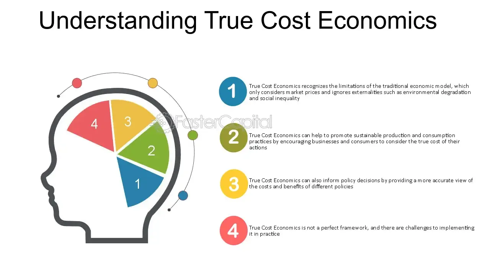

## Table of Contents

## What is True Cost Economics?

True Cost Economics is a way of thinking about the economy that takes into account all the costs of making and using things, not just the money people pay. It looks at the hidden costs, like damage to the environment or harm to people's health, that are often not included in the price of goods and services. For example, when a factory pollutes a river, the cost of cleaning up the river or the health problems caused by the pollution are not usually paid by the factory, but by society as a whole.

By considering these hidden costs, True Cost Economics aims to create a more fair and sustainable economy. It encourages businesses and governments to make decisions that are better for the planet and for people. This approach can help us understand the real impact of our economic activities and guide us towards choices that benefit everyone, not just those who can afford to pay the market price.

## How does True Cost Economics differ from traditional economics?

True Cost Economics and traditional economics look at the economy in different ways. Traditional economics mainly focuses on the money people pay for things. It looks at how much things cost to make and sell, and how much people are willing to pay for them. This way of thinking often leaves out important costs that are not paid with money, like pollution or health problems caused by making or using products.

On the other hand, True Cost Economics tries to include all costs, even those that are not paid with money. It looks at the harm done to the environment and people's health, and tries to put a value on these hidden costs. By doing this, True Cost Economics aims to show the true impact of economic activities and help make choices that are better for everyone and the planet.

In simple terms, traditional economics is like looking at just the price tag on a product, while True Cost Economics is like looking at the whole picture, including the effects on the world around us. This broader view can lead to more sustainable and fair economic decisions.

## What are the key principles of True Cost Economics?

True Cost Economics is based on the idea that all costs of making and using things should be included when we think about the economy. This means looking at more than just the money people pay. It includes the harm done to the environment, like pollution, and the health problems caused by making or using products. By counting these hidden costs, True Cost Economics tries to show the real impact of our economic choices.

The main goal of True Cost Economics is to make the economy more fair and sustainable. It wants businesses and governments to think about the bigger picture when they make decisions. This way, they can choose options that are better for the planet and for people, not just those who can afford to pay the market price. By considering the true costs, we can work towards an economy that benefits everyone and helps protect our world for the future.

## Why is True Cost Economics important for sustainable development?

True Cost Economics is important for sustainable development because it helps us see the real impact of what we do in the economy. It includes the costs that are often hidden, like pollution or health problems, which are not usually counted in traditional economics. By looking at these hidden costs, we can make better choices that are good for the environment and for people. This means we can work towards an economy that does not harm the planet and helps everyone, not just those who can afford to pay more.

When we use True Cost Economics, we can make decisions that help keep our world healthy for the future. It encourages businesses and governments to think about the bigger picture and choose options that are better for everyone. By counting all the costs, we can move towards a more fair and sustainable way of living. This helps us protect our environment and make sure that future generations can live well too.

## What are some examples of hidden costs not accounted for in traditional economics?

Hidden costs that traditional economics does not account for include the damage done to the environment, like when a factory pollutes a river. The cost of cleaning up the river and fixing the harm done to wildlife and plants is not paid by the factory, but by everyone else. Another example is the health problems caused by pollution, like when people get sick from breathing bad air or drinking dirty water. These health costs, such as hospital bills and lost work time, are not included in the price of the products that caused the pollution.

There are also hidden costs related to using up resources that cannot be replaced, like cutting down forests or using up oil. When we use these resources, we lose them forever, and the cost of not having them in the future is not counted in traditional economics. Another example is the social costs, like when a community loses jobs because a factory moves away. The cost of unemployment and the struggle to find new work is not paid by the company that moved, but by the people who lose their jobs. By not counting these hidden costs, traditional economics misses out on the true impact of economic activities.

## How can True Cost Economics be applied in business practices?

True Cost Economics can help businesses make better choices by looking at all the costs of making and selling things, not just the money part. For example, if a company makes a product that pollutes the air, it should think about the cost of cleaning up the pollution and the health problems it causes. By counting these hidden costs, a business can see the real impact of what it does. This can lead to choosing ways of making things that are better for the environment and people. It might mean using cleaner energy or finding ways to make less waste.

When businesses use True Cost Economics, they can also think about the long-term effects of their choices. For instance, if a company uses up resources that cannot be replaced, like cutting down forests, it should think about the cost of not having those resources in the future. By considering these hidden costs, a business can make decisions that help keep the world healthy for the future. This can help the company build a good reputation and attract customers who care about the environment and fairness. By looking at the whole picture, businesses can work towards a more sustainable and fair way of doing things.

## What methodologies are used to calculate true costs in True Cost Economics?

To calculate true costs in True Cost Economics, people use different methods to figure out the hidden costs that traditional economics misses. One common way is called Life Cycle Assessment (LCA). LCA looks at all the stages of making a product, from getting the raw materials to making it, using it, and getting rid of it. It tries to find out how much harm each stage does to the environment and people's health. By adding up all these costs, LCA helps show the real impact of making and using things.

Another method is called Environmental and Social Cost-Benefit Analysis (ES-CBA). This method puts a money value on the harm done to the environment and people. For example, if a factory pollutes a river, ES-CBA might count the cost of cleaning up the river and the health problems caused by the pollution. By putting these costs into money terms, businesses and governments can see the full cost of what they do and make better choices. Both these methods help make sure all costs are counted, so we can work towards a more fair and sustainable economy.

## What are the challenges in implementing True Cost Economics on a global scale?

Implementing True Cost Economics on a global scale is hard because it needs everyone to agree on how to count the hidden costs. Different countries have different ways of doing things, and they might not want to change. It can be hard to get everyone to use the same methods, like Life Cycle Assessment or Environmental and Social Cost-Benefit Analysis. Also, putting a money value on things like pollution or health problems is tricky. It can be different in different places, and people might argue about what the real cost should be.

Another challenge is that some countries might not want to pay the hidden costs. For example, if a country makes things that pollute the environment, it might not want to pay for the cleanup or the health problems caused by the pollution. This can lead to fights between countries, especially if the hidden costs affect other countries more than the one that caused them. It's also hard to make sure everyone follows the rules. Without strong laws and ways to check that everyone is doing their part, it can be tough to make True Cost Economics work everywhere.

## How does True Cost Economics influence policy-making and regulations?

True Cost Economics can help make better laws and rules by showing the real cost of things, not just the money people pay. When people in charge make laws, they can use True Cost Economics to think about the harm done to the environment and people's health. This way, they can make rules that make businesses pay for the hidden costs, like pollution or health problems. For example, a government might make a new rule that says factories have to pay for cleaning up the pollution they cause. This can help make sure businesses think about the bigger picture and choose ways of doing things that are better for everyone.

However, using True Cost Economics to make laws and rules can be hard. Everyone needs to agree on how to count the hidden costs, and different places might have different ideas about what the real cost should be. Also, some countries might not want to pay for the hidden costs if it means they have to spend more money. This can lead to fights between countries, especially if the hidden costs affect other places more than the one causing them. To make it work, there need to be strong laws and ways to check that everyone is doing their part.

## What are the economic and social benefits of adopting True Cost Economics?

Adopting True Cost Economics can help make the economy more fair and good for everyone. It makes sure that businesses pay for the hidden costs, like pollution or health problems, instead of leaving them for others to deal with. This can lead to businesses choosing ways to make things that are better for the environment and people. When businesses think about the true costs, they might use cleaner energy or make less waste. This can help the planet stay healthy and make sure resources are used in a way that lasts a long time.

True Cost Economics can also make society better by helping people live healthier lives. When businesses have to pay for the harm they cause, they are more likely to find ways to do things that don't make people sick or hurt the environment. This can lead to cleaner air and water, which means fewer health problems for everyone. By counting all the costs, True Cost Economics can help make sure that everyone, not just those who can afford to pay more, benefits from a fairer and more sustainable way of doing things.

## How do different sectors (e.g., agriculture, energy) apply True Cost Economics?

In agriculture, True Cost Economics helps farmers think about more than just the money they spend on seeds, water, and other things to grow crops. It looks at the hidden costs, like how using certain chemicals can harm the soil and water, or how farming can affect the health of people who live nearby. By counting these hidden costs, farmers can choose ways to grow food that are better for the environment and people. For example, they might use fewer chemicals or try different ways of farming that help keep the soil healthy. This can lead to healthier food and a cleaner environment for everyone.

In the energy sector, True Cost Economics helps people think about the real impact of making and using energy. It counts the hidden costs, like pollution from burning coal or oil, and how that can harm the air we breathe and the water we drink. By looking at these hidden costs, energy companies can choose to use cleaner ways to make energy, like wind or solar power. This can help reduce pollution and make the world a healthier place. True Cost Economics encourages energy companies to think about the long-term effects of their choices and find ways to make energy that is good for everyone and the planet.

## What future trends and developments can we expect in the field of True Cost Economics?

In the future, True Cost Economics will likely become more important as more people and businesses start to care about the environment and fairness. We can expect to see more tools and ways to count the hidden costs of things, like better Life Cycle Assessments and Environmental and Social Cost-Benefit Analyses. These tools will help everyone understand the real impact of what they do and make better choices. Governments might also start using True Cost Economics more to make laws and rules that help protect the environment and people's health. This can lead to a world where businesses have to think about the bigger picture and find ways to do things that are good for everyone.

As more people learn about True Cost Economics, we might see new ideas and ways to use it in different parts of the economy. For example, in farming, we might see more farmers using methods that are good for the soil and water, and in energy, more companies using clean energy like wind and solar power. These changes can help make the world a healthier and more fair place. But to make True Cost Economics work everywhere, people will need to work together and agree on how to count the hidden costs. This will take time and effort, but it can lead to a better future for everyone.

## What is Understanding True Cost Economics?

True cost economics seeks to redefine how we value products and services by internalizing externalities that traditional pricing models often ignore. Externalities are costs or benefits affecting parties who did not choose to incur that cost or benefit, and they can be positive or negative. In the context of true cost economics, the focus is on negative externalities, such as environmental pollution, depletion of natural resources, and public health impacts that arise from production and consumption processes.

Traditional economic models frequently overlook these externalities. For example, the market price of a product rarely reflects the environmental damage caused by its production, such as carbon emissions or water pollution. Similarly, the health costs resulting from exposure to pollutants are not considered in the price consumers pay. This omission can lead to a misallocation of resources, wherein environmentally harmful products are underpriced and overconsumed, further exacerbating ecological and social issues.

True cost economics proposes a solution by incorporating these overlooked costs into the financial evaluation of goods and services. This approach encourages businesses to adopt sustainable practices by accounting for the ecological and social impacts of their operations. For instance, a company might invest in cleaner production technologies or sustainable sourcing practices to reduce its environmental footprint.

Mathematically, true cost pricing can be expressed as:

$$
\text{True Cost} = \text{Market Price} + \text{External Costs}
$$

Where the external costs represent the monetized value of the negative impacts associated with the production and consumption of goods or services.

The implementation of true cost economics involves several challenges, including accurately measuring and assigning monetary value to externalities, which can be complex and context-dependent. Despite these challenges, this economic model holds the potential to foster sustainable economic growth by aligning business practices with ecological and social well-being.

## References & Further Reading

[1]: Hawken, P., Lovins, A. B., & Lovins, L. H. (2000). ["Natural Capitalism: Creating the Next Industrial Revolution"](https://www.jstor.org/stable/24357805). Back Bay Books.

[2]: KPMG. (2014). ["A New Vision of Value: Connecting corporate and societal value creation"](https://assets.kpmg.com/content/dam/kpmg/pdf/2014/09/a-new-vision-of-value-2014.pdf).

[3]: United Nations (2015). ["Transforming our world: the 2030 Agenda for Sustainable Development"](https://sdgs.un.org/publications/transforming-our-world-2030-agenda-sustainable-development-17981). United Nations General Assembly.

[4]: U.S. Securities and Exchange Commission & Commodity Futures Trading Commission. (2010). ["Findings Regarding the Market Events of May 6, 2010"](https://www.sec.gov/news/studies/2010/marketevents-report.pdf).

[5]: Gallagher, K., & Porzecanski, R. (2008). ["The Sustainable Development Goals (SDGs) and Key Messages for Advanced Economies"](https://www.sup.org/books/title?id=20122).