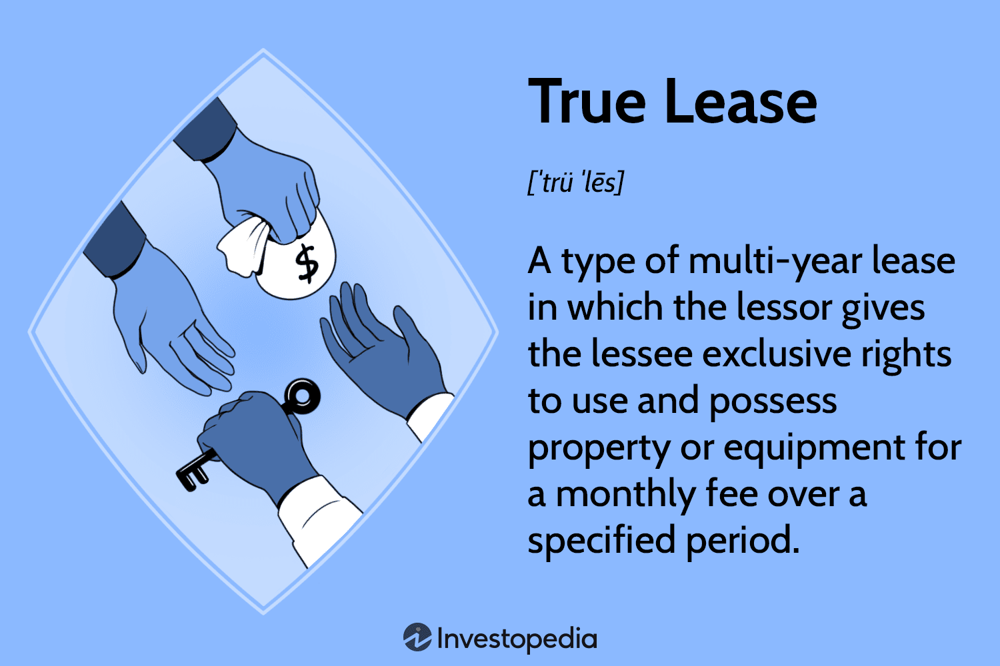

In today's dynamic financial landscape, leasing has become a strategic choice for businesses seeking to access high-value assets without the burden of significant upfront investments. This article examines the intricate world of leasing, focusing on true leases and finance leases, and elucidates their roles in the broader contexts of financial leasing and algorithmic trading.

Leases play a pivotal role in modern business operations. By understanding the various lease agreements and their financial implications, organizations can optimize their operational efficiency and leverage assets more effectively. The distinction between true leases, also known as operating leases, and finance leases is paramount; each serves different purposes and fits unique financial strategies. True leases offer the flexibility of using an asset without transferring ownership, allowing businesses to adapt to technological advancements and market dynamics. On the other hand, finance leases provide a clearer path toward ownership, impacting balance sheets differently and offering distinct financial benefits.



Beyond the basics of these lease types, the article also considers the broader implications of financial leasing on businesses. Financial leasing can help organizations conserve cash flow, enhance liquidity, and reallocate resources toward strategic investments, particularly in industries requiring rapid technological updates. Additionally, the integration of leasing within algorithmic trading platforms is explored, highlighting how such arrangements enable businesses to maintain access to the latest technology, crucial for high-frequency trading and stress testing scenarios.

Ultimately, this comprehensive guide aims to demystify lease agreements, improve financial literacy, and empower decision-makers to choose the leasing options that best suit their company's financial strategy and growth objectives. Understanding these complexities can have a profound impact on a company's financial health and strategic positioning. Readers will gain valuable insights to tailor leasing solutions to their specific business needs and circumstances.

## Table of Contents

## What is a True Lease?

True leases, commonly known as operating leases, offer lessees the opportunity to utilize an asset for a predetermined duration without transferring ownership rights. This arrangement is structured in a way that the asset does not appear on the lessee's balance sheet, an approach that categorizes the associated payments as operating expenses rather than capital expenditures. This off-balance-sheet financing is a significant advantage for businesses seeking to present a less leveraged financial position while maintaining necessary operational assets.

The flexibility provided by true leases can dramatically decrease the burden of asset management and related capital expenses. This flexibility allows businesses to allocate their financial resources toward other critical areas such as research and development, marketing, or unexpected expenditures. Furthermore, the structure of true leases permits companies to return, renew, or upgrade their equipment at the conclusion of the lease term, facilitating adaptation to ever-evolving technological advancements and shifting market demands. This adaptability is particularly critical for industries where technological change is rapid and constant upgrades are necessary to maintain competitiveness.

Additionally, true leases are advantageous for businesses that require equipment for a temporary period or those that aim to sustain financial agility. By leasing rather than purchasing, companies can avoid the long-term financial commitment of asset ownership while gaining the operational benefits of reliable equipment. This is particularly useful for start-ups or rapidly scaling enterprises where cash flow management and financial flexibility are paramount.

In summary, true leases offer a strategic pathway for businesses to use essential assets without the financial implications of full ownership, thereby enhancing operational efficiency and financial flexibility.

## Finance Lease Overview

Finance leases, commonly referred to as capital leases, serve as a contractual agreement where significant ownership risks and benefits are transferred to the lessee. These leases often bear similarities to asset purchase agreements. By design, finance leases entail recording the leased asset on the lessee’s balance sheet, resulting in both an asset and a corresponding liability. This accounting treatment distinguishes finance leases from true leases, which typically do not appear on the balance sheet as assets or liabilities.

A finance lease is generally preferred when a lessee plans to eventually own the asset or the lease term encompasses a substantial portion of the asset’s useful life. This form of leasing arrangement is particularly beneficial in scenarios where the asset is integral to the business's operations over an extended period, effectively functioning as a long-term investment.

The payments made under a finance lease consist of both a principal and an interest component. The principal component reduces the liability over time, while the interest component represents the cost of financing. This duality in payment structure influences a company's financial ratios and accounting practices. For instance, the presence of a finance lease affects metrics like return on assets (ROA), due to the inclusion of both the asset and the associated liability on the balance sheet.

The impact on financial statements can be further illustrated using the following Python code snippet to calculate the annual lease payment breakdown into principal and interest components:

```python
def calculate_lease_payment(lease_amount, interest_rate, periods):
    """
    Calculate the breakdown of annual lease payments into principal and interest.

    :param lease_amount: The total amount of the lease
    :param interest_rate: The annual interest rate as a decimal
    :param periods: The number of payment periods
    :return: A list of dictionaries containing principal and interest for each period
    """
    # Assuming equal payments for simplicity 
    payments = []
    remaining_balance = lease_amount

    for period in range(1, periods + 1):
        # Calculate interest for the period
        interest_payment = remaining_balance * interest_rate
        # Calculate total payment (assuming annuity due)
        total_payment = lease_amount * (interest_rate / (1 - (1 + interest_rate) ** -periods))
        # Calculate principal portion of the payment
        principal_payment = total_payment - interest_payment
        # Reduce the remaining balance by principal portion
        remaining_balance -= principal_payment
        # Store payment information
        payments.append({
            'Period': period,
            'Principal': principal_payment,
            'Interest': interest_payment,
            'Remaining Balance': remaining_balance
        })

    return payments

# Example usage
lease_amount = 100000  # Example lease amount
interest_rate = 0.05   # 5% interest rate
periods = 5            # 5-year lease

lease_payments = calculate_lease_payment(lease_amount, interest_rate, periods)
for payment in lease_payments:
    print(payment)
```

This code calculates each period's lease payment, distinguishing between principal and interest. By doing so, it provides clarity on how finance leases impact the lessee’s financial statements over time. Understanding such financial implications plays a crucial role in determining whether a finance lease aligns with a company’s strategic goals and financial strategies.

## Comparing True Lease and Finance Lease

When comparing true leases and finance leases, it is essential to understand the distinct financial and tax implications each type offers. True leases, commonly referred to as operating leases, provide non-ownership use of an asset. This means that the lessee can utilize the asset without having it on their balance sheet. The lease payments are treated as operating expenses, which are fully deductible, potentially offering tax advantages by reducing taxable income.

Conversely, a finance lease, also known as a capital lease, effectively acts as a purchase agreement. Here, the lessee assumes significant ownership risks and benefits, leading to the recording of the asset and its corresponding liability on the lessee's balance sheet. For finance leases, payments are divided into principal and interest components, both of which have tax implications. The interest component is deductible, and the asset itself is subject to depreciation, which can further impact the lessee's tax liability.

True leases are attractive for businesses seeking off-balance-sheet financing. This type of lease can help maintain financial statement ratios by not increasing the amount of debt or total assets. Finance leases, however, involve asset capitalization, which may affect a company’s leverage ratios but can be beneficial for businesses looking to gain depreciation benefits and ultimately acquire ownership of the asset.

Deciding between a true lease and a finance lease requires a careful assessment of various factors. Asset longevity is crucial; assets with long useful lives may be better suited for finance leases. In industries where technology is rapidly evolving, true leases provide the flexibility to upgrade without ownership burdens. Tax strategy also plays a critical role, as the different deduction methods affect the company’s overall tax liability. Finally, the overall financial position of a business, including its cash flow, creditworthiness, and balance sheet considerations, must guide this strategic decision. Understanding these nuances allows businesses to align their leasing choices with their financial goals and operational needs.

## Implications of Financial Leasing

Financial leasing enables businesses to access essential equipment without the burden of large upfront expenditures. This financial arrangement is particularly advantageous for companies seeking to conserve cash flow and enhance [liquidity](/wiki/liquidity-risk-premium), as it allows for the reallocation of financial resources toward strategic initiatives such as research and development or market expansion. By doing so, companies can maintain a competitive edge and adapt swiftly to changing market conditions.

In industries characterized by rapid technological advancements, financial leasing becomes especially critical. Companies operating within such sectors often require frequent updates to their equipment and technology to remain competitive. Leasing provides the flexibility to upgrade or replace equipment as needed, thereby avoiding obsolescence and ensuring operational efficiency.

Moreover, the strategic use of financial leasing can lead to optimized tax obligations. Leased assets might be eligible for certain tax deductions, such as lease payments being classified as operating expenses, unlike asset purchases that require capitalization and are subject to depreciation. This treatment can influence a company's taxable income favorably and result in reduced tax liabilities.

Additionally, financial leasing can improve a company's financial ratios. By keeping assets off the balance sheet, companies can maintain a healthier debt-to-equity ratio, potentially enhancing their creditworthiness and financial appearance to investors and stakeholders. Financial ratios such as return on assets (ROA) and return on equity (ROE) can also be positively affected, as leasing reduces asset base while maintaining or increasing net income.

Utilizing a strategic lease agreement could be exemplified in Python to calculate its impact on cash flow and financial ratios. For instance:

```python
def calculate_leasing_impact(cash_flow, tax_rate, lease_payment, asset_purchase_price):
    tax_savings = lease_payment * tax_rate
    adjusted_cash_flow = cash_flow + lease_payment - tax_savings

    # Assuming all else equal, calculate new ROA
    asset_base = asset_purchase_price - lease_payment
    net_income = cash_flow + tax_savings - lease_payment
    roa = net_income / asset_base if asset_base != 0 else 0

    return adjusted_cash_flow, roa

# Example values
cash_flow = 100000  # Initial cash flow
tax_rate = 0.3     # 30% tax rate
lease_payment = 20000  # Lease payment
asset_purchase_price = 500000  # Asset purchase price

adjusted_cash_flow, new_roa = calculate_leasing_impact(cash_flow, tax_rate, lease_payment, asset_purchase_price)

print(f"Adjusted Cash Flow: ${adjusted_cash_flow}")
print(f"New Return on Assets (ROA): {new_roa:.2%}")
```

By strategically coordinating financial leases, businesses can achieve more efficient capital management, position themselves better against rapid technological changes, and ultimately improve their financial performance and sustainability.

## Algorithmic Trading and Leasing

Algorithmic trading, characterized by high-frequency and high-speed transactions, is fundamentally dependent on state-of-the-art technology and robust networking infrastructures. These technological demands necessitate continuous access to advanced equipment, often achieved through financial leases. This leasing strategy allows algorithmic traders to acquire and utilize the latest hardware and software without the substantial upfront costs associated with outright purchases, thus preserving capital for investment strategies.

True leases, known for their flexibility, provide algorithmic traders with scalable solutions to accommodate the rapidly changing technological landscape. As technology evolves, true leases enable traders to upgrade or replace equipment, ensuring that their systems remain competitive and capable of handling increased trading volumes and complex computational models. This adaptability is crucial in the ever-evolving financial markets where latency and processing power can significantly impact profitability.

Moreover, the integration of [algorithmic trading](/wiki/algorithmic-trading) strategies requires leasing arrangements that can adjust to fluctuating trading volumes and various stress testing scenarios. Financial models used in algorithmic trading, such as quantitative strategies based on moving averages, stochastic calculus, or [machine learning](/wiki/machine-learning) algorithms, demand significant computational power and low-latency data processing. For instance, a trader may employ a Python-based [backtesting](/wiki/backtesting) environment like the one shown below to simulate trading strategies:

```python
import pandas as pd
import numpy as np
import matplotlib.pyplot as plt

# Simulate a simple moving average crossover strategy
def moving_average_crossover_strategy(data, short_window, long_window):
    signals = pd.DataFrame(index=data.index)
    signals['price'] = data['price']
    signals['short_mavg'] = data['price'].rolling(window=short_window, min_periods=1, center=False).mean()
    signals['long_mavg'] = data['price'].rolling(window=long_window, min_periods=1, center=False).mean()
    signals['signal'] = 0.0
    signals['signal'][short_window:] = np.where(signals['short_mavg'][short_window:] > signals['long_mavg'][short_window:], 1.0, 0.0)
    signals['positions'] = signals['signal'].diff()

    return signals

# Sample data
np.random.seed(0)
price_data = pd.DataFrame({'price': np.random.lognormal(mean=0, sigma=0.1, size=1000)}, index=pd.date_range('2020-01-01', periods=1000))

# Generate signals
signals = moving_average_crossover_strategy(price_data, 40, 100)

# Plot results
plt.figure(figsize=(10, 5))
plt.plot(signals['price'], label='Price')
plt.plot(signals['short_mavg'], label='Short MAvg')
plt.plot(signals['long_mavg'], label='Long MAvg')
plt.plot(signals['signals'][signals.positions == 1.0].index, signals.short_mavg[signals.positions == 1.0], '^', markersize=10, color='g', label='Buy Signal')
plt.plot(signals['signals'][signals.positions == -1.0].index, signals.short_mavg[signals.positions == -1.0], 'v', markersize=10, color='r', label='Sell Signal')
plt.legend()
plt.show()
```

This code exemplifies how computational resources might be utilized in testing trading strategies against historical data. Such complex simulations underscore the need for agile, scalable leasing solutions to maintain performance efficacy amidst varying operational demands.

Ultimately, leasing, particularly true leases, supports algorithmic trading operations by affording continuous access to necessary technology upgrades. This approach not only aligns with the strategic requirements of algorithmic trading but also serves to optimize financial efficiency and operational effectiveness, enabling traders to swiftly adapt to market developments without being encumbered by outdated technology or inflexible contracts.

## Conclusion

Selecting the appropriate leasing option between true leases and finance leases is crucial for aligning with a company’s financial strategy, asset requirements, and growth plans. True leases, often known as operating leases, fit businesses that value operational flexibility and aim to reduce ownership risks. These leases permit companies to use assets temporarily, offering the capability to return, renew, or upgrade the asset at the end of the lease term. This flexibility is suitable for industries experiencing rapid technological changes, as it allows businesses to adapt swiftly without heavy capital commitments.

On the other hand, finance leases—also referred to as capital leases—are more apt for businesses that have a strategic interest in eventually owning the asset. These leases effectively mimic asset purchase agreements by transferring significant ownership risks and rewards to the lessee. The inclusion of the asset on the lessee's balance sheet can lead to benefits like asset depreciation and interest deductions, which can influence a company’s tax considerations and balance sheet metrics positively.

Understanding the distinct characteristics of each lease type is vital as they have far-reaching consequences on a business's financial health and strategic market stance. The choice between a true lease and a finance lease can affect liquidity, asset management efficiency, tax liabilities, and ultimately, the strategic growth trajectory of a company.

Expert consultation with financial advisors is recommended for businesses to optimize lease agreements effectively. Financial advisors can provide insights into the cost-benefit analysis of leasing options, aligning them with broader corporate financial planning and sustainability goals. Such informed decisions ensure that companies leverage their leasing strategies to maintain competitiveness while securing financial stability.

## References & Further Reading

[1]: Beattie, V., Goodacre, A., & Thomson, S. (2000). ["Operating leases and the assessment of lease-debt substitutability."](https://eprints.gla.ac.uk/782/1/Jo_Bank_Fin_24%283%29427-470.pdf)00112-8) Journal of Banking & Finance, 24(3), 427-470.

[2]: ["Accounting for Leases: A New Approach."](https://openlibrary.org/books/OL23376514M/Accounting_for_leases) by Dean A. Campbell and Thomas W. Leland

[3]: Verma, R., & Jackson, R. (1997). ["Leasing: A flexible option for financing technology."](https://www.yeastgenome.org/reference/S000058188) IEEE Spectrum, 34(9), 26-31.

[4]: ["Financial Modeling and Valuation: A Practical Guide to Investment Banking and Private Equity"](https://books.google.com/books/about/Financial_Modeling_and_Valuation.html?id=Bet3zgEACAAJ) by Paul Pignataro

[5]: Hull, J. C. (2018). ["Options, Futures, and Other Derivatives"](https://www.semanticscholar.org/paper/Options%2C-Futures%2C-and-Other-Derivatives-Hull/89bdee500c8623864fc9eb7a471546aa713acc44) (10th Edition). Pearson.

[6]: Hull, J., & White, A. (2017). ["LIBOR vs OIS: The Derivatives Discounting Dilemma."](https://www-2.rotman.utoronto.ca/~hull/DownloadablePublications/LIBORvsOIS.pdf) Journal of Investment Management. 

[7]: ["Fixed Income Securities: Tools for Today's Markets"](https://www.amazon.com/Fixed-Income-Securities-Markets-Finance/dp/1119835550) by Bruce Tuckman and Angel Serrat