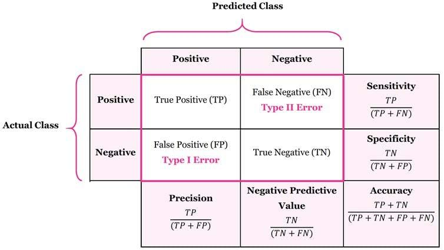

## Table of Contents

## What is a True Negative in the context of machine learning?

In machine learning, a True Negative is when a model correctly predicts that an instance does not belong to a certain class. Imagine you have a model that tries to identify if an email is spam or not. If the email is actually not spam and the model says it's not spam, that's a True Negative. It means the model got it right by saying "no" to the question "Is this spam?" when it should have said "no".

True Negatives are important because they help us understand how well a model performs at recognizing when something is not part of the class we're looking for. In medical tests, for example, a True Negative means the test correctly identified that a person does not have a disease. This is crucial because it helps avoid unnecessary treatments or worry. The rate of True Negatives, along with other metrics like True Positives, False Positives, and False Negatives, helps us measure the overall accuracy and reliability of a model.

## How is True Negative different from False Negative?

A True Negative happens when a model correctly says that something does not belong to a certain group. For example, if a test for a disease says you don't have the disease and you really don't, that's a True Negative. It means the model got it right by saying "no" when it should have said "no."

A False Negative is different because it happens when the model says "no" but it should have said "yes." For example, if the same disease test says you don't have the disease but you actually do, that's a False Negative. This is a mistake because the model missed something important. Both True Negatives and False Negatives are important to understand how well a model works, but they show different kinds of correct and incorrect predictions.

## Can you explain the role of True Negatives in a confusion matrix?

In a confusion matrix, True Negatives are one of the four key outcomes that help us understand how well a model is doing. A confusion matrix is like a table that shows how many times a model got its predictions right or wrong. True Negatives are found in the bottom-left corner of this table. They show the number of times the model correctly said "no" when it should have said "no." For example, if you're using a model to find out if emails are spam or not, True Negatives would be all the times the model correctly identified an email as not spam.

True Negatives are important because they tell us how good the model is at recognizing things that don't belong to the group we're looking for. If a model has a lot of True Negatives, it means it's doing a good job at saying "no" when it needs to. This is especially important in situations like medical tests, where saying "no" to a disease when someone really doesn't have it can help avoid unnecessary treatments or worry. By looking at True Negatives along with other parts of the confusion matrix, like True Positives, False Positives, and False Negatives, we can get a full picture of how well the model is working.

## Why are True Negatives important in evaluating the performance of a model?

True Negatives are important in evaluating the performance of a model because they show how well the model can correctly identify instances that do not belong to a certain class. For example, if you're using a model to detect spam emails, True Negatives are all the times the model correctly said an email is not spam. This is crucial because it tells us how reliable the model is at not making false alarms. If a model has a high number of True Negatives, it means it's good at saying "no" when it should say "no," which is important in many real-world applications, like medical tests where correctly identifying someone as disease-free can prevent unnecessary treatments and worry.

In addition to understanding the model's reliability, True Negatives help in calculating important performance metrics like specificity. Specificity is the proportion of actual negatives that are correctly identified by the model, and it's calculated as the number of True Negatives divided by the sum of True Negatives and False Positives, or $$ \text{Specificity} = \frac{\text{True Negatives}}{\text{True Negatives} + \text{False Positives}} $$. A high specificity means the model is very good at ruling out the condition or class in question. By looking at True Negatives alongside other metrics like True Positives, False Positives, and False Negatives, we can get a complete picture of how well the model performs and make informed decisions about its use in practical scenarios.

## How do True Negatives affect the calculation of specificity in a model?

True Negatives are really important when we want to find out how good a model is at saying "no" when it should say "no." In the world of [machine learning](/wiki/machine-learning), we use something called specificity to measure this. Specificity tells us how well a model can rule out something that's not there. To calculate specificity, we look at the number of True Negatives and compare it to the total number of times the model said "no," which includes both True Negatives and False Positives. The formula for specificity is $$ \text{Specificity} = \frac{\text{True Negatives}}{\text{True Negatives} + \text{False Positives}} $$. A high number of True Negatives means the model is good at correctly saying "no," which makes the specificity higher.

In practical terms, having a lot of True Negatives is great because it means the model is reliable at telling us when something isn't there. For example, if we're using a model to test for a disease, a high number of True Negatives means the model is good at saying someone doesn't have the disease when they really don't. This is super important because it helps avoid unnecessary worry or treatments. So, True Negatives play a big role in making sure the model's specificity is as high as possible, which helps us trust the model more when it says something isn't there.

## What are some common scenarios where maximizing True Negatives is crucial?

In medical testing, maximizing True Negatives is super important. Imagine a test for a disease like cancer. If the test can correctly say someone doesn't have cancer when they really don't, that's a True Negative. A lot of True Negatives means fewer people will get worried or go through treatments they don't need. This is really helpful because it saves time, money, and reduces stress for patients. The formula for specificity, which shows how good the test is at saying "no" when it should, is $$ \text{Specificity} = \frac{\text{True Negatives}}{\text{True Negatives} + \text{False Positives}} $$. A high number of True Negatives makes the specificity higher, which means the test is more reliable.

Another common scenario is in security systems, like those that detect fraud in credit card transactions. If the system can correctly say a transaction is not fraudulent when it really isn't, that's a True Negative. Having a lot of True Negatives means fewer innocent transactions get flagged, which is good because it keeps the system from bothering people with false alarms. This helps keep customers happy and trust the system more. Just like in medical testing, the more True Negatives there are, the better the system is at saying "no" to fraud when it should.

## How can True Negatives be used to improve a machine learning model?

True Negatives help us make a machine learning model better by showing how well it can say "no" when it should. In a confusion matrix, True Negatives are the times the model correctly said something doesn't belong to a group. For example, if you're using a model to find out if emails are spam or not, True Negatives are all the times it correctly said an email is not spam. By looking at how many True Negatives the model has, we can see if it's good at not making false alarms. If there are a lot of True Negatives, it means the model is reliable at saying "no," which is important in many real-world situations like medical tests or security systems.

To improve the model, we can use True Negatives to calculate something called specificity. Specificity tells us how good the model is at ruling out something that's not there. The formula for specificity is $$ \text{Specificity} = \frac{\text{True Negatives}}{\text{True Negatives} + \text{False Positives}} $$. If the specificity is high, it means the model is doing a good job at saying "no" when it should. By focusing on increasing True Negatives, we can make the model better at not missing important things and at not causing unnecessary worry or action. This helps make the model more trustworthy and useful in practical applications.

## What are the challenges in increasing the number of True Negatives without affecting other metrics?

Increasing the number of True Negatives can be tricky because it might mess up other important measures like True Positives, False Positives, and False Negatives. For example, if we make the model really strict to avoid saying "yes" when it should say "no," it might miss some things it should catch, leading to more False Negatives. This means the model might be good at saying an email is not spam when it really isn't, but it might also miss some spam emails, which isn't good. So, we have to find a balance where the model can correctly say "no" a lot without missing too many "yes" cases.

One way to work on this is by adjusting the model's decision threshold. The threshold is like a line the model uses to decide if something is a "yes" or a "no." If we move the threshold to make it harder for the model to say "yes," we might get more True Negatives, but we need to watch out for the impact on other metrics. The formula for specificity, which tells us how good the model is at saying "no" when it should, is $$ \text{Specificity} = \frac{\text{True Negatives}}{\text{True Negatives} + \text{False Positives}} $$. By carefully tuning this threshold and using techniques like cross-validation to test the model on different data sets, we can try to increase True Negatives without making the model too bad at catching the things it should.

## Can you discuss the impact of class imbalance on True Negatives?

Class imbalance happens when there are a lot more examples of one class than another in your data. For example, if you're trying to detect a rare disease, you might have way more people without the disease (negative class) than with it (positive class). When you have this kind of imbalance, it can be hard to get a lot of True Negatives without messing up other important measures like True Positives. If the model focuses too much on the negative class because there are so many examples, it might get really good at saying "no" to the disease when someone doesn't have it, but it might miss catching the disease when someone actually does have it.

To deal with class imbalance, you can try different things like changing the model's decision threshold. The threshold is like a line the model uses to decide if something is a "yes" or a "no." If you move the threshold to make it harder for the model to say "yes," you might get more True Negatives, but you have to be careful because it could lead to more False Negatives. The formula for specificity, which tells us how good the model is at saying "no" when it should, is $$ \text{Specificity} = \frac{\text{True Negatives}}{\text{True Negatives} + \text{False Positives}} $$. By carefully tuning this threshold and using techniques like cross-validation to test the model on different data sets, you can try to increase True Negatives without making the model too bad at catching the things it should.

## How do different machine learning algorithms handle True Negatives differently?

Different machine learning algorithms can handle True Negatives in different ways because of how they are built and what they focus on. For example, logistic regression tries to find a line that separates the "yes" and "no" classes. It uses a thing called a decision threshold to decide if something is a "yes" or a "no." If you change this threshold, you can make the model better at saying "no" when it should, which means more True Negatives. But, you have to be careful because changing the threshold might also make the model miss some "yes" cases, which isn't good. The formula for specificity, which tells us how good the model is at saying "no" when it should, is $$ \text{Specificity} = \frac{\text{True Negatives}}{\text{True Negatives} + \text{False Positives}} $$. So, by tuning the threshold, logistic regression can balance getting more True Negatives without messing up too much on other important measures.

Decision trees and random forests, on the other hand, work by splitting the data into smaller groups based on different features. They can be really good at finding patterns that help them say "no" correctly, but sometimes they can overfit, which means they might be too focused on the training data and not do as well on new data. This can affect how well they do at getting True Negatives. To fix this, you can use techniques like pruning the tree or using more trees in a random forest to make the model more balanced. Support Vector Machines (SVMs) try to find the best line to separate the classes and can be really good at getting True Negatives if the classes are well separated. But, if the classes are mixed up, SVMs might struggle more. Each type of algorithm has its own way of dealing with True Negatives, and the best one to use depends on the specific problem and data you're working with.

## What advanced techniques can be used to optimize True Negatives in complex models?

In complex models, one advanced technique to optimize True Negatives is by using cost-sensitive learning. This means we tell the model that making certain kinds of mistakes is more important than others. For example, if we want more True Negatives, we can make the model know that saying "yes" when it should say "no" (a False Positive) is a bigger mistake than saying "no" when it should say "yes" (a False Negative). By adjusting these costs, we can make the model focus more on getting the "no" cases right, which helps increase True Negatives. The formula for specificity, which shows how good the model is at saying "no" when it should, is $$ \text{Specificity} = \frac{\text{True Negatives}}{\text{True Negatives} + \text{False Positives}} $$. By using cost-sensitive learning, we can try to make this number higher without messing up the model's ability to catch the "yes" cases.

Another technique is ensemble methods, like boosting or bagging. These methods combine several models to make a stronger one. For example, boosting can focus on the examples the model got wrong, which might help it get better at saying "no" when it should. By using these methods, we can make the model more reliable at getting True Negatives. It's like having a team of models working together to make sure they don't miss the "no" cases. Ensemble methods can help balance the model's performance across all kinds of predictions, making it good at saying "no" without missing too many "yes" cases.

## How can True Negatives be interpreted in the context of multi-class classification problems?

In multi-class classification, where a model has to choose between more than two classes, True Negatives can be a bit trickier to understand. In this setup, a True Negative happens when the model correctly says that an example doesn't belong to a certain class. For example, if you're classifying animals into cats, dogs, and birds, and the model says a picture is not a cat and it's really not a cat, that's a True Negative for the "cat" class. But, because there are multiple classes, you might have True Negatives for each class. So, if the picture is actually a dog, it's a True Negative for both the "cat" and "bird" classes.

To measure how well the model does at getting True Negatives in multi-class problems, we can use something called specificity for each class. Specificity tells us how good the model is at saying "no" when it should for a specific class. The formula for specificity in a multi-class setting is the same as in binary classification, but you calculate it for each class. For example, for the "cat" class, specificity would be $$ \text{Specificity}_{\text{cat}} = \frac{\text{True Negatives}_{\text{cat}}}{\text{True Negatives}_{\text{cat}} + \text{False Positives}_{\text{cat}}} $$. By looking at the specificity for each class, we can see how well the model does at correctly saying "no" to each class, which helps us understand its overall performance in multi-class classification.

## References & Further Reading

[1]: Saito, T., & Rehmsmeier, M. (2015). ["The precision-recall plot is more informative than the ROC plot when evaluating binary classifiers on imbalanced datasets."](https://journals.plos.org/plosone/article?id=10.1371/journal.pone.0118432) Knowledge and Information Systems, 42(3), 627-644.

[2]: Powers, D. M. W. (2011). ["Evaluation: From Precision, Recall and F-Measure to ROC, Informedness, Markedness & Correlation."](https://arxiv.org/abs/2010.16061) Journal of Machine Learning Technologies, 2(1), 37-63.

[3]: Fawcett, T. (2006). ["An Introduction to ROC Analysis."](https://www.researchgate.net/publication/222511520_Introduction_to_ROC_analysis) Pattern Recognition Letters, 27(8), 861-874.

[4]: Provost, F., & Fawcett, T. (2013). ["Data Science for Business: What You Need to Know about Data Mining and Data-Analytic Thinking."](https://www.researchgate.net/publication/256438799_Data_Science_for_Business) O'Reilly Media.

[5]: Hand, D. J., & Anagnostopoulos, C. (2014). ["A Handbook of Statistical Analyses using SAS."](https://www.ehu.eus/ccwintco/uploads/9/93/A_Handbook_of_Statistical_Analyses_Using_R_Second_Edition.pdf) Chapman and Hall/CRC.