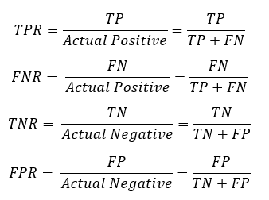

## Table of Contents

## What is the True Positive Rate (TPR) in machine learning?

The True Positive Rate (TPR), also known as sensitivity or recall, is a measure used in machine learning to evaluate the performance of a classification model. It specifically tells us how good a model is at identifying positive cases correctly. In simpler terms, TPR is the ratio of the number of true positives (instances correctly identified as positive) to the total number of actual positives (which includes both true positives and false negatives). The formula for TPR can be written as $$ \text{TPR} = \frac{\text{True Positives}}{\text{True Positives} + \text{False Negatives}} $$. 

Understanding TPR is crucial when the cost of missing a positive case is high, such as in medical diagnoses where failing to identify a disease could be harmful. For example, if a model is used to predict whether a patient has a certain disease, a high TPR means the model is good at catching the disease when it is present. However, it's important to balance TPR with other metrics like the False Positive Rate because focusing solely on TPR might lead to a model that over-predicts positives, which could also be problematic.

## How is TPR calculated?

The True Positive Rate (TPR) is calculated by dividing the number of true positives by the total number of actual positives. True positives are the cases that the model correctly identified as positive. Actual positives include both the true positives and the false negatives, which are the cases that the model incorrectly identified as negative when they were actually positive. The formula for TPR is $$ \text{TPR} = \frac{\text{True Positives}}{\text{True Positives} + \text{False Negatives}} $$. This calculation gives you a number between 0 and 1, where a higher number means the model is better at identifying positive cases.

For example, imagine a model that's trying to predict if emails are spam or not. If out of 100 actual spam emails, the model correctly identifies 90 as spam, then the true positives are 90. If the model incorrectly labels 10 of those spam emails as not spam, those are the false negatives. Using the formula, the TPR would be $$ \text{TPR} = \frac{90}{90 + 10} = \frac{90}{100} = 0.9 $$. This means the model has a 90% True Positive Rate, which is quite good at identifying spam emails.

## What is the difference between TPR and sensitivity?

True Positive Rate (TPR) and sensitivity are actually the same thing in the world of machine learning and statistics. They both measure how well a model can find the positive cases correctly. The formula for both TPR and sensitivity is $$ \text{TPR} = \text{Sensitivity} = \frac{\text{True Positives}}{\text{True Positives} + \text{False Negatives}} $$. This means they are calculated in the same way, by dividing the number of true positives by the total number of actual positives.

In simple terms, if you're using a test or a model to check for something like a disease, TPR and sensitivity tell you how good the test is at catching the disease when it's really there. So, whether you call it TPR or sensitivity, it's all about how well the model or test can say "yes" when the answer should be "yes".

## Why is TPR important in evaluating a classification model?

The True Positive Rate (TPR) is important in evaluating a classification model because it tells us how well the model can correctly identify the positive cases. In simple terms, it shows the model's ability to say "yes" when it should. This is crucial in many fields, like medicine where missing a disease can be harmful, or in security systems where failing to detect a threat can be dangerous. A high TPR means the model is good at catching what it's supposed to catch, which can be very important depending on the application.

However, TPR alone isn't enough to fully evaluate a model. It needs to be balanced with other metrics like the False Positive Rate (FPR), which tells us how often the model incorrectly says "yes" when it should say "no". If a model has a high TPR but also a high FPR, it might not be very useful because it's over-predicting positives. So, while TPR is a key measure of a model's performance, it's best used alongside other metrics to get a complete picture of how well the model works.

## How does TPR relate to the confusion matrix?

The True Positive Rate (TPR) is directly linked to the confusion matrix, which is a table used to evaluate the performance of a classification model. In a confusion matrix, you see four categories: True Positives (TP), True Negatives (TN), False Positives (FP), and False Negatives (FN). TPR, also known as sensitivity or recall, focuses on the positive cases. It is calculated by taking the number of True Positives and dividing it by the sum of True Positives and False Negatives. The formula for TPR is $$ \text{TPR} = \frac{\text{True Positives}}{\text{True Positives} + \text{False Negatives}} $$. This means TPR looks at how many of the actual positive cases the model correctly identified as positive.

Understanding the confusion matrix helps you see where the TPR comes from. Imagine the matrix as a grid. The top row shows what the model predicted, and the left column shows the actual outcomes. The True Positives are in the top-left cell of the grid, where the model's prediction and the actual outcome both say "yes". The False Negatives are in the bottom-left cell, where the model said "no" but the actual outcome was "yes". By using these numbers from the confusion matrix, TPR gives you a clear picture of how well the model catches the positive cases, which is vital for understanding the model's effectiveness in identifying what it's supposed to identify.

## Can you explain TPR with a simple example?

Imagine you have a test that checks if apples are ripe or not. Out of 100 apples, 60 are actually ripe. Your test correctly identifies 54 of these ripe apples as ripe. These 54 apples are the true positives because the test got them right. However, the test misses 6 ripe apples and says they are not ripe. These 6 apples are the false negatives because the test got them wrong.

The True Positive Rate (TPR) tells us how good the test is at finding the ripe apples. To find the TPR, we use the formula $$ \text{TPR} = \frac{\text{True Positives}}{\text{True Positives} + \text{False Negatives}} $$. In this example, the TPR is $$ \text{TPR} = \frac{54}{54 + 6} = \frac{54}{60} = 0.9 $$. This means the test has a 90% True Positive Rate, which is pretty good at catching the ripe apples.

## What are the implications of a high TPR in a model?

A high True Positive Rate (TPR) in a model means the model is very good at finding the things it's supposed to find. For example, if you're using a test to check for a disease, a high TPR means the test is good at catching the disease when it's really there. This is important in situations where missing a positive case could be harmful or dangerous, like in medical diagnoses or security systems. A high TPR gives you confidence that the model is doing a good job at identifying what it needs to.

However, a high TPR alone doesn't tell the whole story. It's possible for a model to have a high TPR but also make a lot of mistakes by saying "yes" when it should say "no". This is measured by the False Positive Rate (FPR). If the FPR is also high, the model might not be very useful because it's over-predicting positives. So, while a high TPR is good, you need to look at other measures like FPR to make sure the model is really performing well overall.

## How does TPR affect the ROC curve?

The True Positive Rate (TPR) is a key part of the ROC (Receiver Operating Characteristic) curve. The ROC curve shows how well a model can tell the difference between positive and negative cases at different thresholds. TPR, which is the same as sensitivity, is plotted on the y-axis of the ROC curve. It shows the percentage of positive cases that the model correctly identifies. The x-axis of the ROC curve shows the False Positive Rate (FPR), which is the percentage of negative cases that the model incorrectly identifies as positive. As you change the threshold for deciding what's positive and what's negative, the TPR and FPR change, and you get different points on the ROC curve.

A high TPR means the model is good at catching the positive cases, which makes the ROC curve go up higher on the y-axis. If the model is perfect, the ROC curve would go straight up to the top left corner, where TPR is 1 and FPR is 0. In real life, though, models aren't perfect, so the ROC curve usually forms a curve that shows how TPR and FPR trade off against each other. The more the curve bends towards the top left corner, the better the model is at separating the positive and negative cases. So, TPR is important because it helps you see how well the model is doing at finding the positive cases, which is a big part of what the ROC curve is all about.

## What are some common scenarios where TPR is particularly useful?

True Positive Rate (TPR) is especially useful in medical testing. For example, if you're using a test to check for a disease like cancer, TPR tells you how good the test is at finding the disease when it's really there. A high TPR means the test is good at catching the disease, which is really important because missing a disease can be very harmful. The formula for TPR is $$ \text{TPR} = \frac{\text{True Positives}}{\text{True Positives} + \text{False Negatives}} $$. So, if a test has a high TPR, doctors can trust it more to help them find diseases early and start treatment sooner.

TPR is also very helpful in security systems, like those used to detect threats or fraud. For instance, if a system is checking emails to see if they are spam, a high TPR means the system is good at finding the spam emails. This is important because missing a dangerous email can cause problems. A high TPR helps make sure that the system catches the threats it's supposed to catch, making it more reliable and useful for keeping things safe.

## How can TPR be used in conjunction with other metrics like False Positive Rate?

True Positive Rate (TPR) is a key metric that tells us how well a model can find the positive cases. But to get a full picture of how good a model is, we need to look at it with other metrics like the False Positive Rate (FPR). TPR, which is also called sensitivity or recall, is calculated with the formula $$ \text{TPR} = \frac{\text{True Positives}}{\text{True Positives} + \text{False Negatives}} $$. This tells us how many of the actual positive cases the model correctly identified as positive. On the other hand, FPR tells us how often the model says something is positive when it's really negative. It's calculated with the formula $$ \text{FPR} = \frac{\text{False Positives}}{\text{False Positives} + \text{True Negatives}} $$. By looking at both TPR and FPR, we can see if the model is good at finding the right things without making too many mistakes.

Using TPR and FPR together helps us understand the trade-offs in a model's performance. For example, if a model has a high TPR but also a high FPR, it means the model is good at catching the positive cases but it's also saying "yes" too often when it should say "no". This can be a problem in situations where false alarms are costly or annoying, like in spam email filters or medical tests. By adjusting the threshold of the model, we can change the balance between TPR and FPR to find a sweet spot that works best for our needs. This balance is often shown on a graph called the ROC curve, where TPR is on the y-axis and FPR is on the x-axis. A model that does well will have a curve that bends towards the top left corner of the graph, showing high TPR and low FPR.

## What are the challenges in optimizing TPR in imbalanced datasets?

Optimizing the True Positive Rate (TPR) in imbalanced datasets can be tough because these datasets have a lot more examples of one type than the other. For example, if you're trying to predict rare diseases, most of the data will be about people who don't have the disease. When you train a model on this kind of data, it might get really good at predicting the common cases (like saying "no disease") but not so good at finding the rare ones (like saying "disease"). This means the TPR, which is calculated as $$ \text{TPR} = \frac{\text{True Positives}}{\text{True Positives} + \text{False Negatives}} $$, might be low because the model struggles to find the positive cases.

To make things better, you can try different techniques. One way is to balance the data by adding more examples of the rare case or taking away some of the common ones. Another way is to use special methods in the model that pay more attention to the rare cases. But even with these tricks, it's hard to get a high TPR without messing up other important measures like the False Positive Rate (FPR). So, finding the right balance is a big challenge when you're working with imbalanced data.

## How can advanced techniques like threshold tuning impact TPR?

Threshold tuning is a way to change how a model decides if something is positive or negative. By adjusting the threshold, you can make the model more or less likely to say "yes". When you lower the threshold, the model becomes more sensitive and will catch more positive cases, which makes the True Positive Rate (TPR) go up. TPR is calculated as $$ \text{TPR} = \frac{\text{True Positives}}{\text{True Positives} + \text{False Negatives}} $$. So, if you want to find more of the positive cases, you might lower the threshold to increase the TPR.

But there's a catch. When you lower the threshold to get a higher TPR, the model might also start saying "yes" to more things that are actually negative. This means the False Positive Rate (FPR) goes up too. You have to find a balance that works for what you need. For example, in medical tests, you might want a high TPR to catch all the diseases, but you also don't want too many false alarms. So, threshold tuning helps you adjust the model to get the best TPR without making the FPR too high.