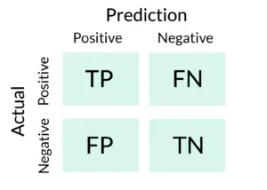

## Table of Contents

## What is a True Positive in the context of machine learning?

In machine learning, a True Positive (TP) is when a model correctly identifies a positive case. Imagine you're using a model to detect if an email is spam. If the email is actually spam and the model labels it as spam, that's a True Positive. It means the model did its job right in spotting the positive case, which in this example is spam.

True Positives are important because they show how well a model can find what it's looking for. In medical tests, for example, a True Positive means the test correctly identified a disease in a patient who really has it. The more True Positives a model has, the better it is at its job. But, it's also important to look at other measures like False Positives and True Negatives to get the full picture of how good a model is.

## How is a True Positive different from a False Positive?

A True Positive and a False Positive are two different outcomes when a model makes a prediction. A True Positive happens when the model correctly identifies something as positive. For example, if a model is looking for sick people and it finds someone who is actually sick, that's a True Positive. It means the model did a good job at spotting the right thing.

On the other hand, a False Positive is when the model says something is positive, but it's actually not. Using the same example, if the model says someone is sick, but they're actually healthy, that's a False Positive. This can be a problem because it might cause unnecessary worry or action, like getting more tests or treatments that aren't needed.

To sum up, True Positives are good because they show the model is working well. False Positives are not good because they can lead to mistakes and extra work. Both are important to think about when you're checking how well a model is doing its job.

## Can you explain the concept of True Positive with a simple example?

Imagine you have a machine that can tell if a fruit is an apple or not. You show it a bunch of fruits, and it says "Yes, this is an apple" when you show it an actual apple. That's a True Positive. It means the machine got it right and correctly identified the apple.

In this example, the machine's job is to find apples. When it sees an apple and says it's an apple, it's doing exactly what it's supposed to do. True Positives are important because they show how good the machine is at finding what it's looking for. If the machine can find all the apples correctly, it's doing a great job.

## What role does True Positive play in evaluating a machine learning model's performance?

True Positive is a key part of figuring out how well a [machine learning](/wiki/machine-learning) model is doing its job. It tells us how many times the model got it right when it said something was positive. For example, if a model is trying to find pictures of cats and it correctly says "yes, that's a cat" when it sees a cat, that's a True Positive. The more True Positives a model has, the better it is at finding what it's looking for.

True Positives are used in important formulas like accuracy, precision, and recall. Accuracy is how often the model is right overall, and it uses True Positives along with other outcomes like True Negatives, False Positives, and False Negatives. Precision looks at how many of the positive predictions were actually right, and recall checks how many of the actual positives were caught by the model. Both precision and recall use True Positives to help us understand the model's performance in different ways. For example, precision can be written as $$ \text{Precision} = \frac{\text{True Positives}}{\text{True Positives} + \text{False Positives}} $$, and recall as $$ \text{Recall} = \frac{\text{True Positives}}{\text{True Positives} + \text{False Negatives}} $$. By looking at these numbers, we can see how good the model is at finding the right things and avoiding mistakes.

## How is True Positive used in calculating accuracy?

True Positive is an important piece of information when we want to figure out how accurate a machine learning model is. Accuracy tells us how often the model is right overall. To find accuracy, we need to know about True Positives, which are the times the model correctly said something was positive. We also need to know about True Negatives, which are the times the model correctly said something was negative, False Positives, which are the times the model wrongly said something was positive, and False Negatives, which are the times the model wrongly said something was negative. The formula for accuracy is $$ \text{Accuracy} = \frac{\text{True Positives} + \text{True Negatives}}{\text{True Positives} + \text{True Negatives} + \text{False Positives} + \text{False Negatives}} $$. This formula shows us that True Positives are a big part of figuring out how accurate the model is.

When we use True Positives in the accuracy formula, we're looking at how many times the model got it right when it said something was positive. If the model is good at finding the things it's supposed to find, it will have a lot of True Positives. This means the model is doing a good job at its main task. But accuracy is not just about True Positives; it's also about True Negatives, False Positives, and False Negatives. All these numbers together give us a full picture of how well the model is doing. By looking at all these pieces, we can decide if the model is accurate enough for what we need it to do.

## What is the relationship between True Positive and sensitivity in a confusion matrix?

In a confusion matrix, True Positive is the number of times a model correctly identifies a positive case. Sensitivity, also known as the recall or true positive rate, measures how good the model is at finding all the positive cases. It's the ratio of True Positives to the total number of actual positive cases, which includes True Positives and False Negatives. The formula for sensitivity is $$ \text{Sensitivity} = \frac{\text{True Positives}}{\text{True Positives} + \text{False Negatives}} $$. This means sensitivity tells us what percentage of all the positive cases the model correctly found.

The relationship between True Positive and sensitivity is straightforward: True Positive is the numerator in the sensitivity formula. If a model has a high number of True Positives, it will have a high sensitivity, showing that it's good at catching the positive cases. But if the model misses a lot of positive cases, resulting in many False Negatives, the sensitivity will be lower, even if there are some True Positives. So, True Positive directly affects how sensitive the model is to detecting positive cases.

## How can True Positive Rate be used to compare different models?

True Positive Rate, also known as sensitivity or recall, is a useful measure when you want to compare how well different models can find the things they're looking for. It tells you the percentage of actual positive cases that a model correctly identifies. The formula for True Positive Rate is $$ \text{True Positive Rate} = \frac{\text{True Positives}}{\text{True Positives} + \text{False Negatives}} $$. If one model has a higher True Positive Rate than another, it means the first model is better at catching the positive cases. For example, if you're comparing two models that detect spam emails, the one with a higher True Positive Rate will find more of the actual spam emails.

When you're comparing models, it's important to look at the True Positive Rate along with other measures like False Positive Rate. This is because a model might have a high True Positive Rate but also a high False Positive Rate, meaning it catches a lot of the positive cases but also makes a lot of mistakes. So, you need to balance these measures to pick the best model for your needs. If you're trying to find a model that's really good at catching all the positive cases without missing any, you'd want to focus on the one with the highest True Positive Rate.

## What are the implications of maximizing True Positives in a model?

Maximizing True Positives in a model means trying to make sure the model catches as many of the actual positive cases as possible. For example, if you're using a model to find sick people, you want it to find all the people who are really sick. This is important because missing a positive case can be serious, like missing a disease in someone who needs treatment. The more True Positives a model has, the higher its sensitivity or recall, which is calculated as $$ \text{Sensitivity} = \frac{\text{True Positives}}{\text{True Positives} + \text{False Negatives}} $$. A high sensitivity means the model is good at finding what it's looking for, which is often a key goal in many applications.

However, focusing too much on maximizing True Positives can lead to other problems. If a model tries too hard to find all the positive cases, it might start labeling things as positive that aren't really positive, leading to more False Positives. For example, if the model is trying to find spam emails and it labels too many regular emails as spam, it can cause a lot of trouble for people. So, while it's good to have a high number of True Positives, you also need to think about the balance with False Positives. This balance is often measured by looking at other metrics like precision, which is $$ \text{Precision} = \frac{\text{True Positives}}{\text{True Positives} + \text{False Positives}} $$. A good model will try to find a balance between catching all the positive cases and not making too many mistakes.

## How does the choice of threshold affect the number of True Positives?

The choice of threshold in a machine learning model can change how many True Positives the model finds. A threshold is like a line the model uses to decide if something is positive or not. If you set the threshold low, the model will say "yes, this is positive" more often. This can mean more True Positives because the model will catch more of the actual positive cases. But, it can also lead to more False Positives, which are mistakes where the model says something is positive when it's not.

On the other hand, if you set the threshold high, the model will be more careful and only say "yes, this is positive" when it's really sure. This can mean fewer True Positives because the model might miss some of the actual positive cases. But, it can also lead to fewer False Positives because the model is less likely to make mistakes. So, choosing the right threshold is important because it affects how many True Positives the model finds and how many mistakes it makes.

## In what scenarios might a high True Positive rate be misleading?

A high True Positive rate can be misleading if the model is also making a lot of False Positives. Imagine you have a test to find sick people, and the test says a lot of people are sick when they're not. Even if the test finds most of the sick people correctly (high True Positive rate), it's not very useful because it's also saying a lot of healthy people are sick. This means the test isn't good at telling the difference between sick and healthy people. The True Positive rate by itself doesn't tell the whole story; you need to look at other things like the False Positive rate too.

For example, if you're using a model to detect spam emails, a high True Positive rate means it's good at finding spam. But if it also labels a lot of regular emails as spam (high False Positive rate), it can be annoying and not very helpful. To understand how good a model really is, you need to look at a balance of measures. One way to do this is by looking at the precision, which is calculated as $$ \text{Precision} = \frac{\text{True Positives}}{\text{True Positives} + \text{False Positives}} $$. A high True Positive rate with a low precision might mean the model is catching a lot of the right things but also making a lot of mistakes.

## How can True Positive be optimized in imbalanced datasets?

When you're working with imbalanced datasets, where one class has a lot more examples than the other, it can be hard to get a good number of True Positives. The model might learn to always guess the class with more examples, which means it might miss a lot of the positive cases. To fix this, you can use a few tricks. One way is to use something called "oversampling," where you make more copies of the positive examples to balance things out. Another way is "undersampling," where you take away some of the examples from the bigger class. These methods help the model see more of the positive cases, so it can learn to find them better and increase the number of True Positives.

Another way to optimize True Positives in imbalanced datasets is by changing the cost of mistakes. You can tell the model that missing a positive case (a False Negative) is a bigger mistake than labeling a negative case as positive (a False Positive). This makes the model try harder to find the positive cases, which can lead to more True Positives. You can do this by adjusting what's called the "class weights" in the model. By giving more weight to the positive class, the model will focus more on getting those right. This can be done in many machine learning libraries, like in scikit-learn, where you can set the `class_weight` parameter to `'balanced'` to automatically adjust the weights based on the class sizes.

## What advanced techniques can be used to improve True Positive rates in complex models?

When you're trying to make a complex model better at finding the right things, you can use a technique called "ensemble methods." This means you use more than one model together to make better guesses. One popular way to do this is with "boosting," where you train models one after the other, and each new model tries to fix the mistakes of the last one. This can help catch more of the positive cases that the first models missed. Another way is "bagging," where you train lots of models on different parts of your data and then let them vote on what the answer should be. This can help make sure you don't miss any positive cases because you're looking at the data from different angles.

You can also use "[deep learning](/wiki/deep-learning)" to improve True Positive rates. Deep learning models, like neural networks, are good at finding patterns in data that are hard to see. By making the model bigger or changing how it works, you can make it better at finding the positive cases. For example, you can use "transfer learning," where you start with a model that's already good at something similar and then teach it to do your specific task. This can help the model find more True Positives because it's starting with a good base of knowledge. Another trick is to use "[data augmentation](/wiki/data-augmentation)," where you make more data by changing the data you already have. This can help the model see more examples of positive cases, so it gets better at finding them.

## References & Further Reading

[1]: Fawcett, T. (2006). ["An Introduction to ROC Analysis."](https://www.sciencedirect.com/science/article/pii/S016786550500303X) Pattern Recognition Letters, 27(8).

[2]: Powers, D. M. (2011). ["Evaluation: From Precision, Recall and F-Measure to ROC, Informedness, Markedness & Correlation."](https://arxiv.org/abs/2010.16061) Journal of Machine Learning Technologies, 2(1).

[3]: Saito, T., & Rehmsmeier, M. (2015). ["The Precision-Recall Plot is More Informative than the ROC Plot When Evaluating Binary Classifiers on Imbalanced Datasets."](https://journals.plos.org/plosone/article?id=10.1371/journal.pone.0118432) PLoS ONE, 10(3).

[4]: Kuhn, M., & Johnson, K. (2013). ["Applied Predictive Modeling."](https://link.springer.com/book/10.1007/978-1-4614-6849-3) Springer.

[5]: Drummond, C., & Holte, R. C. (2006). ["Cost Curves: An Improved Method for Visualizing Classifier Performance."](https://link.springer.com/article/10.1007/s10994-006-8199-5) Machine Learning, 65(1).