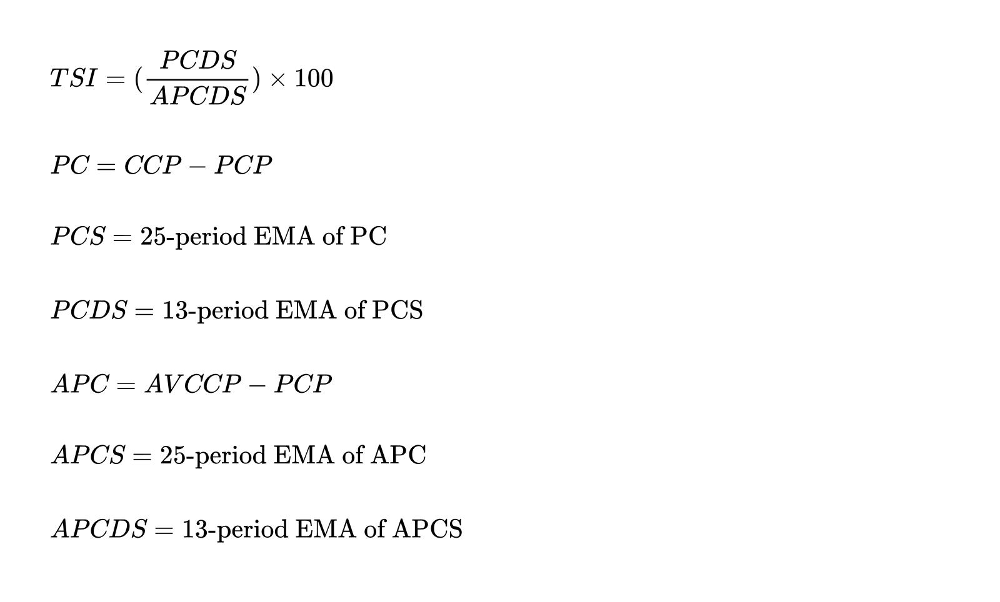

## Table of Contents

## What is the True Strength Index (TSI)?

The True Strength Index (TSI) is a technical indicator used by traders to measure the strength of a stock's price movement. It helps to identify trends and potential reversals by comparing the current price to the price from a certain number of periods ago. The TSI is unique because it uses both price and momentum to give a more complete picture of a stock's movement. It's calculated using a double smoothing process, which means it takes the average of the price changes over time, then takes the average of those averages.

The TSI can be used to spot when a stock is overbought or oversold. When the TSI line moves above zero, it suggests that the stock's price is gaining strength, and when it moves below zero, it indicates the price is losing strength. Traders often look for crossovers of the TSI line with a signal line, similar to how they use moving averages. If the TSI line crosses above the signal line, it might be a good time to buy, and if it crosses below, it might be a good time to sell. This helps traders make more informed decisions about when to enter or exit a trade.

## Who developed the True Strength Index and when?

The True Strength Index, or TSI, was created by a man named William Blau. He came up with this tool in the 1990s. William Blau wanted to help traders see how strong a stock's price movement was, so he made the TSI to do just that.

The TSI is special because it looks at both the price of a stock and how fast it's moving. This helps traders understand if a stock's price is getting stronger or weaker. By using the TSI, traders can make better choices about when to buy or sell a stock.

## What is the basic formula for calculating the TSI?

The True Strength Index, or TSI, is calculated in a few steps. First, you find the difference between today's closing price and yesterday's closing price. This gives you the price change for the day. Then, you take a moving average of these price changes over a certain number of days, usually 25 days. After that, you take another moving average of the first moving average, but this time over a shorter period, often 13 days. These two steps are called double smoothing, and they help make the TSI more accurate.

Next, you do the same thing but for the absolute values of the price changes. You take a 25-day moving average of the absolute price changes, and then a 13-day moving average of that first average. Now, you have two numbers: the double-smoothed price change and the double-smoothed absolute price change. To get the TSI, you divide the double-smoothed price change by the double-smoothed absolute price change, and then multiply by 100. This gives you a percentage that shows the strength of the price movement.

## How does the TSI differ from other momentum indicators like the Relative Strength Index (RSI)?

The True Strength Index (TSI) and the Relative Strength Index (RSI) are both used to measure the momentum of a stock's price, but they do it in different ways. The TSI looks at the difference between today's price and yesterday's price, and then smooths this data twice to get a more accurate picture of the price movement. It compares this smoothed price change to the smoothed absolute price change to give a percentage that shows how strong the price movement is. On the other hand, the RSI measures the speed and change of price movements by comparing the average gains and losses over a certain period, usually 14 days. The RSI gives a value between 0 and 100, which helps traders see if a stock is overbought or oversold.

Another key difference is how the TSI and RSI show trends. The TSI is better at showing the direction of the price movement because it uses a double smoothing process. This makes it easier to spot when the price is gaining or losing strength. The RSI, while good at showing if a stock is overbought or oversold, doesn't give as clear a picture of the trend direction. Traders often use the TSI with a signal line to find good times to buy or sell, similar to how they use moving averages. The RSI can also be used with a signal line, but its main focus is on spotting overbought and oversold conditions rather than the overall trend.

## What data inputs are required to calculate the TSI?

To calculate the True Strength Index (TSI), you need the closing prices of a stock for several days. You start by finding the difference between today's closing price and yesterday's closing price. This gives you the daily price change. You'll need these daily price changes for at least 25 days because the TSI uses a 25-day moving average to smooth out the data. After that, you'll need another 13 days because the TSI also uses a 13-day moving average of the first average. This double smoothing helps make the TSI more accurate.

Next, you'll need the absolute values of these daily price changes. Just like with the regular price changes, you'll take a 25-day moving average of the absolute price changes, and then a 13-day moving average of that first average. So, in total, you need the closing prices for at least 38 days to calculate the TSI. This will give you all the data you need to find the double-smoothed price change and the double-smoothed absolute price change, which you'll use to calculate the TSI percentage.

## How do you interpret the TSI values in terms of market momentum?

The True Strength Index (TSI) helps traders understand if a stock's price is getting stronger or weaker. When the TSI line moves above zero, it means the stock's price is gaining strength. This is a good sign for traders who might want to buy the stock. On the other hand, when the TSI line drops below zero, it means the stock's price is losing strength. This could be a signal for traders to sell or avoid buying the stock.

Traders also look at the TSI line crossing over a signal line, which is often a moving average of the TSI itself. If the TSI line crosses above the signal line, it might be a good time to buy because it shows the price is picking up momentum. If the TSI line crosses below the signal line, it might be a good time to sell because it shows the price is losing momentum. By watching these signals, traders can make better choices about when to enter or exit a trade.

## What are the typical signal line settings used in TSI calculations?

When using the True Strength Index (TSI), traders often use a signal line to help them make better trading decisions. The signal line is usually a moving average of the TSI itself. The most common setting for this signal line is a 7-day exponential moving average (EMA) of the TSI. This means that the signal line is calculated by taking the average of the TSI values over the last 7 days, giving more weight to the most recent values.

Traders watch for the TSI line to cross over the signal line. If the TSI line moves above the signal line, it can be a sign that the stock's price is gaining strength, and it might be a good time to buy. On the other hand, if the TSI line moves below the signal line, it can mean the stock's price is losing strength, and it might be a good time to sell. Using this 7-day EMA helps traders spot these changes in momentum more clearly and make timely decisions.

## How can traders use the TSI to identify potential buy and sell signals?

Traders use the True Strength Index (TSI) to spot good times to buy or sell a stock by looking at the TSI line and a signal line. The TSI line shows how strong the price movement is. When the TSI line goes above zero, it means the price is getting stronger, which might be a good time to buy. If the TSI line drops below zero, it means the price is getting weaker, and it might be a good time to sell. The signal line helps make these signals clearer. It's usually a 7-day moving average of the TSI. When the TSI line crosses above the signal line, it's another sign that the price is gaining strength, and it might be a good time to buy. If the TSI line crosses below the signal line, it's a sign that the price is losing strength, and it might be a good time to sell.

By watching these signals, traders can make better choices about when to enter or exit a trade. For example, if a trader sees the TSI line move above zero and then cross above the signal line, they might feel more confident about buying the stock. On the other hand, if the TSI line moves below zero and then crosses below the signal line, the trader might decide it's time to sell. Using the TSI this way helps traders understand the momentum of the stock's price and make more informed trading decisions.

## Can you explain the concept of double smoothing in the context of the TSI?

Double smoothing in the True Strength Index (TSI) is a way to make the indicator more accurate. It's like taking a picture and then smoothing it out twice to get rid of any small bumps or shakes. In the TSI, you start by finding the difference between today's closing price and yesterday's closing price. Then, you take the average of these price changes over 25 days. This is the first smoothing. After that, you take another average of the first average, but this time over 13 days. This second smoothing helps to make the TSI line smoother and more reliable.

The double smoothing process helps traders see the big picture of a stock's price movement. By smoothing the data twice, it reduces the noise from daily price changes and shows a clearer trend. This makes it easier for traders to understand if the price is getting stronger or weaker over time. So, when you see the TSI line, you know it's been carefully smoothed to give you a better idea of the stock's momentum.

## What are the limitations or potential pitfalls of using the TSI in trading?

Using the True Strength Index (TSI) in trading can be helpful, but it has its limits. One big problem is that the TSI can give false signals. Sometimes, it might tell you to buy or sell a stock, but the price doesn't move the way you expect. This can happen because the TSI is based on past data, and it can't predict the future perfectly. Traders need to be careful and not rely only on the TSI to make their decisions.

Another thing to watch out for is that the TSI works best in markets that have clear trends. If the market is moving sideways or is very choppy, the TSI might not be as useful. It can be hard to tell if the price is really getting stronger or weaker when it's not moving in a clear direction. Traders should use the TSI along with other tools and their own judgment to get a better sense of what's happening in the market.

## How can the TSI be integrated with other technical analysis tools for better results?

The True Strength Index (TSI) can be used with other technical analysis tools to help traders make better decisions. For example, traders often use the TSI with moving averages. A moving average is a line that shows the average price of a stock over a certain number of days. If the TSI line crosses above a moving average, it might be a good time to buy because it shows the price is getting stronger. If the TSI line crosses below a moving average, it might be a good time to sell because it shows the price is getting weaker. By using the TSI and moving averages together, traders can see the overall trend of the stock and make more informed choices.

Another way to use the TSI with other tools is by looking at support and resistance levels. Support is a price level where a stock often stops falling, and resistance is a price level where it often stops rising. If the TSI shows the price is gaining strength and the stock is also nearing a support level, it might be a good time to buy. If the TSI shows the price is losing strength and the stock is nearing a resistance level, it might be a good time to sell. Using the TSI along with support and resistance levels helps traders understand where the price might be headed next and make smarter trading decisions.

## What advanced strategies can be employed using the TSI for experienced traders?

Experienced traders can use the TSI in more advanced ways by combining it with other indicators to create a powerful trading strategy. One way is to use the TSI with the Moving Average Convergence Divergence (MACD). The MACD is another momentum indicator that shows the relationship between two moving averages of a stock's price. When the TSI and MACD both show that the price is gaining strength, it can be a strong signal to buy. On the other hand, if both indicators show that the price is losing strength, it can be a strong signal to sell. By using these two indicators together, traders can get a clearer picture of the stock's momentum and make more confident trading decisions.

Another advanced strategy is to use the TSI with volume indicators, like the On-Balance Volume (OBV). The OBV measures the buying and selling pressure of a stock by looking at its volume. If the TSI shows that the price is gaining strength and the OBV is also rising, it can mean that the stock is being supported by strong buying interest. This can be a good time to buy. If the TSI shows that the price is losing strength and the OBV is falling, it can mean that the stock is facing strong selling pressure. This can be a good time to sell. By combining the TSI with volume indicators, experienced traders can better understand the forces driving the stock's price and make more informed trades.

## What is the True Strength Index (TSI) and how can it be understood?

The True Strength Index (TSI) is a technical momentum oscillator developed to evaluate the strength and direction of a security's price movement. As a component of technical analysis, it helps traders and analysts identify bullish and bearish trends by measuring the rate of change in price. Unlike some other indicators, TSI effectively filters out market noise, providing a clearer perspective on price momentum.

The TSI was introduced by William Blau in 1991 and described in his book "Momentum, Direction and Divergence". The development of the TSI was grounded on the limitations observed in other momentum indicators, such as their inability to differentiate between strong and weak momentum effectively. Blau's TSI sought to refine momentum assessment by utilizing a double smoothing function, enhancing trend recognition and signal reliability.

One of the differentiating features of the TSI compared to other [momentum](/wiki/momentum) indicators, like the Relative Strength Index (RSI) or Moving Average Convergence Divergence (MACD), is its employment of a double smoothing technique. This involves first smoothing the price changes over a short-term period and then applying a second smoothing process to these results. This dual-layered approach minimizes the effects of volatile price fluctuations while emphasizing overall price trends, thereby reducing signal noise and false alerts.

TSI calculation involves short-term double smoothing of price changes, described mathematically by:

$$
\text{TSI} = 100 \times \frac{\text{Smoothed}(\text{Smoothed}(PC))}{\text{Smoothed}(\text{Smoothed}(|PC|))}
$$

where $PC$ denotes price change, typically calculated as the difference between current and previous prices. This calculation requires applying a smoothing function, such as exponential moving averages, to both the price change and its absolute value.

The advantages of using TSI in price strength and momentum analysis are notable. By smoothing price changes twice, the TSI is particularly adept at highlighting true price direction while filtering out misleading fluctuations that can obscure market insights. This characteristic makes TSI more robust in analyzing longer-term trends and can be particularly beneficial when combined with other indicators to confirm signals or provide additional market insights.

## What is the TSI Formula and how is it calculated?

The True Strength Index (TSI) is a momentum-based technical indicator that helps traders identify trends and potential reversal points by smoothing price changes. The TSI employs a double smoothing technique on price changes to provide a clearer picture of price momentum.

### Detailed Breakdown of the TSI Formula

The TSI is calculated using the following formula:

$$
\text{TSI} = 100 \times \left( \frac{\text{Double EMA of PC}}{\text{Double EMA of |PC|}} \right)
$$

Where:
- $\text{PC}$ (Price Change) is the difference between the current closing price and the closing price of the previous period.
- $|\text{PC}|$ is the absolute value of the price change.

Double EMA refers to the exponential moving average applied twice.

### Step-by-Step Guide on Calculating the TSI

1. **Compute Price Change (PC):**
$$
   \text{PC}(t) = \text{Price}(t) - \text{Price}(t-1)

$$

2. **Calculate the Absolute Price Change (|PC|):**
$$
   |\text{PC}(t)| = |\text{Price}(t) - \text{Price}(t-1)|

$$

3. **Calculate the First Exponential Moving Average (EMA) of PC and |PC|:**
$$
   \text{EMA}_{N1}(\text{PC}) = \text{EMA}(\text{PC}, N1)

$$
$$
   \text{EMA}_{N1}(|\text{PC}|) = \text{EMA}(|\text{PC}|, N1)

$$

4. **Calculate the Second Exponential Moving Average (EMA) of the previous results:**
$$
   \text{EMA}_{N2}(\text{EMA}_{N1}(\text{PC})) = \text{EMA}(\text{EMA}_{N1}(\text{PC}), N2)

$$
$$
   \text{EMA}_{N2}(\text{EMA}_{N1}(|\text{PC}|)) = \text{EMA}(\text{EMA}_{N1}(|\text{PC}|), N2)

$$

5. **Finalize TSI Calculation:**
$$
   \text{TSI}(t) = 100 \times \left( \frac{\text{EMA}_{N2}(\text{EMA}_{N1}(\text{PC}))}{\text{EMA}_{N2}(\text{EMA}_{N1}(|\text{PC}|))} \right)

$$

### Explanation of Input Variables

- **Price Change (PC):** The basis for momentum, capturing the difference between consecutive prices.
- **Absolute Price Change (|PC|):** Helps gauge the magnitude of price movement, disregarding direction, which is crucial for calculating a ratio that reflects strength.
- **Smoothing Factors (N1 and N2):** The periods for the exponential moving averages, crucial for moderating noise and focusing on genuine momentum shifts.

### Importance of Smoothing Factors and Absolute Price Changes

Smoothing factors serve to minimize price fluctuations' noise, providing a clearer understanding of prevailing trends. Absolute price changes play a vital role in standardizing the size of price movements, allowing for more accurate comparisons over time.

### Example Calculation with Hypothetical Market Data

Consider a fictional daily closing price series: 100, 102, 101, 105, 106. 

- **Step 1:** Calculate PC: 
  - 102 - 100 = 2 
  - 101 - 102 = -1 
  - 105 - 101 = 4 
  - 106 - 105 = 1 

- **Step 2:** Calculate |PC|:
  - |2| = 2 
  - |-1| = 1 
  - |4| = 4 
  - |1| = 1

- **Step 3 and 4:** Apply EMAs with chosen smoothing periods, say N1 = 2 and N2 = 3, on PC and |PC|.

- **Step 5:** Compute the final TSI using the double-smoothed values from Step 4.

For practical applications, this process can be automated using programming languages like Python:

```python
import pandas as pd

def ema(series, periods):
    return series.ewm(span=periods, adjust=False).mean()

prices = pd.Series([100, 102, 101, 105, 106])

pc = prices.diff()
abs_pc = pc.abs()

n1, n2 = 2, 3

ema_n1_pc = ema(pc, n1)
ema_n1_abs_pc = ema(abs_pc, n1)

ema_n2_pc = ema(ema_n1_pc, n2)
ema_n2_abs_pc = ema(ema_n1_abs_pc, n2)

tsi = 100 * (ema_n2_pc / ema_n2_abs_pc)

print(tsi)
```

This script calculates the TSI using pandas' `ewm` function to efficiently process exponential moving averages, showcasing a practical way to integrate TSI calculations into trading systems.

## References & Further Reading

[1]: Blau, William. (1995). ["Momentum, Direction, and Divergence"](https://books.google.com/books/about/Momentum_Direction_and_Divergence.html?id=OmkgfTUx9pMC). Wiley Finance.

[2]: Aronson, David R. (2006). ["Evidence-Based Technical Analysis: Applying the Scientific Method and Statistical Inference to Trading Signals"](https://www.amazon.com/Evidence-Based-Technical-Analysis-Scientific-Statistical/dp/0470008741). Wiley.

[3]: Achelis, Steven B. (2000). ["Technical Analysis from A to Z"](https://www.mhebooklibrary.com/doi/book/10.1036/9780071380119). McGraw-Hill.

[4]: Jansen, Stefan. (2020). ["Machine Learning for Algorithmic Trading: Predictive models to extract signals from market and alternative data for systematic trading strategies with Python"](https://github.com/stefan-jansen/machine-learning-for-trading). Packt Publishing.

[5]: Chan, Ernest P. (2009). ["Quantitative Trading: How to Build Your Own Algorithmic Trading Business"](https://github.com/ftvision/quant_trading_echan_book). John Wiley & Sons.