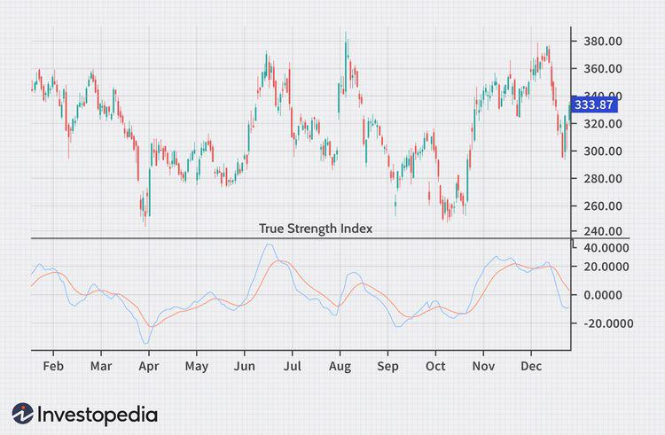

Technical indicators are essential tools in trading, used to analyze historical market data and predict future price movements. By providing insights into market trends, volatility, and momentum, they enable traders to make informed decisions. Indicators like moving averages, relative strength index (RSI), and moving average convergence divergence (MACD) help identify trading opportunities by highlighting patterns that may not be immediately visible from raw price data.

Among these tools, the True Strength Index (TSI) stands out as a momentum oscillator designed to represent the underlying strength of a price action. Developed by William Blau, TSI is particularly useful in revealing the strength or weakness of market trends through its ability to highlight price overbought or oversold conditions. Its calculation involves a double smoothing of price changes, making it more responsive to market shifts while minimizing noise.



TSI's relevance in algorithmic trading is notable. Trading algorithms often rely heavily on technical indicators to dictate buy or sell signals, and the TSI's capacity to gauge momentum with precision makes it an attractive component in such strategies. Its structure allows traders to integrate it seamlessly into automated systems to enhance the accuracy of trend predictions and timing decisions.

The objective here is to explore the TSI formula and its application within algorithmic trading environments. By understanding TSI's role and its integration in trading algorithms, traders can harness its full potential for developing robust trading strategies. This article aims to clarify these applications and provide a comprehensive guide to utilizing TSI effectively in modern trading practices.

## Table of Contents

## Understanding the True Strength Index (TSI)

The True Strength Index (TSI) is a technical momentum oscillator developed to evaluate the strength and direction of a security's price movement. As a component of technical analysis, it helps traders and analysts identify bullish and bearish trends by measuring the rate of change in price. Unlike some other indicators, TSI effectively filters out market noise, providing a clearer perspective on price momentum.

The TSI was introduced by William Blau in 1991 and described in his book "Momentum, Direction and Divergence". The development of the TSI was grounded on the limitations observed in other momentum indicators, such as their inability to differentiate between strong and weak momentum effectively. Blau's TSI sought to refine momentum assessment by utilizing a double smoothing function, enhancing trend recognition and signal reliability.

One of the differentiating features of the TSI compared to other [momentum](/wiki/momentum) indicators, like the Relative Strength Index (RSI) or Moving Average Convergence Divergence (MACD), is its employment of a double smoothing technique. This involves first smoothing the price changes over a short-term period and then applying a second smoothing process to these results. This dual-layered approach minimizes the effects of volatile price fluctuations while emphasizing overall price trends, thereby reducing signal noise and false alerts.

TSI calculation involves short-term double smoothing of price changes, described mathematically by:

$$
\text{TSI} = 100 \times \frac{\text{Smoothed}(\text{Smoothed}(PC))}{\text{Smoothed}(\text{Smoothed}(|PC|))}
$$

where $PC$ denotes price change, typically calculated as the difference between current and previous prices. This calculation requires applying a smoothing function, such as exponential moving averages, to both the price change and its absolute value.

The advantages of using TSI in price strength and momentum analysis are notable. By smoothing price changes twice, the TSI is particularly adept at highlighting true price direction while filtering out misleading fluctuations that can obscure market insights. This characteristic makes TSI more robust in analyzing longer-term trends and can be particularly beneficial when combined with other indicators to confirm signals or provide additional market insights.

## The TSI Formula and Calculation

The True Strength Index (TSI) is a momentum-based technical indicator that helps traders identify trends and potential reversal points by smoothing price changes. The TSI employs a double smoothing technique on price changes to provide a clearer picture of price momentum.

### Detailed Breakdown of the TSI Formula

The TSI is calculated using the following formula:

$$
\text{TSI} = 100 \times \left( \frac{\text{Double EMA of PC}}{\text{Double EMA of |PC|}} \right)
$$

Where:
- $\text{PC}$ (Price Change) is the difference between the current closing price and the closing price of the previous period.
- $|\text{PC}|$ is the absolute value of the price change.

Double EMA refers to the exponential moving average applied twice.

### Step-by-Step Guide on Calculating the TSI

1. **Compute Price Change (PC):**
$$
   \text{PC}(t) = \text{Price}(t) - \text{Price}(t-1)

$$

2. **Calculate the Absolute Price Change (|PC|):**
$$
   |\text{PC}(t)| = |\text{Price}(t) - \text{Price}(t-1)|

$$

3. **Calculate the First Exponential Moving Average (EMA) of PC and |PC|:**
$$
   \text{EMA}_{N1}(\text{PC}) = \text{EMA}(\text{PC}, N1)

$$
$$
   \text{EMA}_{N1}(|\text{PC}|) = \text{EMA}(|\text{PC}|, N1)

$$

4. **Calculate the Second Exponential Moving Average (EMA) of the previous results:**
$$
   \text{EMA}_{N2}(\text{EMA}_{N1}(\text{PC})) = \text{EMA}(\text{EMA}_{N1}(\text{PC}), N2)

$$
$$
   \text{EMA}_{N2}(\text{EMA}_{N1}(|\text{PC}|)) = \text{EMA}(\text{EMA}_{N1}(|\text{PC}|), N2)

$$

5. **Finalize TSI Calculation:**
$$
   \text{TSI}(t) = 100 \times \left( \frac{\text{EMA}_{N2}(\text{EMA}_{N1}(\text{PC}))}{\text{EMA}_{N2}(\text{EMA}_{N1}(|\text{PC}|))} \right)

$$

### Explanation of Input Variables

- **Price Change (PC):** The basis for momentum, capturing the difference between consecutive prices.
- **Absolute Price Change (|PC|):** Helps gauge the magnitude of price movement, disregarding direction, which is crucial for calculating a ratio that reflects strength.
- **Smoothing Factors (N1 and N2):** The periods for the exponential moving averages, crucial for moderating noise and focusing on genuine momentum shifts.

### Importance of Smoothing Factors and Absolute Price Changes

Smoothing factors serve to minimize price fluctuations' noise, providing a clearer understanding of prevailing trends. Absolute price changes play a vital role in standardizing the size of price movements, allowing for more accurate comparisons over time.

### Example Calculation with Hypothetical Market Data

Consider a fictional daily closing price series: 100, 102, 101, 105, 106. 

- **Step 1:** Calculate PC: 
  - 102 - 100 = 2 
  - 101 - 102 = -1 
  - 105 - 101 = 4 
  - 106 - 105 = 1 

- **Step 2:** Calculate |PC|:
  - |2| = 2 
  - |-1| = 1 
  - |4| = 4 
  - |1| = 1

- **Step 3 and 4:** Apply EMAs with chosen smoothing periods, say N1 = 2 and N2 = 3, on PC and |PC|.

- **Step 5:** Compute the final TSI using the double-smoothed values from Step 4.

For practical applications, this process can be automated using programming languages like Python:

```python
import pandas as pd

def ema(series, periods):
    return series.ewm(span=periods, adjust=False).mean()

prices = pd.Series([100, 102, 101, 105, 106])

pc = prices.diff()
abs_pc = pc.abs()

n1, n2 = 2, 3

ema_n1_pc = ema(pc, n1)
ema_n1_abs_pc = ema(abs_pc, n1)

ema_n2_pc = ema(ema_n1_pc, n2)
ema_n2_abs_pc = ema(ema_n1_abs_pc, n2)

tsi = 100 * (ema_n2_pc / ema_n2_abs_pc)

print(tsi)
```

This script calculates the TSI using pandas' `ewm` function to efficiently process exponential moving averages, showcasing a practical way to integrate TSI calculations into trading systems.

## TSI in Algorithmic Trading

Technical indicators are crucial for [algorithmic trading](/wiki/algorithmic-trading) systems as they provide systematic methods for analyzing market trends and making informed decisions. The True Strength Index (TSI) is increasingly utilized in these systems due to its effectiveness in capturing momentum and price strength through smoothed calculations. 

TSI is integrated into algorithmic trading systems primarily through its ability to generate reliable buy and sell signals. The TSI indicator achieves this by identifying bullish and bearish conditions based on the direction and magnitude of price changes. This is accomplished by analyzing smoothed double exponential averages, which filter out noise and enhance the clarity of trend direction and momentum oscillations. The use of TSI allows algorithms to adjust to trending or ranging markets dynamically, enhancing the system's decision-making accuracy.

A key benefit of integrating TSI into automated trading strategies is the reduction of false signals that often plague raw momentum indicators. TSI's double smoothing mechanism helps to produce more decisive signals, which can be programmed into algorithmic systems to trigger trades at optimal points. Incorporating TSI in trading algorithms can maximize profits and minimize losses by accurately timing market entries and exits.

Trading algorithms that utilize TSI typically follow a set pattern: they buy when the TSI crosses above a particular positive threshold and sell when it crosses below a negative threshold. Here is a simplified example in Python that demonstrates how TSI can be programmed into a trading algorithm using a library like Pandas for data handling:

```python
import pandas as pd

def calculate_tsi(prices, r=25, s=13):
    diff = prices.diff()
    abs_diff = diff.abs()

    double_smoothed_diff = diff.ewm(span=r, adjust=False).mean().ewm(span=s, adjust=False).mean()
    double_smoothed_abs_diff = abs_diff.ewm(span=r, adjust=False).mean().ewm(span=s, adjust=False).mean()

    tsi = 100 * (double_smoothed_diff / double_smoothed_abs_diff)
    return tsi

# Example usage with a hypothetical DataFrame 'data' with a 'close' column for closing prices
data['TSI'] = calculate_tsi(data['close'])

# Example trading logic
data['Signal'] = 0
data.loc[data['TSI'] > 25, 'Signal'] = 1  # Buy Signal
data.loc[data['TSI'] < -25, 'Signal'] = -1  # Sell Signal
```

Several case studies underscore the utility of TSI in trading systems. For instance, some hedge funds and proprietary trading firms integrate TSI in strategies that focus on momentum shifts, improving risk-adjusted returns. Custom algorithms employing TSI can gain an edge in performance by adapting the smoothing parameters to match varying market conditions.

However, implementing TSI in algorithmic trading also presents challenges. One primary consideration is the parameter selection for smoothing periods, which can significantly impact the effectiveness of the signals. Inappropriate parameters may lead to missed opportunities or excessive trades, thereby reducing profitability. Additionally, systems must be routinely updated to adapt to changing market dynamics, ensuring the TSI's calculated signals remain relevant.

In conclusion, the True Strength Index is a versatile tool for algorithmic trading, providing clear buy and sell indicators while filtering out noise. Its integration requires careful consideration of market conditions and system parameters to harness its full potential.

## Comparing TSI with Other Technical Indicators

The True Strength Index (TSI) is a momentum oscillator designed to identify trends and reversals in the price, often compared to other momentum indicators like the Relative Strength Index (RSI) and the Moving Average Convergence Divergence (MACD). While each of these indicators provides unique insights into market behavior, the TSI offers certain advantages and considerations that differentiate it from its peers.

### Comparison between TSI, RSI, and MACD

**True Strength Index (TSI):**

- *Formula and Sensitivity*: The TSI utilizes a double smoothing technique applied to the price changes to generate a more refined momentum reading. It is less sensitive to sharp price movements, providing a more stable signal, which can be particularly useful during volatile market conditions.

- *Pros*: The TSI excels in identifying medium to long-term trends by filtering out noise, making it suitable for trend-following strategies.

- *Cons*: Due to its double smoothing, TSI may lag in comparison to faster momentum indicators, potentially causing delayed signals in rapidly changing markets.

**Relative Strength Index (RSI):**

- *Formula and Sensitivity*: The RSI measures the speed and change of price movements over a specific period, offering insights into overbought or oversold conditions. It is sensitive to short-term price movements.

- *Pros*: RSI is excellent for spotting overbought or oversold levels quickly, useful for traders seeking to capitalize on short-term market inefficiencies.

- *Cons*: Its short-term focus can lead to false signals during strong trending markets, where overbought or oversold conditions could persist indefinitely.

**Moving Average Convergence Divergence (MACD):**

- *Formula and Sensitivity*: Based on exponential moving averages, MACD calculates both momentum and trend direction, providing buy/sell signals through its signal line and histogram.

- *Pros*: Offers clear visual signals and can represent both trend and momentum, making it a versatile tool for various trading strategies.

- *Cons*: Can produce lagging signals during rapid market reversals and may not accurately capture overbought/oversold conditions.

### Scenario-based Analysis

The TSI is particularly valuable in scenarios where identifying sustainable trends is crucial. For example, in a market exhibiting prolonged trends with periodic price corrections, the TSI's smoothing technique aids in maintaining position alignment with the underlying trend. Conversely, during rapid reversals or range-bound conditions, RSI and MACD might offer more immediate insights due to their sensitivity to sudden price changes.

### Complementary Indicators

Enhancing the effectiveness of TSI involves integrating it with other indicators. Combining TSI with RSI could balance TSI’s lag with RSI’s promptness in signaling overbought/oversold conditions. Furthermore, MACD's trend identification can corroborate TSI signals, adding confidence in trading decisions by confirming trend direction and momentum.

### Insights for Indicator Selection

Choosing the right set of indicators depends on the specific objectives and market characteristics being targeted. Traders aiming for trend-following strategies might prioritize TSI for its smoothing ability, complemented by MACD to verify trend direction. In contrast, those focusing on swing trading could integrate RSI with TSI, leveraging RSI's sensitivity to identify short-term entry and [exit](/wiki/exit-strategy) points while using TSI to ensure alignment with broader market trends.

In conclusion, while the TSI offers stability and clear trend signals, its effectiveness is heightened when used alongside complementary indicators like RSI and MACD, tailored to the specific market scenarios and trading goals. Understanding each indicator's strengths and limitations allows traders to craft a robust trading strategy that mitigates risk and enhances decision-making accuracy.

## Practical Tips for Traders Using TSI

Incorporating the True Strength Index (TSI) into trading strategies can significantly enhance a trader's ability to analyze momentum and price strength. To maximize its potential, traders should consider several best practices while being aware of common pitfalls.

### Best Practices for Incorporating TSI

1. **Calibration and Optimization**: To effectively use TSI, it’s crucial to fine-tune its parameters according to the specific asset class and market conditions. Traders often adjust the smoothing periods, typically with the default being a double exponential smoothing of 25 and 13 days. Experimentation with different period lengths can optimize the TSI to react appropriately to market volatility.

2. **Combining with Other Indicators**: While the TSI provides valuable momentum insights, it can be even more powerful when used alongside other indicators. For example, combining TSI with the Relative Strength Index (RSI) or the Moving Average Convergence Divergence (MACD) can provide layered confirmation for trading signals, reducing the likelihood of false positives.

3. **Regular Backtesting**: Implementing a rigorous backtesting process for strategies incorporating TSI is crucial. By simulating TSI-based strategies on historical data, traders can identify the best settings and combinations with other indicators to predict market movements effectively.

### Common Pitfalls to Avoid

- **Over-reliance on TSI Alone**: Depending exclusively on TSI without considering other market factors or technical indicators may lead to unreliable trading decisions. It’s important to incorporate fundamental analysis and other technical tools to validate signals.

- **Neglecting Changing Market Conditions**: Markets are dynamic; hence, a static TSI setup might not be effective over time. Regularly reviewing and adjusting the TSI parameters to align with current market trends ensures its ongoing efficacy.

### Advice for Optimizing TSI Settings

The adaptability of TSI can be enhanced by periodically revisiting the smoothing factors and periods used. Adjustments based on [volatility](/wiki/volatility-trading-strategies) and [liquidity](/wiki/liquidity-risk-premium) of the asset ensure that the TSI remains responsive to price movements. For instance, in a highly volatile market, shorter smoothing periods might be more effective.

### Tools and Platforms

- **Trading Platforms with Built-in TSI**: Several trading platforms, like MetaTrader, TradingView, and NinjaTrader, offer TSI as a built-in indicator. These platforms provide easy customization of TSI parameters, facilitating backtesting and optimization tasks.

- **Custom Script Implementation**: The following Python script using the `pandas` library showcases how to compute TSI for a given dataset of closing prices:

  ```python
  import pandas as pd

  def calculate_tsi(prices, long_window=25, short_window=13):
      delta = prices.diff()
      abs_delta = abs(delta)

      # Double smoothing the absolute price change and the price change
      long_smoothed = delta.ewm(span=long_window, adjust=False).mean()
      short_smoothed = long_smoothed.ewm(span=short_window, adjust=False).mean()

      long_smoothed_abs = abs_delta.ewm(span=long_window, adjust=False).mean()
      short_smoothed_abs = long_smoothed_abs.ewm(span=short_window, adjust=False).mean()

      tsi = 100 * (short_smoothed / short_smoothed_abs)
      return tsi

  # Example usage:
  prices = pd.Series([50, 51, 52, 50, 49, 48, 47, 50, 51, 53, 54])
  tsi = calculate_tsi(prices)
  print(tsi)
  ```

### Continued Education and Resources

Engaging with trading forums, subscribing to technical analysis courses, and attending webinars can deepen understanding and application of TSI. Communities such as EliteTrader and platforms like Udemy or Coursera offer educational content that can improve proficiency in technical analysis and trading strategy development utilizing TSI.

By following these best practices and leveraging the right tools and resources, traders can enhance their market analysis capabilities with the True Strength Index, ultimately making more informed and profitable trading decisions.

## Conclusion

The True Strength Index (TSI) has established itself as a significant tool in technical analysis and algorithmic trading. By offering a nuanced perspective on price movements through the dual smoothing of price changes, TSI helps traders discern the real strength behind market trends. Unlike some other momentum indicators, TSI's ability to filter out market noise makes it particularly valuable for developing robust trading strategies. 

Traders are encouraged to integrate TSI into their trading strategies to gain a more comprehensive understanding of market dynamics. Experimenting with TSI allows traders to tailor the indicator settings to align with specific trading styles and market conditions. This personalization can lead to more informed decision-making and, potentially, improved trading outcomes.

Technical indicators, like the TSI, play a dynamic role in modern trading by providing insights that might not be immediately apparent from raw price data alone. As financial markets continue to evolve, the sophistication and adaptability of tools like the TSI become even more crucial. Therefore, traders are urged to engage in continuous learning and exploration of such indicators to remain competitive and informed.

For those looking to deepen their understanding and application of TSI, further learning and adoption through available resources is advisable. Engaging with trading platforms that offer TSI functionality, reviewing case studies, and joining forums for discussion are excellent ways to enhance expertise.

Feedback and discussions from experienced traders and analysts can also provide valuable insights. Sharing experiences and strategies involving TSI can foster a community of learning and innovation, ensuring that traders can adapt their approaches to the ever-changing market landscape.

## References & Further Reading

[1]: Blau, William. (1995). ["Momentum, Direction, and Divergence"](https://books.google.com/books/about/Momentum_Direction_and_Divergence.html?id=OmkgfTUx9pMC). Wiley Finance.

[2]: Aronson, David R. (2006). ["Evidence-Based Technical Analysis: Applying the Scientific Method and Statistical Inference to Trading Signals"](https://www.amazon.com/Evidence-Based-Technical-Analysis-Scientific-Statistical/dp/0470008741). Wiley.

[3]: Achelis, Steven B. (2000). ["Technical Analysis from A to Z"](https://www.mhebooklibrary.com/doi/book/10.1036/9780071380119). McGraw-Hill.

[4]: Jansen, Stefan. (2020). ["Machine Learning for Algorithmic Trading: Predictive models to extract signals from market and alternative data for systematic trading strategies with Python"](https://github.com/stefan-jansen/machine-learning-for-trading). Packt Publishing.

[5]: Chan, Ernest P. (2009). ["Quantitative Trading: How to Build Your Own Algorithmic Trading Business"](https://github.com/ftvision/quant_trading_echan_book). John Wiley & Sons.