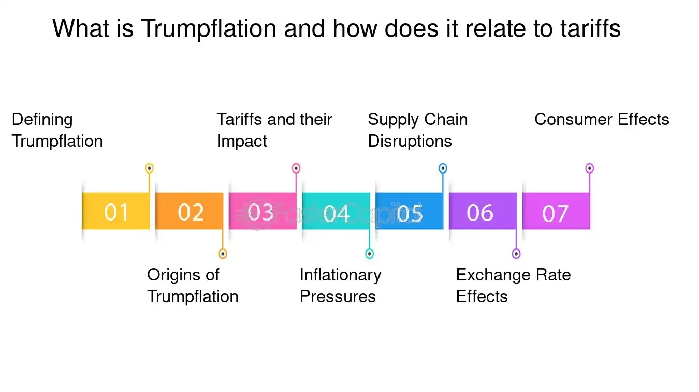

## Table of Contents

## What is Trumpflation?

Trumpflation is a term that was used to describe the expected rise in inflation during Donald Trump's presidency. People thought that the policies Trump wanted to put in place, like tax cuts and more spending on things like infrastructure, would make prices go up. This idea came about after Trump won the election in 2016, and it was based on the belief that his economic plans would lead to higher inflation.

However, the actual inflation during Trump's time as president did not go up as much as people thought it would. Instead of high inflation, the economy saw low inflation rates. This showed that the predictions about Trumpflation were not correct. Even though the term was popular for a while, it did not end up describing what really happened with inflation during Trump's presidency.

## How did the term 'Trumpflation' originate?

The term 'Trumpflation' started being used right after Donald Trump won the 2016 election. People thought that the things Trump said he would do, like cutting taxes and spending more on building roads and bridges, would make prices go up. This idea spread quickly because it was new and different from what people were used to hearing about inflation.

Soon after the election, financial experts and the media began talking about 'Trumpflation' a lot. They used it to talk about the worries that Trump's plans might make the cost of living go up. But as time went on, it turned out that inflation did not rise as much as everyone thought it would. So, even though 'Trumpflation' was a popular term for a while, it did not end up describing what actually happened with prices during Trump's time as president.

## What economic policies did Donald Trump implement that could lead to Trumpflation?

Donald Trump's economic policies that people thought might cause Trumpflation included big tax cuts and more spending on things like roads and bridges. He signed a law in 2017 that lowered taxes for businesses and many people. This was supposed to help the economy grow by giving people and companies more money to spend. But some people worried that if everyone had more money to spend, it might make prices go up because there would be more demand for things.

Another policy was increasing spending on infrastructure. Trump wanted to spend a lot of money to fix and build new roads, bridges, and other public things. This kind of spending can help the economy by creating jobs and making it easier for people to get around. But it can also add to the amount of money the government borrows, which some people thought might lead to higher inflation if it got out of control.

In the end, these policies did not cause the high inflation that people were worried about. Instead, inflation stayed pretty low during Trump's time as president. This showed that the worries about Trumpflation were not correct, and the term did not end up describing what really happened with prices.

## How does Trumpflation affect inflation rates?

Trumpflation was the idea that Donald Trump's economic policies would make prices go up. People thought that if Trump cut taxes and spent more money on things like roads and bridges, it would give people more money to spend. More spending could make demand for things go up, which might push prices higher. This is why some people were worried about inflation when Trump became president.

But in the end, Trumpflation did not happen the way people thought it would. Even though Trump did cut taxes and wanted to spend more on infrastructure, inflation stayed pretty low during his time as president. This showed that the worries about Trumpflation were not correct. The term became popular for a while, but it did not end up describing what really happened with prices during Trump's presidency.

## What is the mechanism behind Trumpflation?

Trumpflation is the idea that Donald Trump's economic plans would make prices go up. People thought that if Trump cut taxes and spent more money on things like roads and bridges, it would give people more money to spend. When people have more money, they might buy more things. If everyone is trying to buy more stuff, the demand for those things goes up. When demand goes up, prices can go up too. This is why some people were worried that Trump's policies might lead to higher inflation.

But in the end, Trumpflation did not happen the way people thought it would. Even though Trump did cut taxes and wanted to spend more on infrastructure, inflation stayed pretty low during his time as president. This showed that the worries about Trumpflation were not correct. The term became popular for a while, but it did not end up describing what really happened with prices during Trump's presidency.

## Can you explain the relationship between Trumpflation and fiscal policy?

Trumpflation is the idea that Donald Trump's economic plans would make prices go up. These plans were part of his fiscal policy, which is about how the government spends and collects money. Trump wanted to cut taxes and spend more on things like roads and bridges. When the government cuts taxes, people and businesses have more money to spend. If everyone is spending more, they might buy more things, which can make the demand for those things go up. When demand goes up, prices can go up too. This is why some people thought Trump's fiscal policy might lead to higher inflation.

But in the end, Trumpflation did not happen the way people thought it would. Even though Trump did cut taxes and wanted to spend more on infrastructure, inflation stayed pretty low during his time as president. This showed that the worries about Trumpflation were not correct. The term became popular for a while, but it did not end up describing what really happened with prices during Trump's presidency. So, while Trump's fiscal policy was thought to possibly cause higher inflation, it did not actually lead to the high inflation that people were worried about.

## How does Trumpflation impact the stock market?

Trumpflation is the idea that Donald Trump's economic plans would make prices go up. People thought that if Trump cut taxes and spent more money on things like roads and bridges, it would give people more money to spend. When people have more money, they might buy more things, including stocks. If everyone is buying more stocks, the stock market might go up because more people want to buy stocks. But if prices go up a lot because of inflation, it might make people worried about the future, and they might sell their stocks. This could make the stock market go down.

But in the end, Trumpflation did not happen the way people thought it would. Even though Trump did cut taxes and wanted to spend more on infrastructure, inflation stayed pretty low during his time as president. This meant that the stock market did not go up or down because of high inflation. Instead, the stock market went up a lot during Trump's time as president, but it was because of other things like good company earnings and people feeling good about the economy. So, while people were worried about Trumpflation affecting the stock market, it did not end up being a big problem.

## What are the potential long-term effects of Trumpflation on the economy?

Trumpflation was the idea that Donald Trump's economic plans would make prices go up a lot. People thought that if Trump cut taxes and spent more money on things like roads and bridges, it would give people more money to spend. If everyone had more money, they might buy more things, which could make prices go up. If prices kept going up, it might make people worried about the future. They might spend less money and save more, which could slow down the economy. Also, if prices went up a lot, it might make it harder for people to buy things they need, like food and gas.

But in the end, Trumpflation did not happen the way people thought it would. Even though Trump did cut taxes and wanted to spend more on infrastructure, inflation stayed pretty low during his time as president. This meant that the worries about long-term effects on the economy did not come true. Instead of high inflation causing problems, the economy kept growing, and people kept spending money. So, while people were worried about Trumpflation causing long-term problems, it did not end up being a big issue for the economy.

## How did Trumpflation influence interest rates and bond yields?

Trumpflation was the idea that Donald Trump's economic plans would make prices go up a lot. People thought that if prices went up, the government might raise interest rates to try to slow down the economy and keep inflation under control. Interest rates are what banks charge people to borrow money. If interest rates go up, it can make it more expensive for people to borrow money, which might make them spend less. This could affect bond yields too. Bond yields are what people get paid for lending money to the government or companies. If interest rates go up, bond yields usually go up too because new bonds have to offer more to attract people to buy them.

But in the end, Trumpflation did not happen the way people thought it would. Even though Trump did cut taxes and wanted to spend more on infrastructure, inflation stayed pretty low during his time as president. This meant that the government did not need to raise interest rates as much as people thought. So, interest rates and bond yields did not go up a lot because of high inflation. Instead, they were influenced by other things like what the Federal Reserve was doing and how the economy was doing overall.

## Can you provide a real-world example of Trumpflation in action?

When Donald Trump won the election in 2016, people started talking about Trumpflation. They thought that Trump's plans to cut taxes and spend more money on things like roads and bridges would make prices go up. For example, right after the election, some people thought that if everyone had more money because of tax cuts, they would buy more things. This could make the demand for things go up, which might push prices higher. People were worried that this could happen quickly after Trump became president.

But in the end, Trumpflation did not happen the way people thought it would. Even though Trump did cut taxes and wanted to spend more on infrastructure, inflation stayed pretty low during his time as president. For example, in 2018, the inflation rate was only about 2%, which is not very high. This showed that the worries about Trumpflation were not correct. So, while the idea of Trumpflation was popular for a while, it did not end up describing what really happened with prices during Trump's presidency.

## What are the criticisms and defenses of the concept of Trumpflation?

Some people did not like the idea of Trumpflation. They said it was just a guess and not based on real facts. They thought that saying Trump's plans would make prices go up a lot was too simple. They also said that other things, like what the Federal Reserve was doing, were more important for inflation than Trump's plans. These people thought that worrying about Trumpflation was not helpful and might make people scared for no reason.

But some people thought Trumpflation made sense. They said that if Trump cut taxes and spent more money on things like roads and bridges, it would give people more money to spend. If everyone had more money, they might buy more things, which could make prices go up. These people thought that Trumpflation was a good way to explain why prices might go up because of Trump's plans. But in the end, Trumpflation did not happen the way people thought it would, and inflation stayed pretty low during Trump's time as president.

## How do economic theories like supply-side economics relate to Trumpflation?

Supply-side economics is an idea that says if you help businesses and people who make things, it will make the whole economy better. Donald Trump's plans, like cutting taxes and spending more on things like roads and bridges, were a lot like supply-side economics. People thought that if Trump did these things, it would give businesses and people more money to spend. This could make them buy more things, which might make prices go up. That's why some people thought Trump's plans could lead to Trumpflation, which is the idea that his policies would make prices go up a lot.

But in the end, Trumpflation did not happen the way people thought it would. Even though Trump did cut taxes and wanted to spend more on infrastructure, inflation stayed pretty low during his time as president. This showed that the worries about Trumpflation were not correct. Supply-side economics did not lead to the high inflation that people were worried about. Instead, the economy kept growing, and people kept spending money without prices going up a lot.

## References & Further Reading

[1]: ["The Tax Cuts and Jobs Act of 2017"](https://taxfoundation.org/research/all/federal/2017-tax-cuts-jobs-act-analysis/) - U.S. Congress

[2]: Lopez de Prado, M. (2018). ["Advances in Financial Machine Learning."](https://www.amazon.com/Advances-Financial-Machine-Learning-Marcos/dp/1119482089) Wiley.

[3]: Jones, J. D. (2019). ["Algorithmic Trading: Winning Strategies and Their Rationale."](https://www.wiley.com/en-us/Algorithmic+Trading%3A+Winning+Strategies+and+Their+Rationale-p-9781118460146) Routledge.

[4]: ["U.S. Federal Reserve's Monetary Policy Actions During Trump's Presidency."](https://www.federalreserve.gov/monetarypolicy.htm) - Federal Reserve

[5]: Bown, C. P., & Irwin, D. A. (2019). ["The GATT's Starting Point: Tariff Levels circa 1947."](https://www.nber.org/papers/w21782) National Bureau of Economic Research. 

[6]: Campbell, J. Y., & Viceira, L. M. (2005). ["The Term Structure of the Risk-Return Tradeoff."](https://www.nber.org/papers/w11119) Financial Analysts Journal.

[7]: ["US-China Trade Relations."](https://www.cfr.org/backgrounder/contentious-us-china-trade-relationship) Council on Foreign Relations. 

[8]: Azzimonti, M. (2018). ["Partisan conflict and inflation."](https://www.nber.org/papers/w21273) American Economic Journal: Macroeconomics.