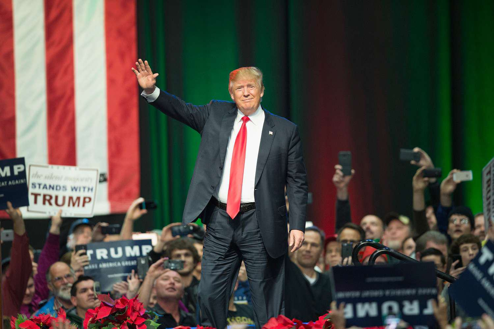

The concept of "Trumpflation" emerged as a focal point of debate and speculation during Donald Trump's presidency, capturing the attention of economists, market analysts, and policymakers. Coined to describe the anticipated inflationary pressures associated with Trump's economic agenda, the term gained prominence amid discussions surrounding proposed tax cuts and substantial infrastructure spending announced during the 2016 presidential campaign and throughout Trump's term in office. These proposed policies, aimed at stimulating economic growth, were scrutinized for their potential impact on inflation, a critical economic indicator that measures the rate at which prices for goods and services rise and subsequently erodes purchasing power.

Trump's presidency was marked by a series of economic policies intended to boost the U.S. economy, prominently featuring tax reforms such as the Tax Cuts and Jobs Act of 2017. These reforms aimed to lower corporate tax rates and spur investment, with the idea that increased economic activity would offset potential inflationary effects. Simultaneously, the administration's approach included imposing tariffs on several trading partners, an action intended to protect domestic industries but which also carried the risk of initiating inflation through increased production costs and disrupted supply chains.

In navigating the economic environment under Trump's presidency, the financial markets saw a growing reliance on algorithmic trading, which employs complex mathematical models and automated systems to execute trades at high speeds. This technology-driven approach has become essential in responding to market volatility and was particularly relevant during periods of economic uncertainty influenced by Trump's policies. Algorithmic trading systems reacted in real-time to shifts in economic indicators and governmental fiscal strategies, showcasing their capacity to adapt to rapidly changing landscapes.

This article embarks on a comprehensive analysis of the intricate relationships between inflation, economic policy, and algorithmic trading during the Trump era. By examining the genesis and evolution of Trumpflation—assessing the anticipated versus actual inflationary outcomes—we aim to provide an insightful critique of how economic growth strategies intersected with inflation dynamics. Additionally, the article will highlight the integral role of algorithmic trading, exploring how these advanced systems have reshaped financial market operations amid policy-driven economic conditions. Through this examination, we aim to elucidate the broader implications of these interconnected domains for past, present, and future economic policy decisions.

## Table of Contents

## Understanding Trumpflation

Trumpflation emerged during Donald Trump's presidential campaign and early tenure from concerns that his proposed economic policies could spark inflationary pressures in the United States. The term gained traction especially in 2016 and early 2017, as Trump's ambitious plans for infrastructure spending and significant tax cuts were expected to boost economic growth, potentially at the cost of increasing inflation rates. 

The economic strategies of Trump's administration were centered around fiscal stimulus, deregulation, and renegotiating trade deals. These policies were anticipated to enhance economic activity by stimulating demand, which could, theoretically, lead to higher prices. Infrastructure spending had the potential to increase employment and consumption, further intensifying pressure on prices. Simultaneously, tax cuts were expected to provide individuals and corporations with more disposable income, potentially increasing spending and investment.

Despite these potential inflationary pressures, actual inflation during Trump's presidency did not reach the heightened levels feared by some economists. Several mitigating factors contributed to this outcome. First, the Federal Reserve maintained a cautious approach by gradually increasing the benchmark interest rates, which helped temper inflationary pressures by making borrowing more expensive and slowing down economic overheating. Additionally, globalization and technological advancements continued to exert deflationary pressures, keeping goods and services competitively priced.

Further analysis of economic indicators reveals a complex picture. The Consumer Price Index (CPI), which measures inflation by tracking the average change over time in the prices paid by urban consumers for goods and services, showed relatively moderate increases during Trump's time in office. Another important measure, the Core CPI, which excludes volatile food and energy prices, also did not show unprecedented spikes. Moreover, the Producer Price Index (PPI), which measures the average changes in prices received by domestic producers for their output, indicated that at the wholesale level, inflation was likewise kept at manageable levels.

A combination of external global factors and domestic policies balanced the expected inflationary impacts of Trumpflation. The global economic environment, including slow growth in other developed economies, trade tensions, and low energy prices, played a role in stabilizing inflation. Furthermore, the unpredictable effects of the COVID-19 pandemic starting in early 2020 also contributed to economic [volatility](/wiki/volatility-trading-strategies) but did not necessarily align with initial inflation expectations associated with Trumpflation.

In essence, while the term "Trumpflation" highlighted valid concerns over potential inflation due to proposed economic policies, the actual inflationary outcomes during Trump's presidency were more tempered than initially anticipated. This nuanced reality can be attributed to a confluence of monetary policy actions, global economic conditions, and unforeseen scenarios such as the pandemic.

## Inflation and Economic Policy under Trump

During Donald Trump's presidency, a series of economic policies aimed at reshaping the United States' financial landscape were introduced. These policies included significant tax reforms, the imposition of tariffs, and increased fiscal spending on infrastructure, all of which were intended to spur economic growth but also carried potential inflationary risks. 

The Tax Cuts and Jobs Act of 2017 was one of the cornerstone policies of Trump's economic agenda. This act reduced the corporate tax rate from 35% to 21% and introduced various individual tax cuts. The primary objective was to increase disposable income for individuals and stimulate business investment by lowering the cost of capital. However, these tax cuts also raised concerns about a potential increase in the federal deficit, which could contribute to inflationary pressure if not offset by corresponding spending cuts or revenue increases in other areas.

Concurrently, Trump's administration implemented a series of tariffs, particularly targeting China, through what was popularly known as the trade war. These tariffs aimed to protect domestic industries from foreign competition and to address trade imbalances. However, the tariffs led to increased costs for goods, which could have contributed to inflation. Additionally, retaliatory tariffs by other countries affected U.S. exports, creating further economic volatility.

Infrastructure spending was another focus of Trump's economic strategy, with proposals for significant investment to rebuild and improve transportation networks, utilities, and communication systems. While infrastructure investment can stimulate economic activity and increase productivity over the long term, the immediate fiscal outlay without equivalent revenue generation can inflate the national debt.

Under Trump's administration, the national debt saw a notable increase. According to the U.S. Treasury, the national debt rose from approximately $19.9 trillion when Trump took office in January 2017 to $27 trillion by the end of his term in January 2021. This surge was exacerbated by the economic impact of the COVID-19 pandemic, which necessitated substantial government spending to mitigate economic fallout, including the CARES Act. The growing debt level poses concerns for potential inflationary impacts, depending on how future administrations manage the debt and its interest obligations.

Balancing economic growth stimulation with inflation control presents a complex challenge. Trump's policies had the short-term effect of accelerating economic growth before the pandemic, characterized by a lower unemployment rate and higher GDP growth. However, the question of sustainability arose, given the increasing debt and fiscal imbalances. The short-term benefits were significant, but the long-term economic health needs careful management of inflation risks and fiscal sustainability.

In conclusion, the economic policies under Trump were ambitious and had explicit growth-oriented objectives. However, these policies also introduced complexities regarding inflation and long-term fiscal health. The legacy of Trump's policies continues to shape economic debates, particularly concerning how to achieve growth without igniting inflationary pressures or exacerbating national debt.

## The Role of Algorithmic Trading

Algorithmic trading, a crucial component of modern financial markets, leverages computer algorithms and advanced mathematical models to automate trading decisions. This approach to trading provides numerous advantages, such as speed, accuracy, and the ability to process complex data sets rapidly, making it indispensable in navigating volatile economic conditions like those during Donald Trump's presidency.

During Trump’s tenure, marked by significant economic policy changes and geopolitical uncertainties, [algorithmic trading](/wiki/algorithmic-trading) demonstrated its adaptability. The period saw reforms such as tax reductions and tariff implementations, introducing market fluctuations that created both opportunities and challenges for traders. Algorithmic trading systems, designed to respond swiftly to market conditions, were instrumental in managing these uncertainties. These systems typically employ sophisticated models to analyze large volumes of data, allowing traders to make informed decisions based on real-time market conditions.

The relationship between algorithmic trading strategies and inflationary indicators is critical. Algorithms can be programmed to monitor various economic indicators, such as the Consumer Price Index (CPI) or Producer Price Index (PPI), which are essential for assessing inflationary trends. By analyzing these indicators, algorithms can forecast market movements and adjust trading strategies accordingly. For instance, if an algorithm detects an uptick in inflationary indicators, it might adjust portfolios to hedge against inflation risks, thereby safeguarding investments.

Technology-driven trading systems offer several advantages in contexts of anticipated inflation. They can execute trades with extreme efficiency, minimizing transaction costs and reducing the likelihood of human error. Furthermore, algorithmic strategies can continuously learn and evolve based on new data, enhancing their ability to predict and react to market behavior changes. However, the reliance on technology also presents challenges, such as the risk of algorithmic errors or the potential for market manipulation.

Several algorithmic techniques have been employed to hedge against risks associated with perceived 'Trumpflation'. Strategies such as pairs trading, statistical [arbitrage](/wiki/arbitrage), and [momentum](/wiki/momentum)-based approaches have been effectively utilized. For example, pairs trading involves taking long and short positions in two correlated assets, anticipating that their price divergence will revert to the mean, thereby capturing profit from this re-alignment. Meanwhile, momentum-based strategies capitalize on continuing price trends, adjusted by algorithms that analyze historical price data to predict future movements.

Algorithmic trading systems during Trump's administration often accounted for geopolitical events, such as trade tensions with China, incorporating these variables into risk models. By doing so, these systems could mitigate risks associated with such events, ensuring more resilient trading outcomes. This adaptability underscores the critical role algorithmic trading plays in modern finance, particularly during periods characterized by economic policy changes and inflationary fears.

## Comparative Analysis of Trumpflation and Historical Inflation Trends

During Donald Trump's presidency, the concept of "Trumpflation" emerged as a descriptor for the inflationary pressures anticipated from his proposed economic policies. Understanding the nuances of Trumpflation requires comparing it with historical inflation trends under previous U.S. administrations, identifying both parallels and divergences.

Historically, U.S. inflation trends have been influenced by varying economic conditions, ranging from technological advances and international tensions to fiscal and monetary policies. For instance, during the late 1970s under President Jimmy Carter, the U.S. faced stagflation, characterized by high inflation and unemployment, largely driven by oil price shocks and expansive monetary policy. In contrast, the 1990s under President Bill Clinton saw relatively low inflation coinciding with technological growth and globalization, which enhanced productivity and moderated price increases.

Trump's economic strategies, particularly his tax reforms and extensive deregulation efforts, were expected to stimulate growth and could potentially lead to inflation similar to Reagan's supply-side economic policies in the 1980s. However, unlike Reagan’s era, where the Federal Reserve, under Paul Volcker's leadership, aggressively raised interest rates to combat inflation, the Trump administration did not experience such price spirals. This outcome can be attributed to several mitigating factors, including subdued wage growth and technological advancements that continued to exert downward pressure on prices.

Inflation management under Trump's predecessors often involved a balancing act between fiscal policy and monetary policy. For example, President Richard Nixon implemented wage and price controls in the 1970s in an attempt to curb inflation, which ultimately proved ineffective and unsustainable. Comparatively, Trump's approach focused more on fiscal stimulus through tax cuts and infrastructure spending, initially sparking fears of inflation but ultimately not materializing to the extent anticipated.

Case studies from past presidencies provide insights into the outcomes of various inflation management strategies. Under President Gerald Ford, the "Whip Inflation Now" initiative aimed at reducing inflation through voluntary measures, but had limited success due to a lack of enforceable policies. Conversely, the tight monetary policies by the Federal Reserve in the early 1980s successfully curbed inflation but at the cost of a recession.

During Trump's presidency, global factors such as the COVID-19 pandemic and trade tensions, particularly with China, played significant roles in shaping inflationary dynamics. The pandemic led to unprecedented disruptions in global supply chains, impacting prices and demand. Meanwhile, tariffs and trade wars contributed to inflationary pressures on imported goods, although the overall influence on U.S. inflation remained moderated by countervailing factors like decreased consumer spending during the pandemic.

In essence, while Trumpflation was a term used to describe potential inflationary pressures during Trump's presidency, the actual inflation trends observed were influenced by a complex interplay of fiscal policies, global events, and structural economic factors, echoing themes from past administrations but also highlighting unique contemporary challenges and responses.

## Conclusion: The Legacy of Trumpflation

Trump's administration left a distinctive imprint on economic policies and inflation management, coining the term 'Trumpflation' to characterize the unique challenges and dynamics observed during this period. Central to this was the administration's ambitious tax overhaul, infrastructural spending proposals, and trade policies, which collectively aimed at stimulating economic growth but also stirred concerns about inflationary pressures.

Trump's tax cuts, particularly the Tax Cuts and Jobs Act of 2017, were intended to incentivize investment and increase disposable income, potentially fueling economic expansion. However, this fiscal stimulus also posed the risk of overheating the economy, making inflation management critical. These policies, coupled with aggressive trade tariffs, especially against China, brought notable fluctuations in market dynamics. Despite the fears of 'Trumpflation', the inflation rates during Trump's term did not escalate as anticipated, owing in part to subdued wage growth and global deflationary pressures.

Algorithmic trading emerged as a crucial mechanism to navigate the economic volatility induced by these policies. Equipped with complex algorithms, trading systems could rapidly respond to market changes, adjusting portfolios and managing risks associated with inflationary expectations. Algorithmic trading not only provided [liquidity](/wiki/liquidity-risk-premium) to the markets during tumultuous times but also established a benchmark for adapting to unforeseen fiscal outcomes. Traders, relying on tech-driven strategies, managed to hedge against potential risks, mitigating the economic uncertainty that characterized much of Trump's presidency.

Reflecting on the economic management during Trump's tenure, several lessons emerge. First, the impact of fiscal policy on inflation is nuanced and influenced by various external factors, including global economic conditions. Second, technological advancements, such as algorithmic trading, have redefined traditional economic defenses and require continuous adaptation.

Looking forward, current and future economic policies might leverage these insights, particularly in balancing fiscal stimulus with inflation control. Algorithmic trading is likely to play an increasingly vital role, adapting to evolving market conditions and regulatory landscapes. As the global economy navigates ongoing challenges like pandemics or geopolitical tensions, the foundation laid during the Trump era provides valuable precedents.

Ultimately, Trump's legacy in economic policy sets a framework for future administrations, offering lessons on the delicate interplay between growth stimulation and inflation management, while highlighting the transformative impact of technology in modern financial ecosystems. This experience underscores the importance of adaptable, informed approaches to economic governance in a connected global economy.

## References & Further Reading

[1]: ["The Tax Cuts and Jobs Act of 2017"](https://taxfoundation.org/research/all/federal/2017-tax-cuts-jobs-act-analysis/) - U.S. Congress

[2]: Lopez de Prado, M. (2018). ["Advances in Financial Machine Learning."](https://www.amazon.com/Advances-Financial-Machine-Learning-Marcos/dp/1119482089) Wiley.

[3]: Jones, J. D. (2019). ["Algorithmic Trading: Winning Strategies and Their Rationale."](https://www.wiley.com/en-us/Algorithmic+Trading%3A+Winning+Strategies+and+Their+Rationale-p-9781118460146) Routledge.

[4]: ["U.S. Federal Reserve's Monetary Policy Actions During Trump's Presidency."](https://www.federalreserve.gov/monetarypolicy.htm) - Federal Reserve

[5]: Bown, C. P., & Irwin, D. A. (2019). ["The GATT's Starting Point: Tariff Levels circa 1947."](https://www.nber.org/papers/w21782) National Bureau of Economic Research. 

[6]: Campbell, J. Y., & Viceira, L. M. (2005). ["The Term Structure of the Risk-Return Tradeoff."](https://www.nber.org/papers/w11119) Financial Analysts Journal.

[7]: ["US-China Trade Relations."](https://www.cfr.org/backgrounder/contentious-us-china-trade-relationship) Council on Foreign Relations. 

[8]: Azzimonti, M. (2018). ["Partisan conflict and inflation."](https://www.nber.org/papers/w21273) American Economic Journal: Macroeconomics.