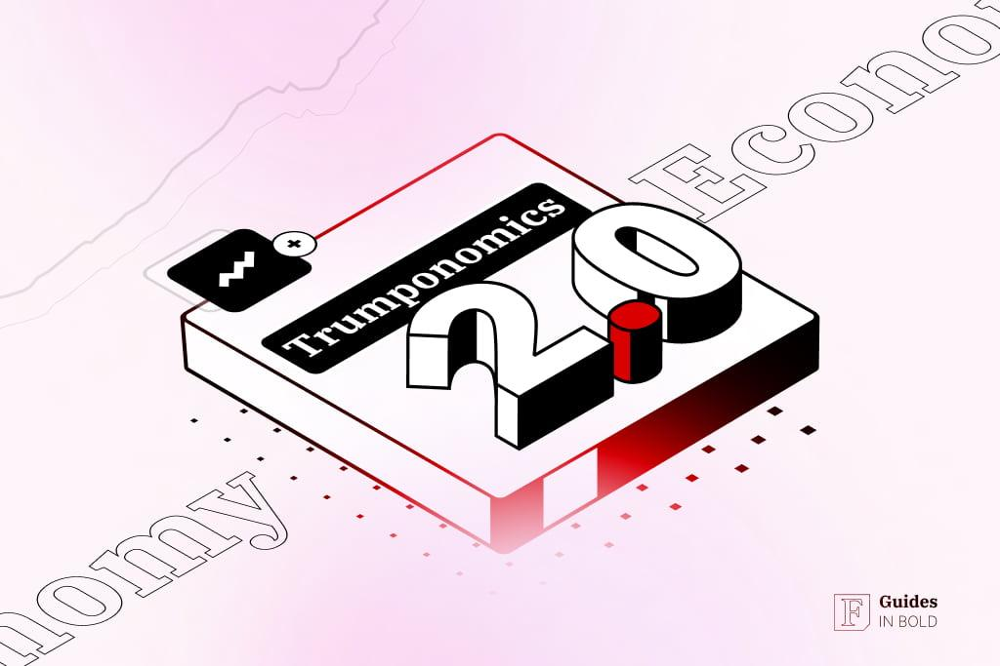

## Table of Contents

## What is Trumponomics and how does it differ from traditional economic policies?

Trumponomics refers to the economic policies and strategies implemented during Donald Trump's presidency. These policies focused on reducing taxes, cutting regulations, and promoting American industry through protectionist trade policies. A key part of Trumponomics was the Tax Cuts and Jobs Act of 2017, which lowered the corporate tax rate from 35% to 21%. Trump also aimed to bring back manufacturing jobs to the U.S. by imposing tariffs on imported goods, especially from China. He believed that these actions would boost economic growth and make America more competitive globally.

Traditional economic policies, on the other hand, often emphasize a balance between free trade and regulation. Many economists support free trade agreements that allow countries to exchange goods and services without high tariffs. They believe this leads to lower prices for consumers and more efficient global markets. Traditional policies also tend to favor a more gradual approach to tax changes and often include measures to address income inequality. In contrast, Trumponomics took a more aggressive stance on tariffs and tax cuts, aiming for immediate economic boosts but also leading to debates about long-term effects on the economy and international relations.

## What are the key principles of Trumponomics?

Trumponomics is based on a few main ideas. One big idea is cutting taxes. During Trump's time as president, they passed a law that made taxes lower for businesses and some people. They thought this would help businesses grow and create more jobs. Another key part is getting rid of rules that businesses have to follow. Trump believed that if there were fewer rules, businesses could work better and faster.

Another important part of Trumponomics is protecting American jobs. Trump did this by putting taxes on things coming into the country from other places, especially China. He wanted to make it harder for other countries to sell their stuff in America, so American companies could sell more. This is different from what many other leaders do, who often want to trade freely with other countries. Trumponomics focused on making America stronger by itself, even if it meant being tough with other countries.

## How did Trumponomics aim to stimulate economic growth?

Trumponomics aimed to stimulate economic growth by cutting taxes. The big tax cut law they passed made it so businesses paid less in taxes. They thought if businesses had more money, they would use it to grow and hire more people. This was supposed to make the economy bigger and better. They also wanted to get rid of a lot of rules that businesses have to follow. They believed that without so many rules, businesses could work faster and easier, which would help them grow and make more money.

Another way Trumponomics tried to boost the economy was by protecting American jobs. They did this by putting taxes on things coming into the country from other places, especially China. They thought if it was harder for other countries to sell their stuff in America, then American companies would sell more and hire more people. This was different from what many other leaders do, who often want to trade freely with other countries. Trumponomics focused on making America stronger by itself, even if it meant being tough with other countries.

## What were the main tax policies introduced under Trumponomics?

The main tax policy under Trumponomics was the Tax Cuts and Jobs Act of 2017. This law made big changes to how much people and businesses had to pay in taxes. For businesses, it lowered the corporate tax rate from 35% down to 21%. They thought this would help businesses keep more of their money and use it to grow and hire more people. For people, it changed the tax rates and increased the standard deduction, which meant many people could pay less in taxes.

Another part of the tax policy was to encourage businesses to bring money back to the U.S. that they had made in other countries. They did this by offering a lower tax rate on that money if it was brought back home. They called this a "repatriation tax holiday." They hoped this would bring a lot of money back into the country and help the economy grow. Overall, these tax policies were meant to make it easier for businesses and people to keep more of their money and use it to help the economy.

## How did Trumponomics affect trade policies, particularly with regards to tariffs?

Trumponomics changed how America dealt with other countries when it came to trading things. One big change was putting tariffs on stuff coming into the country, especially from China. Tariffs are like extra taxes that make things from other countries more expensive. Trump thought that if things from China were more expensive, people would buy more things made in America instead. This was supposed to help American businesses and workers by making it harder for other countries to sell their stuff here.

These tariffs caused a lot of talk and some problems. Other countries, like China, didn't like the tariffs and put their own tariffs on American things. This made it harder for American businesses to sell their stuff in other countries. Some people worried that these tariffs could make things more expensive for everyone and might even start a trade war. But Trump believed that being tough on trade would make America stronger and help bring back jobs that had gone to other countries.

## What was the impact of Trumponomics on the U.S. stock market?

Trumponomics had a big effect on the U.S. stock market. When Trump became president and started talking about cutting taxes and getting rid of rules, the stock market went up a lot. People thought that if businesses had to pay less in taxes and had fewer rules to follow, they would make more money. This made investors feel good about buying stocks, and the stock market kept going up for a while. The tax cuts in 2017 helped make this happen even more because businesses had more money to use.

But not everything was perfect. The tariffs that Trump put on things coming from other countries, especially China, made some people worried. They thought that if other countries put tariffs on American stuff too, it could hurt businesses that sell things overseas. This made the stock market go up and down sometimes. Overall, though, the stock market did pretty well during Trump's time as president, but it was also affected by other things happening around the world.

## How did Trumponomics influence employment rates and job creation?

Trumponomics had a big effect on jobs and how many people were working. When Trump became president, he wanted to make it easier for businesses to grow and hire more people. He did this by cutting taxes and getting rid of some rules that businesses had to follow. The tax cuts made it so businesses had more money to use, and they thought this would help them hire more workers. Because of these changes, the unemployment rate went down a lot during Trump's time as president. More people were working, and this made the economy feel stronger.

But not everything was perfect. Some of the jobs that were created were in industries that might not last forever, like construction and manufacturing. Also, the tariffs that Trump put on things coming from other countries, especially China, made some businesses worried. They thought that if other countries put tariffs on American stuff too, it could hurt businesses that sell things overseas. This could make it harder for some businesses to grow and hire more people. Overall, though, more people were working during Trump's time as president, but the kinds of jobs and how long they would last were things people talked about.

## What were the effects of Trumponomics on income inequality?

Trumponomics had a big effect on how money was shared among people. The tax cuts that Trump made helped businesses and rich people keep more of their money. This made the gap between rich and poor people bigger. The rich got richer because they saved a lot on taxes, but many regular people didn't see as much help. Some people worried that this made income inequality worse because the tax cuts didn't help everyone the same way.

On the other hand, Trumponomics did help more people get jobs. When businesses had more money because of the tax cuts, they hired more workers. This meant more people were working and making money. But the kinds of jobs that were created didn't always pay a lot. So, even though more people were working, the money they made didn't always close the gap between them and the rich people. Overall, Trumponomics made the rich richer and helped more people get jobs, but it didn't do much to make income inequality better.

## How did Trumponomics impact the national debt and federal deficit?

Trumponomics made the national debt and federal deficit bigger. When Trump cut taxes with the Tax Cuts and Jobs Act, it meant the government was getting less money from taxes. But the government still had to spend money on things like the military, health care, and other programs. So, with less money coming in and the same amount of money going out, the government had to borrow more money. This made the national debt, which is all the money the government owes, go up a lot. By the end of Trump's time as president, the national debt was much higher than when he started.

The federal deficit, which is how much more the government spends than it gets in a year, also got bigger. The tax cuts helped businesses and some people keep more money, but they didn't bring in as much money for the government. At the same time, the government was spending more money on things like defense and other programs. So, the difference between what the government spent and what it got from taxes grew bigger each year. This meant the federal deficit was bigger during Trump's time as president than it had been before.

## What were the global economic repercussions of Trumponomics?

Trumponomics had a big effect on the world's economy. One of the biggest things Trump did was put tariffs on things coming from other countries, especially China. This made things from China more expensive in America, and it made China mad. China put tariffs on American things too, which made it harder for American businesses to sell their stuff in China. This started a trade war, and it made a lot of countries worried. They thought that if big countries like America and China were fighting over trade, it could hurt the whole world's economy.

Another way Trumponomics affected the world was through the tax cuts. When America cut taxes, it made businesses there have more money. Some of these businesses used that money to buy things from other countries, which helped those countries' economies a little bit. But the tax cuts also made America's national debt bigger, and that worried other countries. They thought that if America had a lot of debt, it might not be able to buy as much from other countries in the future. So, while some parts of Trumponomics helped other countries, other parts made them worried about what might happen next.

## How did Trumponomics affect different sectors of the U.S. economy?

Trumponomics had different effects on different parts of the U.S. economy. The tax cuts helped businesses a lot, especially big companies. They had more money to use, so they could grow and hire more people. This was good for industries like manufacturing and construction, where a lot of new jobs were created. The stock market also did well because investors thought businesses would make more money with lower taxes. But not all sectors did as well. For example, some businesses that sold a lot of things to other countries were hurt by the tariffs. When other countries put tariffs on American stuff, it made it harder for these businesses to sell their products overseas.

Another part of Trumponomics was getting rid of some rules that businesses had to follow. This helped industries like energy and finance because they didn't have to spend as much time and money following rules. But it also made some people worried about things like the environment and safety. The tariffs on things coming from other countries, especially China, helped some American businesses that made similar things. But it made things more expensive for everyone, which hurt businesses that needed to buy things from other countries. Overall, Trumponomics helped some parts of the economy grow, but it also made things harder for other parts.

## What are the long-term economic forecasts and potential future impacts of Trumponomics?

The long-term effects of Trumponomics are still being figured out, but some things are clear. The big tax cuts made the national debt a lot bigger. This means the government owes more money, and in the future, it might have to spend more money just to pay back what it owes. This could make it harder for the government to spend money on things like schools, roads, and helping people who need it. Also, the tax cuts helped businesses a lot, but they might not last forever. When the tax cuts end or if they get changed, businesses might not have as much money to grow and hire people.

Another thing to think about is the trade war that started because of the tariffs. The fighting over trade with China and other countries made things more expensive and harder to sell. If this keeps going, it could slow down the whole world's economy. But if America and other countries can make new trade deals, it might help things get better. The jobs that were created during Trumponomics were good, but many were in industries that might not last forever. If these jobs go away, it could make it harder for people to find work. Overall, Trumponomics made some quick changes, but the long-term effects will depend a lot on what happens next with taxes, trade, and the economy.

## References & Further Reading

[1]: United States - Joint Committee on Taxation. (2017). ["Estimated Budget Effects of the Conference Agreement for H.R.1, the 'Tax Cuts and Jobs Act'."](https://www.jct.gov/publications/2017/jcx-67-17/) 

[2]: Poole, W. (2018). ["Trumponomics: Causes and Consequences,"](https://www.researchgate.net/publication/354451748_Trumponomics_Causes_and_Consequences) National Bureau of Economic Research Working Paper No. 24507.

[3]: Krugman, P. (2018). ["Goodbye, Sweet Deficit — Hello, Trade War."](https://scholar.google.com/citations?user=D_Rebd0AAAAJ&hl=en) The New York Times.

[4]: Brookings Institution. (2019). ["Deregulation Under Trump: The New Blurred Lines Between Regulatory Savings and Costs."](https://www.brookings.edu/articles/examining-some-of-trumps-deregulation-efforts-lessons-from-the-brookings-regulatory-tracker/)

[5]: Lopez de Prado, M. (2018). ["Advances in Financial Machine Learning."](https://www.amazon.com/Advances-Financial-Machine-Learning-Marcos/dp/1119482089) Wiley.

[6]: Aldridge, I. (2013). ["High-Frequency Trading: A Practical Guide to Algorithmic Strategies and Trading Systems."](https://onlinelibrary.wiley.com/doi/pdf/10.1002/9781119203803.fmatter) Wiley.

[7]: Securities and Exchange Commission (SEC). (2010). ["Findings Regarding the Market Events of May 6, 2010."](https://www.sec.gov/news/studies/2010/marketevents-report.pdf)

[8]: Chan, E. (2009). ["Quantitative Trading: How to Build Your Own Algorithmic Trading Business."](https://github.com/ftvision/quant_trading_echan_book) Wiley.

[9]: Cumming, D. J., & Zaher, S. (2016). ["Regulatory Changes and Rule Choices: Evidence from Algorithmic Trading."](https://onlinelibrary.wiley.com/doi/abs/10.1002/sej.1265) Journal of Corporate Finance.