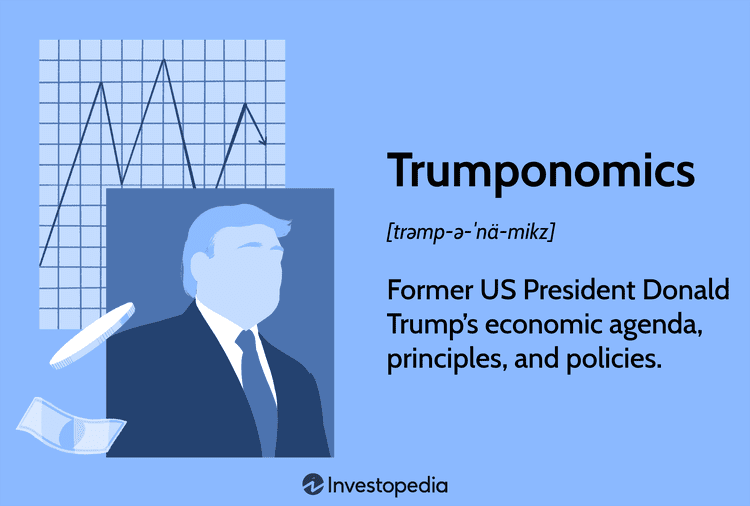

'Trumponomics' refers to the economic strategies and policies introduced by the Trump administration during its tenure from 2017 to 2021. Characterized by a framework aimed at tax reform, deregulation, trade adjustments, and infrastructure investment, Trumponomics sought to transform the U.S. economic terrain significantly. One of the pivotal features was the implementation of the Tax Cuts and Jobs Act of 2017, which aimed to foster economic growth by reducing corporate tax rates and incentivizing capital repatriation. By lessening regulatory burdens, the Trump administration intended to enhance business investment and stimulate economic activity.

The impact of Trumponomics on financial markets was multifaceted. Stock markets experienced fluctuations with sectors such as manufacturing and technology responding variably to the administration's stance on tariffs and trade agreements. The administration's trade policies, including tariffs on imports from China and renegotiation of NAFTA into the USMCA, injected volatility and drove shifts in trading strategies as market participants adapted to these geopolitical changes.



Algorithmic trading (algo trading), which involves the use of computer algorithms to execute trades based on pre-defined criteria, plays an integral role in modern financial markets. It facilitates high-speed trade execution and large-scale data analysis, significantly impacting market dynamics and price discovery processes. As market volatility increased due to policy shifts introduced by Trumponomics, algorithmic trading provided the tools necessary for traders to manage risk effectively and identify arbitrage opportunities.

The interaction between Trump's economic policies and the growth of algo trading presented new opportunities and challenges. Policies under Trumponomics often led to unpredictable market movements, creating an environment where algorithmic trading models could be tuned to exploit transient market inefficiencies. These adaptations allowed traders to navigate unprecedented economic scenarios effectively, machining the complexity of policy implications into measurable and actionable strategies.

Overall, the Trump administration's economic policy direction created a unique landscape for both traditional and algorithmic traders. As policymakers and financial markets continue to evolve, the lessons learned from the effectiveness of Trumponomics and algo trading will inform future strategies, showcasing the need for adaptability in economic policy development and trading technologies.

## Table of Contents

## Overview of Trumponomics

Trumponomics encompasses the economic strategies initiated during the presidency of Donald Trump from 2017 to 2021. Central to these strategies were tax reforms, deregulation, trade policy adjustments, and infrastructure development.

**Tax Cuts: The Tax Cuts and Jobs Act of 2017**

A cornerstone of Trumponomics was the Tax Cuts and Jobs Act (TCJA) of December 2017. This legislation included significant alterations to the U.S. tax code, most notably reducing the corporate tax rate from 35% to 21%. Proponents argued that the reduced tax burden on businesses would stimulate economic growth by increasing investment, encouraging repatriation of overseas profits, and enhancing job creation. According to the Joint Committee on Taxation, the TCJA was estimated to reduce federal revenues by approximately $1.5 trillion over a decade.

**Deregulation: Stimulating Business Investment**

The Trump administration pursued aggressive deregulation, aiming to eliminate federal regulations perceived as impeding business operations. This drive included loosening restrictions across various industries, particularly energy and finance. The administration contended that reducing regulatory burdens would lower costs, foster entrepreneurial activity, and enhance the competitiveness of U.S. businesses. The Brookings Institution noted that by the end of 2019, the rate of new significant regulations had slowed dramatically compared to previous administrations.

**Trade Policies: Tariffs and Trade Negotiations**

Under Trumponomics, trade policies shifted towards protectionism, notably through the imposition of tariffs on imports from major trading partners, including China and the European Union. The intention was to bolster domestic industries, rectify trade imbalances, and renegotiate trade agreements on terms more favorable to the U.S. One significant outcome was the United States–Mexico–Canada Agreement (USMCA), which replaced the North American Free Trade Agreement (NAFTA), aimed at creating a more balanced trade framework for North American countries. These trade measures had mixed impacts, leading to increased costs for importers and foreign retaliatory tariffs affecting U.S. exports.

**Infrastructure Spending as a Pillar of Economic Growth**

Infrastructure development was posited as a significant growth area under Trumponomics, focusing on modernizing the nation's transportation, telecommunications, and utility systems. The administration proposed a $1.5 trillion infrastructure plan, seeking to leverage federal investments with state, local, and private sector contributions. However, a comprehensive infrastructure bill faced political headwinds and logistical challenges, ultimately limiting the scope of realized projects during Trump's presidency.

Overall, Trumponomics aimed to stimulate economic growth through tax cuts, deregulation, trade policy adjustments, and proposed infrastructure investments, prioritizing business-friendly initiatives and American competitiveness on the global stage.

## Impact of Trumponomics on Financial Markets

### Impact of Trumponomics on Financial Markets

The economic policies under the Trump administration, collectively known as "Trumponomics," significantly influenced the dynamics of financial markets between 2017 and 2021. These policies' combined effect on trading environments encompassed both immediate disruptions and long-term adjustments in various market sectors.

**Short-term and Long-term Effects on the Stock Market**

Trumponomics initially stimulated a bullish sentiment in the stock market, partly due to anticipations of corporate tax cuts and deregulatory measures. The enactment of the Tax Cuts and Jobs Act in December 2017 led to a significant reduction in corporate tax rates from 35% to 21%, which directly improved corporate earnings and contributed to a market surge, particularly benefitting large-cap stocks. This short-term boost was evidenced by the Dow Jones Industrial Average and S&P 500 reaching record highs shortly after the law was passed.

In the long term, Trumponomics' impact became more nuanced. While the initial tax cut fueled growth, concerns over escalating federal deficits and international trade tensions introduced new layers of complexity. Sector performance varied, with some industries thriving under the reduced tax burden and others, such as those reliant on international trade, facing headwinds due to tariffs.

**Sectoral Impacts—Beneficiaries and Losers Under Trumponomics**

Beneficiaries of Trumponomics included the financial sector, which prospered from deregulation efforts that rolled back significant portions of the Dodd-Frank Act. Energy companies, particularly those in fossil fuels, also benefitted from relaxed environmental regulations and policies favoring domestic energy production.

Conversely, sectors heavily reliant on global supply chains faced adversity. Manufacturing and agriculture sectors were particularly affected by the administration's trade wars, notably with China. These industries experienced increased costs and market access issues, leading to [volatility](/wiki/volatility-trading-strategies) and pressure on profitability.

**Volatility Spikes Due to Policy Announcements and Geopolitical Tensions**

Trumponomics was characterized by significant policy fluctuations and geopolitical tensions, which spurred frequent volatility spikes in financial markets. Announcements related to tariffs or international trade deals often resulted in immediate market reactions, as investors adjusted their portfolios in response to anticipated economic consequences. The unpredictability of policy directions under the administration necessitated adaptive trading strategies, with market participants keenly attuned to political developments.

**Influence on Bond Markets and Interest Rates**

Bond markets experienced fluctuations under Trumponomics due to juxtaposed factors of fiscal expansion and tax policy. The government’s fiscal policies increased budget deficits, which put upward pressure on interest rates by expanding government borrowing needs. Concurrently, the Federal Reserve's monetary policy actions to adjust interest rates in response to economic conditions also played a critical role. Rising interest rates generally led to reduced bond prices, creating a complex environment for bond investors.

**Investor Sentiment During the Trump Administration**

Investor sentiment fluctuated with the varying impacts of Trumponomics, oscillating between optimism spurred by tax cuts and pessimism due to trade uncertainties and geopolitical tensions. This sentiment was mirrored across various investor confidence indices, which recorded heightened levels of optimism during early policy successes, later tempered by the uncertainties introduced by aggressive trade stances.

Overall, while Trumponomics endeavored to reform economic structures favoring domestic industries, the multifaceted impacts on financial markets demonstrated the complex interplay between policy, market perceptions, and global economic integration during the Trump administration.

 to Algorithmic Trading

Algorithmic trading is a method of executing orders in financial markets using automated and pre-programmed trading instructions. These instructions are typically based on variables such as time, price, and [volume](/wiki/volume-trading-strategy), utilizing mathematical models and algorithms to make decisions at speeds and frequencies that a human trader cannot match. In modern finance, [algorithmic trading](/wiki/algorithmic-trading) plays a crucial role by enhancing market efficiency, providing [liquidity](/wiki/liquidity-risk-premium), and allowing traders to execute large volumes of trades with minimal market impact.

The evolution of algorithmic trading began in the 1970s with the introduction of electronic trading systems. It gained [momentum](/wiki/momentum) in the 1990s with advancements in computer technology and the development of sophisticated trading algorithms. The proliferation of high-speed internet access and increased computational power further propelled algorithmic trading into the mainstream, establishing it as a dominant force in global financial markets. Technological advancements, such as [machine learning](/wiki/machine-learning) and [artificial intelligence](/wiki/ai-artificial-intelligence), have continued to refine and expand the capabilities of algorithmic trading systems.

There are several types of algorithmic trading strategies and techniques, each serving different purposes. Common strategies include:

1. **Market Making**: Algorithms aim to profit from the bid-ask spread by simultaneously placing buy and sell orders.
2. **Arbitrage**: Exploiting price differentials of identical or similar financial instruments across different markets or platforms.
3. **Trend Following**: Identifying and trading in the direction of an established market trend.
4. **Statistical Arbitrage**: Using statistical methods to identify relative value opportunities.
5. **Mean Reversion**: Based on the idea that prices and returns eventually move back toward the mean or average level.

A significant development within algorithmic trading is the rise of high-frequency trading ([HFT](/wiki/high-frequency-trading-strategies)). HFT involves executing a large number of orders at extremely high speeds, often within microseconds. This type of trading requires cutting-edge technology and high-speed data feeds, as even a millisecond advantage can be profitable. High-frequency traders commonly use strategies like latency [arbitrage](/wiki/arbitrage) and liquidity rebates. Although HFT contributes to market liquidity and efficiency, it also raises concerns about market stability and fairness due to its potential to exacerbate market volatility.

Regulatory aspects of algorithmic trading present significant challenges. Regulators are tasked with ensuring that these automated systems do not lead to market manipulation or increased systemic risk. Regulations such as the Markets in Financial Instruments Directive II (MiFID II) in Europe and the Dodd-Frank Act in the United States include provisions that impact algorithmic trading practices. These regulations require increased transparency, risk management controls, and reporting requirements for firms engaged in automated trading. Balancing innovation in algorithmic trading with the need for market oversight continues to be a focal point for regulators worldwide.

## The Synergy Between Trumponomics and Algo Trading

Trumponomics, characterized by tax cuts, deregulation, aggressive trade policies, and infrastructure spending, significantly impacted economic conditions in the United States during President Donald Trump's administration (2017-2021). These policy choices set a fertile ground for algorithmic trading, allowing traders to adapt quickly to market shifts and capitalize on new economic realities.

Trumponomics created substantial opportunities for algorithmic trading. The administration's policies often led to rapid market adjustments and increased volatility. Such conditions are ideal for algorithmic trading systems, which can execute trades at speeds and volumes unattainable by human traders. For instance, the corporate tax cuts introduced as part of the Tax Cuts and Jobs Act of 2017 precipitated an immediate rise in the stock market as companies anticipated improved profitability. Algorithmic trading systems, equipped with sophisticated algorithms and high-speed data feeds, could swiftly exploit these opportunities by buying into equities that were expected to benefit most from these tax reductions.

The volatile markets induced by trade policies and geopolitical tensions under Trumponomics further underscored the advantages of algorithmic trading. Traders utilized automated systems to respond to sudden market movements triggered by policy announcements or international trade negotiations. Algorithmic trading strategies excelled in such environments by processing news input through sentiment analysis and machine learning models to predict short-term price movements accurately. For example, Python libraries like `pandas` and `scikit-learn` can be employed to create quantitative models that ingest real-time data and produce trading signals based on identified patterns and historical trends.

Moreover, the era saw a notable implementation of predictive models and quantitative analysis to understand and react to economic shifts. Algorithms employing regression models and time series analysis became increasingly popular. These models enabled traders to forecast market trends by evaluating the potential impact of regulatory changes or new tariffs on specific sectors. The following Python code snippet illustrates a basic approach to implementing a linear regression model for predicting stock prices:

```python
import pandas as pd
from sklearn.model_selection import train_test_split
from sklearn.linear_model import LinearRegression

# Assuming 'data' is a DataFrame containing historical stock prices and relevant features
X = data[['feature1', 'feature2', 'feature3']]  # Selected features
y = data['stock_price']  # Target variable

# Splitting data into training and test sets
X_train, X_test, y_train, y_test = train_test_split(X, y, test_size=0.2, random_state=42)

# Training the regression model
model = LinearRegression()
model.fit(X_train, y_train)

# Making predictions
predictions = model.predict(X_test)
```

During the Trump administration, numerous case studies highlighted successful algorithmic trading strategies. For instance, high-frequency trading (HFT) firms thrived by capitalizing on short-term market inefficiencies and liquidity variations created by continuous policy shifts. Algorithmic systems that employed arbitrage strategies exploited momentary price discrepancies across different markets enhanced by the administration’s pro-business policies.

Algorithmic trading also played a crucial role in enhancing overall market liquidity and efficiency. By providing continuous buy and sell orders, these systems helped reduce bid-ask spreads and increased trading volume, making markets more competitive and efficient. The constant engagement of algorithmic systems in market activities smoothed out transaction processes, benefitting traders and investors alike by maintaining a more stable trading environment.

In summary, the intersecting pathways of Trumponomics and algorithmic trading brought about an era marked by rapid adaptation to changing economic policies and continuous optimization of trading strategies. As financial markets evolve, the synergy between economic policies and technologically advanced trading methodologies will likely continue to shape the landscape of trading and investment.

## Challenges and Criticisms

Critiques of Trumponomics often center on its long-term sustainability. Detractors argue that while the Tax Cuts and Jobs Act of 2017 stimulated short-term economic growth, it also contributed to increasing the national deficit. This fiscal approach raised concerns about potential future debt burdens. Krugman (2018) pointed out that relying heavily on tax cuts predominantly benefits the wealthy, potentially exacerbating income inequality without significant trickle-down effects to the broader economy.

Ethical considerations and risks associated with algorithmic trading cast doubt on its implications for financial markets. Algorithmic trading strategies, especially high-frequency trading, can lead to market manipulation, where large players may use these sophisticated tools to exploit minute inefficiencies, adversely affecting smaller investors. The Flash Crash of 2010 serves as a critical example, where automated trading systems contributed to a rapid, systemic drop in financial markets within minutes.

The impact of trading algorithms on market fairness and transparency is another point of contention. Algorithms can trade at speeds and complexities far beyond human capability, which, while advantageous for liquidity, may also result in opaque market conditions where the true drivers behind price movements are obscured. As algorithms become more widespread, ensuring equitable access and understanding of these trading technologies remains challenging.

Regulatory scrutiny and the need for oversight in financial markets play a pivotal role in mitigating these challenges. Agencies such as the Securities and Exchange Commission (SEC) and the Commodity Futures Trading Commission (CFTC) have implemented measures to regulate the activities of high-frequency trading firms. These efforts aim to establish fair trading environments where automated systems do not jeopardize market integrity or stability.

Balancing economic policies with technological innovation in finance requires careful consideration. Trumponomics attempted to foster growth through deregulatory initiatives, which, while encouraging business investments, may have inadvertently relaxed some financial safeguards. The challenge lies in promoting innovation and efficiency within the financial sector without compromising the robustness required to prevent episodes of instability and market distortion.

In conclusion, addressing the critiques of Trumponomics and algorithmic trading's implications is crucial for resilient economic policy-making and the equitable evolution of financial markets. Future economic strategies should consider these factors to ensure balanced growth and technological advancements that benefit all market participants equitably.

## Conclusion

Trumponomics significantly influenced both the U.S. economy and financial markets during the period from 2017 to 2021. The administration's focus on tax cuts, deregulation, aggressive trade policies, and infrastructure investment reshaped economic expectations and led to considerable shifts in market dynamics. The Tax Cuts and Jobs Act of 2017, for instance, provided substantial incentives for corporations, potentially boosting investment and economic activity. Deregulatory measures aimed to increase business flexibility, while new trade agreements and tariffs sought to protect domestic industries and stimulate local production. However, these policies also introduced volatility, particularly in sectors heavily affected by trade negotiations and geopolitical tensions. 

Algorithmic trading played an essential role in adapting to and capitalizing on these economic changes. As market conditions fluctuated in response to policy announcements, algorithmic trading systems effectively leveraged quantitative models to assess and respond to new information swiftly. High-frequency trading, in particular, proved beneficial in navigating and exploiting short-term volatility spikes, leading to enhanced market liquidity and efficiency.

From an economic policy perspective, several lessons emerged from the Trump administration. Policymakers learned that while stimulating growth through fiscal measures like tax cuts could yield immediate benefits, the long-term sustainability of such growth depended on balancing fiscal discipline with those incentives. Additionally, abrupt policy changes—in trade and regulatory frameworks—highlighted the need for creating adaptable and predictive economic models that account for such uncertainties.

Looking to the future, the trajectory of algorithmic trading is set to become increasingly integrated into financial systems worldwide. Ongoing advancements in machine learning and artificial intelligence will likely increase the efficiency and complexity of trading algorithms, enabling them to better anticipate market movements and price securities with higher accuracy. Economic policy will need to keep pace by ensuring that frameworks are flexible yet robust, capable of supporting innovation while safeguarding against systemic risks.

Navigating economic policy shifts with advanced trading technologies requires a delicate balance between harnessing the benefits of technological innovation and mitigating the associated risks. As financial markets evolve, the continued development of regulatory oversight, coupled with ethical algorithms, will be crucial in ensuring fairness and transparency. Ultimately, the interaction between policy and technology offers immense potential but necessitates vigilant management to maximize benefits and minimize disruptions.

## References & Further Reading

[1]: United States - Joint Committee on Taxation. (2017). ["Estimated Budget Effects of the Conference Agreement for H.R.1, the 'Tax Cuts and Jobs Act'."](https://www.jct.gov/publications/2017/jcx-67-17/) 

[2]: Poole, W. (2018). ["Trumponomics: Causes and Consequences,"](https://www.researchgate.net/publication/354451748_Trumponomics_Causes_and_Consequences) National Bureau of Economic Research Working Paper No. 24507.

[3]: Krugman, P. (2018). ["Goodbye, Sweet Deficit — Hello, Trade War."](https://scholar.google.com/citations?user=D_Rebd0AAAAJ&hl=en) The New York Times.

[4]: Brookings Institution. (2019). ["Deregulation Under Trump: The New Blurred Lines Between Regulatory Savings and Costs."](https://www.brookings.edu/articles/examining-some-of-trumps-deregulation-efforts-lessons-from-the-brookings-regulatory-tracker/)

[5]: Lopez de Prado, M. (2018). ["Advances in Financial Machine Learning."](https://www.amazon.com/Advances-Financial-Machine-Learning-Marcos/dp/1119482089) Wiley.

[6]: Aldridge, I. (2013). ["High-Frequency Trading: A Practical Guide to Algorithmic Strategies and Trading Systems."](https://onlinelibrary.wiley.com/doi/pdf/10.1002/9781119203803.fmatter) Wiley.

[7]: Securities and Exchange Commission (SEC). (2010). ["Findings Regarding the Market Events of May 6, 2010."](https://www.sec.gov/news/studies/2010/marketevents-report.pdf)

[8]: Chan, E. (2009). ["Quantitative Trading: How to Build Your Own Algorithmic Trading Business."](https://github.com/ftvision/quant_trading_echan_book) Wiley.

[9]: Cumming, D. J., & Zaher, S. (2016). ["Regulatory Changes and Rule Choices: Evidence from Algorithmic Trading."](https://onlinelibrary.wiley.com/doi/abs/10.1002/sej.1265) Journal of Corporate Finance.