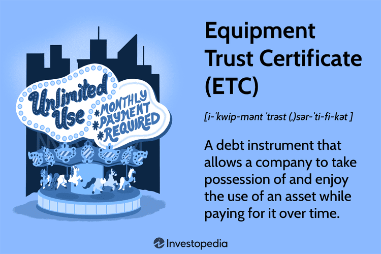

In the digital era, technological advancements have significantly transformed trading environments, creating a landscape rich with both opportunities and challenges. The technological integration in trading operations has paved the way for faster, more efficient transactions but has also introduced complexities related to security and trust. Among the key components that support this evolving trading ecosystem are digital authentication security certificates. These certificates serve as crucial tools for verifying identities, facilitating secure communications, and protecting sensitive data from unauthorized access and cyber threats.

Digital authentication security certificates are essential in verifying the legitimacy of counterparties in a trade, thereby ensuring that interactions are both secure and trustworthy. As trading becomes increasingly algorithmic, the need for robust digital security measures is heightened. Algorithmic trading, characterized by the use of complex algorithms to automate trading decisions, relies heavily on secure electronic communications to function effectively. Here, digital certificates play a pivotal role by enabling encrypted communications and safeguarding information exchange, thus minimizing the risks associated with digital trading platforms.



This article aims to explore the interconnectedness of trust certificates and digital security within the context of algorithmic trading. By examining how these elements coalesce, we can gain insights into creating a resilient trading ecosystem that prioritizes both speed and security. As the financial industry continues to evolve, the development and implementation of advanced digital security measures will be critical in protecting trading operations from emerging cybersecurity threats.

## Table of Contents

## Understanding Trust Certificates in Trading

Trust certificates serve as crucial financial instruments within the trading ecosystem, offering distinct advantages over traditional unsecured bonds. Fundamentally, trust certificates are debt instruments that are backed by collateral assets, thereby affording investors a greater sense of security. 

### Definition and Characteristics

A trust certificate typically represents a loan that is secured by underlying assets. This collateralization differentiates them from unsecured bonds, which rely solely on the issuer's creditworthiness and are not backed by physical or financial assets. The existence of collateral provides a buffer against potential losses, as the assets can be liquidated to cover the debt in case of default by the issuer.

### Safety Mechanism for Investors

The presence of collateral in trust certificates acts as a safety net for investors. In the event of an issuer defaulting on the debt, investors have a claim on the collateralized assets. This mechanism significantly reduces the risk associated with the investment compared to unsecured bonds, where investors stand to lose the principal amount if the issuer defaults without any recovery options. 

### Example

To illustrate, consider a company issuing a trust certificate backed by its real estate holdings. If the company fails to meet its debt obligations, investors can claim the real estate, which can be sold or managed to recover the funds, thereby protecting the investors' interests.

### Mathematical Perspective

The risk reduction afforded by trust certificates can be quantitatively evaluated. Let's define:

- $V_i$: The value of the investment.
- $C$: The collateral value.

For an unsecured bond, in case of default, the recovery amount $R = 0$. However, for trust certificates, the recovery can be expressed as:

$$
R = \min(V_i, C)
$$

Where $R$ represents the recovery amount, which is constrained by the lesser of the investment value or the collateral value. This equation highlights the enhanced recovery potential for asset-backed securities compared to their unsecured counterparts.

### Conclusion

In summary, trust certificates provide a layer of security that is absent in unsecured bonds, offering a relatively safer investment option by securing the loan through collateral assets. This feature ensures a protective mechanism for investors, enhancing the stability and trustworthiness of trade-related financial dealings.

## The Role of Digital Certificates in Cybersecurity

Digital certificates are integral to cybersecurity as they function as electronic credentials for the verification of identities on online platforms. These certificates serve as a cornerstone for ensuring the secure exchange of information between entities, thereby mitigating the risk of unauthorized access and data breaches. The essence of digital certificates lies in their ability to form a trust chain through which parties can confidently exchange sensitive data.

Digital certificates employ a public key infrastructure (PKI) system, which includes a public key, a private key, and a Certificate Authority (CA). The CA is a trusted third party that issues digital certificates after verifying the credentials of requesters. The certificates thus issued bind a public key with an individual's or organization's identity. For example, when a client accesses a secure server, the server presents its digital certificate. The client then uses the public key contained in the certificate to establish a secure connection, usually via SSL/TLS protocols.

SSL (Secure Sockets Layer) is a standard security technology for establishing an encrypted link between a server and a client—typically a web server (website) and a browser, or a mail server and a mail client. TLS (Transport Layer Security) is an updated, more secure version of SSL. Digital certificates are critical for the functioning of these protocols. They enable the encryption of data in transit, ensuring that any intercepted information cannot be read by unintended parties. This encryption is facilitated by employing algorithms such as RSA, DSA, or ECDSA, which rely on asymmetric cryptography.

For example, a digital certificate might contain the following information:

1. **Version**: Indicates the version of the X.509 standard which the certificate complies with.
2. **Serial Number**: A unique identifier assigned by the Certificate Authority to the certificate.
3. **Algorithm Information**: Specifies the algorithm used by the CA to sign the certificate.
4. **Issuer Name**: The name of the CA.
5. **Validity Period**: Specifies the start and expiration date of the certificate.
6. **Subject Name**: The identity of the certificate owner.
7. **Public Key**: The public cryptographic key associated with the subject.

This structure is essential to the operation of SSL/TLS protocols, which rely on digital certificates to confirm that the party on the other end of the connection is who they say they are. When a certificate is verified, the client antenna sends a challenge to the server, which is then signed using the server's private key. The client can verify this signature using the public key in the server's digital certificate. This handshake process establishes an encrypted communication session safeguarded from eavesdropping and tampering.

By ensuring encrypted communications, digital certificates are a fundamental part of safeguarding cyber interactions against various threats, thereby supporting both privacy and integrity in digital communications.

## Service Authentication and Security Certificates

Service authentication is crucial in verifying identities and securing transaction data within digital ecosystems. This authentication process is primarily supported by digital certificates, which are cryptographic documents issued by trusted Certificate Authorities (CAs). These certificates serve as the bedrock of online identity and transaction security by providing a means for entities to prove their legitimacy and ensuring secure communications.

Digital certificates utilize public key infrastructure (PKI) to authenticate the identity of participants in a transaction. PKI employs a pair of cryptographic keys—public and private keys—where the public key is included in the digital certificate. When a user or system presents its digital certificate during a transaction, the receiving party can verify the certificate using the public key of the issuing CA, which assures that the certificate is valid and issued by a trusted source.

The issuance of digital certificates by CAs mitigates the risk of identity fraud and impersonation attacks. By relying on these trusted authorities, organizations can establish a chain of trust whereby each participant in a transaction can be assured of the other’s identity. This trust is enhanced by the digital signature affixed by the CA, which serves as a tamper-proof seal of authenticity.

In practice, digital certificates are integral to protocols like Secure Sockets Layer (SSL) and Transport Layer Security (TLS), which secure data transmission over networks. By encrypting the data exchanged between parties during a transaction, these protocols prevent unauthorized access and ensure that any data intercepted cannot be read or altered by malicious actors.

Here is a simple Python example demonstrating how digital certificates can be used to verify identity using the `ssl` library:

```python
import socket
import ssl

# Create a secure SSL context
context = ssl.create_default_context()

# Connect to a server using HTTPS
hostname = 'www.example.com'
with socket.create_connection((hostname, 443)) as sock:
    with context.wrap_socket(sock, server_hostname=hostname) as ssock:
        # Get the certificate from the server
        cert = ssock.getpeercert()
        # Check if the certificate is valid
        if not cert or ssl.match_hostname(cert, hostname):
            print("Certificate verification failed.")
        else:
            print("Certificate verified successfully.")
```

In summary, service authentication through digital certificates enhances both the security and trustworthiness of financial transactions. By preventing impersonation attacks, these certificates safeguard not only the data but also the broader integrity of digital financial ecosystems. The continuous development and adoption of advanced technologies in digital certification will be essential for maintaining robust cybersecurity defenses as threats evolve.

## Algorithmic Trading: Balancing Speed and Security

Algorithmic trading has revolutionized financial markets by leveraging technology to automate trade execution, thereby enhancing market efficiency and [liquidity](/wiki/liquidity-risk-premium). The core advantage of [algorithmic trading](/wiki/algorithmic-trading) lies in its ability to process large volumes of data and execute trades at speeds and frequencies that are beyond human capability. This high-speed trading often leads to tighter bid-ask spreads and more efficient price discovery, which benefits all market participants by enhancing liquidity and reducing transaction costs.

However, the digital nature of algorithmic trading platforms also introduces significant cybersecurity risks. These platforms are vulnerable to various cyber threats such as unauthorized access, data breaches, and manipulation of trading algorithms. A single security breach can have dire consequences, not only causing financial losses but also jeopardizing market integrity. Thus, ensuring robust security measures is critical for maintaining trust and stability in algorithmic trading systems.

Secure authentication is indispensable in algorithmic trading to prevent unauthorized access and transactions. Digital certificates play a crucial role in this context by serving as electronic verifiers of identity. Issued by trusted Certificate Authorities (CAs), these certificates enable the establishment of a secure communication channel via Secure Sockets Layer (SSL) or Transport Layer Security (TLS) protocols. This ensures that all parties involved in the trading process are authenticated and that data exchanged is encrypted and protected from interception or tampering.

To illustrate, consider an algorithmic trading system where digital certificates are integrated within the software infrastructure. Each user or system component is assigned a unique certificate, which is used to authenticate identity before executing trades. This implementation involves a Public Key Infrastructure (PKI) that manages the issuance, renewal, and revocation of certificates, thereby maintaining the security and integrity of the trading environment. 

Moreover, digital certificates can be complemented with advanced security measures such as multi-[factor](/wiki/factor-investing) authentication, intrusion detection systems, and end-to-end encryption to further mitigate risks. These measures ensure that only legitimate parties can access the trading system and execute transactions, thus safeguarding against potential cyber threats.

In summary, while algorithmic trading offers significant benefits in terms of speed and efficiency, its security challenges must not be underestimated. Implementing digital certificates as part of a holistic security strategy is vital to protect algorithmic trading platforms from cyber threats, ensuring that the speed and efficiency of automated trading do not compromise system security and market trust.

## Integrating Digital Certificates in Trading Systems

Integrating digital certificates within trading systems requires the establishment of a robust Public Key Infrastructure (PKI) that forms the backbone of secure communications and transactions. PKI is essential for managing keys and certificates, which enable encrypted communications and authenticate the identities of trading parties. This infrastructure provides a framework for the creation, distribution, and revocation of digital certificates, ensuring that only legitimate and authorized entities can participate in the trading process.

To maintain system integrity, it is crucial to manage digital certificates carefully. This involves issuing certificates to authorized users, devices, or services, and implementing policies for periodically renewing these certificates to prevent expiration and associated security risks. Equally important is the ability to revoke compromised or invalid certificates swiftly. This can be achieved through mechanisms such as Certificate Revocation Lists (CRLs) or Online Certificate Status Protocol (OCSP) responses, which help trading systems recognize and nullify invalid certificates in real-time.

A multi-layered security strategy complements the integration of digital certificates. This approach encompasses various security measures to protect both the network and the application layers. For network security, deploying firewalls, intrusion detection and prevention systems (IDPS), and Virtual Private Networks (VPNs) helps secure data transmission channels. At the application level, the use of strong authentication methods, such as multi-factor authentication (MFA), combined with regular security updates and vulnerability assessments, adds an additional layer of defense.

An example Python code snippet for setting up a basic Public Key Infrastructure might look like this:

```python
from cryptography.hazmat.primitives import serialization
from cryptography.hazmat.primitives.asymmetric import rsa
from cryptography.x509 import NameOID
from cryptography import x509
import datetime

# Generate an RSA key pair
private_key = rsa.generate_private_key(
    public_exponent=65537,
    key_size=2048,
)

# Create a self-signed certificate
subject = issuer = x509.Name([
    x509.NameAttribute(NameOID.COUNTRY_NAME, "US"),
    x509.NameAttribute(NameOID.STATE_OR_PROVINCE_NAME, "California"),
    x509.NameAttribute(NameOID.LOCALITY_NAME, "San Francisco"),
    x509.NameAttribute(NameOID.ORGANIZATION_NAME, "Trading Company"),
    x509.NameAttribute(NameOID.COMMON_NAME, "trading.example.com"),
])

cert = x509.CertificateBuilder().subject_name(
    subject
).issuer_name(
    issuer
).public_key(
    private_key.public_key()
).serial_number(
    x509.random_serial_number()
).not_valid_before(
    datetime.datetime.utcnow()
).not_valid_after(
    datetime.datetime.utcnow() + datetime.timedelta(days=365)  # 1 year validity
).add_extension(
    x509.SubjectAlternativeName([x509.DNSName("trading.example.com")]),
    critical=False,
).sign(private_key, hashes.SHA256())

# Write the private key and certificate to files
with open("private_key.pem", "wb") as f:
    f.write(private_key.private_bytes(
        encoding=serialization.Encoding.PEM,
        format=serialization.PrivateFormat.TraditionalOpenSSL,
        encryption_algorithm=serialization.NoEncryption(),
    ))

with open("certificate.pem", "wb") as f:
    f.write(cert.public_bytes(serialization.Encoding.PEM))
```

In conclusion, the integration of digital certificates through a well-supported PKI and a comprehensive security strategy enhances the security of trading systems. This framework not only facilitates secure and authenticated transactions but also reinforces trust within the trading environment by ensuring that all participants are legitimate and verified.

## Challenges and Future Trends

Scalability and lifecycle management of digital certificates are significant challenges within fast-paced trading environments. One of the main issues is the vast [volume](/wiki/volume-trading-strategy) of transactions requiring validation at high speed, which can strain certificate management systems. Effective scalability requires these systems to handle a large number of certificate operations, such as issuance, renewal, and revocation, without delays. Lifecycle management involves ensuring certificates are updated and secure through automated processes to prevent service disruptions or security vulnerabilities. 

Emerging technologies offer compelling solutions to these challenges. Artificial Intelligence (AI) can enhance certificate management by automating processes and identifying anomalies in real time, thereby improving efficiency and security. For example, AI algorithms can be employed to predict certificate expiration dates and automate renewal processes, reducing manual workload and error. Moreover, [machine learning](/wiki/machine-learning) models can be fine-tuned to detect unusual patterns of access or misuse, thereby preemptively addressing potential security breaches.

Blockchain technology presents another promising avenue for managing digital certificates. With its decentralized and immutable nature, blockchain can provide a transparent and tamper-proof ledger for certificate transactions. This ensures that all changes to certificate data are recorded and verifiable by all parties, enhancing the trustworthiness and integrity of the system. Smart contracts on a blockchain platform can automate the issuance and revocation of certificates, further streamlining lifecycle management.

Quantum computing, while still in its nascent stage, holds transformative potential for digital security. Quantum computers could eventually break current cryptographic standards, prompting the development of quantum-resistant algorithms. These advanced algorithms are essential for securing digital certificates in future-proof trading systems._

Adapting to these technological innovations is crucial to maintaining secure and efficient trading systems. As blockchain, AI, and quantum computing continue to evolve, their integration into digital certificate management processes will be imperative. Financial systems must proactively adapt to these advancements to safeguard against sophisticated cybersecurity threats and ensure the continual growth and reliability of trading operations.

## Conclusion

Digital authentication security certificates are crucial in maintaining trust and security within modern trading environments. These certificates provide a framework for verifying the identity of parties engaged in trading, ensuring that individuals and entities are who they claim to be. This process of verification reduces the risk of fraudulent activities and unauthorized access to sensitive trading systems. As trading platforms increasingly rely on algorithmic trading to enhance efficiency, the integration of digital authentication certificates becomes even more significant. 

Algorithmic trading, which utilizes algorithms to automate the execution of trades, requires systems that are both rapid and resilient against cyber threats. Merging digital authentication certificates with these systems offers a dual advantage—safeguarding speed and enhancing security. The certificates validate each transaction, ensuring that only legitimate trades are executed. This integration is vital in preventing spoofing, fraud, and other malicious activities that can occur in high-frequency trading environments.

As cybersecurity threats continue to evolve in complexity and frequency, the role of digital authentication certificates must also adapt. Emerging challenges, such as sophisticated hacking techniques and quantum computing, necessitate continuous enhancement of certificate security protocols. This adaptation may involve leveraging advanced technologies like [artificial intelligence](/wiki/ai-artificial-intelligence) and machine learning to predict and mitigate threats before they materialize. Moreover, the development of quantum-resistant algorithms is crucial to ensure the long-term viability of digital certificates in defending against future cryptographic threats.

Maintaining secure trading systems will require a proactive approach to the lifecycle management of digital certificates. This includes regular updates, timely revocations, and the implementation of a Public Key Infrastructure (PKI) capable of handling the demands of a fast-paced trading environment. By continuously enhancing digital authentication security measures, financial systems can effectively balance the imperatives of speed and security, thus fortifying the trust that is the foundation of modern trading ecosystems.

## References & Further Reading

[1]: Jacobson, V., & Borman, H. (2011). ["The infrastructure of digital certificates: Everything you need to know."](https://www.digicert.com/faq/trust-and-pki/what-is-a-digital-certificate-and-why-are-digital-certificates-important)

[2]: Lopez de Prado, M. (2018). ["Advances in Financial Machine Learning."](https://www.amazon.com/Advances-Financial-Machine-Learning-Marcos/dp/1119482089) Wiley.

[3]: Ferguson, N. (2003). ["Cryptography Engineering: Design Principles and Practical Applications."](https://onlinelibrary.wiley.com/doi/pdf/10.1002/9781118722367.fmatter) Wiley Publishing.

[4]: Rescorla, E. (2001). ["SSL and TLS: Designing and Building Secure Systems."](https://archive.org/details/ssltls00eric) Addison-Wesley.

[5]: Boneh, D., & Shoup, V. (2020). ["A Graduate Course in Applied Cryptography."](https://crypto.stanford.edu/~dabo/cryptobook/BonehShoup_0_5.pdf) Draft Version 0.5.