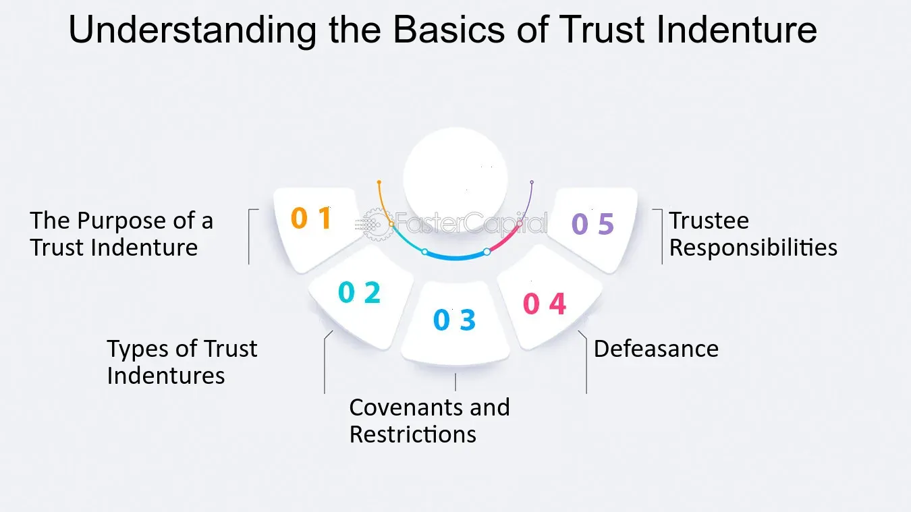

## Table of Contents

## What is a trust indenture?

A trust indenture is a legal document that outlines the terms and conditions between a bond issuer and bondholders. It acts like a contract, where the issuer promises to pay back the borrowed money with interest on specific dates. The document also includes details about the bond, like its interest rate, maturity date, and how payments will be made. This helps protect the bondholders by making sure the issuer follows the rules.

The trust indenture also appoints a trustee, usually a bank or trust company, to represent the bondholders' interests. The trustee makes sure the issuer sticks to the terms of the indenture. If the issuer fails to make payments or breaks any other rules, the trustee can take action on behalf of the bondholders. This setup gives bondholders more security and confidence in their investment.

## Why is a trust indenture important in bond issuance?

A trust indenture is important in bond issuance because it acts like a safety net for people who buy bonds. It's a contract that says the company or government that issued the bond has to follow certain rules. These rules include paying back the money they borrowed, plus interest, on time. The trust indenture makes sure everyone knows what to expect and helps keep things fair.

The trust indenture also picks a special person or company, called a trustee, to watch over the bond issuer. The trustee's job is to make sure the issuer does what they promised in the indenture. If the issuer doesn't pay back the money or breaks any other rules, the trustee can step in and help the bondholders. This gives people who buy bonds more confidence that their investment is safe.

## Who are the key parties involved in a trust indenture?

The key parties in a trust indenture are the bond issuer and the bondholders. The bond issuer is the company or government that borrows money by selling bonds. They promise to pay back the money they borrowed, plus interest, according to the terms in the trust indenture. The bondholders are the people or organizations that buy the bonds. They lend their money to the issuer and expect to get it back with interest as promised in the indenture.

Another important party is the trustee. The trustee is usually a bank or trust company that is chosen to represent the bondholders. Their job is to make sure the bond issuer follows all the rules in the trust indenture. If the issuer doesn't pay back the money on time or breaks any other rules, the trustee can take action to protect the bondholders' interests. This helps give bondholders more confidence in their investment.

## What are the main components of a trust indenture?

A trust indenture is like a detailed contract that explains the rules between the company or government that borrows money by issuing bonds and the people who buy those bonds. It includes important details like how much interest the bond will pay, when the bond will be paid back, and how the payments will be made. This helps everyone know what to expect and makes sure the bond issuer follows the rules.

The trust indenture also picks a special person or company, called a trustee, to watch over the bond issuer. The trustee's job is to make sure the issuer does what they promised in the indenture. If the issuer doesn't pay back the money on time or breaks any other rules, the trustee can step in and help the bondholders. This setup gives people who buy bonds more confidence that their investment is safe.

## How does a trust indenture protect bondholders?

A trust indenture protects bondholders by setting clear rules that the bond issuer must follow. It's like a contract that says the issuer has to pay back the money they borrowed, plus interest, on specific dates. This helps bondholders know exactly what to expect and makes sure the issuer can't change the rules without their agreement. If the issuer doesn't follow these rules, the trust indenture gives bondholders a way to take action.

The trust indenture also appoints a trustee, which is usually a bank or trust company, to watch over the bond issuer. The trustee's job is to make sure the issuer sticks to the terms of the indenture. If the issuer misses a payment or breaks any other rules, the trustee can step in and help the bondholders. This gives bondholders more confidence because they know someone is looking out for their interests and can take action if needed.

## What is the role of a trustee in a trust indenture?

The trustee in a trust indenture is like a guardian for the people who buy bonds. They are usually a bank or trust company picked to watch over the bond issuer. The main job of the trustee is to make sure the issuer follows all the rules in the trust indenture. This includes making sure the issuer pays back the money they borrowed, plus interest, on time.

If the issuer misses a payment or breaks any other rules, the trustee can step in to help the bondholders. They can take legal action against the issuer if needed. This gives bondholders more confidence because they know someone is looking out for their interests and can take action if the issuer doesn't do what they promised.

## Can the terms of a trust indenture be modified after issuance?

Yes, the terms of a trust indenture can be changed after the bonds are issued, but it's not easy. Usually, both the bond issuer and the bondholders have to agree to any changes. This means the issuer can't just change the rules without asking the bondholders first. It's like a contract where everyone has to agree to any updates.

The process to change the terms can be complicated. Often, a certain percentage of bondholders need to vote and agree to the changes. This is to make sure that the rights of the bondholders are protected and that the issuer can't make changes that might hurt the bondholders. The trustee, who is there to look out for the bondholders, also plays a role in making sure any changes are fair and follow the rules.

## What are the differences between a trust indenture and a mortgage indenture?

A trust indenture and a mortgage indenture are both legal documents, but they serve different purposes. A trust indenture is used when a company or government issues bonds. It's like a contract that says the issuer will pay back the money they borrowed, plus interest, on certain dates. It also picks a trustee to watch over the issuer and make sure they follow the rules. This helps protect the people who buy the bonds by making sure the issuer does what they promised.

On the other hand, a mortgage indenture is used when someone takes out a loan to buy a house or property. It's a document that says the property is used as security for the loan. If the person can't pay back the loan, the lender can take the property. Unlike a trust indenture, a mortgage indenture doesn't usually involve a trustee. Instead, it's just between the borrower and the lender, and it focuses on the property as a way to make sure the loan gets paid back.

## How do covenants in a trust indenture affect the issuer's operations?

Covenants in a trust indenture are like promises that the bond issuer has to keep. These promises can affect how the issuer runs their business. For example, some covenants might say the issuer can't borrow more money or sell important assets without asking the bondholders first. This can limit what the issuer can do and make it harder for them to grow or change their business quickly. They have to be careful and make sure they follow these rules, or they could get in trouble with the bondholders.

Other covenants might require the issuer to keep certain financial ratios, like having enough money to cover their debts. This means the issuer has to manage their money carefully and might not be able to spend as freely as they want. If they don't meet these financial requirements, it could be seen as breaking the trust indenture, and the bondholders could take action against them. So, covenants help protect the bondholders but can also make it more challenging for the issuer to run their business the way they want.

## What happens if an issuer defaults on the terms of a trust indenture?

If an issuer defaults on the terms of a trust indenture, it means they didn't do what they promised, like missing a payment or breaking a rule. When this happens, the trustee, who is there to look out for the bondholders, can step in. The trustee might talk to the issuer to fix the problem or take legal action against them. This is to make sure the bondholders get their money back and that the issuer follows the rules.

The specific actions the trustee can take depend on what's written in the trust indenture. Sometimes, the trustee can demand that the issuer pays back all the money right away. Other times, they might work out a new plan with the issuer to get the bondholders their money over time. If the issuer still can't pay, the trustee might even help the bondholders take over the issuer's assets to sell them and get their money back. This process helps protect the bondholders and makes sure the issuer can't just ignore the rules.

## How are trust indentures regulated and by which bodies?

Trust indentures are regulated to make sure they are fair and protect the people who buy bonds. In the United States, the main body that regulates trust indentures is the Securities and Exchange Commission (SEC). The SEC makes rules that companies have to follow when they issue bonds and create trust indentures. These rules help make sure that the trust indenture has all the important details and that the issuer can't trick the bondholders.

Other countries have their own rules and bodies to regulate trust indentures. For example, in Canada, the Office of the Superintendent of Financial Institutions (OSFI) and provincial securities commissions play a role in making sure trust indentures are fair. These regulators check that the trust indenture follows the law and that the issuer is honest with the bondholders. By having these rules and regulators, bondholders can feel more confident that their investment is safe and that the issuer will follow the rules.

## What are some advanced strategies for negotiating trust indenture terms?

When negotiating trust indenture terms, one advanced strategy is to focus on the covenants. Covenants are the rules the issuer has to follow, and they can be strict or more flexible. Bondholders might want to push for stricter covenants to make sure the issuer can't do things that might hurt their investment, like borrowing more money or selling important assets without asking first. On the other hand, the issuer might want more flexibility to run their business. A good negotiator will try to find a balance that protects the bondholders but also gives the issuer enough room to operate.

Another strategy is to negotiate the role and powers of the trustee. The trustee is there to watch over the issuer and make sure they follow the rules. Bondholders might want a strong trustee who can take quick action if the issuer breaks the trust indenture. This could mean giving the trustee more power to step in and help the bondholders if there's a problem. The issuer might want a trustee who is less likely to cause trouble. Negotiating these details can help make sure the trustee is effective and that the bondholders feel protected.

Lastly, it's important to think about how the trust indenture can be changed after the bonds are issued. Bondholders might want to make it hard for the issuer to change the terms without their agreement. This could mean setting a high percentage of bondholders who need to vote and agree to any changes. The issuer might want more flexibility to adjust the terms if their situation changes. A smart negotiator will try to set clear rules for how changes can be made, so both sides know what to expect and feel confident in the agreement.

## References & Further Reading

[1]: ["The Indenture Trustee’s Role in Debt Securities"](https://bankruptcyroundtable.law.harvard.edu/2019/07/09/indenture-trustee-duties-the-pre-default-puzzle/) - Skadden, Arps, Slate, Meagher & Flom LLP.

[2]: Fabozzi, Frank J. (2007). ["Bond Markets, Analysis, and Strategies"](https://www.amazon.com/Bond-Markets-Analysis-Strategies-tenth/dp/026204627X) (7th Edition). Pearson.

[3]: ["Algorithmic Trading: A Comprehensive Guide to Trading Strategies, Mathematics, and Computational Tools"](https://www.amazon.com/Algorithmic-Trading-Comprehensive-Beginners-Training/dp/1091263973) by Álvaro Cartea, Sebastian Jaimungal, and José Penalva.

[4]: Lopez de Prado, Marcos (2018). ["Advances in Financial Machine Learning"](https://www.amazon.com/Advances-Financial-Machine-Learning-Marcos/dp/1119482089). Wiley.

[5]: Harris, Larry (2003). ["Trading and Exchanges: Market Microstructure for Practitioners"](https://www.amazon.com/Trading-Exchanges-Market-Microstructure-Practitioners/dp/0195144708). Oxford University Press.