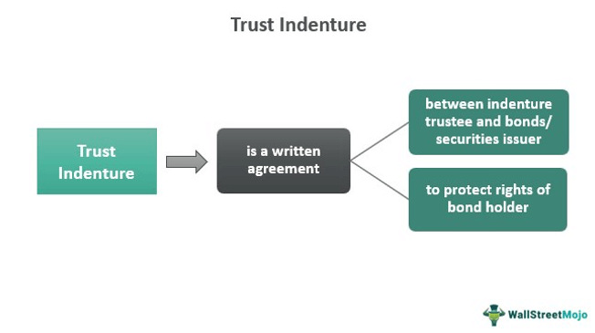

Understanding the intricacies of the bond market is crucial for investors and financiers as it forms a fundamental part of the global financial system. Bonds, essentially loans made by investors to borrowers like corporations or governments, involve various legal agreements that ensure transparency and safeguard the interests of all parties involved. Among these agreements, trust indentures are significant, encapsulating the terms and conditions governing bond issues. These legal documents protect investor interests by outlining the responsibilities of the issuer and the rights of the bondholders.

Additionally, the advent of algorithmic trading is transforming the landscape of financial markets, including bonds. Algorithmic trading, or algo trading, employs computer algorithms to automate and optimize the execution of trades. This technological innovation is enhancing market efficiency by increasing liquidity, improving price discovery, and reducing transaction costs. The combination of legal frameworks and technological advancements represents a dynamic synergy that influences how bonds and other securities are traded.

This article examines the components of legal agreements within the bond market, elucidates the function of trust indentures, and analyzes the burgeoning impact of algorithmic trading. By exploring these elements, it aims to provide an informed perspective on how traditional legal instruments and contemporary technology are shaping the modern bond market.

## Table of Contents

## Understanding Legal Agreements in the Bond Market

Legal agreements are fundamental in structuring transactions within the bond market, serving as the framework that clearly delineates the rights and obligations between bond issuers and investors. These agreements not only set the legal parameters for a bond issuance but also act as a foundation on which the trust is built between the parties involved.

At the core of these agreements lies the bond indenture, which is a legal contract that specifies the terms of the bond issue. This document is crucial as it provides detailed information regarding the obligation of the issuer, including the principal amount of bonds to be repaid at maturity, the interest rate (or coupon rate) to be paid, and the timing of these payments. These terms are essential for investors to ascertain the returns on their investment and the duration of the bond.

In addition to the financial terms, legal agreements in the bond market encompass multiple clauses designed to protect investors. Such clauses include covenants that may impose restrictions on the issuer, such as limiting the amount of additional debt that can be incurred, which helps in preserving the financial stability of the bond issuer. Moreover, the agreement might stipulate actions that may be taken in case of default, including acceleration provisions where the principal and interest become immediately due and payable if certain criteria are met.

These agreements also present procedural guidelines for both parties, such as the obligations of the trustee, who acts as an intermediary to ensure the issuer complies with the bond terms. The trustee's role involves the enforcement of bond provisions, thus safeguarding investor interests.

For investors, understanding these agreements is paramount to protect their financial interests. A comprehensive grasp of the terms allows investors to evaluate the risk associated with a bond and make informed investment decisions. For instance, by interpreting covenants, investors can assess the financial health and operational restrictions on the issuer, thus gauging the bond's risk profile relative to other investment opportunities.

Moreover, legal agreements are crafted to mitigate conflicts and outline clearly the resolution mechanisms, further supporting a well-functioning bond market. In essence, legal agreements not only safeguard the interests of bondholders but also promote transparency and confidence, fostering a stable investment environment. Consequently, investors who are well-versed in the implications of these legal contracts are better equipped to navigate the complexities of the bond market effectively.

## What is a Trust Indenture?

A trust indenture is a legally binding document that establishes the specific terms and conditions associated with the issuance of a bond. This document is essential for articulating the rights and responsibilities of both the bond issuer and the bondholders, represented by a trustee. The trustee acts as an intermediary to ensure that the bond issuer adheres to the terms of the indenture, providing protection for the bondholders.

Critical components of a trust indenture usually include details about the bond's maturity date, which indicates when the principal or face value must be repaid to bondholders. The face value, often referred to as the par value, represents the amount that the issuer agrees to repay the bondholders at maturity. 

Another integral element specified within the trust indenture is the coupon rate. This rate denotes the annual interest payment, typically expressed as a percentage of the bond’s face value, paid to bondholders during the life of the bond. For example, a bond with a face value of $1,000 and a coupon rate of 5% would pay $50 in interest annually.

Trust indentures may also outline any call features, which give the issuer the right to redeem the bond before its maturity date, often at a premium to the face value. These features provide issuers with the flexibility to refinance the debt should market conditions become favorable.

By clearly defining these terms, a trust indenture provides a framework that mitigates risk and provides transparency, ensuring that both parties are aware of their commitments and the rules governing the bond issuance. This legal document is thus a cornerstone of investor protection in the bond market.

## Components and Provisions of a Trust Indenture

Trust indentures are critical legal documents in the bond market, designed to protect the interests of bondholders by establishing specific terms and conditions for bond issuance. These indentures include a variety of components and provisions, the most notable being protective covenants. Protective covenants are clauses that impose restrictions and obligations on bond issuers to ensure they adhere to certain financial guidelines, ultimately safeguarding the bondholders' returns.

One of the primary protective covenants often found in trust indentures is the restriction on the issuer's ability to incur additional debt. This covenant is significant as it prevents the dilution of the issuer's ability to meet its existing debt obligations, which could jeopardize the original bondholders' investments. By limiting further debt accumulation, the indenture maintains the financial integrity and creditworthiness of the issuer.

Other common provisions within a trust indenture involve detailing default procedures. These provisions outline the actions to be taken in the event of an issuer's failure to meet its payment obligations. It typically includes steps for the acceleration of bond payments, enabling bondholders to recover the principal and any accrued interest more swiftly. Default procedures might also describe the role of the trustee in managing and negotiating any recovery effort on behalf of the bondholders, thereby providing a systematic approach to resolving payment issues.

Understanding these provisions is essential for evaluating the risk associated with a bond issuance. They serve as a mechanism for bondholders to assess the level of protection against potential financial distress faced by the issuer. By comprehending these protective measures, investors can make informed decisions, aligning their investment strategies with their risk tolerance. This understanding also allows bondholders to perform a due diligence assessment, weighing the benefits of the bond's interest payouts against the legal protections embedded within the indenture.

In summary, the components and provisions of a trust indenture act as essential tools for investor protection. They define the obligations of the issuer, regulate financial maneuvers, and provide a framework for managing potential defaults, thus ensuring that bondholder interests are safeguarded throughout the life of the bond. This comprehensive understanding is invaluable for evaluating the viability of bond investments in the often volatile financial markets.

## Role of Algorithmic Trading in the Bond Market

Algorithmic trading employs computer algorithms to facilitate the swift execution of trades, often executing at speeds and for volumes beyond human capabilities. This approach to trading harnesses advanced mathematical models and statistical methods to decide on trade execution. In the bond market, [algorithmic trading](/wiki/algorithmic-trading) has become a critical tool in enhancing [liquidity](/wiki/liquidity-risk-premium), determining prices, and improving transaction efficiency.

Liquidity in the bond market, traditionally lower than in equities, is significantly bolstered by algorithmic trading. Algorithms can quickly connect buyers and sellers, enabling quicker market access and narrower bid-ask spreads, which is crucial in a market often characterized by sporadic trading. This improvement in liquidity results in a more efficient market, reducing the cost of execution for participants. Moreover, algorithmic trading systems are capable of managing and processing large datasets to detect liquidity patterns, which aids in the prediction and understanding of price movements.

Pricing, another core aspect of the bond market, is increasingly influenced by algorithms that analyze various market indicators and historical data to determine the most advantageous price points for trading. These systems can continuously process new information and make real-time pricing adjustments, offering traders a dynamic tool to optimize their strategies. The precision and speed of these algorithmic systems often lead to more accurate pricing and better hedging strategies against market risks.

Transaction efficiency, facilitated by algorithmic processes, allows for faster execution which reduces potential slippage and latency. The algorithms are designed to execute trades at the optimal price and timing, minimizing market impact and optimizing the execution cost. Additionally, with algorithmic trading, transactions can be conducted outside traditional trading hours, increasing the flexibility and potential profit opportunities for market participants.

The integration of algorithmic trading into the traditional aspects of bond trading bridges the gap between conventional processes and modern technological advancements. Traditionally, bond trading was heavily reliant on manual processes, with traders relying on phone calls and personal relationships to conduct trades. Algorithmic trading revolutionizes this by reducing human intervention, thus decreasing errors associated with manual trading. The capacity for real-time data processing and execution allows for more strategic trading decisions, aligning with the rapid pace of modern financial markets.

In summary, algorithmic trading redefines the operating landscape of the bond market, enhancing liquidity, refining pricing mechanisms, and streamlining transactions. Its influence represents a significant evolution from traditional trading methods, providing market participants with tools to navigate the complexities and dynamism of the modern financial world effectively.

## The Intersection of Trust Indentures and Algo Trading

In the rapidly evolving landscape of financial markets, trust indentures and algorithmic trading represent two foundational components that significantly influence bond market operations. Trust indentures provide a structured, legal framework that ensures the security and transparency of bond investments. These documents define key aspects of a bond issuance, such as maturity dates, interest payments, and covenants intended to protect bondholders. In contrast, algorithmic trading introduces agility and efficiency through the use of sophisticated computer algorithms capable of executing trades at speeds unattainable by human traders.

Understanding the intersection of these two elements offers valuable insights into modern bond market dynamics. Trust indentures traditionally serve as a safeguard, ensuring that all parties adhere to agreed-upon terms and protecting investors against default risks. The legal certainty they offer is fundamental in establishing investor confidence, particularly in long-term or complex bond structures.

Conversely, algorithmic trading impacts how bonds are bought and sold by facilitating quick adjustments to market conditions and enabling large [volume](/wiki/volume-trading-strategy) transactions. This technology can affect liquidity by increasing the ease with which bonds can be traded, thereby potentially narrowing bid-ask spreads and enhancing price discovery. Algorithmic strategies might also utilize data from trust indentures—such as covenants or call features—to inform trading decisions or automate certain risk management processes.

As the bond market incorporates technology with traditional legal frameworks, several key effects are observed. Algorithmic trading systems, when integrated with the legal certainty provided by trust indentures, support a more resilient financial market infrastructure. The speed and efficiency of algo trading complement the traditional roles of trustees and legal advisors by ensuring that market transactions adhere to predetermined legal conditions and financial strategies.

Moreover, the convergence of these domains presents opportunities for innovation in compliance and regulation. For example, smart contract technology, which leverages blockchain assets with programmable logic, can automate the execution of trust indenture provisions based on preset conditions. This technological overlay enhances legal compliance while reducing administrative burdens and costs associated with manual oversight.

In conclusion, the interplay between trust indentures and algorithmic trading underscores a broader trend in financial markets where technology not only augments existing legal frameworks but also catalyzes their evolution. Stakeholders, including investors, issuers, and regulators, benefit from a dual-layer protection that combines the stability and security of legal agreements with the flexibility and efficiency of technological advances. Through this integration, the bond market continues to adapt, providing a more robust and dynamic environment for capital management and investment.

## Conclusion

The bond market represents a sophisticated landscape where legal agreements and cutting-edge technology intersect to shape investment and trading practices. At one end, trust indentures serve as foundational elements that ensure the protection of bondholders. These legal documents provide a structured framework, defining the rights, obligations, and safeguards necessary for the security of investments. By laying out specific terms such as maturity dates, coupon rates, and covenants, trust indentures deliver a comprehensive guide that helps mitigate risks and protect investor interests.

On the other hand, algorithmic trading represents a significant shift in how bonds and other securities are traded. By employing advanced computer programs, algorithmic trading improves the efficiency, speed, and volume of transactions in the bond market. This technological advancement enhances liquidity and pricing accuracy, benefiting both issuers and investors through more streamlined trading processes.

To navigate this complex ecosystem, it is essential for investors and market participants to grasp both the traditional aspects of trust indentures and the innovative dynamics of algorithmic trading. Such an integrated understanding not only facilitates better decision-making but also enhances strategic planning for investment portfolios. Investors who can deftly balance these legal and technological components are better positioned to capitalize on opportunities and mitigate risks in the ever-evolving bond market landscape. Hence, mastering the intricacies of trust indentures alongside the mechanics of algorithmic trading becomes crucial for achieving sustainable financial success.

## References & Further Reading

[1]: ["The Indenture Trustee’s Role in Debt Securities"](https://bankruptcyroundtable.law.harvard.edu/2019/07/09/indenture-trustee-duties-the-pre-default-puzzle/) - Skadden, Arps, Slate, Meagher & Flom LLP.

[2]: Fabozzi, Frank J. (2007). ["Bond Markets, Analysis, and Strategies"](https://www.amazon.com/Bond-Markets-Analysis-Strategies-tenth/dp/026204627X) (7th Edition). Pearson.

[3]: ["Algorithmic Trading: A Comprehensive Guide to Trading Strategies, Mathematics, and Computational Tools"](https://www.amazon.com/Algorithmic-Trading-Comprehensive-Beginners-Training/dp/1091263973) by Álvaro Cartea, Sebastian Jaimungal, and José Penalva.

[4]: Lopez de Prado, Marcos (2018). ["Advances in Financial Machine Learning"](https://www.amazon.com/Advances-Financial-Machine-Learning-Marcos/dp/1119482089). Wiley.

[5]: Harris, Larry (2003). ["Trading and Exchanges: Market Microstructure for Practitioners"](https://www.amazon.com/Trading-Exchanges-Market-Microstructure-Practitioners/dp/0195144708). Oxford University Press.