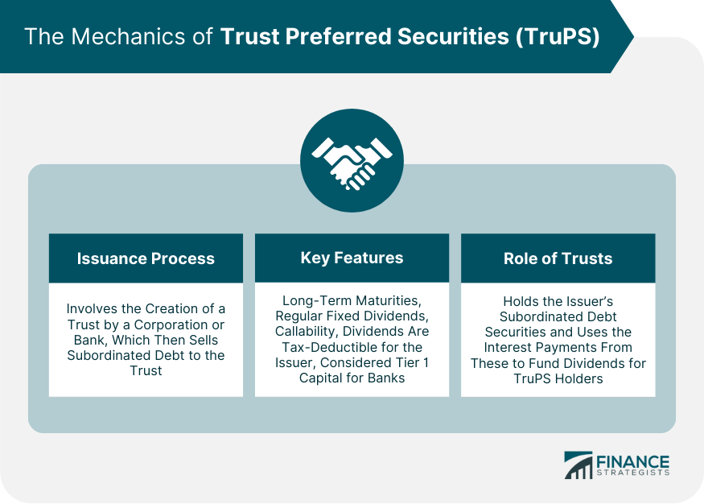

## Table of Contents

## What are Trust Preferred Securities (TruPS)?

Trust Preferred Securities, often called TruPS, are a type of financial instrument that companies use to raise money. They are a mix between debt and equity. When a company issues TruPS, it creates a trust that then sells these securities to investors. The money raised goes to the company, and in return, the company makes regular payments to the trust, which then passes these payments on to the investors.

TruPS are attractive to companies because the payments they make on these securities can often be tax-deductible, similar to interest payments on debt. For investors, TruPS can offer higher yields than traditional bonds, but they also come with more risk. This is because, in some cases, the company can skip payments if it is facing financial difficulties, much like how dividends on stocks can be skipped.

## How do Trust Preferred Securities differ from traditional preferred stocks?

Trust Preferred Securities (TruPS) and traditional preferred stocks are both ways for companies to raise money, but they work a bit differently. TruPS are a hybrid of debt and equity. When a company wants to issue TruPS, it sets up a trust that sells these securities to investors. The money goes to the company, and it pays the trust, which then pays the investors. This setup means that the payments a company makes on TruPS can often be tax-deductible, like interest on a loan.

On the other hand, traditional preferred stocks are more like regular stocks. When a company issues preferred stocks, it sells them directly to investors without setting up a trust. The company pays dividends to the preferred stockholders, but these payments are not tax-deductible for the company. Preferred stocks usually have a fixed dividend rate and are higher in the pecking order than common stocks if the company goes bankrupt, but they don't have the tax benefits that TruPS offer.

## What is the structure of a Trust Preferred Security?

A Trust Preferred Security, or TruPS, is set up in a special way. A company that wants to use TruPS creates a trust. This trust then sells the TruPS to investors. The money from the investors goes to the company, and the company agrees to make regular payments to the trust. The trust then passes these payments on to the investors who bought the TruPS.

This structure is different from other types of securities because it involves a trust. The payments the company makes to the trust can often be treated like interest on a loan, which means the company can deduct them from its taxes. This makes TruPS attractive to companies looking to save on taxes while raising money. For investors, TruPS can offer higher returns than regular bonds, but they also come with more risk because the company can sometimes skip payments if it's having financial trouble.

## Who typically issues Trust Preferred Securities?

Trust Preferred Securities, or TruPS, are usually issued by banks and financial institutions. These companies use TruPS as a way to raise money. They create a trust that sells the TruPS to investors. The money from the investors goes to the bank, and the bank makes payments to the trust, which then passes the payments on to the investors.

TruPS are popular with banks because the payments they make to the trust can often be treated like interest on a loan. This means the bank can deduct these payments from its taxes, which can save them money. For investors, TruPS can offer higher returns than regular bonds, but they also come with more risk because the bank can sometimes skip payments if it's facing financial difficulties.

## What are the benefits of issuing Trust Preferred Securities for a company?

Issuing Trust Preferred Securities, or TruPS, can be a smart move for a company, especially for banks and financial institutions. One big benefit is that the payments they make on TruPS can often be treated like interest on a loan. This means the company can deduct these payments from its taxes, which can save them a lot of money. This tax advantage makes TruPS a cheaper way for companies to raise money compared to other methods.

Another benefit is that TruPS help companies keep their debt levels looking good on paper. Because TruPS are a mix of debt and equity, they don't always count as debt on the company's balance sheet. This can make the company look financially healthier to investors and credit rating agencies. So, by using TruPS, a company can raise money without making its debt levels look too high.

## How are Trust Preferred Securities taxed?

When a company issues Trust Preferred Securities, or TruPS, the payments they make to the trust can often be treated like interest on a loan. This means the company can deduct these payments from its taxes. This tax advantage makes TruPS a cheaper way for companies to raise money compared to other methods.

For investors, the payments they receive from TruPS are usually taxed as ordinary income, similar to interest from bonds. This is different from dividends from stocks, which can sometimes be taxed at a lower rate. So, while TruPS can offer higher returns, investors need to think about how these payments will be taxed.

## What are the risks associated with investing in Trust Preferred Securities?

Investing in Trust Preferred Securities, or TruPS, can be riskier than investing in regular bonds. One big risk is that the company issuing the TruPS can sometimes skip payments if it's having financial trouble. This is different from regular bonds, where the company usually has to keep making payments no matter what. So, if you invest in TruPS, you might not get your payments on time, or at all, if the company is struggling.

Another risk is that TruPS are more complicated than other investments. They are a mix of debt and equity, and they involve a trust. This can make it harder to understand exactly what you're investing in and how it will perform. If you don't fully understand TruPS, you might be surprised by how they behave, especially in tough economic times.

Lastly, the payments you get from TruPS are taxed as ordinary income, which can be higher than the tax rate on dividends from stocks. This means you might end up paying more in taxes than you would with other investments. So, while TruPS can offer higher returns, you need to think about how taxes will affect your overall earnings.

## How do Trust Preferred Securities fit into a diversified investment portfolio?

Trust Preferred Securities, or TruPS, can be a part of a diversified investment portfolio, but they come with their own set of risks and rewards. They are a mix of debt and equity, which means they can offer higher returns than regular bonds. This can be good for investors looking to boost their income. However, TruPS are also riskier because the company can skip payments if it's having financial trouble. So, if you're thinking about adding TruPS to your portfolio, you need to be okay with taking on more risk for the chance of higher returns.

Adding TruPS to a portfolio can help spread out your investments. Instead of putting all your money into stocks or bonds, you can mix in some TruPS to balance things out. This can make your portfolio less likely to be hurt by problems in just one type of investment. But remember, TruPS are complicated and the payments you get are taxed as ordinary income, which might be higher than taxes on other investments. So, it's important to think about how TruPS fit with your overall investment goals and how much risk you're willing to take.

## What are the regulatory considerations for Trust Preferred Securities?

Trust Preferred Securities, or TruPS, have to follow certain rules set by the government. In the United States, the main rule-makers are the Securities and Exchange Commission (SEC) and the Federal Reserve. These groups make sure that companies follow the rules when they issue TruPS. For example, they have to give investors all the important information about the TruPS, like how much they cost and the risks involved. This helps investors make smart choices.

There are also special rules for banks that issue TruPS. Before the 2008 financial crisis, banks could use TruPS to count as part of their capital, which made them look stronger financially. But after the crisis, new rules were made to make banks safer. The Dodd-Frank Act changed things so that most banks can't use TruPS to count as capital anymore. Only smaller banks are still allowed to do this. These rules are there to keep banks from taking too many risks with TruPS.

## How have Trust Preferred Securities been affected by changes in financial regulations?

Trust Preferred Securities, or TruPS, have been affected a lot by changes in financial rules, especially after the 2008 financial crisis. Before the crisis, banks could use TruPS to count as part of their capital. This made banks look stronger and more stable. But after the crisis, the government saw that this could be risky. So, they made new rules to make banks safer.

The Dodd-Frank Act, which came after the crisis, changed the rules for TruPS. Now, most big banks can't use TruPS to count as capital anymore. Only smaller banks are still allowed to do this. These new rules are meant to stop banks from taking too many risks with TruPS. This has made TruPS less popular with big banks, but they are still used by smaller banks and other companies.

## What are the key financial metrics to consider when evaluating Trust Preferred Securities?

When you're thinking about investing in Trust Preferred Securities, or TruPS, there are a few important numbers to look at. One big one is the yield, which tells you how much money you'll get back each year compared to what you paid for the TruPS. A higher yield can mean more money for you, but it also means more risk. Another thing to check is the credit rating of the company issuing the TruPS. A good credit rating means the company is less likely to have trouble paying you back. You should also look at the company's debt-to-equity ratio, which shows how much debt the company has compared to its equity. A lower ratio can mean the company is in a better financial position.

Another key metric is the interest coverage ratio, which shows how easily the company can pay the interest on its debts, including TruPS. A higher ratio means the company is more likely to keep making payments to you. It's also good to look at the company's earnings and cash flow. Strong earnings and good cash flow mean the company is more likely to keep paying you on time. By looking at these numbers, you can get a better idea of whether TruPS are a good fit for your investment goals and how much risk you're willing to take.

## How do market conditions influence the performance of Trust Preferred Securities?

Market conditions can really affect how well Trust Preferred Securities, or TruPS, do. When the economy is doing well, companies usually have more money coming in, which means they can keep making payments on their TruPS. This makes TruPS more attractive to investors because they feel safer about getting their money back. But if the economy starts to struggle, companies might have a harder time making those payments. This can make investors worried, and the value of TruPS can go down because people are less willing to buy them.

Interest rates are another big thing that can change how TruPS perform. When interest rates go up, new bonds and other investments start to offer higher returns. This can make TruPS less appealing because they might not pay as much as these new investments. On the other hand, when interest rates go down, TruPS can look better because their payments might be higher than what you can get from new bonds. So, keeping an eye on interest rates and the overall economy can help you understand how TruPS might do in the future.

## References & Further Reading

[1]: ["The Dodd-Frank Act: Key Provisions and the Regulation of Systemic Risk"](https://www.investopedia.com/terms/d/dodd-frank-financial-regulatory-reform-bill.asp) by Hal S. Scott, Journal of Applied Corporate Finance, 2010.

[2]: ["Basel III: An Overview"](https://www.bis.org/bcbs/basel3.htm) by the Basel Committee on Banking Supervision, Bank for International Settlements, 2011.

[3]: ["Trust Preferred Securities and Financial Innovation in Banking"](https://www.fdic.gov/bank-examinations/trust-preferred-securities-and-capital-strength-banking-organizations) by Mark J. Flannery, Journal of Applied Finance, 2005.

[4]: ["Algorithmic Trading: Winning Strategies and Their Rationale"](https://www.wiley.com/en-us/Algorithmic+Trading%3A+Winning+Strategies+and+Their+Rationale-p-9781118746912) by Ernie Chan.

[5]: ["Hybridity and Its Discontents: Analyzing Financial Innovation"](https://www.taylorfrancis.com/books/edit/10.4324/9780203991954/hybridity-discontents-avtar-brah-annie-coombes) by Morgan Ricks, Georgetown Law Journal, 2011.

[6]: ["The Handbook of Fixed Income Securities"](https://www.amazon.com/Handbook-Fixed-Income-Securities-6th/dp/0071358056) by Frank J. Fabozzi.

[7]: ["Advances in Financial Machine Learning"](https://www.amazon.com/Advances-Financial-Machine-Learning-Marcos/dp/1119482089) by Marcos Lopez de Prado.