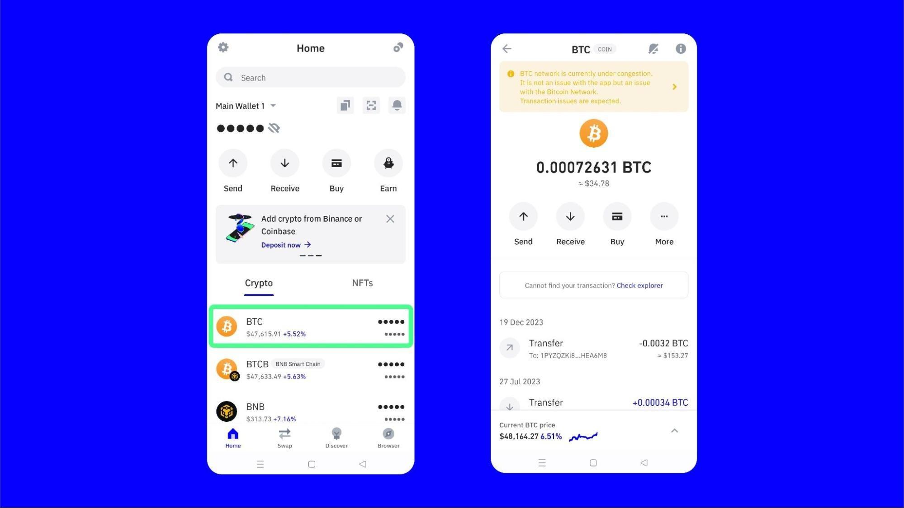

## Table of Contents

## What is Trust Wallet and what is its primary function?

Trust Wallet is a mobile app that lets you store and manage different types of cryptocurrencies, like Bitcoin and Ethereum. It's like a digital wallet where you can keep your money safe and move it around easily. You can use it on your phone, and it's made to be easy to use, even if you're new to cryptocurrencies.

The main thing Trust Wallet does is help you keep your cryptocurrencies safe and let you use them whenever you want. You can send and receive different cryptocurrencies, and you can also swap them for other types right in the app. It's all about making it simple and secure for you to handle your digital money.

## How do I download and install Trust Wallet on my mobile device?

To download and install Trust Wallet on your mobile device, first, go to the app store on your phone. If you have an iPhone, open the Apple App Store. If you have an Android phone, open the Google Play Store. Once you're in the app store, search for "Trust Wallet" in the search bar at the top of the screen. When you see the Trust Wallet app in the search results, tap on it to go to its page. Then, tap the "Install" or "Get" button to start downloading the app. Wait for the download to finish, and the app will install automatically.

After the installation is done, you can open Trust Wallet by tapping on its icon on your home screen or in your app drawer. When you open the app for the first time, you'll be guided through a few simple steps to set up your wallet. You'll need to create a new wallet or import an existing one, and you'll be asked to write down a recovery phrase. Make sure to keep this phrase safe and private, as it's important for accessing your wallet if you ever need to. Once you've completed these steps, you're ready to start using Trust Wallet to manage your cryptocurrencies.

## What cryptocurrencies can I store in Trust Wallet?

Trust Wallet lets you store a lot of different cryptocurrencies. You can keep popular ones like Bitcoin, Ethereum, and Litecoin in it. It also works with many other cryptocurrencies, like Binance Coin, Ripple, and Cardano. If you're into newer or less common cryptocurrencies, Trust Wallet might support those too, because it keeps adding new ones all the time.

Besides the big names, Trust Wallet also supports many tokens that run on the Ethereum network, like ERC-20 and ERC-721 tokens. This means you can store a wide variety of tokens, including those used in decentralized finance (DeFi) and non-fungible tokens (NFTs). So, whether you're into the well-known cryptocurrencies or the newer, specialized tokens, Trust Wallet has you covered.

## How do I add a new cryptocurrency to my Trust Wallet?

To add a new [cryptocurrency](/wiki/cryptocurrency) to your Trust Wallet, first open the app on your phone. Once you're in, look at the bottom of the screen and tap on the "Receive" button. This will show you a list of all the cryptocurrencies that Trust Wallet supports. Scroll through the list until you find the cryptocurrency you want to add. If it's not there, it might not be supported yet, but Trust Wallet often adds new ones, so check back later.

When you find the cryptocurrency you want, tap on it. Trust Wallet will then show you a unique address for that cryptocurrency. This address is like a special code that people can use to send you that cryptocurrency. You can share this address with others or use it on a cryptocurrency exchange to move your money into Trust Wallet. Once someone sends you the cryptocurrency using this address, it will show up in your Trust Wallet, and you can start using it right away.

## What are the security features of Trust Wallet?

Trust Wallet has several security features to keep your cryptocurrencies safe. One important feature is that it's a non-custodial wallet, which means you're the only one who has control over your money. You don't have to give your private keys or recovery phrase to anyone, not even Trust Wallet. This makes it harder for anyone else to get into your wallet. Trust Wallet also uses strong encryption to protect your data and transactions, so your information stays private and secure.

Another security feature is the recovery phrase. When you set up your wallet, you get a special list of words that you need to write down and keep safe. This recovery phrase can help you get your wallet back if you lose your phone or forget your password. It's really important to keep this phrase secret and safe, because anyone who knows it can access your wallet. Trust Wallet also lets you set up a PIN or use biometric security like your fingerprint or face to unlock the app, adding another layer of protection to make sure only you can get in.

## How can I backup and restore my Trust Wallet?

To backup your Trust Wallet, you need to save your recovery phrase. When you first set up your wallet, Trust Wallet will show you a list of 12 or 24 words. This is your recovery phrase. Write it down on a piece of paper and keep it in a safe place, like a locked drawer or a safe. Don't take a photo of it or save it on your computer, because that's not as safe. Your recovery phrase is very important because it's the only way to get your wallet back if you lose your phone or forget your password.

To restore your Trust Wallet, you'll need that recovery phrase you wrote down. Open the Trust Wallet app on a new phone or after you've lost your old one. When it asks if you want to create a new wallet or import an existing one, choose to import. Then, enter the recovery phrase exactly as you wrote it down, in the right order. Once you've entered it correctly, Trust Wallet will bring back all your cryptocurrencies and settings, just like they were before. Make sure you keep your recovery phrase safe, because anyone who knows it can access your wallet.

## What is the process for sending and receiving cryptocurrencies using Trust Wallet?

To send cryptocurrencies using Trust Wallet, first open the app on your phone. Tap on the "Send" button at the bottom of the screen. Then, choose the cryptocurrency you want to send from the list. You'll need to enter the recipient's address, which is a long string of letters and numbers. Make sure you double-check this address to avoid sending your money to the wrong place. Next, type in the amount you want to send. You can also add a memo or note if needed. After you've filled everything in, tap "Send" and confirm the transaction. Trust Wallet will ask you to enter your PIN or use your biometric security to make sure it's really you sending the money. Once you confirm, the transaction will be sent to the blockchain, and it might take a little while to be completed.

To receive cryptocurrencies, open Trust Wallet and tap on the "Receive" button at the bottom of the screen. Choose the cryptocurrency you want to receive from the list. Trust Wallet will show you a unique address for that cryptocurrency. This address is like a special code that people can use to send you money. You can share this address with others by copying it, showing a QR code, or sharing it through a messaging app. Once someone sends you the cryptocurrency using this address, it will show up in your Trust Wallet. You can check the transaction status in the app to see when it's been completed.

## How does Trust Wallet integrate with decentralized applications (dApps)?

Trust Wallet makes it easy for you to use decentralized applications, or dApps, right from your phone. When you open Trust Wallet, you can find a section called "DApps" at the bottom of the screen. Tapping on it will show you a list of different dApps that you can use. These dApps are like special websites or apps that run on blockchain technology, and they let you do things like trade cryptocurrencies, play games, or even lend and borrow money without a bank. Trust Wallet connects you to these dApps securely, so you can use them without having to leave the app.

When you want to use a dApp, you just tap on it from the list in Trust Wallet. The app will open the dApp for you, and you can start using it right away. Because Trust Wallet is connected to your wallet, you can easily sign in to the dApp and make transactions without having to enter your private keys or recovery phrase. This makes it simple and safe to interact with dApps, and you can do it all from one place. Whether you're swapping tokens, playing a blockchain game, or using a decentralized finance service, Trust Wallet helps you do it smoothly.

## What are the fees associated with using Trust Wallet?

When you use Trust Wallet, you don't have to pay any fees to the app itself. Trust Wallet is free to download and use, and there are no charges for storing your cryptocurrencies in the wallet. However, when you send or receive cryptocurrencies, you might have to pay a small fee. These fees are not set by Trust Wallet but by the blockchain network that the cryptocurrency uses. For example, if you're sending Bitcoin, you'll pay a Bitcoin network fee, which can change depending on how busy the network is.

These network fees are important because they help keep the blockchain running smoothly. They go to the people who help process and confirm your transactions, like miners or validators. The amount of the fee can vary, and sometimes you can choose how much you want to pay. If you pick a higher fee, your transaction might get processed faster. If you pick a lower fee, it might take longer. So, while Trust Wallet itself doesn't charge you anything, you should be aware of these network fees when you're moving your cryptocurrencies around.

## How can I stake cryptocurrencies within Trust Wallet?

To stake cryptocurrencies in Trust Wallet, first open the app on your phone and go to the "DApps" section at the bottom of the screen. Look for a staking platform like Binance Staking or other dApps that support staking. Once you find a staking dApp, tap on it to open it. You'll need to connect your Trust Wallet to the dApp, which is easy to do because Trust Wallet will ask you to confirm the connection. After you're connected, you can choose which cryptocurrency you want to stake, like Binance Coin (BNB) or Ethereum (ETH). Enter the amount you want to stake and follow the instructions to complete the staking process. Remember, staking means you're locking up your cryptocurrencies to help support the blockchain network, and in return, you can earn rewards.

Staking in Trust Wallet is a good way to earn passive income on your cryptocurrencies. The rewards you get depend on the cryptocurrency you're staking and the rules of the staking platform. Some cryptocurrencies might give you a higher reward rate than others. It's important to keep your cryptocurrencies in your Trust Wallet while they're staked, because moving them could stop you from [earning](/wiki/earning-announcement) rewards. Also, remember that staking usually means you can't use those cryptocurrencies for a while, so make sure you're okay with that before you start. Trust Wallet makes it easy to stake and keep track of your rewards, all from one app.

## What advanced features does Trust Wallet offer for experienced users?

Trust Wallet has some cool features for people who know a lot about cryptocurrencies. One of these is the ability to use different blockchains. This means you can work with many types of cryptocurrencies, not just the popular ones. Trust Wallet also lets you connect to decentralized exchanges (DEXs) right from the app. This makes it easy to swap one cryptocurrency for another without having to go to a different website. Plus, you can use decentralized finance (DeFi) apps to do things like lend, borrow, or earn interest on your cryptocurrencies.

Another advanced feature is the option to manage your own private keys. This gives you more control over your money and makes it safer because you don't have to trust anyone else with your keys. Trust Wallet also supports hardware wallets, like Ledger or Trezor, which are extra secure ways to store your cryptocurrencies. If you're into non-fungible tokens (NFTs), Trust Wallet lets you buy, sell, and store them too. All these features make Trust Wallet a powerful tool for experienced users who want to do more with their cryptocurrencies.

## How does Trust Wallet ensure privacy and what are its data handling policies?

Trust Wallet takes your privacy seriously and works hard to keep your information safe. When you use Trust Wallet, you don't have to give them your personal details like your name or email. This means they don't collect or store that kind of information about you. Trust Wallet is what's called a non-custodial wallet, which means you're the only one who has control over your money. They don't have access to your private keys or recovery phrase, so your transactions stay private and secure.

Trust Wallet also has clear rules about how they handle any data they do collect. They only gather information that's needed to make the app work better, like how you use the app or what kind of phone you have. This data is used to improve the app and fix any problems, but it's not shared with anyone else. Trust Wallet promises to keep your data safe and private, and they follow strict rules to make sure they do that. So, you can feel good knowing that your privacy is protected when you use Trust Wallet.

## References & Further Reading

[1]: Bergstra, J., Bardenet, R., Bengio, Y., & Kégl, B. (2011). ["Algorithms for Hyper-Parameter Optimization."](https://papers.nips.cc/paper/4443-algorithms-for-hyper-parameter-optimization) Advances in Neural Information Processing Systems 24.

[2]: ["Advances in Financial Machine Learning"](https://www.amazon.com/Advances-Financial-Machine-Learning-Marcos/dp/1119482089) by Marcos Lopez de Prado.

[3]: ["Evidence-Based Technical Analysis: Applying the Scientific Method and Statistical Inference to Trading Signals"](https://www.amazon.com/Evidence-Based-Technical-Analysis-Scientific-Statistical/dp/0470008741) by David Aronson.

[4]: ["Machine Learning for Algorithmic Trading"](https://github.com/PacktPublishing/Machine-Learning-for-Algorithmic-Trading-Second-Edition) by Stefan Jansen.

[5]: ["Quantitative Trading: How to Build Your Own Algorithmic Trading Business"](https://www.amazon.com/Quantitative-Trading-Build-Algorithmic-Business/dp/0470284889) by Ernest P. Chan.