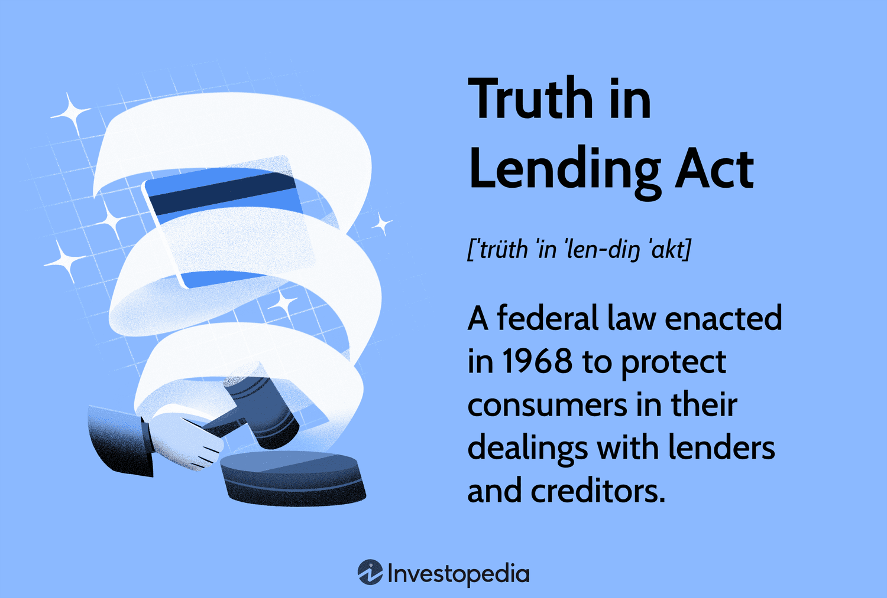

## Table of Contents

## What is the Truth in Lending Act (TILA)?

The Truth in Lending Act (TILA) is a federal law in the United States that helps protect consumers when they borrow money or use credit. It was passed in 1968 to make sure that lenders clearly explain the costs of borrowing money. This law requires lenders to tell you important details about your loan or credit, like the interest rate, fees, and how much you will have to pay back in total. By doing this, TILA helps you understand the true cost of borrowing so you can make better financial decisions.

TILA applies to many types of credit, including credit cards, mortgages, auto loans, and personal loans. It also gives you certain rights, like the right to cancel certain types of loans within a few days of signing the agreement. This is called the "right of rescission." If a lender does not follow the rules of TILA, you might be able to sue them and get money back. Overall, TILA is important because it helps make borrowing money fairer and more transparent for everyone.

## When was the Truth in Lending Act enacted?

The Truth in Lending Act, or TILA, was enacted on May 29, 1968. This law was created to help people understand the costs of borrowing money. Before TILA, it was hard for people to know how much they would really have to pay back because lenders did not always explain things clearly.

TILA makes it a rule for lenders to tell you important details about your loan or credit. This includes the [interest rate](/wiki/interest-rate-trading-strategies), fees, and the total amount you will have to pay back. By doing this, TILA helps you make better choices about borrowing money and protects you from unfair practices.

## What are the main goals of the Truth in Lending Act?

The main goal of the Truth in Lending Act (TILA) is to make sure that people understand the true cost of borrowing money. Before TILA, lenders did not always explain things clearly, which made it hard for people to know how much they would really have to pay back. TILA changes this by requiring lenders to tell you important details about your loan or credit, like the interest rate, fees, and the total amount you will have to pay back. This helps you see the full cost of borrowing so you can make better financial decisions.

Another goal of TILA is to protect consumers from unfair practices. The law gives you certain rights, like the right to cancel some types of loans within a few days of signing the agreement. This is called the "right of rescission." If a lender does not follow the rules of TILA, you might be able to sue them and get money back. By making borrowing money fairer and more transparent, TILA helps everyone make smarter choices about credit and loans.

## Who does the Truth in Lending Act protect?

The Truth in Lending Act, or TILA, protects people who borrow money or use credit. This includes anyone who gets a loan, uses a credit card, or takes out a mortgage. TILA makes sure that lenders tell you clearly about the costs of borrowing, like the interest rate and fees. This way, you can understand how much you will have to pay back and make better choices about borrowing money.

TILA also gives you certain rights to protect you from unfair practices. For example, you have the right to cancel some types of loans within a few days of signing the agreement. This is called the "right of rescission." If a lender does not follow the rules of TILA, you might be able to sue them and get money back. By making borrowing money fairer and more transparent, TILA helps everyone make smarter choices about credit and loans.

## What types of loans are covered under TILA?

The Truth in Lending Act, or TILA, covers many types of loans and credit. This includes credit cards, mortgages, auto loans, and personal loans. If you are borrowing money or using credit, TILA makes sure that the lender tells you important details about your loan. This includes the interest rate, fees, and how much you will have to pay back in total. By doing this, TILA helps you understand the true cost of borrowing so you can make better financial decisions.

TILA also applies to certain types of home loans. This includes home equity loans and home equity lines of credit. If you are using your home as collateral for a loan, TILA gives you extra protections. For example, you have the right to cancel some types of home loans within three days of signing the agreement. This is called the "right of rescission." TILA helps make sure that borrowing money is fair and clear for everyone.

## What are the key disclosure requirements under TILA?

The Truth in Lending Act, or TILA, has key disclosure requirements that help you understand the costs of borrowing money. Lenders must tell you the annual percentage rate (APR), which is the total cost of your loan as a yearly rate. They also need to tell you the finance charge, which is the total amount of interest and fees you will pay over the life of the loan. Lenders must also give you the total amount you will have to pay back, including both the principal and the finance charges.

In addition to these basic disclosures, TILA requires lenders to provide more specific information depending on the type of loan. For example, if you are getting a mortgage, the lender must give you a loan estimate within three business days of your application. This document shows the estimated costs of your loan, including the interest rate, monthly payments, and closing costs. If you are using a credit card, the lender must tell you about the grace period, how they calculate your balance, and how much you will have to pay if you miss a payment. By making these disclosures, TILA helps you make informed decisions about borrowing money.

## How does TILA affect the way interest rates are disclosed?

The Truth in Lending Act, or TILA, makes it important for lenders to tell you about the interest rate on your loan or credit. They have to show you the annual percentage rate, or APR. This is a number that shows the total cost of your loan each year, including the interest and any fees. By showing you the APR, TILA helps you see how expensive the loan really is. This way, you can compare different loans and choose the one that costs less.

TILA also says that lenders must tell you how the interest rate works. For example, if you have a credit card, the lender must explain if there's a grace period before you have to pay interest. They also need to tell you how they figure out your balance and how much you will have to pay if you miss a payment. By making these rules, TILA helps you understand how interest rates affect your loan or credit, so you can make better choices about borrowing money.

## What is the right of rescission under TILA and when can it be exercised?

The right of rescission under the Truth in Lending Act, or TILA, is a special rule that lets you cancel certain types of loans within a few days of signing the agreement. This right is there to protect you if you feel like you made a mistake or if the lender did not explain things clearly. The right of rescission gives you three business days to change your mind and back out of the loan without any penalty.

You can use the right of rescission for loans where your home is used as collateral, like home equity loans or refinancing your mortgage. If you sign the loan papers on Monday, you have until the end of the business day on Thursday to cancel the loan. To cancel, you need to tell the lender in writing that you want to use your right of rescission. Once you do that, the lender has to give your money back and release any lien they put on your home.

## How does TILA regulate advertising of credit terms?

The Truth in Lending Act, or TILA, has rules about how lenders can advertise credit terms. These rules make sure that ads are clear and do not trick people. If an ad talks about the interest rate or how much you have to pay back, it has to show the annual percentage rate, or APR. The APR is a number that shows the total cost of the loan each year, including interest and fees. This way, people can see the real cost of borrowing money and compare different loans.

TILA also says that if an ad mentions a low interest rate or a special deal, it has to tell you about any important limits or conditions. For example, if the low rate only lasts for a short time, the ad has to say that. This helps people understand the full details of the offer and not be surprised later. By making these rules, TILA helps keep advertising fair and honest, so people can make better choices about borrowing money.

## What are the penalties for non-compliance with TILA?

If a lender does not follow the rules of the Truth in Lending Act, or TILA, they can face big penalties. People who borrow money can sue the lender if they do not get the right information about their loan. If the court finds that the lender broke TILA rules on purpose, they might have to pay the borrower up to $5,000, plus any money the borrower lost because of the mistake. The lender might also have to pay for the borrower's legal fees.

The government can also take action against lenders who do not follow TILA. The Consumer Financial Protection Bureau, or CFPB, can fine lenders and make them fix their mistakes. If a lender keeps breaking the rules, they might have to pay even bigger fines. These penalties help make sure that lenders tell people the truth about borrowing money and follow the law.

## How have amendments to TILA, such as the CARD Act, expanded consumer protections?

The Credit Card Accountability Responsibility and Disclosure Act, or CARD Act, is an important amendment to the Truth in Lending Act, or TILA. It was passed in 2009 to make credit card companies treat people more fairly. The CARD Act says that credit card companies have to tell you clearly about the interest rates and fees before you sign up. They also have to give you at least 21 days to pay your bill before they can charge you a late fee. This helps people understand how much they will have to pay and gives them more time to make their payments.

Another big change from the CARD Act is that it stops credit card companies from raising interest rates on existing balances without a good reason. They can only do this if you miss a payment or if the rate was only for a short time. The CARD Act also says that people under 21 need someone to co-sign their credit card application unless they can show they can pay the bill. These rules help protect people from unfair credit card practices and make borrowing money safer and clearer for everyone.

## What are some common criticisms or limitations of the Truth in Lending Act?

Some people say that the Truth in Lending Act, or TILA, is hard to understand because it uses a lot of complicated words and numbers. Even though TILA wants to help people know the true cost of borrowing money, some people still find it confusing. For example, the annual percentage rate, or APR, can be hard to figure out. This can make it tough for people to compare different loans and make good choices about borrowing money.

Another problem with TILA is that it does not cover all types of loans. For example, it does not apply to business loans or loans from some types of lenders. This means that some people might not get the same protections when they borrow money. Also, even though TILA has rules to help people, some lenders still find ways to trick people or hide the true costs of borrowing. This can make it hard for people to trust lenders and feel safe when they borrow money.

## References & Further Reading

[1]: ["The Truth in Lending Act: A Review by the Consumer Financial Protection Bureau"](https://files.consumerfinance.gov/f/201503_cfpb_truth-in-lending-act.pdf) - Consumer Financial Protection Bureau

[2]: ["Regulation Z (Truth in Lending)"](https://www.consumerfinance.gov/rules-policy/regulations/1026/) - Federal Reserve

[3]: ["Algorithmic Trading Basics"](https://www.investopedia.com/articles/active-trading/101014/basics-algorithmic-trading-concepts-and-examples.asp) - Investopedia

[4]: Lambert, L. (2010). ["The Digital Evolution of banking and the impact on compliance"](https://www.taylorfrancis.com/books/mono/10.4324/9780203102329/digital-storytelling-joe-lambert) - Lexology

[5]: ["Machine Learning and its Impact on Algorithmic Trading"](https://ijsra.net/sites/default/files/IJSRA-2024-0292.pdf) - SSRN Papers