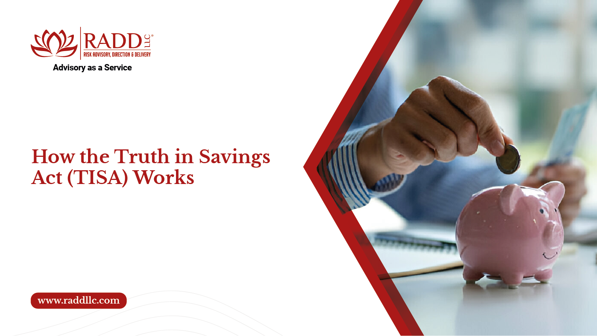

## Table of Contents

## What is the Truth in Savings Act (TISA)?

The Truth in Savings Act (TISA) is a law in the United States that helps people understand how much money they will earn from their savings accounts. It was passed in 1991 and is meant to make sure that banks and other financial institutions clearly explain the terms of savings accounts to customers. This way, people can compare different accounts and choose the one that is best for them.

TISA requires banks to give clear information about things like the interest rate, how often interest is added to the account, and any fees or charges. This helps people know exactly what they can expect from their savings account. By making this information clear and easy to understand, TISA helps people make better decisions about where to keep their money.

## When was the Truth in Savings Act enacted?

The Truth in Savings Act, or TISA, was enacted in 1991. This law was created to help people understand how much money they could earn from their savings accounts. Before TISA, it was hard for people to compare different savings accounts because the information was not clear.

TISA makes banks and other financial institutions give clear information about savings accounts. This includes details like the [interest rate](/wiki/interest-rate-trading-strategies), how often interest is added, and any fees. By making this information easy to understand, TISA helps people choose the best place to save their money.

## What is the main purpose of the Truth in Savings Act?

The main purpose of the Truth in Savings Act (TISA) is to help people understand how much money they can earn from their savings accounts. Before TISA, it was hard for people to compare different savings accounts because the information was not clear. TISA makes sure that banks and other financial institutions give clear information about savings accounts.

This law requires banks to tell people important details like the interest rate, how often interest is added to the account, and any fees or charges. By making this information easy to understand, TISA helps people make better choices about where to save their money. This way, people can compare different accounts and choose the one that is best for them.

## Who does the Truth in Savings Act apply to?

The Truth in Savings Act (TISA) applies to banks and other financial institutions that offer savings accounts to people. This includes big banks, small banks, and credit unions. Any place that lets people save money and earn interest has to follow the rules of TISA.

TISA makes sure that these banks and financial institutions give clear information about savings accounts. They have to tell people things like the interest rate, how often interest is added, and any fees or charges. This way, people can understand how much money they will earn and compare different accounts to find the best one for them.

## What types of accounts are covered under TISA?

The Truth in Savings Act, or TISA, covers different types of savings accounts that people can have at banks and other financial places. This includes regular savings accounts where you can put money in and take it out whenever you want. It also includes money market deposit accounts, which are a bit like savings accounts but might have some rules about how much money you need to keep in them.

Another type of account covered by TISA is the certificate of deposit, or CD. With a CD, you agree to leave your money in the account for a certain time, like six months or a year, and you get a fixed interest rate. TISA makes sure that banks tell you clearly about all these different accounts so you know what to expect.

By covering these types of accounts, TISA helps people understand how much money they can earn and what the rules are for each account. This way, people can compare different accounts and choose the one that is best for them.

## What are the key disclosure requirements for financial institutions under TISA?

Under the Truth in Savings Act, or TISA, financial institutions have to tell people important things about their savings accounts in a clear way. This includes the interest rate, which is how much money the account will earn. They also need to say how often interest is added to the account, like every month or every three months. Another thing they have to tell people is the annual percentage yield, or APY, which shows how much money the account will earn in a year, including the effect of adding interest.

Financial institutions also have to tell people about any fees or charges that might come with the account. This could be fees for taking money out too often or for not keeping enough money in the account. They also need to explain any rules about how much money you need to keep in the account, like a minimum balance. By making all this information clear, TISA helps people understand what to expect from their savings accounts and compare different options to find the best one for them.

## How does TISA affect the way interest rates are advertised and calculated?

TISA makes banks tell people the interest rate for savings accounts in a clear way. This means banks have to show the interest rate as a simple number, like 1% or 2%. They also have to tell people the annual percentage yield, or APY. The APY shows how much money the account will earn in a year, including the effect of adding interest. This helps people understand how much they will really earn from their savings.

TISA also says that banks have to tell people how often interest is added to the account. This could be every month, every three months, or at other times. By knowing this, people can see how their money will grow over time. TISA makes sure that all this information is easy to understand, so people can compare different accounts and choose the one that is best for them.

## What are the penalties for non-compliance with TISA?

If banks and other financial places do not follow the rules of the Truth in Savings Act, or TISA, they can get in trouble. The government can make them pay money as a penalty. This is to make sure that banks tell people the truth about savings accounts and do not hide important information.

The penalties can be different depending on how bad the mistake is. If a bank does not tell people the right interest rate or hides fees, they might have to pay a lot of money. This helps make sure that banks always give clear and honest information about savings accounts so people can make good choices about where to save their money.

## How does TISA help consumers make informed decisions about savings accounts?

TISA helps people make smart choices about savings accounts by making banks tell the truth about them. It makes sure that banks give clear information about things like the interest rate, how often interest is added, and any fees. This way, people can see exactly how much money they will earn and what they need to do to keep their account.

By having all this information, people can compare different savings accounts easily. They can look at the interest rates and fees from different banks and pick the one that is best for them. TISA makes it easier for people to understand their options and choose the right place to save their money.

## What are the differences between TISA and the Truth in Lending Act (TILA)?

The Truth in Savings Act (TISA) and the Truth in Lending Act (TILA) are two different laws that help people understand their money better. TISA focuses on savings accounts. It makes banks tell people clearly about the interest rate, how often interest is added, and any fees. This way, people can see how much money they will earn from their savings and compare different accounts to find the best one.

On the other hand, the Truth in Lending Act (TILA) is about loans and credit. It makes sure that lenders tell people the true cost of borrowing money. This includes the interest rate, any fees, and the total amount that needs to be paid back. TILA helps people understand how much a loan will cost them so they can make good choices about borrowing money.

Both laws are important because they help people make informed decisions. TISA helps with saving money, while TILA helps with borrowing money. By making information clear and easy to understand, these laws help people manage their money better.

## How have amendments to TISA changed its scope and requirements over time?

Since it was first passed in 1991, the Truth in Savings Act (TISA) has been changed a few times to make it better and cover more things. One big change happened in 2010 with the Dodd-Frank Wall Street Reform and Consumer Protection Act. This law gave more power to the Consumer Financial Protection Bureau (CFPB) to watch over and make rules about TISA. The CFPB can now make sure banks are following the rules and help people understand their savings accounts better.

These changes have made TISA stronger and more helpful for people. Now, the rules are clearer and there are more ways to make sure banks tell the truth about savings accounts. The CFPB can also look into problems and help fix them if banks are not following the rules. This means people can trust that the information they get about their savings accounts is honest and easy to understand.

## What are some best practices for financial institutions to ensure compliance with TISA?

Financial institutions can make sure they follow the Truth in Savings Act by always being clear and honest about savings accounts. They should tell people the interest rate, how often interest is added, and any fees in a way that is easy to understand. This means using simple words and not hiding important information. They should also make sure that all their ads and account information are correct and up to date. By doing this, they can help people trust them and make good choices about where to save their money.

Another good practice is to train their staff well. Everyone who works at the bank should know about TISA and what it means for savings accounts. They should be able to answer questions and help people understand their options. Financial institutions should also keep an eye on their own work to make sure they are following the rules. They can do this by checking their own ads and account information regularly. If they find any mistakes, they should fix them quickly to stay in line with TISA.

## References & Further Reading

[1]: Bergstra, J., Bardenet, R., Bengio, Y., & Kégl, B. (2011). ["Algorithms for Hyper-Parameter Optimization."](https://dl.acm.org/doi/10.5555/2986459.2986743) Advances in Neural Information Processing Systems 24.

[2]: ["Advances in Financial Machine Learning"](https://www.amazon.com/Advances-Financial-Machine-Learning-Marcos/dp/1119482089) by Marcos Lopez de Prado

[3]: ["Evidence-Based Technical Analysis: Applying the Scientific Method and Statistical Inference to Trading Signals"](https://www.amazon.com/Evidence-Based-Technical-Analysis-Scientific-Statistical/dp/0470008741) by David Aronson

[4]: ["Machine Learning for Algorithmic Trading"](https://github.com/stefan-jansen/machine-learning-for-trading) by Stefan Jansen

[5]: ["Quantitative Trading: How to Build Your Own Algorithmic Trading Business"](https://www.amazon.com/Quantitative-Trading-Build-Algorithmic-Business/dp/1119800064) by Ernest P. Chan

[6]: ["Truth-in-Savings Act Overview"](https://www.aba.com/banking-topics/compliance/acts/truth-in-savings-act) by the Federal Deposit Insurance Corporation (FDIC)