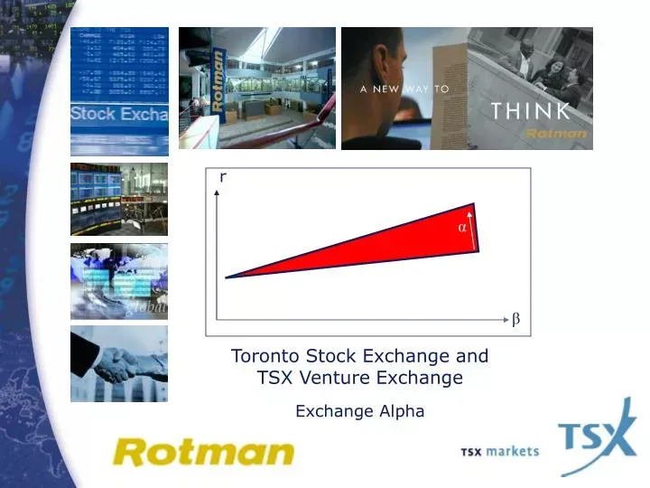

## Table of Contents

## What is the TSX Venture Exchange?

The TSX Venture Exchange is a stock exchange in Canada. It is where smaller companies that are still growing can list their stocks. These companies are often in the early stages of development and might not be big enough for the main Toronto Stock Exchange yet.

The exchange helps these smaller companies raise money by selling shares to investors. This can help the companies grow and expand their business. The TSX Venture Exchange is important because it gives investors a chance to invest in new and potentially successful businesses.

## How does the TSX Venture Exchange differ from the Toronto Stock Exchange?

The TSX Venture Exchange and the Toronto Stock Exchange (TSX) are both stock exchanges in Canada, but they serve different types of companies. The TSX Venture Exchange is for smaller, newer companies that are still growing. These companies might not be big enough or stable enough to be on the main Toronto Stock Exchange yet. The TSX Venture Exchange helps these smaller companies raise money by selling shares to investors, which can help them grow and expand.

On the other hand, the Toronto Stock Exchange is for larger, more established companies. These companies are usually more stable and have a longer history of operation. The TSX is one of the biggest stock exchanges in the world and lists many well-known Canadian companies. It's where investors can buy and sell shares of these larger companies.

In summary, the main difference between the two exchanges is the size and maturity of the companies they list. The TSX Venture Exchange is for smaller, growing companies, while the Toronto Stock Exchange is for larger, more established ones. Both exchanges play important roles in helping companies raise money and allowing investors to buy and sell shares.

## What types of companies are typically listed on the TSX Venture Exchange?

The TSX Venture Exchange is home to many smaller companies that are just starting out or still growing. These companies often come from industries like mining, oil and gas, and technology. They might be looking for new ways to find minerals, develop new energy sources, or create new tech products. Because they are still growing, these companies might not make a lot of money yet, but they have big plans for the future.

These companies use the TSX Venture Exchange to raise money by selling shares to investors. This money can help them grow their business, do more research, or start selling their products. Investors who buy these shares are betting that the companies will become successful and their shares will become more valuable over time. This makes the TSX Venture Exchange a place where people can invest in new and exciting businesses that might be the big companies of tomorrow.

## What are the listing requirements for companies on the TSX Venture Exchange?

To get listed on the TSX Venture Exchange, a company needs to meet some basic rules. They need to have enough money to pay for listing fees and other costs. They also need to have a certain number of shares that are owned by the public, usually at least 1 million shares. This makes sure that enough people can buy and sell the company's shares.

The company also needs to show that it has a good business plan and that it is run by people who know what they are doing. They need to share information about their business with the public, like how much money they make and what they plan to do next. This helps investors decide if they want to buy the company's shares.

The TSX Venture Exchange wants to make sure that the companies listed are honest and have a real chance to grow. So, they check the company's financial reports and make sure everything looks good before they let them list their shares. This helps keep the exchange a safe place for investors to find new and exciting businesses to invest in.

## How does the trading mechanism work on the TSX Venture Exchange?

Trading on the TSX Venture Exchange works a lot like trading on other stock exchanges. When someone wants to buy or sell shares, they place an order through a broker. The broker sends the order to the exchange, where it is matched with another order from someone who wants to do the opposite trade. If someone wants to buy shares, the exchange will find someone who wants to sell the same number of shares at a similar price. Once the orders match, the trade happens, and the shares change hands.

The exchange uses a system called an electronic trading platform to make sure everything happens quickly and fairly. This platform shows the current prices of shares and lets brokers see all the orders that are waiting to be matched. It helps make sure that trades happen at the best possible price and that everyone has a fair chance to buy or sell shares. This way, the TSX Venture Exchange can help smaller companies grow by letting investors easily trade their shares.

## What are the benefits of listing on the TSX Venture Exchange for small to medium-sized enterprises?

Listing on the TSX Venture Exchange can help small to medium-sized enterprises grow. When a company lists its shares on the exchange, it can raise money from investors. This money can be used to do more research, build new products, or expand the business. It's like getting a big loan, but instead of paying it back, the company gives the investors a chance to own part of the business. This can help the company grow faster and reach more customers.

Another benefit is that being on the TSX Venture Exchange can make the company more well-known. When a company is listed on the exchange, more people hear about it. This can attract more customers and even more investors. It also shows that the company is serious about growing and is willing to share information with the public. This can build trust with customers and investors, which is important for any growing business.

## Can foreign companies list on the TSX Venture Exchange, and what are the specific requirements?

Yes, foreign companies can list on the TSX Venture Exchange. They need to follow the same basic rules as Canadian companies, but there are a few extra things they need to do. They need to show that they are allowed to sell shares in Canada and that they will follow Canadian laws. They also need to have a way to share information with investors in Canada, like having a website or working with a Canadian company that can help.

The main thing foreign companies need to do is make sure they can meet the exchange's rules about having enough shares owned by the public and having enough money to pay for listing fees. They also need to share information about their business, like how much money they make and what they plan to do next. This helps investors in Canada decide if they want to buy the company's shares. By listing on the TSX Venture Exchange, foreign companies can raise money from Canadian investors and grow their business.

## How does the TSX Venture Exchange support the growth and development of its listed companies?

The TSX Venture Exchange helps small companies grow by letting them sell shares to investors. When a company lists on the exchange, it can get money to do things like research new ideas, build new products, or expand to new places. This money is important because it helps the company do things it couldn't do before. It's like getting a big loan, but instead of paying it back, the company gives investors a chance to own part of the business. This can help the company grow faster and reach more people.

Being on the TSX Venture Exchange also makes the company more well-known. When a company lists its shares, more people hear about it. This can attract new customers and even more investors. It shows that the company is serious about growing and is willing to share information with the public. This can build trust with customers and investors, which is important for any growing business. By helping companies get money and become more known, the TSX Venture Exchange plays a big role in helping small companies grow and succeed.

## What role does the TSX Venture Exchange play in the Canadian economy?

The TSX Venture Exchange is important for the Canadian economy because it helps small companies grow. When small companies list on the exchange, they can sell shares to investors and get money to do things like research new ideas, build new products, or expand their business. This helps them create jobs and bring new ideas to the market. As these companies grow, they can become bigger parts of the economy, making more money and helping Canada's economy grow too.

The exchange also helps bring new money into Canada. When foreign investors buy shares on the TSX Venture Exchange, they are putting money into Canadian companies. This can help the economy by giving companies the money they need to grow and by making Canada a more attractive place for investors. By supporting small companies and bringing in new money, the TSX Venture Exchange plays a big role in making the Canadian economy stronger and more diverse.

## How are regulations and compliance managed on the TSX Venture Exchange?

The TSX Venture Exchange has rules to make sure companies follow the law and are honest with investors. They check the company's financial reports and make sure everything looks good before letting them list their shares. Companies need to share information about their business, like how much money they make and what they plan to do next. This helps investors decide if they want to buy the company's shares. If a company does not follow the rules, the exchange can stop them from trading or even remove them from the exchange.

The exchange also works with the Canadian Securities Administrators (CSA) to make sure companies follow the rules. The CSA is a group that helps make sure everyone in the stock market follows the law. They can check on companies and make sure they are doing what they are supposed to do. If a company breaks the rules, the CSA can take action to protect investors. This helps keep the TSX Venture Exchange a safe place for investors to find new and exciting businesses to invest in.

## What are some success stories of companies that started on the TSX Venture Exchange and moved to a larger exchange?

One success story is Lundin Mining. It started on the TSX Venture Exchange in 1995 when it was just a small company looking for minerals. As it grew and found more minerals, it got bigger and moved to the Toronto Stock Exchange in 2007. Now, Lundin Mining is a big company that mines copper, zinc, and other minerals all over the world. It shows how the TSX Venture Exchange can help small companies grow into big ones.

Another example is Shopify. It began on the TSX Venture Exchange in 2007 as a small tech company helping people sell things online. As more people started using Shopify's services, the company grew quickly. In 2015, Shopify moved to the Toronto Stock Exchange and later to the New York Stock Exchange too. Today, Shopify is a huge company that helps businesses all over the world sell online. It's a great example of how the TSX Venture Exchange can help new tech companies become big successes.

## What advanced trading strategies can be employed on the TSX Venture Exchange?

On the TSX Venture Exchange, one advanced trading strategy is called momentum trading. This is when traders look for stocks that are going up quickly and try to buy them before they go up even more. They hope to sell the stocks later for a profit. Momentum traders use tools like charts and graphs to see which stocks are moving fast. They need to be quick and know when to buy and sell to make money with this strategy.

Another strategy is called value investing. This is when investors look for companies that they think are worth more than their current stock price. They buy these stocks hoping that other people will see the value too and the price will go up. Value investors look at a company's financial reports and business plans to decide if it's a good buy. This strategy takes patience because it can take a long time for the stock price to go up, but it can be rewarding if the investor picks the right companies.

## What is the Real-World Impact and what are the Case Studies?

The TSX Venture Exchange (TSXV) serves as a dynamic platform for small-cap investments, offering significant opportunities for growth. Algorithmic trading, with its ability to analyze vast amounts of data quickly and execute trades with precision, has increasingly become a tool of choice for navigating the complexities of the TSXV. This section explores real-world case studies where algorithmic trading has facilitated successful small-cap investments, analyzing historical data and offering expert insights.

### Case Studies of Success

**Case Study 1: Mining Sector Breakthrough**

One notable example involves a junior mining company listed on the TSXV, which saw substantial growth facilitated by algorithmic trading strategies. By leveraging momentum-based algorithms, investors were able to capitalize on timely data releases regarding resource discoveries. These algorithms continuously scanned news releases and geospatial data, providing buy signals when significant mineral findings were announced. As a result, investors experienced significant returns during the volatility peaks commonly associated with the mining sector[^1^].

**Case Study 2: Technology Start-Up Boom**

A technology start-up focused on renewable energy solutions achieved exponential growth, largely impacted by algorithmic trading on the TSXV. Traders deployed machine learning models to predict future stock prices based on historical trading volumes and market sentiment analysis. These models were trained to identify patterns and trends indicating a bullish market move. The increased trading efficiency and precision offered by these algorithms enabled investors to enter and [exit](/wiki/exit-strategy) positions at optimal times, thus maximizing their returns[^2^].

### Historical Data Analysis

Using historical stock data from the TSXV, we can calculate the average volatility and return on investment for small-cap stocks over the past decade. Let $r_t$ represent the daily return of a stock. The historical volatility ($\sigma$) is computed as:

$$
\sigma = \sqrt{\frac{1}{N-1} \sum_{t=1}^{N} (r_t - \bar{r})^2}
$$

where $\bar{r}$ is the average daily return and $N$ is the number of trading days in the period analyzed. For small-cap stocks on the TSXV, historical data analysis indicates an average annual volatility of approximately 30%, compared to larger caps which typically exhibit lower volatility. Despite the high volatility, algorithmic trading techniques have enabled investors to manage risks effectively by setting strategic stop-loss orders and leveraging diversification algorithms.

### Expert Insights

Industry experts emphasize that while the volatility of TSXV stocks can pose risks, algorithmic trading provides tools to identify high-probability trading opportunities and mitigate downside risks. Algorithms capable of real-time sentiment analysis and market prediction have shifted traditional investment paradigms by reducing the emotional bias often associated with manual trading.

Experienced investors highlight the importance of continuous monitoring and adjustment of trading algorithms to adapt to changing market conditions. This adaptive capability is key in volatile exchanges like the TSXV, where market conditions can shift rapidly based on external factors such as commodity prices or technological breakthroughs.

In conclusion, the integration of algorithmic trading within the TSX Venture Exchange has transformed the investment landscape for small-cap stocks. By offering precise and data-driven strategies, investors can capitalize on market inefficiencies and enhance their potential for substantial returns.

[^1^]: "How Algorithmic Trading Transformed a Mining Company's Valuation," Mining Journal, 2022
[^2^]: "Harnessing AI for Profits on the TSX Venture Exchange," Journal of Financial Analysis, 2023

## References & Further Reading

[1]: Bergstra, J., Bardenet, R., Bengio, Y., & Kégl, B. (2011). ["Algorithms for Hyper-Parameter Optimization."](https://papers.nips.cc/paper/4443-algorithms-for-hyper-parameter-optimization) Advances in Neural Information Processing Systems 24.

[2]: ["Advances in Financial Machine Learning"](https://www.amazon.com/Advances-Financial-Machine-Learning-Marcos/dp/1119482089) by Marcos Lopez de Prado

[3]: ["Evidence-Based Technical Analysis: Applying the Scientific Method and Statistical Inference to Trading Signals"](https://books.google.com/books/about/Evidence_Based_Technical_Analysis.html?id=MeoJAQAAMAAJ) by David Aronson

[4]: ["Machine Learning for Algorithmic Trading"](https://github.com/stefan-jansen/machine-learning-for-trading) by Stefan Jansen

[5]: ["Quantitative Trading: How to Build Your Own Algorithmic Trading Business"](https://www.amazon.com/Quantitative-Trading-Build-Algorithmic-Business/dp/1119800064) by Ernest P. Chan